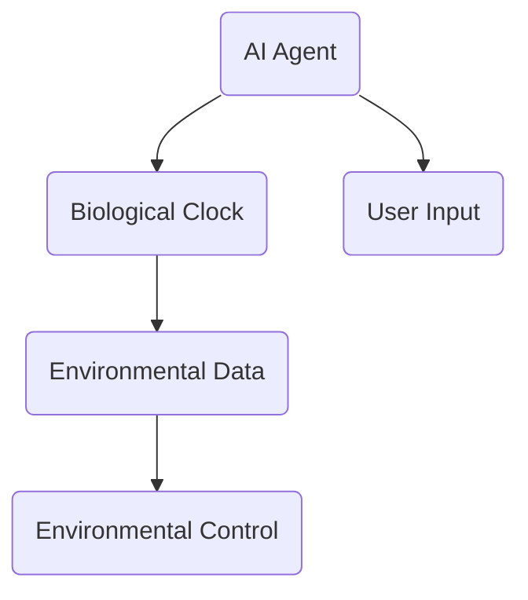
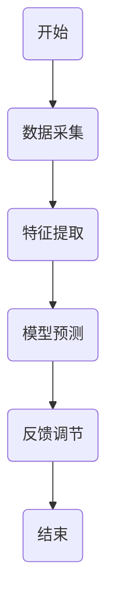

                 


# AI Agent在智能床头柜中的生物钟调节

## 关键词：AI Agent，生物钟调节，智能床头柜，强化学习，时间序列分析

## 摘要：本文探讨了AI Agent在智能床头柜中的应用，重点分析了如何通过AI技术调节用户的生物钟。文章从背景、概念、算法原理到系统架构和项目实战，全面阐述了AI Agent在生物钟调节中的实现过程，最后总结了最佳实践和未来发展方向。

---

## 第一部分：背景与概念

### 第1章：AI Agent与生物钟调节的背景

#### 1.1 AI Agent的基本概念
- AI Agent（智能代理）是指能够感知环境、做出决策并执行动作的智能体。它可以分为简单反射型、基于模型的反应型、目标驱动型和效用驱动型四种类型。
- AI Agent的核心特征包括自主性、反应性、目标导向和学习能力。

#### 1.2 生物钟调节的重要性
- 生物钟是由人体内的生理节律所决定的，控制着睡眠、觉醒、体温调节等多种生理功能。
- 生物钟紊乱会导致失眠、疲劳、注意力不集中等问题，影响身体健康和生活质量。
- 智能设备通过监测生理数据和环境数据，能够实时调整用户的生物钟，帮助用户保持良好的生理状态。

#### 1.3 AI Agent在智能床头柜中的应用
- 智能床头柜是一种结合了物联网和人工智能技术的床头设备，能够通过传感器采集用户的生理数据和环境数据。
- AI Agent在床头柜中的具体作用包括：实时监测用户的生理数据，分析数据并制定调节计划，通过床头柜的灯光、声音、温控等功能帮助用户调节生物钟。

---

## 第二部分：核心概念与联系

### 第2章：AI Agent与生物钟调节的核心概念

#### 2.1 AI Agent的感知、决策与执行机制
- **感知层**：通过传感器采集用户的生理数据（如心率、体温、运动量）和环境数据（如光照强度、温度、湿度）。
- **决策层**：基于采集的数据，利用强化学习或时间序列分析等算法，制定调节策略。
- **执行层**：根据决策结果，通过床头柜的灯光、声音、温控等功能执行调节动作，并收集反馈数据以优化调节策略。

#### 2.2 生物钟调节的数学模型
- **时间序列分析模型**：使用LSTM（长短期记忆网络）对生物钟数据进行建模，预测用户的生理状态。
  $$ LSTM(t) = \sigma(gate\_input_t) $$
- **状态空间模型**：将生物钟调节问题转化为状态空间问题，通过状态转移矩阵优化调节策略。
  $$ P(s_{t+1}|s_t) = \text{状态转移概率} $$

#### 2.3 AI Agent与生物钟调节的实体关系图


---

## 第三部分：算法原理与实现

### 第3章：AI Agent的算法原理

#### 3.1 基于强化学习的生物钟调节算法
- **强化学习的基本原理**：通过智能体与环境的交互，智能体通过试错学习，选择最优动作以最大化累积奖励。
- **状态、动作与奖励函数的定义**：
  - 状态：用户的当前生理状态和环境状态。
  - 动作：调节床头柜的灯光亮度、温度、声音等。
  - 奖励函数：根据调节效果给予奖励，如改善睡眠质量、调节生物钟等。
- **算法的收敛性分析**：通过多次试验和调整，算法能够逐步逼近最优解。

#### 3.2 时间序列预测算法
- **LSTM网络的基本原理**：LSTM通过记忆单元（memory cell）和门控机制（gate）捕捉时间序列中的长期依赖关系。
- **时间序列预测的实现步骤**：
  1. 数据预处理：归一化、缺失值处理。
  2. 模型训练：使用训练数据训练LSTM网络。
  3. 模型预测：利用训练好的模型预测未来的生理状态。
- **算法的优缺点对比**：
  - 优点：能够捕捉时间序列中的长期依赖关系。
  - 缺点：训练时间较长，对数据量要求较高。

#### 3.3 生物钟调节算法的实现流程


#### 3.4 Python代码实现
```python
import numpy as np
import pandas as pd
from keras.models import Sequential
from keras.layers import LSTM, Dense

# 数据预处理
data = pd.read_csv('biological_data.csv')
data = data.values
data = data.astype('float32')

# 划分训练集和测试集
train = data[:1000]
test = data[1000:]

# 构建LSTM模型
model = Sequential()
model.add(LSTM(50, input_shape=(1, 1)))
model.add(Dense(1))
model.compile(loss='mean_squared_error', optimizer='adam')

# 训练模型
model.fit(train[:, np.newaxis, :], train[:, np.newaxis], epochs=50, batch_size=32)

# 预测测试数据
predictions = model.predict(test[:, np.newaxis, :])
```

---

## 第四部分：系统分析与架构设计

### 第4章：系统分析与架构设计

#### 4.1 项目场景介绍
- 智能床头柜的功能模块包括：生理数据采集、环境数据采集、AI Agent调节、反馈优化等。

#### 4.2 系统功能设计
- **领域模型类图**：
  ```mermaid
  classDiagram
      class User {
          id: int
          name: str
          }
      class Sensor {
          id: int
          data: float
          }
      class AI-Agent {
          id: int
          model: LSTM
          }
      class Bedside-Cabinet {
          id: int
          control: bool
          }
      User --> Sensor
      Sensor --> AI-Agent
      AI-Agent --> Bedside-Cabinet
  ```

- **系统架构图**：
  ```mermaid
  architecture
      Client --> Bedside-Cabinet
      Bedside-Cabinet --> Sensor
      Bedside-Cabinet --> AI-Agent
      AI-Agent --> Database
  ```

- **系统交互序列图**：
  ```mermaid
  sequenceDiagram
      User -> Bedside-Cabinet: 请求调节生物钟
      Bedside-Cabinet -> Sensor: 获取生理数据
      Sensor -> Bedside-Cabinet: 返回生理数据
      Bedside-Cabinet -> AI-Agent: 请求调节策略
      AI-Agent -> Bedside-Cabinet: 返回调节策略
      Bedside-Cabinet -> Sensor: 执行调节动作
      Sensor -> Bedside-Cabinet: 返回反馈数据
  ```

---

## 第五部分：项目实战

### 第5章：项目实战

#### 5.1 环境安装
- 安装Python和相关库：`pip install numpy pandas keras`

#### 5.2 核心代码实现
```python
import numpy as np
import pandas as pd
from keras.models import Sequential
from keras.layers import LSTM, Dense

# 数据预处理
data = pd.read_csv('biological_data.csv')
data = data.values
data = data.astype('float32')

# 划分训练集和测试集
train = data[:1000]
test = data[1000:]

# 构建LSTM模型
model = Sequential()
model.add(LSTM(50, input_shape=(1, 1)))
model.add(Dense(1))
model.compile(loss='mean_squared_error', optimizer='adam')

# 训练模型
model.fit(train[:, np.newaxis, :], train[:, np.newaxis], epochs=50, batch_size=32)

# 预测测试数据
predictions = model.predict(test[:, np.newaxis, :])
```

#### 5.3 案例分析与解读
- 通过实际案例分析，说明如何优化生物钟调节系统，例如通过调整LSTM模型的参数或增加更多的传感器数据。

#### 5.4 项目小结
- 总结项目经验，提出改进建议，例如优化算法、增加更多功能模块等。

---

## 第六部分：最佳实践与总结

### 第6章：最佳实践与总结

#### 6.1 小结
- AI Agent在智能床头柜中的应用前景广阔，通过实时监测和智能调节，能够有效帮助用户调节生物钟，改善生活质量。

#### 6.2 注意事项
- 在实际应用中，需要注意数据隐私保护，确保用户数据的安全性。
- 系统的实时性和稳定性也是需要重点关注的方面。

#### 6.3 拓展阅读
- 推荐相关书籍和论文，如《Deep Learning》、《Reinforcement Learning》等。

---

## 作者信息

作者：AI天才研究院/AI Genius Institute & 禅与计算机程序设计艺术 /Zen And The Art of Computer Programming

---

**注意**：本文为技术博客文章，内容基于AI Agent在智能床头柜中的生物钟调节这一主题，通过逐步分析和推理，详细阐述了相关概念、算法和实现方法。

