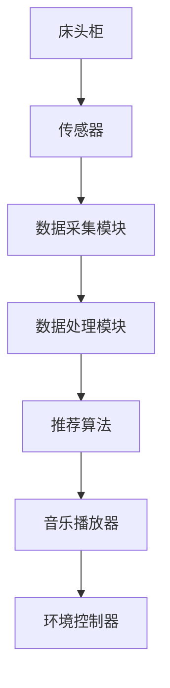
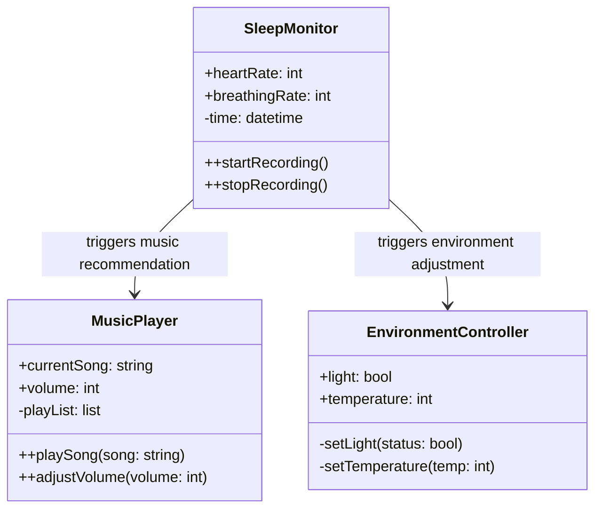
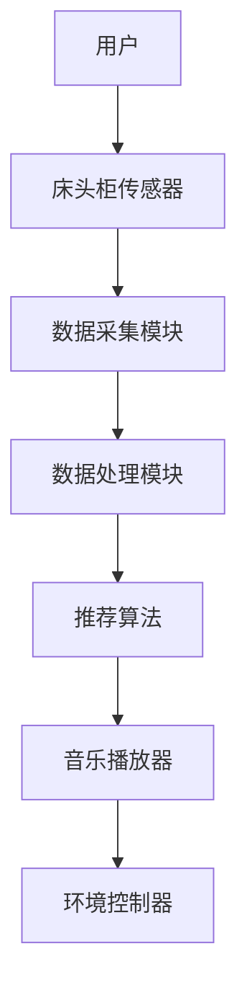
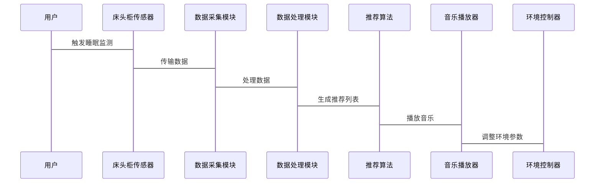

                 


# AI Agent在智能床头柜中的睡眠音乐定制

> 关键词：AI Agent, 智能床头柜, 睡眠音乐, 定制推荐, 算法实现

> 摘要：本文详细探讨了AI Agent在智能床头柜中的应用，重点介绍睡眠音乐的个性化定制。通过分析睡眠监测技术、音乐疗法的科学基础，结合AI Agent的核心算法，展示如何通过系统架构设计实现智能床头柜的功能。文章还提供了一个完整的项目实战案例，指导读者如何实现AI Agent在睡眠音乐定制中的应用。

---

## 第1章：睡眠问题与AI Agent概述

### 1.1 睡眠问题的现状与挑战

睡眠是人体健康的重要组成部分，但现代社会的快节奏生活导致许多人面临睡眠问题。根据世界卫生组织的数据，全球约有20%的人存在睡眠障碍。睡眠不足可能导致注意力不集中、记忆力减退，甚至影响心理健康。因此，改善睡眠质量成为现代人的重要需求。

#### 1.1.1 现代社会的睡眠问题
- 工作压力大，导致入睡困难。
- 不良生活习惯，如晚上使用电子设备、饮食不规律等。
- 环境因素，如噪音、光线等影响睡眠质量。

#### 1.1.2 睡眠不足的影响
- 日间疲劳，工作效率下降。
- 免疫力减弱，易患病。
- 心理健康问题，如焦虑和抑郁。

#### 1.1.3 睡眠改善的需求
- 个性化睡眠解决方案。
- 科技手段辅助睡眠改善。
- 睡眠监测与干预技术的结合。

### 1.2 AI Agent的基本概念

AI Agent（智能代理）是一种能够感知环境、自主决策并执行任务的智能实体。它通过传感器获取信息，利用算法进行分析，并根据结果采取行动。

#### 1.2.1 什么是AI Agent
AI Agent是人工智能技术的核心应用之一，具有以下特点：
- **自主性**：能够自主决策，无需人工干预。
- **反应性**：能够实时感知环境变化并做出反应。
- **目标导向**：根据设定的目标执行任务。
- **学习能力**：能够通过数据学习和优化。

#### 1.2.2 AI Agent的特点与优势
- **智能化**：能够处理复杂信息，做出最优决策。
- **适应性**：能够根据环境变化调整行为。
- **高效性**：通过算法优化，提高任务执行效率。

#### 1.2.3 AI Agent在睡眠改善中的应用
AI Agent可以通过分析用户的睡眠数据，推荐合适的音乐，帮助用户放松心情，改善睡眠质量。例如，智能床头柜可以通过内置的AI Agent监测用户的睡眠状态，并根据数据调整音乐播放的节奏和音量。

### 1.3 智能床头柜的功能与优势

智能床头柜是一种结合了AI技术的智能家居设备，能够通过传感器监测用户的睡眠状态，并根据数据提供个性化的睡眠改善方案。

#### 1.3.1 智能床头柜的功能概述
- **睡眠监测**：通过传感器监测用户的睡眠状态，记录心率、呼吸频率等数据。
- **音乐播放**：根据用户的睡眠数据，推荐适合的音乐，帮助用户放松。
- **环境控制**：调节床头柜的灯光、温度等环境因素，营造适合睡眠的环境。

#### 1.3.2 AI Agent在智能床头柜中的作用
- **数据采集**：AI Agent通过传感器获取用户的睡眠数据。
- **数据分析**：AI Agent对数据进行分析，识别用户的睡眠问题。
- **决策与执行**：AI Agent根据分析结果，推荐合适的音乐或调整环境参数。

#### 1.3.3 智能床头柜的优势与市场前景
- **提升睡眠质量**：通过个性化定制，帮助用户改善睡眠问题。
- **便捷性**：用户无需手动调整，床头柜自动完成优化。
- **市场潜力**：随着人们对健康生活的关注增加，智能床头柜的市场需求逐步增长。

---

## 第2章：AI Agent的核心原理

### 2.1 AI Agent的基本原理

AI Agent的核心原理包括感知、决策和执行三个主要阶段。以下是详细的流程：

1. **感知阶段**：AI Agent通过传感器或其他数据源获取环境信息。
2. **决策阶段**：AI Agent利用算法对数据进行分析，制定决策。
3. **执行阶段**：AI Agent根据决策结果执行相应的操作。

#### 2.1.1 AI Agent的工作流程
1. **数据采集**：AI Agent通过传感器获取用户的睡眠数据。
2. **数据处理**：AI Agent对数据进行预处理，提取有用的信息。
3. **模型训练**：AI Agent利用机器学习算法训练模型，识别用户的睡眠状态。
4. **决策制定**：AI Agent根据模型结果，推荐合适的音乐或调整环境参数。
5. **执行操作**：AI Agent通过床头柜的硬件执行推荐的音乐播放或环境调整。

#### 2.1.2 AI Agent的核心算法
AI Agent的核心算法包括监督学习、无监督学习和强化学习。以下是几种常用算法的简要介绍：

- **监督学习**：通过标记的数据训练模型，预测未来的结果。
- **无监督学习**：通过未标记的数据发现数据中的模式和结构。
- **强化学习**：通过试错的方式，优化决策策略。

#### 2.1.3 AI Agent的学习机制
AI Agent的学习机制是通过不断地与环境交互，优化自身的决策策略。例如，通过强化学习，AI Agent可以根据用户的反馈调整音乐播放的节奏和音量，以达到最佳的睡眠效果。

---

## 第3章：AI Agent在睡眠音乐推荐中的应用

### 3.1 睡眠音乐推荐的算法原理

睡眠音乐推荐的核心在于如何根据用户的睡眠数据和音乐属性，推荐适合用户的音乐。

#### 3.1.1 睡眠监测技术
睡眠监测技术包括心率监测、呼吸监测和体动监测等。AI Agent通过分析这些数据，判断用户的睡眠状态。

#### 3.1.2 音乐疗法的科学基础
音乐疗法是通过特定的音乐刺激改善心理和生理状态。不同类型的音乐对睡眠有不同的影响，例如，柔和的音乐有助于放松，而快节奏的音乐则可能干扰睡眠。

#### 3.1.3 基于AI的睡眠音乐推荐算法
基于AI的睡眠音乐推荐算法可以通过协同过滤和基于内容的推荐方法，为用户提供个性化的音乐推荐。

---

## 第4章：系统架构与实现

### 4.1 系统架构设计

系统架构设计包括感知层、决策层和执行层。以下是具体的架构图：



#### 4.1.1 系统功能设计
系统功能设计包括睡眠监测、音乐推荐和环境控制。以下是领域模型的mermaid类图：



#### 4.1.2 系统架构实现
系统架构实现包括数据采集、数据处理、推荐算法和执行模块。以下是系统架构的mermaid图：



#### 4.1.3 接口设计与交互流程
接口设计与交互流程包括用户触发、数据采集、数据处理、推荐音乐和执行操作。以下是交互流程的mermaid序列图：



---

## 第5章：项目实战

### 5.1 环境安装与配置

项目实战需要以下环境：

- **硬件设备**：智能床头柜、传感器、音乐播放器。
- **软件工具**：Python编程语言、机器学习库（如TensorFlow、Scikit-learn）。
- **开发环境**：Jupyter Notebook或PyCharm。

### 5.2 核心代码实现

以下是基于强化学习的睡眠音乐推荐算法的实现代码：

```python
import numpy as np
from collections import defaultdict

class QLearning:
    def __init__(self, actions):
        self.actions = actions
        self.q = defaultdict(lambda: np.zeros(len(actions)))
    
    def choose_action(self, state):
        return np.argmax(self.q[state])
    
    def update(self, state, action, reward):
        self.q[state][action] += reward

# 示例应用
actions = ['play_soft_music', 'adjust_volume']
agent = QLearning(actions)

# 假设奖励函数
def reward(state, action):
    if action == 'play_soft_music':
        return 1
    else:
        return 0

# 训练过程
for _ in range(100):
    state = 'asleep'
    action = agent.choose_action(state)
    reward = reward(state, action)
    agent.update(state, action, reward)
```

---

## 第6章：总结与展望

### 6.1 总结

本文详细介绍了AI Agent在智能床头柜中的睡眠音乐定制应用，从背景介绍、核心原理到系统架构设计和项目实战，全面展示了如何通过AI技术改善睡眠质量。

### 6.2 展望

未来，随着AI技术的不断发展，智能床头柜的功能将更加智能化和个性化。通过结合更多的传感器和更复杂的算法，AI Agent将能够更精准地分析用户的睡眠状态，推荐更合适的音乐，帮助用户更好地改善睡眠质量。

---

## 作者：AI天才研究院 & 禅与计算机程序设计艺术

这篇文章详细探讨了AI Agent在智能床头柜中的应用，通过理论分析和实际案例，展示了如何利用AI技术改善睡眠质量。

