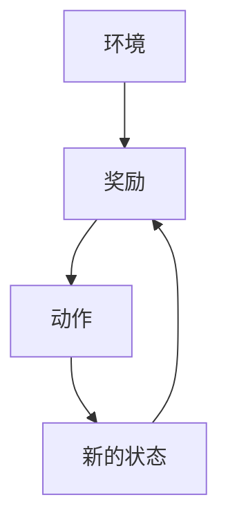
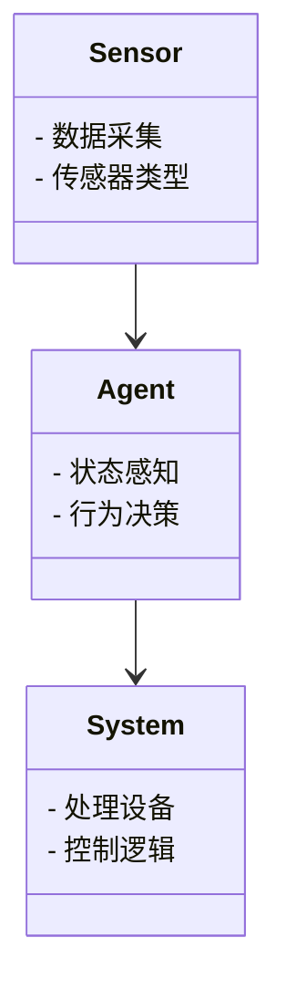

                 


# AI Agent在智能废水处理中的实践

## 关键词：AI Agent, 废水处理, 智能系统, 强化学习, 深度学习, 实时优化

## 摘要：本文系统地探讨了AI Agent在智能废水处理中的应用，从基础概念到算法实现，再到系统架构设计，详细分析了如何利用AI技术提升废水处理的效率和智能化水平。文章通过实际案例展示了AI Agent在废水处理中的优势，并提供了可供参考的系统设计和实现方案。

---

# 第一部分: AI Agent与智能废水处理的背景与基础

## 第1章: AI Agent与智能废水处理概述

### 1.1 废水处理的背景与挑战

#### 1.1.1 废水处理的基本概念
废水处理是指将工业、生活等产生的污水经过物理、化学、生物等方法处理后，使其达到排放标准的过程。废水处理的核心目标是减少污染物的排放，保护环境和人类健康。

#### 1.1.2 废水处理的主要挑战
- 污染物种类繁多，处理难度大。
- 处理过程复杂，涉及多个环节和参数。
- 传统处理方法效率低，难以应对动态变化的环境。

#### 1.1.3 AI技术在废水处理中的应用潜力
- 提高处理效率：通过AI技术优化处理流程。
- 实时监控：利用传感器和AI算法实时监测水质。
- 预测与预警：通过数据分析预测潜在的环境风险。

### 1.2 AI Agent的基本概念与特点

#### 1.2.1 AI Agent的定义
AI Agent（智能体）是指能够感知环境、自主决策并执行任务的智能系统。它能够根据环境反馈不断优化自己的行为，以达到目标。

#### 1.2.2 AI Agent的核心特点
- **自主性**：能够在没有外部干预的情况下自主运行。
- **反应性**：能够实时感知环境并做出反应。
- **学习能力**：能够通过数据和经验不断优化自身的决策能力。
- **协作性**：能够在多智能体环境中与其他智能体协作完成任务。

#### 1.2.3 AI Agent与传统自动控制系统的区别
| 特性                | AI Agent                      | 传统控制系统              |
|---------------------|-------------------------------|---------------------------|
| 决策方式            | 基于学习和数据驱动          | 基于固定规则和逻辑        |
| 环境适应能力        | 强，能够动态调整策略         | 较弱，依赖预设规则          |
| 复杂问题处理能力     | 能处理非线性、复杂问题       | 适合处理线性、简单问题     |

### 1.3 AI Agent在废水处理中的应用场景

#### 1.3.1 智能监测与实时反馈
AI Agent可以通过传感器实时监测水质参数（如pH值、温度、溶解氧等），并根据这些数据调整处理设备的运行参数。

#### 1.3.2 智能优化与决策支持
AI Agent可以利用历史数据和实时信息，优化废水处理的工艺参数，降低处理成本。

#### 1.3.3 智能预测与风险预警
AI Agent可以通过机器学习模型预测水质变化趋势，提前发现潜在风险，避免环境污染。

### 1.4 本章小结
本章介绍了废水处理的基本概念和挑战，详细讲解了AI Agent的核心概念和特点，并探讨了AI Agent在废水处理中的应用场景。

---

## 第2章: AI Agent的核心概念与联系

### 2.1 AI Agent的核心原理

#### 2.1.1 状态感知与环境建模
AI Agent通过传感器感知环境状态，并建立环境模型来描述系统的运行状态。

#### 2.1.2 行为决策与策略优化
AI Agent根据当前状态和目标，选择最优的行为，并通过强化学习等方法不断优化决策策略。

#### 2.1.3 多智能体协作机制
在复杂的废水处理系统中，通常需要多个AI Agent协作完成任务，例如分别负责不同的处理环节。

### 2.2 核心概念对比与ER实体关系图

#### 2.2.1 AI Agent与传统控制系统的对比
| 特性                | AI Agent                      | 传统控制系统              |
|---------------------|-------------------------------|---------------------------|
| 决策方式            | 基于学习和数据驱动          | 基于固定规则和逻辑        |
| 环境适应能力        | 强，能够动态调整策略         | 较弱，依赖预设规则          |
| 复杂问题处理能力     | 能处理非线性、复杂问题       | 适合处理线性、简单问题     |

#### 2.2.2 废水处理系统中的实体关系图
```mermaid
er
actor: 用户
agent: AI Agent
system: 废水处理系统
actor --> agent: 请求处理
agent --> system: 发出指令
system --> agent: 返回数据
```

### 2.3 算法原理与数学模型

#### 2.3.1 强化学习算法原理
强化学习是一种通过试错方法来优化决策策略的算法。AI Agent通过与环境的交互获得奖励，并根据奖励调整行为策略。



#### 2.3.2 Q-learning算法的数学模型
Q-learning是一种常用的强化学习算法，其数学模型如下：

$$ Q(s,a) = r + \gamma \max Q(s',a') $$

其中：
- \( Q(s,a) \) 表示状态 \( s \) 下动作 \( a \) 的价值。
- \( r \) 是奖励。
- \( \gamma \) 是折扣因子。
- \( Q(s',a') \) 是下一个状态下的最大价值。

### 2.4 本章小结
本章详细讲解了AI Agent的核心原理，对比了传统控制系统与AI Agent的区别，并通过ER实体关系图和数学模型展示了AI Agent在废水处理中的工作原理。

---

## 第3章: 废水处理系统的算法原理与实现

### 3.1 算法原理

#### 3.1.1 基于强化学习的废水处理优化
通过强化学习算法优化废水处理的工艺参数，如曝气时间、搅拌速度等。

#### 3.1.2 基于深度学习的水质预测
利用深度学习模型（如LSTM）预测水质变化趋势。

#### 3.1.3 基于规则引擎的异常处理
当系统检测到异常情况（如传感器故障）时，触发规则引擎进行处理。

### 3.2 算法实现与代码示例

#### 3.2.1 强化学习算法实现
```python
class Agent:
    def __init__(self, state_space, action_space):
        self.state_space = state_space
        self.action_space = action_space
        self.q_table = np.zeros((state_space, action_space))

    def act(self, state):
        # 根据Q表选择动作
        return np.argmax(self.q_table[state])

    def learn(self, state, action, reward, next_state):
        # 更新Q表
        self.q_table[state][action] += 0.1 * (reward + 0.9 * np.max(self.q_table[next_state]))
```

#### 3.2.2 深度学习模型实现
```python
import tensorflow as tf
from tensorflow import keras

# 构建LSTM模型
model = keras.Sequential()
model.add(keras.layers.LSTM(64, input_shape=(timesteps, features)))
model.add(keras.layers.Dense(1))
model.compile(loss='mean_squared_error', optimizer='adam')
```

### 3.3 本章小结
本章详细讲解了AI Agent在废水处理中的算法实现，包括强化学习、深度学习和规则引擎的应用，并通过代码示例展示了具体实现方法。

---

## 第4章: 系统分析与架构设计方案

### 4.1 问题场景介绍
废水处理系统通常包括监测、处理、优化和反馈四个环节。

### 4.2 系统功能设计

#### 4.2.1 领域模型（类图）


#### 4.2.2 系统架构设计


### 4.3 本章小结
本章通过领域模型和系统架构图展示了废水处理系统的整体设计，强调了各模块之间的协作关系。

---

## 第5章: 项目实战

### 5.1 环境安装
- 安装Python和必要的库（如numpy、pandas、tensorflow）。
- 安装传感器和数据采集设备。

### 5.2 系统核心实现

#### 5.2.1 传感器数据采集
```python
import serial

ser = serial.Serial('COM3', 9600)
data = ser.readline().decode().strip()
```

#### 5.2.2 AI Agent决策
```python
agent = Agent(state_space=10, action_space=5)
action = agent.act(current_state)
```

#### 5.2.3 系统控制
```python
# 发送控制指令
ser.write(action.encode())
```

### 5.3 案例分析
通过实际案例展示AI Agent在废水处理中的应用效果，包括处理效率提升和成本降低。

### 5.4 本章小结
本章通过实际项目展示了AI Agent在废水处理中的具体应用，并提供了环境安装和代码实现的详细步骤。

---

## 第6章: 总结与展望

### 6.1 本章小结
总结全文，强调AI Agent在废水处理中的重要性和应用价值。

### 6.2 注意事项
- 数据质量对AI Agent的性能影响较大，需确保传感器的准确性和数据的完整性。
- 系统的安全性需重点关注，避免数据泄露和系统攻击。

### 6.3 拓展阅读
推荐相关书籍和论文，进一步深入学习AI在环境工程中的应用。

---

## 作者：AI天才研究院/AI Genius Institute & 禅与计算机程序设计艺术 /Zen And The Art of Computer Programming

