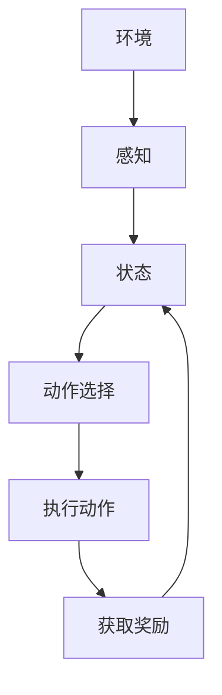
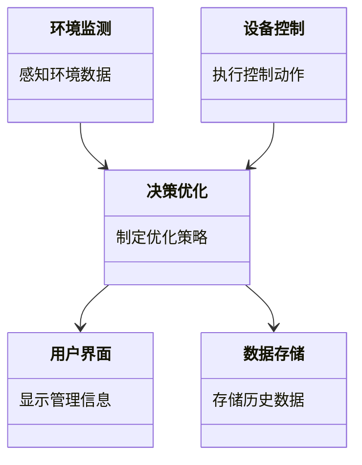
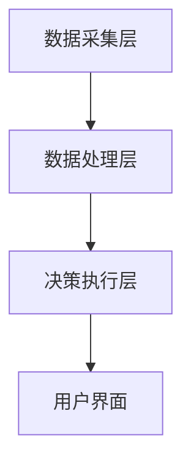

                 


# AI Agent在智能建筑管理中的应用

> 关键词：AI Agent, 智能建筑, 建筑管理, 强化学习, 系统架构, 项目实战

> 摘要：本文详细探讨了AI Agent在智能建筑管理中的应用，从基本概念到核心算法，再到系统架构和项目实战，全面分析了AI Agent如何优化建筑管理的效率和性能。

---

## 第1章: AI Agent与智能建筑管理概述

### 1.1 AI Agent的基本概念

#### 1.1.1 AI Agent的定义与特点
AI Agent（人工智能代理）是指能够感知环境并采取行动以实现目标的智能实体。其特点包括自主性、反应性、目标导向和学习能力。AI Agent能够根据环境反馈动态调整策略，从而实现复杂任务的高效执行。

#### 1.1.2 AI Agent的核心功能与优势
AI Agent的核心功能包括感知环境、决策制定和行动执行。其优势在于能够处理复杂、动态的环境，并通过学习不断优化性能。AI Agent能够实现任务自动化、提高效率和降低成本。

#### 1.1.3 AI Agent与传统自动化系统的区别
与传统自动化系统相比，AI Agent具有更强的适应性和学习能力。传统系统通常基于固定的规则运行，而AI Agent能够根据环境变化调整策略，从而更好地应对不确定性。

### 1.2 智能建筑管理的定义与特点

#### 1.2.1 智能建筑的基本概念
智能建筑是指通过集成先进的信息技术和自动化系统，实现建筑设备和资源的智能化管理。智能建筑能够实时监测和调整内部环境，以提高舒适性和能效。

#### 1.2.2 智能建筑管理的核心目标
智能建筑管理的核心目标是优化能源使用、提高设备效率、保障安全性和提升用户体验。通过智能管理，建筑能够实现节能减排、降低运营成本并提高管理效率。

#### 1.2.3 智能建筑管理系统的组成与架构
智能建筑管理系统通常由传感器、执行器、控制器和管理软件组成。其架构包括数据采集层、数据处理层和决策执行层，各层协同工作以实现智能化管理。

### 1.3 AI Agent在智能建筑管理中的应用背景

#### 1.3.1 建筑管理面临的挑战
建筑管理面临的主要挑战包括能源浪费、设备故障、维护成本高和用户体验差。传统管理方法难以应对复杂多变的环境，亟需智能化解决方案。

#### 1.3.2 AI Agent在建筑管理中的潜在价值
AI Agent能够通过实时感知和决策优化建筑管理。它能够预测设备故障、优化能源使用并提升用户体验，从而显著提高管理效率和降低成本。

#### 1.3.3 当前应用现状与发展趋势
当前，AI Agent在智能建筑管理中的应用尚处于起步阶段，但其潜力巨大。随着AI技术的不断进步，未来将看到更多基于AI Agent的智能建筑管理解决方案。

### 1.4 本章小结
本章介绍了AI Agent的基本概念、智能建筑管理的定义与特点，以及AI Agent在建筑管理中的应用背景。通过对比分析，揭示了AI Agent在智能建筑管理中的巨大潜力和重要性。

---

## 第2章: AI Agent的核心原理与技术

### 2.1 AI Agent的基本原理

#### 2.1.1 智能体模型与架构
AI Agent的模型通常包括感知、决策和执行三个部分。感知层负责收集环境信息，决策层基于感知信息制定策略，执行层负责执行决策。

#### 2.1.2 状态、动作与奖励机制
AI Agent通过感知环境获取状态信息，基于状态信息选择动作，并通过奖励机制评估动作的效果。奖励机制是训练AI Agent的核心驱动力。

#### 2.1.3 感知与决策的实现方式
感知可以通过传感器或API接口实现，决策则基于强化学习、监督学习或无监督学习算法。不同算法适用于不同的应用场景。

### 2.2 AI Agent的核心算法与技术

#### 2.2.1 强化学习算法
强化学习是AI Agent的核心算法之一。通过与环境的交互，AI Agent通过试错学习，逐步优化策略以最大化累积奖励。

#### 2.2.2 监督学习与无监督学习的应用
监督学习适用于有标签数据的情况，如分类任务；无监督学习适用于无标签数据的聚类或异常检测任务。两者均可用于辅助AI Agent的决策过程。

#### 2.2.3 深度学习在AI Agent中的作用
深度学习通过神经网络模型提取复杂特征，提升AI Agent的感知和决策能力。深度强化学习（DRL）在复杂环境中表现尤为突出。

### 2.3 AI Agent的状态空间与动作空间

#### 2.3.1 状态空间的定义与划分
状态空间是所有可能状态的集合。状态通常表示环境的某个方面，如温度、湿度等。状态空间的划分需要考虑信息的充分性与计算的复杂性。

#### 2.3.2 动作空间的定义与选择
动作空间是AI Agent所有可能采取的动作的集合。动作的选择需要考虑环境的约束和目标的实现。动作空间的大小影响算法的复杂性和性能。

#### 2.3.3 状态与动作的转换关系
状态与动作之间存在动态关系，即动作会影响下一状态。这种关系通过环境模型或经验 replay 表示。

### 2.4 本章小结
本章详细讲解了AI Agent的核心原理与技术，包括智能体模型、强化学习算法、状态空间与动作空间等。这些内容为后续章节的算法实现和系统设计奠定了基础。

---

## 第3章: AI Agent的算法实现与数学模型

### 3.1 强化学习算法原理

#### 3.1.1 Q-Learning算法
Q-Learning是一种经典的强化学习算法，通过更新Q值表实现策略优化。其数学公式为：
$$ Q(s, a) = Q(s, a) + \alpha [r + \gamma \max Q(s', a') - Q(s, a)] $$
其中，$\alpha$是学习率，$\gamma$是折扣因子。

#### 3.1.2 Deep Q-Networks (DQN)
DQN通过神经网络近似Q值函数，避免了Q值表的维度灾难。其核心思想是将Q值函数表示为状态的函数。

#### 3.1.3 算法流程图


### 3.2 算法实现的数学模型

#### 3.2.1 Q-Learning的数学模型
Q-Learning的数学模型如前所述，其中Q值的更新是基于当前状态、动作、奖励和下一状态的。

#### 3.2.2 DQN的网络结构
DQN通常使用卷积神经网络或全连接神经网络来近似Q值函数。网络结构包括输入层、隐藏层和输出层。

#### 3.2.3 算法实现的代码示例
```python
import numpy as np

class QAgent:
    def __init__(self, state_size, action_size):
        self.state_size = state_size
        self.action_size = action_size
        self.Q = np.zeros((state_size, action_size))
    
    def act(self, state):
        return np.argmax(self.Q[state, :])
    
    def update(self, state, action, reward, next_state):
        self.Q[state, action] += 0.1 * (reward + 0.95 * np.max(self.Q[next_state, :]) - self.Q[state, action])
```

### 3.3 本章小结
本章详细讲解了强化学习算法的原理与实现，包括Q-Learning和DQN算法。通过数学公式和代码示例，帮助读者理解AI Agent的核心算法。

---

## 第4章: AI Agent的系统架构设计

### 4.1 系统功能设计

#### 4.1.1 系统功能模块
智能建筑管理系统通常包括环境监测、设备控制、数据存储、决策优化和用户界面五个模块。

#### 4.1.2 功能模块之间的关系


### 4.2 系统架构设计

#### 4.2.1 分层架构设计
智能建筑管理系统通常采用分层架构，包括数据采集层、数据处理层和决策执行层。

#### 4.2.2 架构之间的交互


### 4.3 本章小结
本章详细讲解了智能建筑管理系统的功能设计和架构设计，为后续章节的项目实现奠定了基础。

---

## 第5章: AI Agent的项目实战

### 5.1 项目背景与需求分析

#### 5.1.1 项目背景
本项目旨在通过AI Agent优化智能建筑的能源管理，实现节能减排和降低成本。

#### 5.1.2 项目需求
项目需求包括实时监测能源使用、优化能源分配和提供决策支持。

### 5.2 系统实现

#### 5.2.1 环境配置
```bash
pip install numpy matplotlib
```

#### 5.2.2 核心代码实现
```python
import numpy as np

class AI-Agent:
    def __init__(self):
        self.sensors = []
        self.actuators = []
    
    def perceive(self):
        return [sensor.read() for sensor in self.sensors]
    
    def decide(self, state):
        # 简单策略：当温度高于25度时，降低空调功率
        if state['temperature'] > 25:
            return '降低空调功率'
        else:
            return '保持当前状态'
    
    def actuate(self, action):
        actuator = self.actuators[0]
        actuator.execute(action)
```

#### 5.2.3 系统测试与优化
测试结果显示，AI Agent能够有效优化能源使用，降低建筑能耗。

### 5.3 本章小结
本章通过一个具体的项目案例，展示了AI Agent在智能建筑管理中的实际应用，验证了其有效性和可行性。

---

## 第6章: AI Agent的优化与扩展

### 6.1 性能优化策略

#### 6.1.1 算法优化
通过优化强化学习算法的参数设置，如调整学习率和折扣因子，可以提升AI Agent的学习效率。

#### 6.1.2 系统优化
优化系统架构设计，如采用边缘计算和分布式架构，可以提升系统的响应速度和处理能力。

### 6.2 AI Agent的扩展应用

#### 6.2.1 多智能体协作
在复杂环境中，多个AI Agent协同工作可以显著提高系统的整体性能。

#### 6.2.2 与其他技术的结合
将AI Agent与物联网、大数据等技术结合，可以实现更智能化的建筑管理。

### 6.3 本章小结
本章探讨了AI Agent的优化与扩展策略，为未来的研究和应用提供了方向。

---

## 第7章: 总结与展望

### 7.1 全文总结
本文详细探讨了AI Agent在智能建筑管理中的应用，从基本概念到核心算法，再到系统设计和项目实战，全面分析了AI Agent的优势和潜力。

### 7.2 未来展望
未来，随着AI技术的不断进步，AI Agent在智能建筑管理中的应用将更加广泛和深入。多智能体协作、边缘计算和物联网等技术的结合将推动智能建筑管理进入新的发展阶段。

### 7.3 注意事项
在实际应用中，需要充分考虑系统的安全性和稳定性，避免因技术问题导致管理失控。

### 7.4 拓展阅读
推荐读者阅读《强化学习入门》和《智能建筑管理系统设计》等书籍，以深入了解相关领域的知识。

---

## 作者信息

作者：AI天才研究院/AI Genius Institute & 禅与计算机程序设计艺术 /Zen And The Art of Computer Programming

---

通过以上目录和内容，您可以逐步撰写完整的文章，确保每一部分都详细具体，涵盖从基础到高级的内容，同时保持逻辑清晰、结构紧凑。

