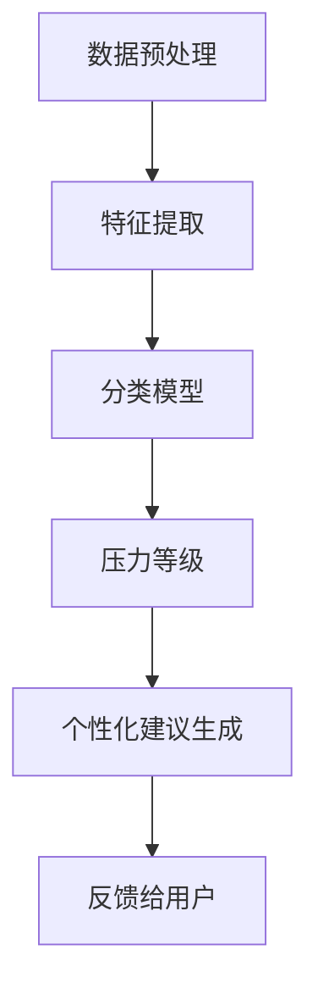
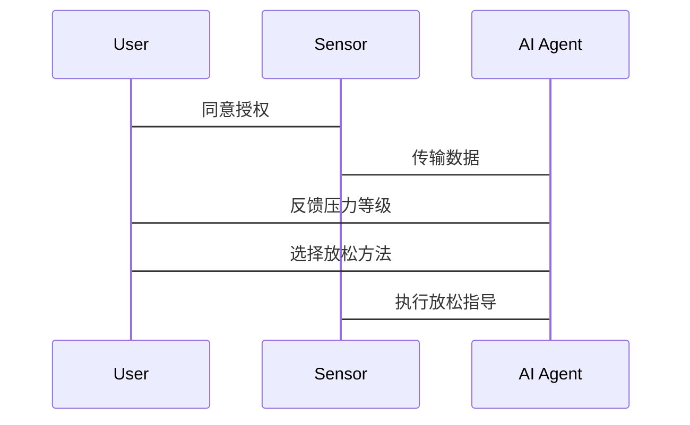

                 


# AI Agent在智能手表中的压力管理与放松指导

**关键词**：AI Agent，智能手表，压力管理，放松指导，健康监测

**摘要**：随着现代生活的节奏加快，压力管理变得越来越重要。AI Agent在智能手表中的应用为用户提供个性化的压力监测和放松指导。本文详细探讨了AI Agent的核心概念、算法原理、系统架构，并通过实际案例展示了其在智能手表中的应用场景和优势。

---

## 第1章: 背景介绍与核心概念

### 1.1 问题背景与现状

#### 1.1.1 现代社会的压力问题
现代社会的快节奏生活导致许多人面临压力问题。压力不仅影响身体健康，还会影响心理健康。智能手表作为一种普及的可穿戴设备，具备监测生理数据的能力，为压力管理提供了新的可能性。

#### 1.1.2 智能手表在健康监测中的作用
智能手表可以监测心率、皮肤温度、皮质醇水平等多种生理指标。这些数据为压力监测提供了客观依据。通过实时监测和反馈，用户可以及时了解自己的压力状态。

#### 1.1.3 压力管理与放松指导的必要性
压力管理的核心在于预防和缓解压力。通过智能手表实时监测压力，并提供个性化的放松指导，可以帮助用户有效管理压力，提升生活质量。

### 1.2 问题描述与目标

#### 1.2.1 压力管理的核心问题
压力管理涉及多个方面，包括压力源识别、压力水平监测和压力缓解策略制定。通过AI代理，可以实现对压力的实时监测和个性化指导。

#### 1.2.2 放松指导的目标
放松指导的目标是帮助用户通过特定的方法（如深呼吸、冥想）来缓解压力。AI代理可以根据用户的生理数据和偏好，提供个性化的放松建议。

#### 1.2.3 AI Agent在压力管理中的角色
AI Agent在压力管理中扮演着数据采集、分析和反馈的角色。它能够实时监测用户的生理数据，分析压力水平，并提供个性化的放松指导。

---

## 第2章: AI Agent的基本概念与应用

### 2.1 AI Agent的定义与特点

#### 2.1.1 AI Agent的定义
AI Agent是一种智能代理，能够感知环境、处理信息并执行任务。它能够通过数据驱动的方式，实现自主决策和执行。

#### 2.1.2 AI Agent的核心特点
- **自主性**：能够自主决策和执行任务。
- **反应性**：能够实时感知环境变化并做出反应。
- **学习能力**：能够通过数据和反馈不断优化自身的算法。

#### 2.1.3 AI Agent与传统软件的区别
AI Agent与传统软件的区别在于其智能性和自主性。传统软件通常按照预设的规则运行，而AI Agent能够通过学习和适应环境来优化自身的行为。

### 2.2 AI Agent在智能手表中的应用

#### 2.2.1 压力监测与反馈
AI Agent通过智能手表监测用户的心率、皮肤温度和皮质醇水平，分析压力水平，并提供实时反馈。

#### 2.2.2 放松指导的实现
AI Agent根据用户的压力水平和偏好，推荐适合的放松方法，如深呼吸练习或冥想。

#### 2.2.3 用户交互与个性化推荐
通过自然语言处理和用户偏好分析，AI Agent能够与用户进行交互，提供个性化的压力管理建议。

---

## 第3章: 核心概念与联系

### 3.1 AI Agent的工作原理

#### 3.1.1 感知模块
AI Agent通过智能手表的传感器获取用户的生理数据，如心率和皮肤温度。这些数据经过预处理后，提取特征用于后续分析。

#### 3.1.2 决策模块
决策模块基于机器学习模型对用户的生理数据进行分类，判断用户的压力水平。常用的算法包括支持向量机（SVM）和随机森林。

#### 3.1.3 执行模块
根据决策模块的结果，AI Agent生成个性化的放松指导建议，并通过智能手表反馈给用户。

### 3.2 核心概念的对比与ER实体关系图

#### 3.2.1 核心概念的属性对比
| 特征 | 压力监测 | 放松指导 |
|------|----------|----------|
| 数据输入 | 心率、皮肤温度 | 用户偏好、压力水平 |
| 数据输出 | 压力等级 | 放松建议 |

#### 3.2.2 ER实体关系图
```mermaid
erDiagram
    user {
        id INT AUTO
        username VARCHAR
        pressure_level INT
    }
    sensor {
        id INT AUTO
        type VARCHAR
        data_value DECIMAL
    }
    ai_agent {
        id INT AUTO
        algorithm_type VARCHAR
        model_version INT
    }
    user -> sensor : 使用
    sensor -> ai_agent : 提供数据
    ai_agent -> user : 提供反馈
```

---

## 第4章: 算法原理

### 4.1 算法原理概述

#### 4.1.1 数据预处理
数据预处理包括数据清洗和特征提取。例如，心率数据需要去除噪声，并提取心率变异性特征。

#### 4.1.2 特征提取
特征提取是将原始数据转换为有意义的特征，如心率变异性、皮肤温度变化率等。

#### 4.1.3 分类模型
常用的分类模型包括支持向量机（SVM）和随机森林。分类模型用于将压力水平分为不同等级。

#### 4.1.4 个性化建议生成
根据分类结果和用户偏好，生成个性化的放松指导建议。

### 4.2 算法流程图



---

## 第5章: 系统分析与架构设计

### 5.1 系统架构设计

#### 5.1.1 分层架构
系统采用分层架构，包括硬件层、数据处理层、AI分析层和用户界面层。

#### 5.1.2 系统接口设计
系统接口包括用户授权接口、数据采集接口、AI分析接口和反馈接口。

#### 5.1.3 交互流程图



---

## 第6章: 项目实战

### 6.1 环境安装

#### 6.1.1 开发环境
- **操作系统**：Windows 10或更高版本
- **编程语言**：Python 3.8+
- **框架与库**：TensorFlow、Scikit-learn、Sensor API

#### 6.1.2 工具安装
- 安装Python环境和必要的库：`pip install numpy scikit-learn`

### 6.2 核心代码实现

#### 6.2.1 数据预处理
```python
import numpy as np

def preprocess(data):
    # 去除噪声
    filtered_data = np.where(abs(data - np.mean(data)) < np.std(data), data, np.mean(data))
    return filtered_data
```

#### 6.2.2 特征提取
```python
from sklearn.feature_selection import SelectKBest

def extract_features(data):
    selector = SelectKBest(k=5)
    features = selector.fit_transform(data)
    return features
```

#### 6.2.3 分类模型
```python
from sklearn.svm import SVC

def train_model(features, labels):
    model = SVC()
    model.fit(features, labels)
    return model
```

#### 6.2.4 个性化建议生成
```python
def generate_recommendation(level):
    recommendations = {
        'low': ['深呼吸练习', '散步'],
        'medium': ['冥想', '听音乐'],
        'high': ['寻求专业帮助', '冷水浴']
    }
    return recommendations[level]
```

### 6.3 案例分析

#### 6.3.1 数据采集
假设有用户A，心率数据如下：
```
heart_rate = [72, 75, 78, 80, 82, 85, 90]
```

#### 6.3.2 数据处理
经过预处理和特征提取后，得到特征向量：
```
features = extract_features(preprocess(heart_rate))
```

#### 6.3.3 分类与反馈
模型预测压力等级为中等：
```
model.predict(features)
# 输出: 'medium'
```
生成放松建议：冥想或听音乐。

---

## 第7章: 最佳实践与小结

### 7.1 最佳实践

#### 7.1.1 数据隐私保护
在处理用户数据时，必须确保数据的隐私和安全。

#### 7.1.2 用户反馈的重要性
及时收集用户的反馈，不断优化AI模型和建议。

### 7.2 小结

本文详细介绍了AI Agent在智能手表中的压力管理与放松指导的应用。通过系统的分析和实际案例的展示，证明了AI代理在压力管理中的巨大潜力。

---

## 结论

AI Agent通过实时监测和个性化指导，帮助用户有效管理压力。随着技术的不断进步，AI代理在智能手表中的应用将更加广泛和深入。

---

## 参考文献

- Bishop, C. M. (2006). Pattern Recognition and Machine Learning.
- Goodfellow, I., Bengio, Y., & Courville, A. (2016). Deep Learning.

---

**作者：AI天才研究院/AI Genius Institute & 禅与计算机程序设计艺术 /Zen And The Art of Computer Programming**

