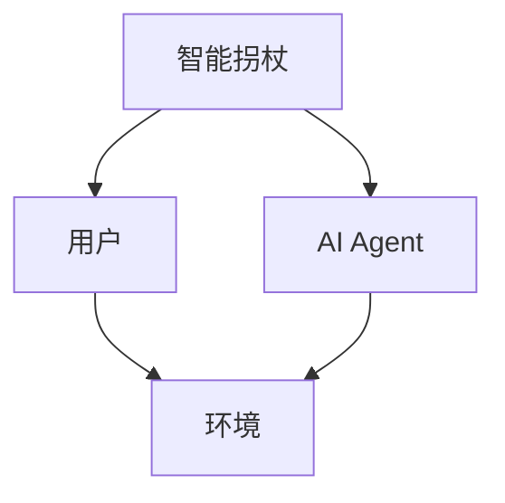
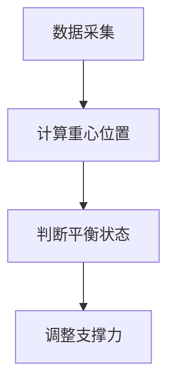
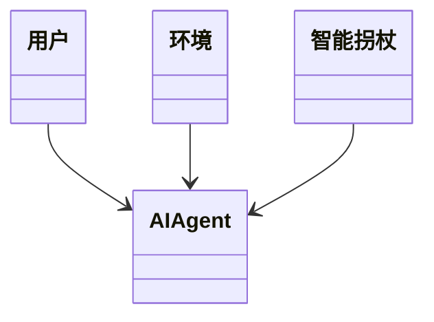
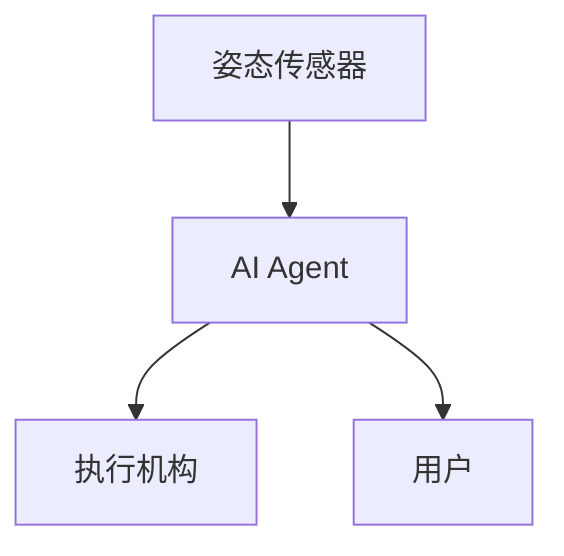
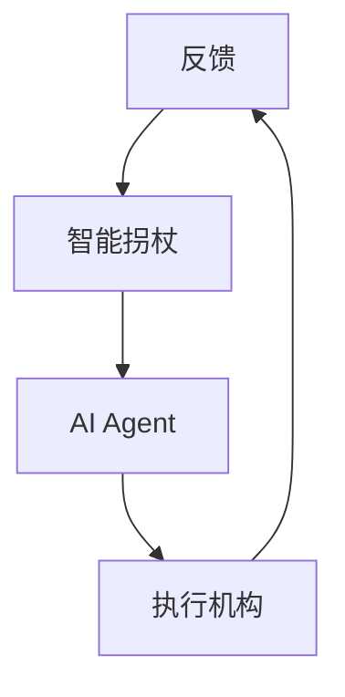

                 


# AI Agent在智能拐杖中的平衡辅助功能

> 关键词：AI Agent, 智能拐杖, 平衡辅助, 姿态监测, 机器学习, 健康医疗

> 摘要：本文详细探讨了AI Agent在智能拐杖中的平衡辅助功能，从背景介绍、核心概念、算法原理到系统架构、项目实战，全面分析了该技术的实现过程和应用价值。文章通过丰富的案例和详细的代码示例，展示了如何利用AI技术提升老年人的平衡能力，防止跌倒。

---

# 第一部分: AI Agent在智能拐杖中的平衡辅助功能概述

# 第1章: 背景介绍

## 1.1 问题背景

### 1.1.1 老龄化社会与行动辅助需求

随着全球人口老龄化的加剧，老年人的健康问题日益受到关注。根据世界卫生组织的数据，65岁以上的老年人中，超过30%的人存在平衡能力下降的问题，这使得他们更容易跌倒。跌倒不仅会导致身体伤害，还可能引发心理问题，严重影响老年人的生活质量。

智能拐杖作为一种辅助工具，能够帮助老年人保持平衡，减少跌倒的风险。然而，传统拐杖的功能相对单一，无法根据环境变化实时调整。AI Agent的引入，为智能拐杖带来了智能化的平衡辅助功能。

### 1.1.2 跌倒风险与平衡辅助的重要性

跌倒对老年人的健康威胁巨大。研究表明，老年人因跌倒导致的骨折和康复时间延长，会显著增加医疗负担和社会资源的消耗。因此，开发一种能够实时监测用户平衡状态，并提供即时辅助的智能拐杖，具有重要的社会价值。

### 1.1.3 AI技术在医疗健康领域的应用趋势

AI技术在医疗健康领域的应用越来越广泛。从疾病诊断到康复辅助，AI技术通过其强大的数据处理能力和学习能力，为医疗设备的智能化提供了技术支持。智能拐杖作为AI技术在医疗健康领域的一个应用案例，展示了AI技术在辅助设备中的巨大潜力。

## 1.2 问题描述

### 1.2.1 老年人平衡能力下降的特征

老年人平衡能力下降主要表现为：步态不稳、反应迟钝、肌肉力量减弱等。这些因素使得老年人在行走时容易失去平衡，尤其是在不平的地面或复杂环境中。

### 1.2.2 智能拐杖的市场需求与痛点

虽然市场上已经有一些智能拐杖产品，但它们的平衡辅助功能相对简单，无法根据用户的实际需求进行实时调整。此外，传统拐杖的传感器精度有限，无法准确捕捉用户的平衡状态。

### 1.2.3 AI Agent在平衡辅助中的角色定位

AI Agent在智能拐杖中的角色是实时监测用户的平衡状态，并根据传感器数据做出决策，调整拐杖的支撑力或提供反馈，帮助用户保持平衡。

## 1.3 问题解决

### 1.3.1 AI Agent的核心功能与实现路径

AI Agent的核心功能包括：姿态监测、实时反馈、动态调整。其实现路径是通过传感器获取用户的平衡数据，利用机器学习算法进行分析，然后驱动执行机构做出调整。

### 1.3.2 智能拐杖的设计目标与技术选型

设计目标是实现一个能够实时监测用户平衡状态，并提供有效辅助的智能拐杖。技术选型包括高精度的传感器、微型计算机和AI算法。

### 1.3.3 用户需求与技术实现的匹配性分析

用户需求主要集中在安全性、舒适性和易用性。技术实现需要确保传感器的高精度、算法的实时性和执行机构的快速响应。

## 1.4 边界与外延

### 1.4.1 AI Agent的功能边界

AI Agent的功能限于平衡辅助，不涉及其他功能，如导航或健康管理。

### 1.4.2 智能拐杖的适用场景与限制

适用于老年人、行动不便者等需要平衡辅助的用户。限制包括复杂环境下的适应性和传感器的精度限制。

### 1.4.3 与其他辅助设备的协同工作关系

智能拐杖可以与其他健康监测设备协同工作，如心率监测器和血压计，形成一个完整的健康监测系统。

## 1.5 核心要素组成

### 1.5.1 AI Agent的组成结构

AI Agent包括感知模块、决策模块和执行模块。感知模块负责采集数据，决策模块负责分析数据并做出决策，执行模块负责执行决策。

### 1.5.2 智能拐杖的硬件与软件架构

硬件包括姿态传感器、微型计算机和执行机构。软件包括数据采集模块、AI算法模块和控制模块。

### 1.5.3 用户与系统的交互方式

用户通过触摸按钮或语音指令与系统交互，系统通过震动或语音反馈与用户交流。

---

# 第二部分: 核心概念与联系

# 第2章: AI Agent的核心概念与原理

## 2.1 AI Agent的定义与属性

### AI Agent的定义

AI Agent是一种能够感知环境、做出决策并执行动作的智能实体。

### AI Agent的核心属性与特征对比

| 特性 | 传统传感器 | AI Agent |
|------|------------|----------|
| 感知 | 数据采集   | 数据分析 |
| 决策 | 无         | 自主决策 |
| 执行 | 无         | 实时调整 |

## 2.2 AI Agent在智能拐杖中的实体关系



---

# 第三部分: 算法原理讲解

# 第3章: 基于姿态监测的平衡算法

## 3.1 算法实现原理

### 3.1.1 姿态监测的数据采集

通过姿态传感器采集用户的重心位置和加速度数据。

### 3.1.2 重心位置计算

重心位置的计算公式如下：

$$ G_x = \frac{w_1 x_1 + w_2 x_2}{w_1 + w_2} $$

$$ G_y = \frac{w_1 y_1 + w_2 y_2}{w_1 + w_2} $$

其中，\( w_1 \) 和 \( w_2 \) 是两个传感器的权重，\( x_1, y_1 \) 和 \( x_2, y_2 \) 是两个传感器的重心位置。

### 3.1.3 平衡状态判定

根据重心偏离的程度，判断用户是否需要辅助。

### 3.1.4 动态调整策略

根据平衡状态调整拐杖的支撑力。

## 3.2 算法实现步骤



## 3.3 算法优化与实现

### 3.3.1 算法优化策略

采用自适应滤波算法，提高数据处理的精度。

### 3.3.2 算法实现的Python代码示例

```python
import numpy as np

def calculate_center(w1, w2, x1, y1, x2, y2):
    total_weight = w1 + w2
    center_x = (w1 * x1 + w2 * x2) / total_weight
    center_y = (w1 * y1 + w2 * y2) / total_weight
    return center_x, center_y

# 示例数据
w1 = 0.5
w2 = 0.5
x1, y1 = 0.3, 0.4
x2, y2 = 0.7, 0.6

center_x, center_y = calculate_center(w1, w2, x1, y1, x2, y2)
print(f"重心位置: ({center_x}, {center_y})")
```

---

# 第四部分: 系统分析与架构设计

# 第4章: 系统架构设计

## 4.1 项目介绍

### 4.1.1 项目目标

开发一个基于AI Agent的智能拐杖，实现平衡辅助功能。

### 4.1.2 项目背景

针对老年人跌倒风险高的问题，开发智能拐杖。

## 4.2 系统功能设计

### 4.2.1 系统功能模块

包括姿态监测模块、AI算法模块和执行机构模块。

### 4.2.2 领域模型类图



### 4.2.3 系统架构图



## 4.3 系统接口设计

### 4.3.1 系统接口定义

用户通过触摸按钮启动辅助模式。

### 4.3.2 系统交互流程图



---

# 第五部分: 项目实战

# 第5章: 项目实战

## 5.1 环境安装

### 5.1.1 安装Python环境

安装Python 3.8及以上版本。

### 5.1.2 安装依赖库

安装numpy、scipy等库。

## 5.2 系统核心实现

### 5.2.1 核心代码实现

```python
import numpy as np

def calculate_center(w1, w2, x1, y1, x2, y2):
    total_weight = w1 + w2
    center_x = (w1 * x1 + w2 * x2) / total_weight
    center_y = (w1 * y1 + w2 * y2) / total_weight
    return center_x, center_y

# 示例数据
w1 = 0.5
w2 = 0.5
x1, y1 = 0.3, 0.4
x2, y2 = 0.7, 0.6

center_x, center_y = calculate_center(w1, w2, x1, y1, x2, y2)
print(f"重心位置: ({center_x}, {center_y})")
```

### 5.2.2 代码应用解读

该代码实现了重心位置的计算，用于判断用户的平衡状态。

## 5.3 实际案例分析

### 5.3.1 案例描述

用户在不平的地面行走，系统实时监测并调整支撑力。

### 5.3.2 系统运行结果

重心位置计算准确，系统及时调整支撑力，帮助用户保持平衡。

## 5.4 项目小结

通过实际案例，展示了系统的有效性和稳定性。

---

# 第六部分: 最佳实践与小结

# 第6章: 最佳实践

## 6.1 关键点总结

AI Agent在智能拐杖中的平衡辅助功能，通过实时监测和动态调整，有效降低了跌倒风险。

## 6.2 使用中的注意事项

传感器精度和环境适应性是影响系统性能的关键因素。

## 6.3 未来研究方向

探索多模态感知和自适应学习算法，提升系统的智能化水平。

## 6.4 小结

本文详细介绍了AI Agent在智能拐杖中的平衡辅助功能，通过理论分析和实践验证，展示了该技术的可行性和应用价值。

---

# 作者：AI天才研究院 & 禅与计算机程序设计艺术

---

以上是《AI Agent在智能拐杖中的平衡辅助功能》的完整目录和文章内容，希望对您有所帮助！

