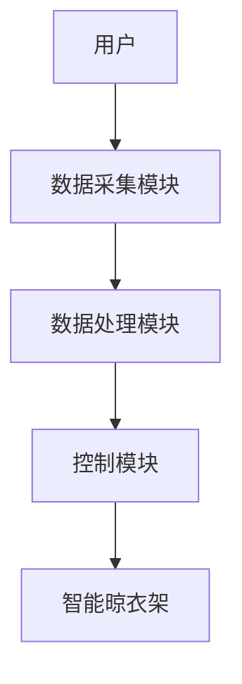
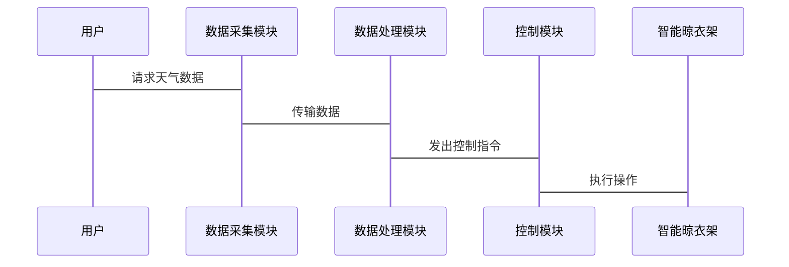

                 


# AI Agent在智能晾衣架中的天气感知

> 关键词：AI Agent，智能晾衣架，天气感知，机器学习，深度学习，物联网

> 摘要：本文深入探讨AI Agent在智能晾衣架中的天气感知应用，从背景、核心概念、算法原理到系统设计和项目实战，全面解析天气感知的关键技术与实现方案，帮助读者理解如何利用AI技术提升智能晾衣架的智能化水平。

---

# 第一部分：AI Agent与智能晾衣架的背景介绍

## 第1章：AI Agent与智能晾衣架概述

### 1.1 AI Agent的基本概念

AI Agent（智能体）是指在计算机系统中，能够感知环境并采取行动以实现目标的实体。它具备自主性、反应性、目标导向和社会能力等特征。AI Agent在智能晾衣架中的应用，使得设备能够根据天气情况自动调整晾晒模式。

#### 1.1.1 什么是AI Agent
AI Agent是一种能够感知环境、做出决策并执行操作的智能系统。它可以独立工作，也可以与其他系统或用户交互。

#### 1.1.2 AI Agent的核心特点
- **自主性**：能够在没有外部干预的情况下独立运行。
- **反应性**：能够实时感知环境并做出反应。
- **目标导向**：所有操作都以实现特定目标为导向。
- **学习能力**：能够通过数据和经验不断优化自身的决策能力。

#### 1.1.3 AI Agent的应用场景
AI Agent广泛应用于自动驾驶、智能助手、智能家居等领域。在智能晾衣架中，AI Agent用于感知天气变化，优化晾晒时间。

### 1.2 智能晾衣架的基本原理

#### 1.2.1 智能晾衣架的功能介绍
智能晾衣架是一种结合物联网技术的智能设备，能够自动晾晒衣物。它通常具备天气监测、自动晾晒、远程控制等功能。

#### 1.2.2 智能晾衣架的硬件组成
- **传感器**：用于采集环境数据，如温度、湿度、光照等。
- **执行机构**：用于控制晾衣架的运动，如伸缩、旋转等。
- **控制单元**：负责处理传感器数据并发出控制指令。

#### 1.2.3 智能晾衣架的软件架构
- **数据采集模块**：收集环境数据。
- **决策模块**：基于数据做出晾晒决策。
- **控制模块**：执行决策指令。

### 1.3 天气感知在智能晾衣架中的重要性

#### 1.3.1 天气对晾衣的影响
天气状况直接影响衣物晾晒的效果。例如，潮湿天气可能导致衣物难以干燥，阴雨天需要避免晾晒。

#### 1.3.2 天气感知的必要性
通过感知天气，智能晾衣架可以自动选择最佳晾晒时间，避免衣物受潮或损坏。

#### 1.3.3 天气感知的实现方式
- **传感器采集**：使用温湿度传感器、光照传感器等。
- **数据处理**：对传感器数据进行分析，判断天气状况。
- **决策控制**：根据天气情况调整晾晒模式。

## 第2章：天气数据的采集与处理

### 2.1 天气数据的采集方法

#### 2.1.1 传感器的选择与安装
- **温湿度传感器**：如DHT11、DHT22。
- **光照传感器**：用于检测光照强度。
- **雨量传感器**：检测降雨情况。

#### 2.1.2 数据采集的频率与精度
- **频率**：每隔几分钟采集一次数据。
- **精度**：传感器的精度直接影响天气判断的准确性。

#### 2.1.3 数据采集的误差分析
传感器误差、环境干扰、数据传输过程中的干扰都会影响数据准确性。

### 2.2 天气数据的预处理

#### 2.2.1 数据清洗与归一化
- **数据清洗**：去除异常值和噪声。
- **归一化**：将数据标准化，便于后续处理。

#### 2.2.2 数据特征的提取
提取关键特征，如温度、湿度、光照强度等，用于天气预测。

#### 2.2.3 数据的存储与管理
将数据存储在数据库中，方便后续分析和查询。

### 2.3 天气数据的可视化

#### 2.3.1 数据可视化工具的选择
常用工具包括Matplotlib、Seaborn、Tableau等。

#### 2.3.2 数据的图表展示
- **折线图**：展示温度、湿度随时间的变化趋势。
- **柱状图**：比较不同时间段的天气数据。

#### 2.3.3 数据可视化的意义
帮助用户直观了解天气变化，辅助决策。

---

## 第3章：AI Agent的天气感知算法

### 3.1 基于机器学习的天气预测

#### 3.1.1 机器学习的基本概念
机器学习是一种通过数据训练模型，使其能够做出预测或决策的技术。

#### 3.1.2 常见的机器学习算法
- **决策树**：适合分类问题。
- **随机森林**：基于决策树的集成方法。
- **支持向量机（SVM）**：适用于分类和回归。

#### 3.1.3 基于机器学习的天气预测模型
- **数据准备**：将天气数据分为训练集和测试集。
- **模型训练**：使用训练数据训练模型。
- **模型评估**：通过测试数据评估模型的准确性。

#### 3.1.4 算法实现步骤
1. 收集天气数据。
2. 数据预处理。
3. 选择算法并训练模型。
4. 评估模型性能。
5. 部署模型到智能晾衣架中。

### 3.2 基于深度学习的天气预测

#### 3.2.1 深度学习的基本概念
深度学习是一种基于人工神经网络的机器学习方法，能够处理复杂的非线性关系。

#### 3.2.2 常见的深度学习算法
- **卷积神经网络（CNN）**：适合图像处理。
- **长短期记忆网络（LSTM）**：适合时间序列数据。
- **循环神经网络（RNN）**：适合序列预测。

#### 3.2.3 基于深度学习的天气预测模型
- **数据准备**：将天气数据转换为适合深度学习的格式。
- **模型设计**：设计神经网络结构。
- **模型训练**：使用GPU加速训练。
- **模型评估**：评估模型的预测能力。

---

## 第4章：系统分析与架构设计

### 4.1 项目背景

智能晾衣架的天气感知系统旨在通过AI技术优化晾晒体验，提升用户满意度。

### 4.2 系统功能设计

#### 4.2.1 领域模型设计
- **实体**：用户、传感器、晾衣架。
- **关系**：用户通过传感器数据控制晾衣架。

#### 4.2.2 功能模块设计
- **数据采集模块**：采集天气数据。
- **数据处理模块**：分析数据，做出决策。
- **控制模块**：根据决策控制晾衣架。

### 4.3 系统架构设计

#### 4.3.1 系统架构图


#### 4.3.2 接口设计
- **传感器接口**：与温湿度传感器连接。
- **用户接口**：提供手机APP或网页控制。

#### 4.3.3 交互流程


---

## 第5章：项目实战

### 5.1 环境配置

#### 5.1.1 硬件安装
- 安装DHT22传感器。
- 连接树莓派。

#### 5.1.2 软件安装
- 安装Python和相关库。
- 安装机器学习框架，如Scikit-learn或TensorFlow。

### 5.2 系统核心实现

#### 5.2.1 数据采集代码
```python
import Adafruit_DHT

def get_weather_data():
    sensor = Adafruit_DHT.DHT22
    pin = 4
    humidity, temperature = Adafruit_DHT.read_retry(sensor, pin)
    return temperature, humidity
```

#### 5.2.2 机器学习模型训练
```python
from sklearn.tree import DecisionTreeClassifier
import numpy as np

# 示例数据
X = np.array([[25, 60], [23, 55], [28, 70], [20, 40]])
y = np.array([0, 0, 1, 0])  # 0代表适合晾晒，1代表不适合

model = DecisionTreeClassifier()
model.fit(X, y)
```

#### 5.2.3 模型部署
```python
def predict_weather(temperature, humidity):
    return model.predict([[temperature, humidity]])

# 示例调用
temperature, humidity = get_weather_data()
result = predict_weather(temperature, humidity)
print("预测结果:", result)
```

### 5.3 实际案例分析

#### 5.3.1 数据分析
- 温度25°C，湿度60%：适合晾晒。
- 温度28°C，湿度70%：不适合晾晒。

#### 5.3.2 模型优化
通过增加更多数据和调整模型参数，提升预测准确性。

---

## 第6章：总结与展望

### 6.1 总结

本文详细介绍了AI Agent在智能晾衣架中的天气感知应用，从数据采集、算法选择到系统设计，全面解析了实现过程。

### 6.2 未来展望

未来可以进一步优化算法，引入更多传感器数据，提升预测精度。同时，结合边缘计算，实现更高效的实时处理。

### 6.3 注意事项

在实际应用中，需注意传感器精度、数据隐私保护等问题。

### 6.4 拓展阅读

建议读者深入学习机器学习和深度学习技术，探索更多AI在智能家居中的应用。

---

# 作者：AI天才研究院 & 禅与计算机程序设计艺术

