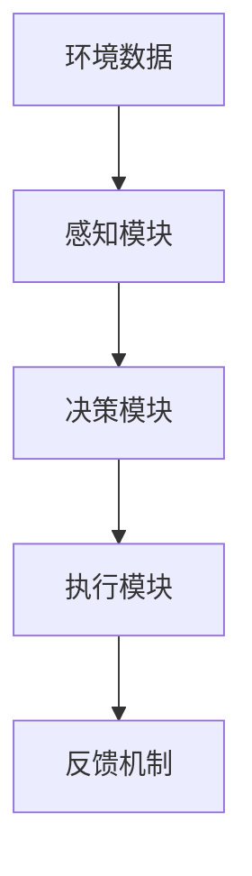
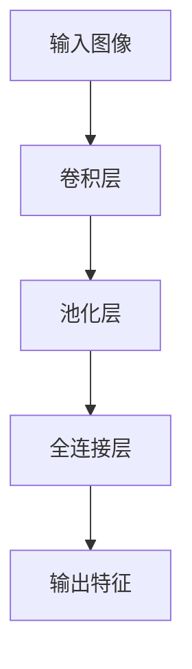
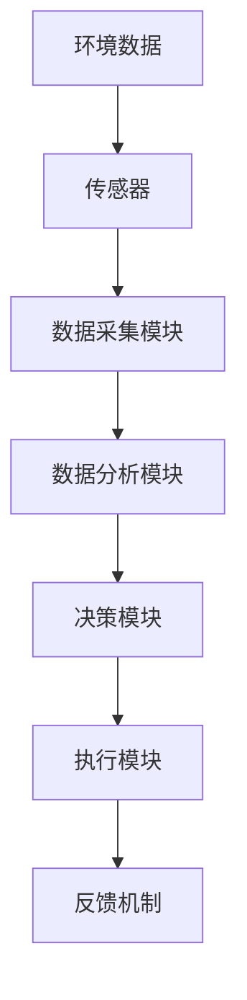
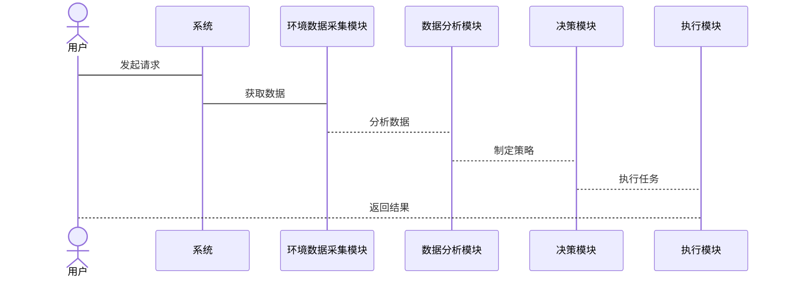

                 


# AI Agent在智能海洋生态保护中的实践

> 关键词：AI Agent，智能海洋生态，生态保护，人工智能，环境监测，污染治理

> 摘要：本文详细探讨了AI Agent技术在智能海洋生态保护中的应用，从基本概念到系统架构，再到实际项目案例，全面分析了AI Agent如何助力海洋环境监测、生物保护和污染治理。

---

# 第一部分: AI Agent与智能海洋生态保护的背景与概念

## 第1章: AI Agent与智能海洋生态保护概述

### 1.1 AI Agent的基本概念

#### 1.1.1 什么是AI Agent
AI Agent（人工智能代理）是一种能够感知环境、自主决策并执行任务的智能实体。它通过传感器获取信息，利用算法进行分析，并通过执行器与环境互动。AI Agent可以是软件程序，也可以是物理机器人。

#### 1.1.2 AI Agent的核心特征
- **自主性**：无需外部干预，自主完成任务。
- **反应性**：实时感知环境变化并做出反应。
- **目标导向**：基于目标进行决策和行动。
- **学习能力**：通过数据不断优化自身性能。

#### 1.1.3 AI Agent与传统自动化的区别
| 特性       | AI Agent                          | 传统自动化                      |
|------------|-----------------------------------|---------------------------------|
| 智能性     | 高                                 | 低                             |
| 自主性     | 高                                 | 低                             |
| 适应性     | 强                                 | 弱                             |
| 学习能力   | 强                                 | 无                             |

### 1.2 智能海洋生态保护的背景

#### 1.2.1 海洋生态保护的重要性
海洋覆盖了地球表面的70%以上，是地球生态系统的重要组成部分。海洋生物多样性丰富，同时海洋也承担着调节气候、提供食物资源等功能。然而，海洋正面临污染、过度捕捞、珊瑚礁退化等问题，保护海洋生态系统迫在眉睫。

#### 1.2.2 传统海洋生态保护的局限性
- **效率低下**：传统方法依赖人工监测和保护，效率低，覆盖面有限。
- **实时性差**：无法实现对海洋环境的实时监控和快速反应。
- **数据不足**：缺乏足够的数据支持，难以进行精准的保护决策。

#### 1.2.3 AI技术在海洋生态保护中的潜力
AI技术的应用可以显著提升海洋生态保护的效率和精准度。例如，通过AI算法分析卫星图像，实时监测海洋污染；利用AI模型预测海洋生物的迁徙路径，制定保护策略。

### 1.3 AI Agent在海洋生态保护中的应用前景

#### 1.3.1 AI Agent在海洋环境监测中的作用
AI Agent可以通过传感器实时收集海洋数据，如温度、盐度、氧气含量等，并通过算法分析这些数据，识别异常情况，如海洋热浪、赤潮等。

#### 1.3.2 AI Agent在海洋生物保护中的应用
AI Agent可以监测海洋生物的活动，如跟踪濒危物种的迁徙路径，识别非法捕捞行为，保护海洋生物多样性。

#### 1.3.3 AI Agent在海洋污染治理中的潜力
AI Agent可以用于监测污染源，分析污染扩散趋势，并制定治理方案，如清理海洋垃圾、处理油污泄漏等。

---

## 1.4 本章小结

本章介绍了AI Agent的基本概念和核心特征，分析了海洋生态保护的重要性以及传统方法的局限性，最后探讨了AI Agent在海洋生态保护中的潜力和应用前景。通过这些内容，读者可以理解AI Agent在智能海洋生态保护中的重要性。

---

# 第二部分: AI Agent的核心概念与原理

## 第2章: AI Agent的核心概念与联系

### 2.1 AI Agent的核心原理

#### 2.1.1 感知模块
感知模块负责收集环境数据，如温度、湿度、图像等。这些数据可以通过传感器、摄像头等设备获取，并传输给决策模块。

#### 2.1.2 决策模块
决策模块基于感知模块提供的数据，利用算法进行分析，制定行动方案。例如，使用强化学习算法优化决策策略。

#### 2.1.3 执行模块
执行模块负责根据决策模块的指令，执行具体的动作，如调整设备参数、发出警报等。

### 2.2 AI Agent的属性特征对比

| 特性       | 感知模块                   | 决策模块                   | 执行模块                   |
|------------|----------------------------|-----------------------------|-----------------------------|
| 功能       | 数据采集                   | 数据分析与决策             | 执行动作                   |
| 输入       | 环境数据                   | 分析结果                   | 决策指令                   |
| 输出       | 数据传输                   | 行动方案                   | 动作执行                   |

### 2.3 AI Agent的实体关系图



### 2.4 本章小结

本章详细讲解了AI Agent的核心原理，包括感知、决策和执行模块的作用和关系，并通过对比表格和实体关系图展示了各模块的特点。

---

## 第3章: AI Agent的算法原理

### 3.1 AI Agent的核心算法

#### 3.1.1 感知算法
感知算法用于从环境中获取数据并进行特征提取。例如，使用卷积神经网络（CNN）对卫星图像进行分类，识别海洋污染区域。

#### 3.1.2 决策算法
决策算法基于感知数据进行分析，制定行动方案。例如，使用马尔可夫链模型预测环境变化趋势。

#### 3.1.3 执行算法
执行算法将决策结果转化为具体动作，如调整设备参数、发出警报等。

### 3.2 感知算法的数学模型

#### 3.2.1 环境数据的特征提取
使用CNN进行图像特征提取，模型结构如下：



#### 3.2.2 数据分类与聚类算法
分类算法：随机森林（Random Forest）
聚类算法：K-means

#### 3.2.3 模型训练与优化
使用梯度下降法优化模型参数，损失函数为交叉熵损失。

### 3.3 决策算法的数学模型

#### 3.3.1 基于马尔可夫链的决策模型
状态转移概率计算公式：
$$ P(s_t | s_{t-1}) = \frac{N(s_{t-1}, s_t)}{\sum_{s'} N(s_{t-1}, s')} $$
其中，$N(s_{t-1}, s_t)$表示状态$s_{t-1}$转移到状态$s_t$的次数。

#### 3.3.2 基于强化学习的决策模型
强化学习通过Q-learning算法进行状态-动作价值函数的更新：
$$ Q(s, a) = Q(s, a) + \alpha [r + \gamma \max Q(s', a') - Q(s, a)] $$

#### 3.3.3 基于贝叶斯网络的决策模型
贝叶斯网络通过概率推理进行决策，计算条件概率：
$$ P(A|B) = \frac{P(B|A)P(A)}{P(B)} $$

### 3.4 本章小结

本章详细讲解了AI Agent的核心算法，包括感知、决策和执行算法的数学模型，并通过示例说明了这些算法在实际应用中的实现。

---

## 第4章: AI Agent在智能海洋生态保护中的系统架构

### 4.1 系统功能设计

#### 4.1.1 环境数据采集模块
通过传感器和卫星接收环境数据，如温度、盐度、图像等。

#### 4.1.2 数据分析模块
对采集的数据进行分类、聚类和预测，识别异常情况。

#### 4.1.3 决策与控制模块
基于分析结果，制定保护策略并执行控制指令。

#### 4.1.4 反馈与优化模块
根据执行结果优化模型参数，提高系统性能。

### 4.2 系统架构图



### 4.3 系统交互流程



### 4.4 本章小结

本章设计了AI Agent在智能海洋生态保护中的系统架构，包括功能模块、架构图和交互流程，展示了系统的整体结构和工作流程。

---

## 第五部分: 项目实战

## 第5章: AI Agent在珊瑚礁保护中的应用

### 5.1 项目背景与目标

#### 5.1.1 项目背景
珊瑚礁是海洋生态系统的重要组成部分，但面临海洋酸化、过度捕捞等威胁。本项目旨在通过AI Agent技术实时监测珊瑚礁的健康状况，预防生态破坏。

#### 5.1.2 项目目标
- 实时监测珊瑚礁的环境数据。
- 自动识别珊瑚礁的健康状态。
- 提供保护策略和预警信息。

### 5.2 系统设计与实现

#### 5.2.1 环境数据采集模块
使用传感器采集珊瑚礁区域的温度、pH值、光照强度等数据。

#### 5.2.2 数据分析模块
通过CNN模型分析珊瑚礁图像，识别珊瑚礁的健康状况。

#### 5.2.3 决策与控制模块
基于分析结果，决策模块制定保护策略，如调整水温、光照强度等。

#### 5.2.4 反馈与优化模块
根据执行结果优化模型参数，提高识别准确率。

### 5.3 核心代码实现

#### 5.3.1 数据采集代码

```python
import serial
import time

ser = serial.Serial('COM3', 9600)
while True:
    data = ser.readline().decode().strip()
    if data:
        print(f"Received data: {data}")
    time.sleep(1)
```

#### 5.3.2 数据分析代码

```python
import tensorflow as tf
import numpy as np

model = tf.keras.models.load_model('coral_model.h5')
new_data = np.array([image_data])
prediction = model.predict(new_data)
print(f"Prediction: {prediction}")
```

### 5.4 实际效果与经验总结

#### 5.4.1 实际效果
通过AI Agent技术，珊瑚礁保护项目实现了环境数据的实时监测和健康状态的自动识别，提高了保护效率和精准度。

#### 5.4.2 经验总结
- AI Agent的应用显著提升了海洋生态保护的效率。
- 系统设计需要考虑环境的复杂性和不确定性，确保系统的鲁棒性。
- 数据质量和模型训练是影响系统性能的关键因素。

### 5.5 本章小结

本章通过珊瑚礁保护项目展示了AI Agent在智能海洋生态保护中的实际应用，详细讲解了项目的背景、设计、实现和效果分析。

---

## 第六部分: 总结与展望

## 第6章: 总结与展望

### 6.1 总结

本文详细探讨了AI Agent在智能海洋生态保护中的应用，从基本概念到系统架构，再到实际项目案例，全面分析了AI Agent如何助力海洋环境监测、生物保护和污染治理。通过珊瑚礁保护项目的实践，展示了AI Agent技术在海洋生态保护中的巨大潜力。

### 6.2 展望

未来，AI Agent技术将在海洋生态保护中发挥更大的作用。随着AI技术的不断发展，AI Agent将具备更强的感知、决策和执行能力，为海洋生态保护提供更高效、更精准的解决方案。

---

## 作者信息

作者：AI天才研究院/AI Genius Institute & 禅与计算机程序设计艺术 /Zen And The Art of Computer Programming

---

通过以上内容，读者可以全面了解AI Agent在智能海洋生态保护中的实践应用，从理论到实际案例，深入理解其技术原理和应用价值。

