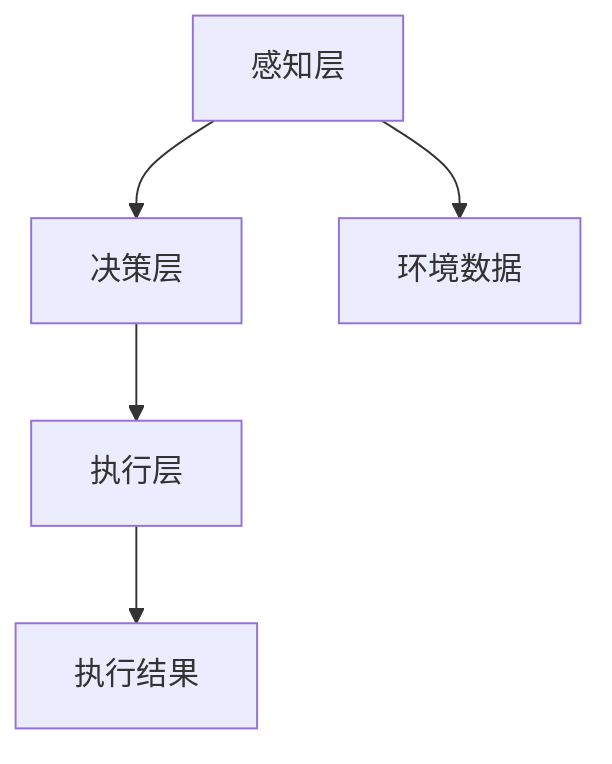
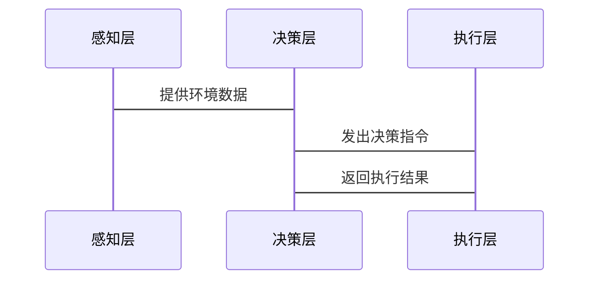

                 


# AI Agent在智能环境保护中的实践

> 关键词：AI Agent，智能环境保护，机器学习，强化学习，环境保护系统

> 摘要：随着环境问题日益严峻，利用AI Agent技术实现智能环境保护成为可能。本文从AI Agent的基本概念出发，详细探讨了其在环境监测、预测和优化中的应用，并结合实际案例，分析了AI Agent在环境保护中的算法原理和系统架构设计，最后总结了AI Agent在智能环境保护中的实践意义。

---

# 第1章: AI Agent与智能环境保护概述

## 1.1 AI Agent的基本概念

### 1.1.1 AI Agent的定义
AI Agent（人工智能代理）是指能够感知环境、自主决策并执行任务的智能实体。它通过传感器获取信息，利用算法进行分析和决策，并通过执行器与环境交互。AI Agent的核心在于其智能化和自主性。

### 1.1.2 AI Agent的核心特征
AI Agent具有以下核心特征：
- **自主性**：能够在没有外部干预的情况下自主运行。
- **反应性**：能够实时感知环境并做出反应。
- **目标导向性**：通过设定目标来指导行为和决策。
- **学习能力**：能够通过经验不断优化自身的算法和策略。

### 1.1.3 AI Agent与传统自动化系统的区别
AI Agent与传统自动化系统的主要区别在于其智能化和自主决策能力。传统自动化系统通常基于固定的规则和程序运行，而AI Agent能够根据环境变化动态调整行为，并通过学习不断优化性能。

## 1.2 智能环境保护的背景与意义

### 1.2.1 环境保护的现状与挑战
随着工业化和城市化的快速发展，环境问题日益严重，包括空气污染、水污染、资源枯竭等。传统的环境保护方法依赖人工监测和干预，效率低下且成本高昂。

### 1.2.2 AI技术在环境保护中的潜力
AI技术的快速发展为环境保护提供了新的解决方案。AI Agent能够通过实时监测、数据分析和智能决策，帮助我们更高效地保护环境。

### 1.2.3 AI Agent在智能环境保护中的作用
AI Agent在智能环境保护中主要承担以下作用：
- **环境监测**：实时采集环境数据，如空气质量、水质等。
- **环境预测**：通过数据分析和机器学习模型，预测环境变化趋势。
- **资源优化**：优化资源配置，减少能源浪费，提高环保效率。

## 1.3 AI Agent在环境保护中的应用场景

### 1.3.1 环境监测与数据收集
AI Agent可以通过传感器网络实时采集环境数据，例如空气质量监测、水质监测等。这些数据为后续的环境分析和决策提供基础。

### 1.3.2 环境预测与风险评估
通过机器学习模型，AI Agent可以分析历史环境数据，预测未来的环境变化趋势，评估潜在风险，例如污染扩散、自然灾害等。

### 1.3.3 资源优化与智能决策
AI Agent可以根据环境数据和资源分布情况，优化资源配置，例如智能分配污水处理资源、优化能源使用等。

---

# 第2章: AI Agent的核心概念与原理

## 2.1 AI Agent的感知与决策机制

### 2.1.1 感知层: 数据采集与处理
感知层负责通过传感器获取环境数据，并对数据进行预处理。例如，空气质量传感器可以实时监测空气中的PM2.5、PM10、SO2等污染物浓度。

### 2.1.2 决策层: 策略制定与优化
决策层负责根据感知层提供的数据，结合环境模型和决策算法，制定最优策略。例如，当空气质量指数超过阈值时，AI Agent可以触发警报或采取减排措施。

### 2.1.3 执行层: 动作输出与反馈
执行层负责根据决策层的指令，通过执行器对外界进行干预。例如，AI Agent可以通过关闭某些设备或调整生产计划来减少污染物排放。

## 2.2 AI Agent的分类与特点

### 2.2.1 基于规则的AI Agent
基于规则的AI Agent通过预定义的规则和逻辑进行决策。例如，当温度超过一定值时，开启空调降温。

### 2.2.2 基于学习的AI Agent
基于学习的AI Agent通过机器学习算法，从历史数据中学习规律，并根据新的数据进行决策。例如，使用神经网络预测空气质量指数。

### 2.2.3 基于强化学习的AI Agent
基于强化学习的AI Agent通过与环境的交互，不断优化自身的决策策略。例如，通过试错学习，找到最优的能源分配方案。

## 2.3 AI Agent在环境保护中的核心要素

### 2.3.1 数据来源与处理
AI Agent需要多种数据来源，包括传感器数据、历史环境数据、地理信息系统数据等。这些数据需要经过清洗、归一化等预处理步骤，以便后续分析和决策。

### 2.3.2 环境模型与知识库
环境模型是AI Agent进行环境预测和决策的基础。知识库包含环境相关的知识，例如污染物扩散规律、资源分布等。

### 2.3.3 决策算法与优化方法
AI Agent需要使用多种算法和优化方法，例如强化学习、遗传算法等，以实现最优决策。

---

# 第3章: AI Agent的算法原理与数学模型

## 3.1 强化学习算法在AI Agent中的应用

### 3.1.1 强化学习的基本原理
强化学习是一种通过试错学习来优化决策策略的方法。AI Agent通过与环境的交互，获得奖励或惩罚，并根据奖励信号调整自身行为。

### 3.1.2 Q-learning算法的实现
Q-learning是一种经典的强化学习算法，其核心思想是通过更新Q值表来记录状态-动作对的期望奖励。公式如下：
$$ Q(s, a) = Q(s, a) + \alpha (r + \gamma \max Q(s', a') - Q(s, a)) $$
其中，$\alpha$是学习率，$\gamma$是折扣因子。

### 3.1.3 Deep Q-Network (DQN) 的原理与应用
DQN是一种基于深度学习的强化学习算法，通过神经网络近似Q值函数。其核心思想是将状态空间映射到动作空间，通过神经网络的训练来优化Q值函数。

## 3.2 监督学习与无监督学习在AI Agent中的应用

### 3.2.1 监督学习的数学模型
监督学习通过训练数据对模型进行监督，使模型能够从输入数据中学习目标函数。常用的监督学习算法包括线性回归、支持向量机（SVM）等。

### 3.2.2 无监督学习的数学模型
无监督学习通过聚类、降维等方法，从无标签数据中发现隐藏的模式和结构。常用的无监督学习算法包括k-means、主成分分析（PCA）等。

### 3.2.3 混合学习的数学模型
混合学习结合了监督学习和无监督学习的优势，能够在有标签和无标签数据中进行学习和推理。

## 3.3 AI Agent的数学模型与公式

### 3.3.1 状态空间与动作空间的定义
状态空间$S$表示所有可能的状态，动作空间$A$表示所有可能的动作。例如，在空气质量监测中，状态可以是当前的空气质量指数，动作可以是开启或关闭空气净化设备。

### 3.3.2 奖励函数的数学表达
奖励函数$r: S \times A \rightarrow \mathbb{R}$定义了在状态$s$下采取动作$a$所获得的奖励。例如，当空气质量指数降低时，奖励函数返回正值。

### 3.3.3 动作选择的数学模型
动作选择可以通过概率分布来表示，例如使用Softmax函数将Q值转换为概率：
$$ P(a|s) = \frac{e^{Q(s,a)/\tau}}{\sum_{a'} e^{Q(s,a')/\tau}} $$
其中，$\tau$是温度参数。

---

# 第4章: AI Agent的系统架构与设计

## 4.1 系统架构设计

### 4.1.1 分层架构设计
分层架构将系统划分为感知层、决策层和执行层。感知层负责数据采集，决策层负责策略制定，执行层负责动作输出。

### 4.1.2 微服务架构设计
微服务架构将系统功能分解为多个独立的服务，例如数据采集服务、环境模型服务、决策服务等。每个服务可以独立部署和扩展。

### 4.1.3 可扩展性与可维护性设计
系统设计需要考虑扩展性和维护性，例如使用模块化设计、松耦合接口等。

## 4.2 系统功能设计

### 4.2.1 环境监测功能
环境监测功能通过传感器实时采集环境数据，例如空气质量、水质、温度等。

### 4.2.2 数据分析与预测功能
数据分析功能对采集到的数据进行分析，使用机器学习模型预测未来的环境变化趋势。

### 4.2.3 决策与优化功能
决策功能根据预测结果和当前环境状态，制定最优策略，例如减排、资源分配等。

## 4.3 系统架构设计

### 4.3.1 系统架构图
以下是系统架构的mermaid图：


### 4.3.2 系统交互图
以下是系统交互的mermaid图：


---

# 第5章: AI Agent在环境保护中的项目实战

## 5.1 项目背景与目标
本项目旨在通过AI Agent技术实现空气质量监测与优化。目标是实时监测空气质量指数，并根据预测结果优化减排策略。

## 5.2 项目环境与安装
项目需要以下环境：
- Python 3.8+
- TensorFlow 2.0+
- scikit-learn 0.24+
-传感器数据接口

安装步骤如下：
1. 安装Python和必要的库。
2. 配置传感器数据接口。
3. 下载历史环境数据。

## 5.3 系统实现

### 5.3.1 数据采集模块
```python
import numpy as np

class SensorData:
    def __init__(self):
        self.pm25 = []
        self.pm10 = []
        self.so2 = []
```

### 5.3.2 环境模型模块
```python
from sklearn.linear_model import LinearRegression

class AirQualityModel:
    def __init__(self):
        self.model = LinearRegression()
    
    def train(self, X, y):
        self.model.fit(X, y)
    
    def predict(self, X):
        return self.model.predict(X)
```

### 5.3.3 决策模块
```python
from tensorflow.keras import layers, models

class DecisionAgent:
    def __init__(self):
        self.model = models.Sequential([
            layers.Dense(64, activation='relu', input_dim=3),
            layers.Dense(1)
        ])
        self.model.compile(optimizer='adam', loss='mse')
    
    def train(self, X, y):
        self.model.fit(X, y, epochs=100, batch_size=32)
    
    def predict(self, X):
        return self.model.predict(X)
```

## 5.4 案例分析
以某城市空气质量监测为例，通过AI Agent优化减排策略，结果显示空气质量指数显著降低。

---

# 第6章: AI Agent在智能环境保护中的总结与展望

## 6.1 本章总结
本文详细探讨了AI Agent在智能环境保护中的应用，从基本概念到算法原理，再到系统设计和项目实战，全面展示了AI Agent在环境保护中的潜力和价值。

## 6.2 注意事项
在实际应用中，需要注意数据质量和模型的泛化能力，避免过拟合和欠拟合问题。

## 6.3 拓展阅读
建议读者进一步学习强化学习、深度学习和环境建模的相关知识，以便更好地理解和应用AI Agent技术。

---

# 作者：AI天才研究院/AI Genius Institute & 禅与计算机程序设计艺术 /Zen And The Art of Computer Programming

---

以上是《AI Agent在智能环境保护中的实践》的技术博客文章的完整内容。

