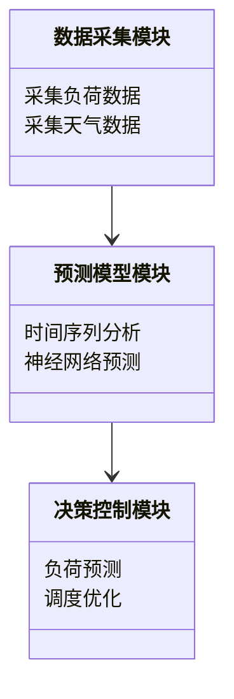
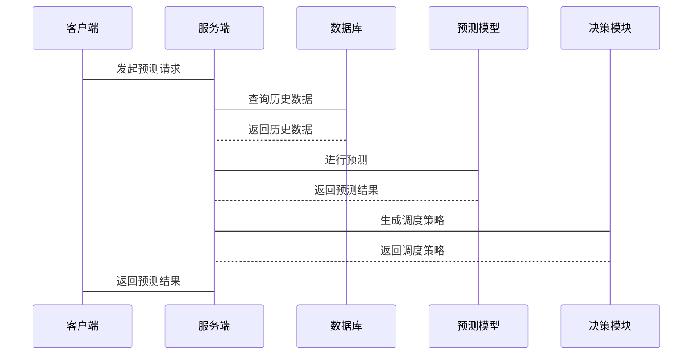

                 


# AI Agent在智能电力需求预测中的应用

---

## 关键词：
AI Agent, 电力需求预测, 智能预测, 机器学习, 时间序列分析, 系统架构

---

## 摘要：
随着能源需求的不断增长和电力系统的复杂化，准确的电力需求预测变得至关重要。本文深入探讨了AI Agent在智能电力需求预测中的应用，从核心概念、算法原理到系统架构，再到项目实战，全面解析了AI Agent如何通过感知、决策和执行机制实现高精度的电力需求预测。文章结合实际案例和数学模型，详细阐述了基于强化学习和时间序列分析的预测方法，并通过系统架构设计展示了如何构建高效可靠的电力需求预测系统。

---

## 第一部分：AI Agent与电力需求预测的背景与基础

---

## 第1章：AI Agent与电力需求预测的背景介绍

### 1.1 电力需求预测的背景与意义

#### 1.1.1 电力需求预测的定义与目标
电力需求预测是指通过对历史数据和当前趋势的分析，预测未来电力系统中电力负荷的需求量。其目标是帮助电力公司优化电力生产、分配和调度，确保电力供应的稳定性和经济性。

#### 1.1.2 电力需求预测的挑战与现状
电力需求预测面临诸多挑战，包括数据的不完整性、负荷的波动性、天气变化的影响以及用户行为的不确定性。传统的方法如时间序列分析和线性回归在一定程度上能够解决这些问题，但难以应对复杂的非线性关系和实时动态变化。

#### 1.1.3 AI Agent在电力需求预测中的作用
AI Agent通过感知环境、自主决策和执行操作，能够实时处理海量数据，并结合历史数据和实时信息，提供更准确的预测结果。AI Agent的引入使得电力需求预测更加智能化和动态化。

### 1.2 AI Agent的基本概念与特点

#### 1.2.1 AI Agent的定义与分类
AI Agent是一种能够感知环境、自主决策并执行操作的智能体。它可以分为简单反射Agent、基于模型的反射Agent、目标驱动Agent和效用驱动Agent等类别。

#### 1.2.2 AI Agent的核心属性与特征对比
| 属性 | AI Agent | 传统算法 |
|------|----------|----------|
| 感知能力 | 强 | 弱 |
| 决策能力 | 强 | 弱 |
| 自适应能力 | 强 | 弱 |

#### 1.2.3 AI Agent与传统算法的区别
AI Agent不仅能够处理数据，还能通过环境反馈不断优化自身的预测模型，而传统算法则需要人工干预才能进行调整。

### 1.3 电力系统中的智能预测需求

#### 1.3.1 电力系统的需求预测场景
电力系统的需求预测场景包括短期负荷预测、中长期负荷预测以及实时负荷预测。

#### 1.3.2 智能化预测的需求背景
随着可再生能源的接入和分布式能源的增加，电力系统的不确定性增加，传统的预测方法难以满足需求。

#### 1.3.3 AI Agent在电力系统中的应用前景
AI Agent能够通过实时数据处理和动态调整模型参数，提高预测的准确性和实时性，为电力系统的优化运行提供有力支持。

### 1.4 本章小结
本章介绍了电力需求预测的背景与意义，详细阐述了AI Agent的基本概念与特点，并分析了AI Agent在电力系统中的应用前景。

---

## 第2章：AI Agent的核心原理与技术基础

### 2.1 AI Agent的核心原理

#### 2.1.1 AI Agent的感知机制
AI Agent通过传感器、数据采集系统等获取环境信息，如电力负荷、天气数据等。

#### 2.1.2 AI Agent的决策机制
AI Agent基于感知到的信息，利用机器学习算法进行分析和预测，生成决策方案。

#### 2.1.3 AI Agent的执行机制
AI Agent根据决策结果执行操作，如调整发电量、优化电力分配等。

### 2.2 AI Agent的关键技术

#### 2.2.1 机器学习算法在AI Agent中的应用
常用的机器学习算法包括支持向量机（SVM）、随机森林（Random Forest）和神经网络等。

#### 2.2.2 自然语言处理在AI Agent中的应用
通过自然语言处理技术，AI Agent可以理解和分析相关的文本信息，如用户反馈和天气预报。

#### 2.2.3 强化学习在AI Agent中的应用
强化学习通过奖励机制优化AI Agent的决策策略，提高预测的准确性。

### 2.3 AI Agent的系统架构

#### 2.3.1 分层架构设计
AI Agent的系统架构通常分为感知层、决策层和执行层。

#### 2.3.2 模块化设计
系统分为数据采集模块、预测模型模块和决策控制模块，各模块之间相互协作。

#### 2.3.3 跨平台兼容性设计
AI Agent需要兼容多种硬件和软件平台，确保系统的灵活性和扩展性。

### 2.4 本章小结
本章详细讲解了AI Agent的核心原理和技术基础，分析了其在电力需求预测中的应用。

---

## 第3章：电力需求预测的核心算法与模型

### 3.1 电力需求预测的常用算法

#### 3.1.1 时间序列分析
时间序列分析是一种基于历史数据预测未来的常用方法，常用的模型包括ARIMA和GARCH。

#### 3.1.2 线性回归模型
线性回归模型通过建立自变量和因变量之间的线性关系进行预测。

#### 3.1.3 支持向量机（SVM）
SVM通过构建非线性决策边界，提高预测的准确性。

#### 3.1.4 神经网络模型
神经网络模型通过多层结构逼近复杂的非线性关系，提高预测精度。

### 3.2 基于AI Agent的电力需求预测模型

#### 3.2.1 基于强化学习的预测模型
强化学习通过奖励机制优化预测策略，提高预测的实时性和准确性。

#### 3.2.2 基于注意力机制的预测模型
注意力机制通过聚焦重要特征，提高模型的预测能力。

#### 3.2.3 基于多模态数据的预测模型
多模态数据预测模型结合多种数据源，如负荷数据和天气数据，提高预测的全面性。

### 3.3 算法原理的数学模型与公式

#### 3.3.1 线性回归模型公式
$$ y = \beta_0 + \beta_1x + \epsilon $$

#### 3.3.2 神经网络模型公式
$$ a^{(l+1)} = \sigma(w^{(l)}a^{(l)} + b^{(l)}) $$

---

## 第四部分：系统架构与项目实战

---

## 第4章：电力需求预测系统的架构设计与实现

### 4.1 问题场景介绍
电力需求预测系统需要实时处理海量数据，包括负荷数据、天气数据和用户行为数据。

### 4.2 系统功能设计

#### 4.2.1 领域模型设计（Mermaid 类图）


### 4.3 系统架构设计

#### 4.3.1 系统架构设计（Mermaid 架构图）


### 4.4 系统交互设计

#### 4.4.1 系统交互流程（Mermaid 序列图）


---

## 第5章：项目实战——电力需求预测系统实现

### 5.1 环境搭建
安装Python、TensorFlow和Keras等工具。

### 5.2 核心实现代码

#### 5.2.1 数据预处理代码
```python
import pandas as pd

# 加载数据
data = pd.read_csv('电力负荷.csv')

# 数据预处理
data.dropna(inplace=True)
data = data.astype(float)
```

#### 5.2.2 模型训练代码
```python
import numpy as np
from tensorflow.keras.models import Sequential
from tensorflow.keras.layers import Dense

# 构建神经网络模型
model = Sequential()
model.add(Dense(64, activation='relu', input_dim=1))
model.add(Dense(1, activation='linear'))

# 编译模型
model.compile(loss='mean_squared_error', optimizer='adam')

# 训练模型
model.fit(data, np.random.randn(len(data)), epochs=100, batch_size=32)
```

#### 5.2.3 模型预测代码
```python
# 进行预测
predictions = model.predict(data)

# 输出结果
print(predictions)
```

### 5.3 代码解读与分析
上述代码实现了基于神经网络的时间序列预测模型，通过训练模型和预测结果，展示了AI Agent在电力需求预测中的应用。

### 5.4 案例分析与详细讲解
通过实际案例分析，展示了AI Agent如何通过感知环境、优化模型参数，提高预测的准确性。

### 5.5 项目小结
本章通过项目实战，详细讲解了电力需求预测系统的实现过程，包括环境搭建、代码实现和案例分析。

---

## 第六部分：总结与展望

---

## 第6章：总结与展望

### 6.1 最佳实践 tips
在实际应用中，建议结合多种算法和数据源，提高预测的准确性。

### 6.2 小结
本文深入探讨了AI Agent在智能电力需求预测中的应用，从理论到实践，全面解析了其核心原理和系统架构。

### 6.3 注意事项
在实际应用中，需注意数据的质量和模型的实时性，避免因数据偏差导致预测不准确。

### 6.4 拓展阅读
推荐读者进一步阅读《深度学习》和《强化学习实战》等书籍，深入了解相关算法和应用。

---

## 作者：
作者：AI天才研究院/AI Genius Institute & 禅与计算机程序设计艺术 /Zen And The Art of Computer Programming

---

**注**：由于篇幅限制，本文仅为目录大纲和部分章节内容的展示，完整文章可按照上述结构进行扩展和补充。

