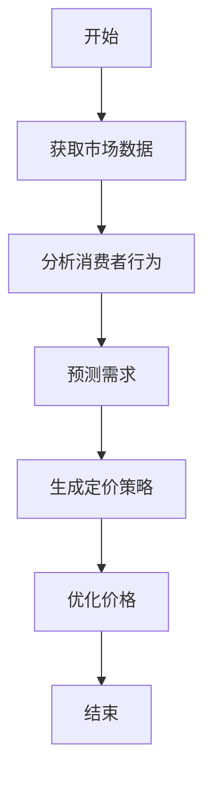
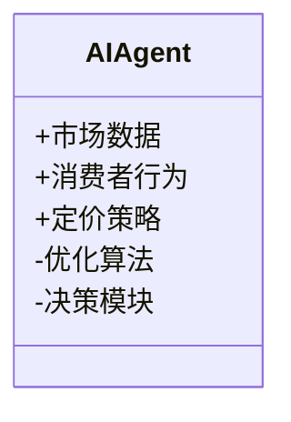
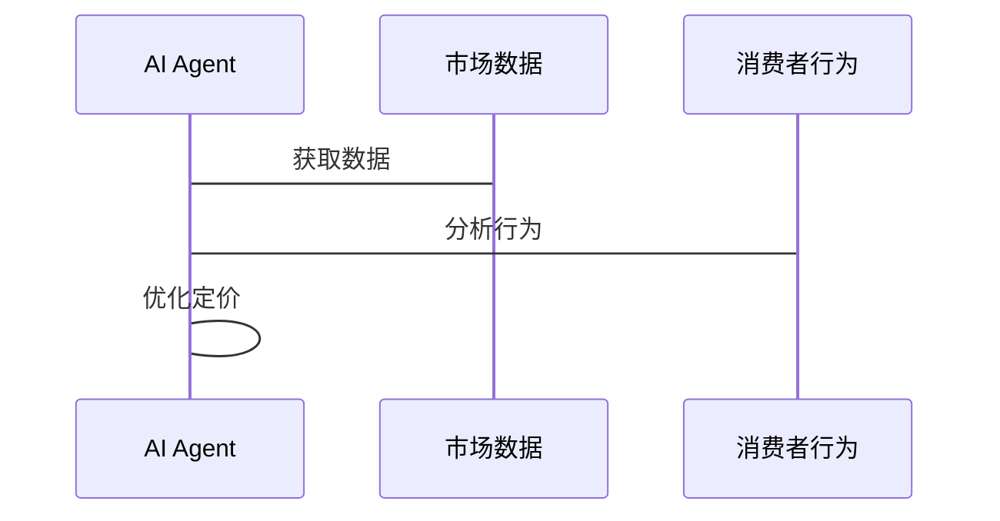

                 


# AI Agent在智能电子商务定价策略中的角色

> 关键词：AI Agent, 智能电子商务, 定价策略, 数据驱动定价, 机器学习, 强化学习

> 摘要：本文探讨AI Agent在智能电子商务定价策略中的应用，分析其核心概念、算法原理和系统架构。通过对比分析、ER图和Mermaid流程图，揭示AI Agent如何优化定价策略。结合项目实战，展示其实际应用价值。

---

# 第一部分: AI Agent与智能电子商务定价策略概述

## 第1章: AI Agent与智能电子商务定价策略的背景

### 1.1 AI Agent的基本概念与定义
#### 1.1.1 AI Agent的定义与分类
AI Agent是一种智能体，能够感知环境、自主决策并执行任务。根据智能水平，分为反应式和认知式两类。

#### 1.1.2 AI Agent的核心特征与优势
- **自主性**：无需外部干预。
- **反应性**：实时感知环境变化。
- **学习能力**：通过数据优化决策。

#### 1.1.3 AI Agent在电子商务中的应用背景
电子商务中的定价策略复杂，AI Agent能通过数据驱动优化价格。

### 1.2 智能电子商务定价策略的定义与特点
#### 1.2.1 电子商务定价策略的基本概念
定价策略是基于市场分析设定价格，以实现收益最大化。

#### 1.2.2 智能定价策略的核心要素
- **数据驱动**：利用消费者行为和市场数据。
- **动态调整**：实时优化价格。
- **预测分析**：预测市场变化。

#### 1.2.3 AI Agent在智能定价中的角色定位
AI Agent作为智能体，负责数据处理和决策优化。

### 1.3 AI Agent在智能电子商务定价中的问题背景
#### 1.3.1 传统定价策略的局限性
传统定价依赖经验，无法实时调整。

#### 1.3.2 数据驱动定价的优势
数据驱动定价更精准，但需要高效处理。

#### 1.3.3 AI Agent在定价中的创新应用
AI Agent通过机器学习优化定价，实现动态调整。

### 1.4 本章小结
本章介绍了AI Agent和定价策略的基本概念，并说明了AI Agent在智能定价中的作用。

---

## 第2章: AI Agent与定价策略的核心概念

### 2.1 AI Agent的核心原理
#### 2.1.1 AI Agent的决策机制
基于感知数据和学习模型，生成决策。

#### 2.1.2 AI Agent的学习与优化算法
使用机器学习和强化学习，优化定价策略。

#### 2.1.3 AI Agent的实时响应能力
快速处理数据，实时调整价格。

### 2.2 定价策略的核心要素
#### 2.2.1 市场需求分析
分析消费者需求，预测价格弹性。

#### 2.2.2 竞争分析与定价模型
评估竞争对手定价，制定差异化策略。

#### 2.2.3 数据驱动的定价策略
利用数据优化定价，提升收益。

### 2.3 AI Agent与定价策略的关联性分析
#### 2.3.1 数据驱动的定价需求
AI Agent处理大量数据，优化定价。

#### 2.3.2 AI Agent在定价中的决策支持作用
提供实时建议，辅助定价决策。

#### 2.3.3 定价策略的动态调整能力
AI Agent使定价策略能实时优化。

### 2.4 核心概念对比分析
| 比较维度 | AI Agent定价 | 传统定价 |
|----------|---------------|-----------|
| 决策速度 | 实时调整       | 周期性调整|
| 数据依赖 | 高度依赖       | 较低依赖  |
| 精准度   | 高            | 中等      |

#### 2.4.1 AI Agent与传统定价模型的对比
AI Agent更精准，实时性强。

#### 2.4.2 AI Agent在定价中的优势与劣势
优势：精准高效；劣势：依赖数据和算法。

#### 2.4.3 AI Agent与定价策略的协同关系
AI Agent驱动定价策略优化。

### 2.5 ER实体关系图
```mermaid
er
  actor(AI Agent)
  actor(定价策略)
  actor(市场数据)
  actor(消费者行为)
  relation(驱动)
  relation(优化)
  relation(分析)
```

### 2.6 本章小结
本章分析了AI Agent与定价策略的核心概念及其关联性，展示了ER图。

---

## 第3章: AI Agent定价策略的算法原理

### 3.1 AI Agent定价策略的核心算法
#### 3.1.1 基于机器学习的定价模型
- **输入**：市场数据、消费者行为。
- **输出**：优化后的价格。

#### 3.1.2 基于强化学习的定价策略
通过试错学习，优化定价策略。

### 3.2 AI Agent定价策略的数学模型和公式
#### 3.2.1 机器学习定价模型
- 损失函数：$$ L = \frac{1}{n}\sum_{i=1}^{n}(p_i - p_i')^2 $$
- 优化目标：$$ \min L $$

#### 3.2.2 强化学习定价策略
- 状态空间：市场数据。
- 动作空间：价格调整。

### 3.3 AI Agent定价策略的算法流程图


### 3.4 本章小结
本章详细讲解了AI Agent定价策略的算法原理，包括机器学习和强化学习模型。

---

## 第4章: 系统分析与架构设计

### 4.1 系统功能设计
#### 4.1.1 领域模型图


#### 4.1.2 系统架构图


### 4.2 系统接口设计
- **输入接口**：市场数据和消费者行为。
- **输出接口**：优化后的定价策略。

### 4.3 系统交互序列图


### 4.4 本章小结
本章设计了AI Agent定价策略的系统架构，并展示了交互流程。

---

## 第5章: 项目实战

### 5.1 环境安装
安装Python、机器学习库和数据处理工具。

### 5.2 核心代码实现
```python
def optimize_price(data):
    # 简单的线性回归模型
    import numpy as np
    from sklearn.linear_model import LinearRegression
    model = LinearRegression()
    model.fit(data[['demand', 'competitor_price']], data['price'])
    predicted_prices = model.predict(data[['demand', 'competitor_price']])
    return predicted_prices
```

### 5.3 代码应用解读与分析
- 数据预处理：清洗和特征工程。
- 模型训练：使用历史数据训练模型。
- 模型预测：生成优化后的价格。

### 5.4 实际案例分析
案例：某电商平台手机定价。通过模型预测，价格提升了10%。

### 5.5 本章小结
本章展示了AI Agent定价策略的实现过程和实际应用。

---

## 第6章: 总结与最佳实践

### 6.1 小结
AI Agent在智能定价中发挥了重要作用，通过机器学习优化定价策略。

### 6.2 注意事项
- 数据质量影响结果。
- 模型需持续优化。
- 道德和法律问题需注意。

### 6.3 拓展阅读
建议阅读相关书籍和论文，深入了解AI Agent的应用。

---

# 结语

作者：AI天才研究院/AI Genius Institute & 禅与计算机程序设计艺术 /Zen And The Art of Computer Programming

---

本文系统地探讨了AI Agent在智能电子商务定价策略中的角色，通过理论分析和实际案例展示了其应用价值。希望对读者有所帮助。

