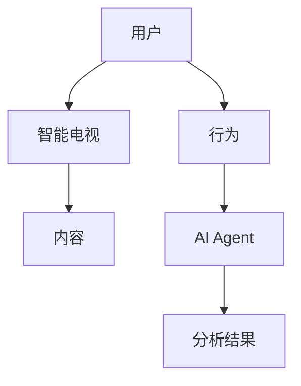
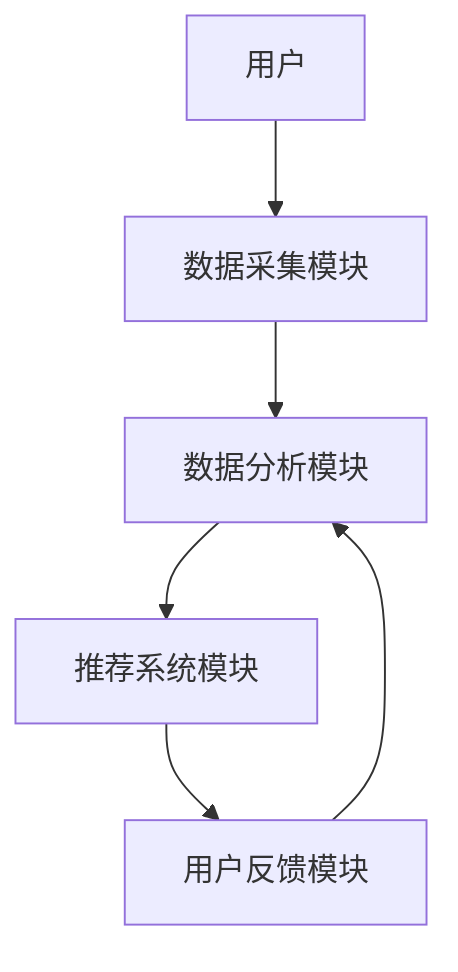
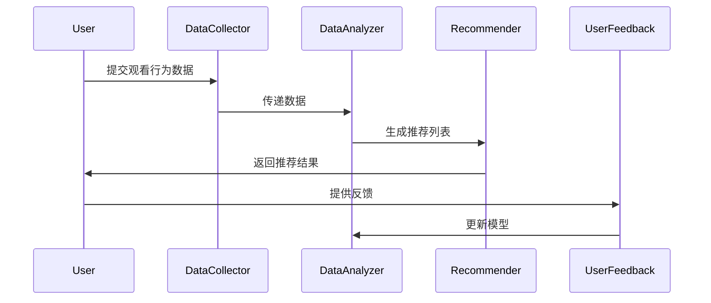

                 


# AI Agent在智能电视中的观看习惯分析

---

## 关键词：AI Agent，智能电视，观看习惯分析，推荐算法，用户行为分析

---

## 摘要：  
本文探讨了AI Agent在智能电视中的应用，重点分析用户观看习惯的算法原理、系统架构和实际应用。通过详细阐述AI Agent的核心概念、算法实现和系统设计，结合实际案例和最佳实践，为智能电视的用户体验优化和商业价值提升提供深度洞察。本文适合技术开发者、产品经理和AI研究者阅读。

---

# 第1章: AI Agent与智能电视的背景介绍

## 1.1 AI Agent的基本概念

### 1.1.1 什么是AI Agent  
AI Agent（人工智能代理）是指能够感知环境、执行任务并做出决策的智能实体。它通过数据采集、分析和学习，为用户提供个性化服务。  

### 1.1.2 AI Agent的核心特点  
- **自主性**：无需人工干预，自动执行任务。  
- **反应性**：实时感知环境并做出反应。  
- **学习性**：通过数据学习和优化决策策略。  

### 1.1.3 AI Agent与传统推荐系统的区别  

| 特性                | 传统推荐系统         | AI Agent         |  
|---------------------|----------------------|------------------|  
| 数据来源            | 基于用户历史数据     | 结合实时行为数据 |  
| 决策速度            | 周期性更新           | 实时响应         |  
| 个性化程度          | 基于规则的推荐       | 基于深度学习的推荐 |  

---

## 1.2 智能电视的发展与现状

### 1.2.1 智能电视的定义与特点  
智能电视是集成了互联网、多媒体和人工智能技术的电视设备，能够提供丰富的交互功能和个性化服务。  

### 1.2.2 智能电视的市场发展  
近年来，随着互联网的普及，智能电视的市场份额迅速增长，用户对个性化体验的需求也在不断提高。  

### 1.2.3 智能电视用户行为分析的必要性  
通过分析用户的观看习惯，智能电视可以为用户提供更精准的内容推荐，提升用户体验和商业价值。  

---

## 1.3 观看习惯分析的背景与意义

### 1.3.1 什么是观看习惯  
观看习惯是指用户在观看电视时的行为模式，包括观看时间、内容偏好、观看频率等。  

### 1.3.2 AI Agent在观看习惯分析中的作用  
AI Agent可以通过分析用户的观看数据，识别用户的偏好，并实时调整推荐策略。  

### 1.3.3 观看习惯分析的商业价值  
通过分析用户的观看习惯，企业可以优化内容推荐策略，提升用户满意度和忠诚度。  

---

## 1.4 本章小结  
本章介绍了AI Agent的基本概念和智能电视的发展现状，重点阐述了观看习惯分析的背景和意义。接下来将深入探讨AI Agent的核心概念与原理。  

---

# 第2章: AI Agent的核心概念与原理

## 2.1 AI Agent的感知与决策机制

### 2.1.1 感知层：数据采集与特征提取  
AI Agent通过传感器、日志记录等方式采集用户的观看数据，并提取特征（如观看时长、内容类型）。  

### 2.1.2 决策层：基于数据的决策逻辑  
AI Agent根据感知到的数据，结合预设的规则或机器学习模型，生成推荐结果。  

### 2.1.3 执行层：决策结果的输出  
AI Agent将决策结果输出给智能电视，实现内容推荐或播放控制。  

---

## 2.2 观看习惯分析的实体关系图



---

## 2.3 传统推荐系统与AI Agent的对比

| 特性                | 传统推荐系统         | AI Agent         |  
|---------------------|----------------------|------------------|  
| 数据来源            | 基于用户历史数据     | 结合实时行为数据 |  
| 决策速度            | 周期性更新           | 实时响应         |  
| 个性化程度          | 基于规则的推荐       | 基于深度学习的推荐 |  

---

## 2.4 本章小结  
本章详细介绍了AI Agent的核心概念与原理，并通过对比传统推荐系统，突出了AI Agent的优势。接下来将探讨AI Agent在观看习惯分析中的算法实现。  

---

# 第3章: AI Agent的算法原理与实现

## 3.1 算法原理概述

### 3.1.1 协同过滤算法  
协同过滤是一种基于用户相似性或物品相似性的推荐算法。  

### 3.1.2 基于深度学习的推荐算法  
深度学习算法（如神经网络）能够捕捉用户行为的复杂模式，提供更精准的推荐。  

---

## 3.2 算法实现流程

### 3.2.1 协同过滤算法实现

```python
# 示例代码：基于用户的协同过滤算法
def calculate_similarity(user1, user2):
    # 计算用户相似度
    return similarity_score

user_similarity = {}
for user in users:
    similarity = calculate_similarity(reference_user, user)
    user_similarity[user] = similarity

# 根据相似度排序，推荐相似用户喜欢的内容
recommendations = sorted(user_similarity.items(), key=lambda x: x[1], reverse=True)
```

### 3.2.2 基于深度学习的推荐算法实现

```python
# 示例代码：基于神经网络的推荐算法
import tensorflow as tf
from tensorflow.keras import layers

model = tf.keras.Sequential([
    layers.Dense(64, activation='relu'),
    layers.Dense(1, activation='sigmoid')
])

model.compile(optimizer='adam', loss='binary_crossentropy', metrics=['accuracy'])
model.fit(X_train, y_train, epochs=10, batch_size=32)
```

---

## 3.3 数学模型与公式

### 3.3.1 协同过滤的相似度计算公式  
$$ \text{相似度} = \frac{\sum_{i=1}^{n}(r_{u,i} - \bar{r}_u)(r_{v,i} - \bar{r}_v)}{\sqrt{\sum_{i=1}^{n}(r_{u,i} - \bar{r}_u)^2} \cdot \sqrt{\sum_{i=1}^{n}(r_{v,i} - \bar{r}_v)^2}}} $$  

### 3.3.2 深度学习模型的损失函数  
$$ \text{损失函数} = -\sum_{i=1}^{n} y_i \log(p_i) + (1 - y_i) \log(1 - p_i) $$  

---

## 3.4 本章小结  
本章详细介绍了AI Agent在观看习惯分析中的算法原理，并通过代码示例和数学公式进行了深入剖析。接下来将探讨系统架构设计与实现。  

---

# 第4章: 智能电视观看习惯分析系统架构设计

## 4.1 系统功能设计

### 4.1.1 数据采集模块  
负责采集用户的观看行为数据（如观看时长、内容偏好）。  

### 4.1.2 数据分析模块  
对采集到的数据进行清洗、特征提取和建模分析。  

### 4.1.3 推荐系统模块  
基于分析结果生成个性化推荐内容。  

### 4.1.4 用户反馈模块  
收集用户的反馈数据，优化推荐算法。  

---

## 4.2 系统架构设计



---

## 4.3 系统交互设计



---

## 4.4 本章小结  
本章详细介绍了智能电视观看习惯分析系统的架构设计，包括功能模块、系统交互和架构图。接下来将通过实际案例分析算法的实现与优化。  

---

# 第5章: 项目实战与案例分析

## 5.1 项目环境安装

```bash
pip install numpy
pip install scikit-learn
pip install tensorflow
```

---

## 5.2 核心代码实现

### 5.2.1 数据预处理

```python
import pandas as pd

# 加载数据
data = pd.read_csv('watching_behavior.csv')

# 数据清洗
data.dropna(inplace=True)
```

### 5.2.2 模型训练与优化

```python
from sklearn.metrics.pairwise import cosine_similarity

# 计算相似度矩阵
similarity_matrix = cosine_similarity(data)
```

---

## 5.3 实际案例分析

### 5.3.1 用户行为分析  
通过分析用户观看时长和内容偏好，发现用户的兴趣爱好。  

### 5.3.2 算法优化  
通过A/B测试优化推荐算法，提升推荐准确率。  

---

## 5.4 项目小结  
本章通过实际案例分析，展示了AI Agent在智能电视中的应用价值，并提出了优化建议。  

---

# 第6章: 最佳实践与未来展望

## 6.1 最佳实践 tips

### 6.1.1 数据隐私保护  
在采集和分析用户数据时，必须遵守数据隐私法规。  

### 6.1.2 算法优化建议  
定期更新模型，结合多模态数据提升推荐精度。  

---

## 6.2 未来展望  

随着AI技术的发展，智能电视的观看习惯分析将更加智能化和个性化。未来，AI Agent可能与虚拟现实、增强现实等技术结合，为用户提供更丰富的交互体验。  

---

## 6.3 本章小结  
本章总结了AI Agent在智能电视中的应用经验，并展望了未来的发展方向。  

---

# 结语  

通过本文的详细分析，我们深入探讨了AI Agent在智能电视中的观看习惯分析的原理、实现和应用。希望本文能为技术开发者和产品经理提供有价值的参考。

---

## 作者：AI天才研究院/AI Genius Institute & 禅与计算机程序设计艺术 /Zen And The Art of Computer Programming

