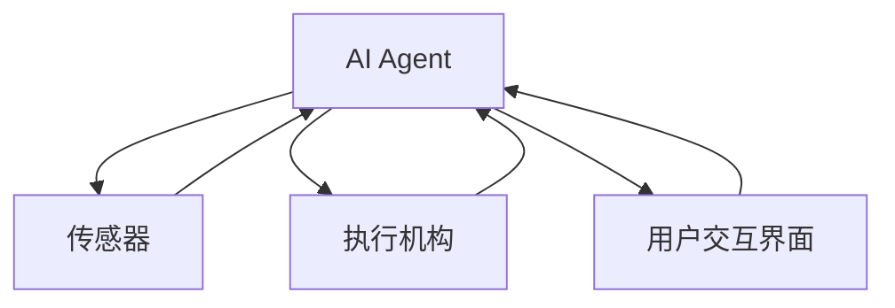
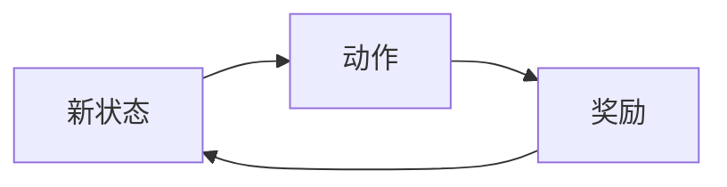
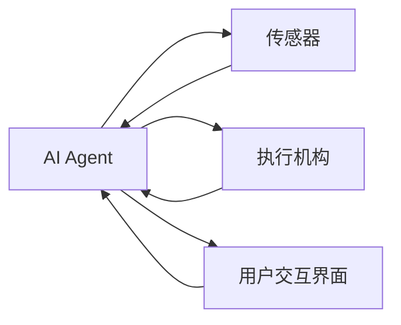

                 


# AI Agent在智能窗帘中的日光与隐私平衡

> 关键词：AI Agent, 智能窗帘, 日光调节, 隐私保护, 智能家居

> 摘要：随着智能家居的快速发展，AI Agent在智能窗帘中的应用越来越广泛。本文探讨了AI Agent如何在智能窗帘中实现日光调节与隐私保护的平衡，分析了AI Agent的核心原理、算法设计、系统架构，并通过实际案例展示了AI Agent在智能窗帘中的具体实现。本文还提出了隐私保护的最佳实践建议，为未来的智能窗帘设计提供了参考。

---

## 目录

1. [AI Agent在智能窗帘中的背景与概念](#ai-agent在智能窗帘中的背景与概念)
2. [AI Agent的核心概念与联系](#ai-agent的核心概念与联系)
3. [AI Agent的日光与隐私平衡算法原理](#ai-agent的日光与隐私平衡算法原理)
4. [AI Agent在智能窗帘中的系统分析与架构设计](#ai-agent在智能窗帘中的系统分析与架构设计)
5. [AI Agent在智能窗帘中的项目实战](#ai-agent在智能窗帘中的项目实战)
6. [AI Agent在智能窗帘中的最佳实践与总结](#ai-agent在智能窗帘中的最佳实践与总结)

---

## 1. AI Agent在智能窗帘中的背景与概念

### 1.1 AI Agent的基本概念
AI Agent（人工智能代理）是一种能够感知环境、做出决策并执行操作的智能实体。在智能窗帘中，AI Agent负责接收环境信息（如光照强度、时间、用户指令等），并根据这些信息调整窗帘的开合状态，以实现日光调节和隐私保护的双重目标。

### 1.2 智能窗帘的发展背景
智能窗帘作为智能家居的重要组成部分，近年来得到了快速发展。传统的窗帘只能通过手动开关或简单的遥控器控制，而智能窗帘则能够通过AI Agent实现自动化控制，提供更智能化、个性化的用户体验。

### 1.3 日光与隐私平衡的背景与问题
在智能窗帘中，日光调节和隐私保护是两个看似矛盾的目标。过多的日光可能暴露用户的隐私，而过度的隐私保护又可能导致室内光线不足。因此，如何在日光调节和隐私保护之间找到平衡点，是智能窗帘设计的核心问题。

### 1.4 本章小结
本章介绍了AI Agent的基本概念、智能窗帘的发展背景以及日光与隐私平衡的核心问题，为后续章节的分析奠定了基础。

---

## 2. AI Agent的核心概念与联系

### 2.1 AI Agent的核心原理
AI Agent在智能窗帘中的工作原理可以分为三个主要模块：
1. **感知模块**：通过光照传感器、时间传感器等获取环境信息。
2. **决策模块**：基于感知到的信息，结合预设的算法模型，做出窗帘开合的决策。
3. **执行模块**：通过电机或其他执行机构，将决策结果转化为实际操作。

### 2.2 AI Agent与智能窗帘的关系
智能窗帘的系统架构可以分为以下几个部分：
1. **传感器**：用于感知环境信息（如光照强度、温度、时间等）。
2. **AI Agent**：负责接收传感器数据，做出决策。
3. **执行机构**：根据AI Agent的决策，调整窗帘的开合状态。
4. **用户交互界面**：用户可以通过手机APP或语音助手与AI Agent进行交互。

### 2.3 AI Agent的日光与隐私平衡机制
AI Agent的日光与隐私平衡机制可以通过以下方式实现：
1. **光照强度调节**：根据光照传感器的数据，动态调整窗帘的开合程度。
2. **隐私保护策略**：在特定时间段（如晚上）或特定条件下（如有人经过窗外）自动关闭窗帘。
3. **用户偏好学习**：通过学习用户的使用习惯，优化窗帘的开合策略。

### 2.4 概念属性特征对比
以下是不同隐私保护方法的对比：

| 方法                | 优点                              | 缺点                              |
|---------------------|-----------------------------------|-----------------------------------|
| 时间-based策略     | 简单易实现，基于固定时间表       | 可能无法适应用户的实时需求       |
| 事件-based策略     | 基于实时事件（如有人经过）       | 对传感器的依赖较高               |
| 用户偏好-based策略 | 更个性化，适应用户的使用习惯     | 实现复杂，需要持续学习用户数据   |

### 2.5 实体关系图



---

## 3. AI Agent的日光与隐私平衡算法原理

### 3.1 算法原理概述
AI Agent的日光与隐私平衡算法主要基于强化学习和模糊逻辑。通过强化学习，AI Agent能够从环境中学习到最优的窗帘控制策略；通过模糊逻辑，AI Agent能够在不明确的信息中做出合理的决策。

### 3.2 强化学习算法
以下是强化学习的流程图：



### 3.3 模糊逻辑算法
模糊逻辑用于处理不明确的信息，例如：
- 如果光照强度很高，并且时间在白天，那么窗帘应该部分打开。
- 如果光照强度很低，并且时间在晚上，那么窗帘应该完全关闭。

### 3.4 数学模型与公式
强化学习的核心公式是Q-learning的更新公式：

$$ Q(s, a) = Q(s, a) + \alpha \left[ r + \gamma \max Q(s', a') - Q(s, a) \right] $$

其中：
- \( Q(s, a) \)：当前状态下动作 \( a \) 的价值函数。
- \( \alpha \)：学习率。
- \( r \)：奖励。
- \( \gamma \)：折扣因子。
- \( Q(s', a') \)：下一个状态下的最大价值函数。

### 3.5 代码实现
以下是强化学习算法的核心代码：

```python
class AI-Agent:
    def __init__(self, state_space, action_space):
        self.state_space = state_space
        self.action_space = action_space
        self.Q = defaultdict(lambda: np.zeros(len(action_space)))

    def get_action(self, state):
        if np.random.random() < 0.1:
            return np.random.randint(len(self.action_space))
        else:
            return np.argmax(self.Q[state])

    def update_Q(self, state, action, reward, next_state):
        target = reward + 0.9 * np.max(self.Q[next_state])
        self.Q[state][action] = self.Q[state][action] + 0.1 * (target - self.Q[state][action])
```

### 3.6 本章小结
本章详细介绍了AI Agent的日光与隐私平衡算法，包括强化学习和模糊逻辑的原理、数学模型和代码实现。

---

## 4. AI Agent在智能窗帘中的系统分析与架构设计

### 4.1 项目背景
本项目旨在设计一个能够实现日光调节和隐私保护的智能窗帘系统，通过AI Agent的核心算法，优化窗帘的开合策略。

### 4.2 系统功能设计
智能窗帘系统的主要功能包括：
1. **光照调节**：根据光照强度自动调整窗帘的开合程度。
2. **隐私保护**：在特定条件下自动关闭窗帘，防止隐私泄露。
3. **用户交互**：支持手机APP或语音助手的远程控制。

### 4.3 系统架构设计



### 4.4 系统接口设计
系统接口主要包括：
1. **传感器接口**：接收光照强度、时间等数据。
2. **执行机构接口**：控制窗帘的开合。
3. **用户交互接口**：提供远程控制功能。

### 4.5 本章小结
本章通过系统分析和架构设计，明确了AI Agent在智能窗帘中的核心作用，并为后续的项目实现奠定了基础。

---

## 5. AI Agent在智能窗帘中的项目实战

### 5.1 环境安装
要实现AI Agent在智能窗帘中的应用，需要以下环境：
1. Python 3.8+
2. numpy、pandas、matplotlib等库。

### 5.2 核心代码实现
以下是AI Agent的核心代码：

```python
import numpy as np
from collections import defaultdict

class AI-Agent:
    def __init__(self, state_space, action_space):
        self.state_space = state_space
        self.action_space = action_space
        self.Q = defaultdict(lambda: np.zeros(len(action_space)))

    def get_action(self, state):
        if np.random.random() < 0.1:
            return np.random.randint(len(self.action_space))
        else:
            return np.argmax(self.Q[state])

    def update_Q(self, state, action, reward, next_state):
        target = reward + 0.9 * np.max(self.Q[next_state])
        self.Q[state][action] = self.Q[state][action] + 0.1 * (target - self.Q[state][action])
```

### 5.3 实际案例分析
以下是AI Agent在智能窗帘中的实际应用案例：

1. **光照调节**：当光照强度超过阈值时，AI Agent会部分打开窗帘，以减少室内亮度。
2. **隐私保护**：当检测到有人经过窗外时，AI Agent会立即关闭窗帘，保护用户隐私。

### 5.4 代码应用解读与分析
AI Agent的核心代码通过强化学习算法不断优化窗帘的开合策略，确保在日光调节和隐私保护之间找到最佳平衡点。

### 5.5 本章小结
本章通过项目实战，详细讲解了AI Agent在智能窗帘中的具体实现，包括环境安装、代码实现和实际案例分析。

---

## 6. AI Agent在智能窗帘中的最佳实践与总结

### 6.1 最佳实践
1. **数据隐私保护**：在用户数据的采集和处理过程中，必须严格遵守隐私保护法律法规。
2. **算法优化**：通过不断优化强化学习算法，提高AI Agent的决策效率和准确性。
3. **系统维护**：定期更新系统软件，修复潜在的安全漏洞。

### 6.2 总结
AI Agent在智能窗帘中的日光与隐私平衡是一个复杂但极具挑战性的任务。通过强化学习和模糊逻辑的结合，AI Agent能够实现日光调节和隐私保护的双重目标。未来，随着AI技术的不断发展，智能窗帘系统将更加智能化、个性化。

### 6.3 拓展阅读
1. 《强化学习入门》
2. 《模糊逻辑与智能系统》
3. 《智能家居设计与实现》

---

## 作者：AI天才研究院/AI Genius Institute & 禅与计算机程序设计艺术/Zen And The Art of Computer Programming

