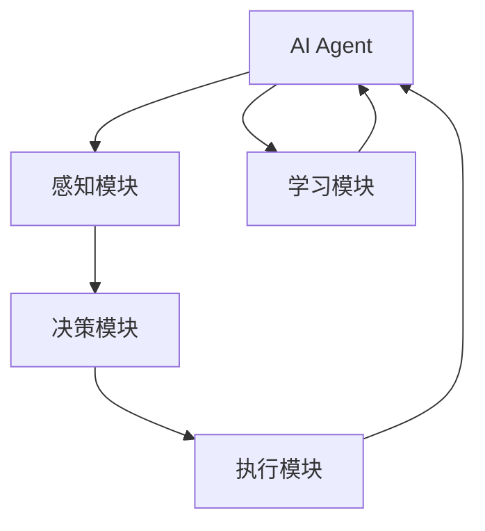
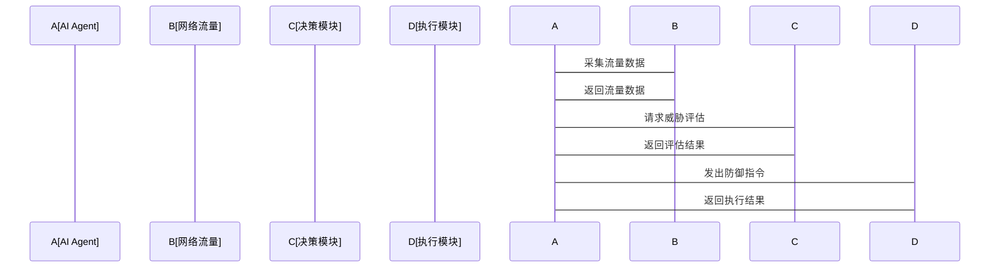

                 


# AI Agent在智能网络安全防御系统中的角色

---

## 关键词：  
AI Agent, 智能网络安全, 强化学习, 网络防御, 自适应安全

---

## 摘要：  
随着网络安全威胁的日益复杂化和智能化，传统的基于规则的网络安全防御系统已难以应对新型攻击手段。AI Agent（人工智能代理）作为一种具备自主学习、决策和执行能力的智能体，正在成为下一代智能网络安全防御系统的核心技术。本文将深入探讨AI Agent在智能网络安全防御系统中的角色，分析其核心概念、算法原理、系统架构，并通过实际案例展示其在网络安全中的应用价值。

---

## 第1章: AI Agent与智能网络安全概述

### 1.1 AI Agent的基本概念

#### 1.1.1 什么是AI Agent  
AI Agent（人工智能代理）是指能够感知环境、自主决策并执行任务的智能实体。它能够通过学习和推理，从环境中获取信息，并根据目标采取行动，以实现特定任务或优化目标。

#### 1.1.2 AI Agent的核心特征  
- **自主性**：能够在没有外部干预的情况下独立运行。  
- **反应性**：能够实时感知环境变化并做出响应。  
- **学习能力**：通过数据和经验不断优化自身的决策能力。  
- **协作性**：能够与其他AI Agent或系统组件协同工作。  

#### 1.1.3 AI Agent在网络安全中的应用潜力  
AI Agent在网络安全中的应用潜力主要体现在以下几个方面：  
1. **实时威胁检测**：通过机器学习算法实时分析网络流量，识别异常行为。  
2. **智能防御策略**：根据威胁情况动态调整防御策略，实现自适应防护。  
3. **自动化响应**：在检测到威胁时，快速启动自动化响应机制，最小化攻击影响。  

---

### 1.2 智能网络安全防御的现状

#### 1.2.1 当前网络安全面临的挑战  
- **复杂性**：网络攻击手段日益复杂，传统基于规则的防御方式难以应对未知威胁。  
- **实时性**：网络安全威胁往往具有突发性，需要实时响应。  
- **多样性**：攻击者不断进化攻击手法，防御系统需要具备快速适应能力。  

#### 1.2.2 智能化网络安全防御的需求  
- **智能化检测**：通过AI技术实现对网络流量的深度分析，发现潜在威胁。  
- **动态防御**：根据实时威胁情况动态调整防御策略。  
- **自动化响应**：通过自动化手段快速应对威胁，减少人工干预。  

#### 1.2.3 AI Agent与网络安全的结合  
AI Agent的自主学习和决策能力使其成为智能网络安全防御的核心技术。通过AI Agent，网络安全系统能够实现从被动防御到主动防御的转变，显著提升防御效率和效果。

---

## 第2章: AI Agent的核心概念与原理

### 2.1 AI Agent的核心概念

#### 2.1.1 AI Agent的感知机制  
AI Agent的感知机制是其核心功能之一，主要包括以下步骤：  
1. **数据采集**：通过传感器或API接口获取网络环境中的数据（如流量日志、系统状态等）。  
2. **数据处理**：对采集到的数据进行清洗、转换和特征提取。  
3. **信息分析**：利用机器学习算法对数据进行分析，识别潜在威胁。  

#### 2.1.2 AI Agent的决策机制  
AI Agent的决策机制基于以下步骤：  
1. **威胁评估**：根据感知到的信息，评估威胁的严重性和潜在影响。  
2. **策略选择**：基于预设的目标和优先级，选择最优的防御策略。  
3. **决策执行**：将决策结果传递给执行模块，启动相应的防御措施。  

#### 2.1.3 AI Agent的执行机制  
AI Agent的执行机制包括以下步骤：  
1. **策略执行**：根据决策结果，启动相应的防御措施（如封堵可疑IP、隔离受感染设备等）。  
2. **效果反馈**：收集执行结果，评估防御措施的有效性。  
3. **持续优化**：根据反馈结果，优化AI Agent的模型和策略。  

---

### 2.2 AI Agent在网络安全中的核心功能

#### 2.2.1 攻击检测与识别  
AI Agent能够通过机器学习算法分析网络流量，识别潜在的攻击行为。例如，利用深度学习模型检测异常流量模式，发现潜在的DDoS攻击或恶意软件传播行为。

#### 2.2.2 威胁分析与预测  
通过分析历史威胁数据和当前网络状态，AI Agent能够预测未来的威胁趋势，并提前制定防御策略。例如，利用强化学习算法模拟攻击者行为，预测可能的攻击向量。

#### 2.2.3 自适应防御策略  
AI Agent能够根据实时威胁情况动态调整防御策略。例如，在检测到某IP地址频繁尝试暴力破解时，AI Agent可以迅速封禁该IP，并启动进一步的监控和分析。

---

## 第3章: AI Agent的算法原理与实现

### 3.1 强化学习算法在AI Agent中的应用

#### 3.1.1 强化学习的基本原理  
强化学习是一种机器学习技术，通过智能体与环境的交互，学习最优策略以最大化累计奖励。其核心公式为：  
$$ Q(s, a) = r + \gamma \max Q(s', a') $$  
其中，$Q$ 表示状态-动作值函数，$s$ 表示当前状态，$a$ 表示动作，$r$ 表示奖励，$\gamma$ 表示折扣因子，$s'$ 表示下一个状态。

#### 3.1.2 强化学习在AI Agent中的应用  
在网络安全中，强化学习可以用于训练AI Agent的威胁响应策略。例如，AI Agent可以通过强化学习学习如何在不同威胁场景下选择最优的防御动作。

#### 3.1.3 强化学习算法实现  
以下是基于Q-learning算法的AI Agent实现示例：

```python
import numpy as np

class AI-Agent:
    def __init__(self, state_space, action_space):
        self.state_space = state_space
        self.action_space = action_space
        self.Q = np.zeros((state_space, action_space))
        self.learning_rate = 0.1
        self.gamma = 0.9

    def perceive(self, state):
        # 返回当前状态下的最优动作
        return np.argmax(self.Q[state, :])

    def learn(self, state, action, reward, next_state):
        # Q-learning更新规则
        self.Q[state, action] += self.learning_rate * (reward + self.gamma * np.max(self.Q[next_state, :]) - self.Q[state, action])

# 示例使用
state_space = 10
action_space = 4
agent = AI-Agent(state_space, action_space)
state = 5
action = agent.perceive(state)
reward = 1
next_state = 3
agent.learn(state, action, reward, next_state)
```

---

### 3.2 AI Agent的感知与决策流程

#### 3.2.1 感知流程  
1. 数据采集：通过网络接口采集流量数据。  
2. 数据预处理：清洗数据并提取特征。  
3. 模型推理：利用训练好的模型对数据进行分析，识别潜在威胁。  

#### 3.2.2 决策流程  
1. 威胁评估：根据感知结果评估威胁的严重性。  
2. 策略选择：基于强化学习算法选择最优防御策略。  
3. 策略执行：启动相应的防御措施。  

---

## 第4章: AI Agent的系统架构与设计

### 4.1 系统架构设计

#### 4.1.1 系统组成模块  
- **感知模块**：负责数据采集和初步分析。  
- **决策模块**：基于感知结果进行威胁评估和策略选择。  
- **执行模块**：根据决策结果执行防御措施。  
- **学习模块**：通过反馈优化AI Agent的模型和策略。  

#### 4.1.2 系统架构图  


---

### 4.2 系统接口设计

#### 4.2.1 接口描述  
- **输入接口**：网络流量数据、系统状态信息。  
- **输出接口**：防御策略、执行指令。  

#### 4.2.2 交互流程  


---

## 第5章: AI Agent的项目实战

### 5.1 项目背景与目标

#### 5.1.1 项目背景  
本项目旨在开发一个基于AI Agent的智能网络安全防御系统，用于实时检测和防御网络攻击。

#### 5.1.2 项目目标  
1. 实现AI Agent的感知、决策和执行功能。  
2. 验证AI Agent在实际网络环境中的防御效果。  

---

### 5.2 系统实现

#### 5.2.1 环境搭建  
- 操作系统：Linux  
- 开发工具：Python、TensorFlow、Keras  
- 网络设备：路由器、交换机  

#### 5.2.2 核心代码实现  
```python
import tensorflow as tf
from tensorflow.keras import layers

# 构建感知模型
model = tf.keras.Sequential()
model.add(layers.Dense(64, activation='relu', input_shape=(input_dim,)))
model.add(layers.Dense(32, activation='relu'))
model.add(layers.Dense(action_space, activation='linear'))

# 编译模型
model.compile(optimizer='adam', loss='mean_squared_error')
model.summary()
```

---

### 5.3 案例分析

#### 5.3.1 案例背景  
假设某企业网络遭受DDoS攻击，AI Agent需要实时检测并防御攻击。

#### 5.3.2 分析过程  
1. AI Agent感知到网络流量异常增加。  
2. 通过模型推理，识别出攻击行为。  
3. AI Agent启动防御策略，封禁可疑IP地址。  

#### 5.3.3 结果评估  
- 成功防御了DDoS攻击，网络流量恢复正常。  
- AI Agent模型经过此次事件优化，防御效果进一步提升。  

---

## 第6章: 总结与展望

### 6.1 最佳实践 Tips  
- 定期更新AI Agent的模型和策略，以应对新的威胁。  
- 结合多种AI技术（如深度学习、强化学习）提升防御效果。  

### 6.2 小结  
本文详细探讨了AI Agent在智能网络安全防御系统中的角色，分析了其核心概念、算法原理和系统架构，并通过实际案例展示了其在网络安全中的应用价值。AI Agent的引入显著提升了网络安全防御的智能化水平，为未来的网络安全防御系统提供了新的思路。

### 6.3 注意事项  
- AI Agent的模型训练需要大量的高质量数据，数据质量直接影响防御效果。  
- 在实际应用中，需要考虑模型的可解释性和透明性，便于调试和优化。  

### 6.4 拓展阅读  
- 《强化学习在网络安全中的应用》  
- 《AI Agent在智能监控系统中的应用研究》  

---

## 作者：  
AI天才研究院/AI Genius Institute & 禅与计算机程序设计艺术/Zen And The Art of Computer Programming

