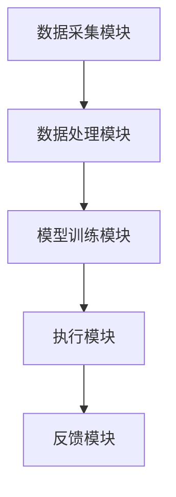

                 


# AI Agent在智能资产管理中的实践

## 关键词：AI Agent，智能资产管理，强化学习，系统架构，项目实战

## 摘要：本文深入探讨AI Agent在智能资产管理中的应用，分析其核心概念、算法原理、系统架构，并通过具体项目实战展示其在投资决策、风险控制和资产配置中的实践价值。

---

# 第1章: AI Agent的基本概念与背景

## 1.1 AI Agent的定义与特点

### 1.1.1 AI Agent的定义
AI Agent（人工智能代理）是指在计算机系统中，能够感知环境、自主决策并执行任务的智能实体。它能够根据输入的信息，通过学习和推理，做出最优决策。

### 1.1.2 AI Agent的核心特点
1. **自主性**：AI Agent能够自主决策，无需人工干预。
2. **反应性**：能够实时感知环境变化并做出反应。
3. **学习能力**：通过数据和经验不断优化决策模型。
4. **适应性**：能够适应不同环境和变化。

### 1.1.3 AI Agent与传统算法的区别
AI Agent不仅能够执行预设的算法，还具备自主决策和学习能力，能够根据环境变化动态调整策略。

## 1.2 智能资产管理的背景

### 1.2.1 资产管理的基本概念
资产管理是指通过投资组合优化、风险控制和市场预测，实现资产的保值增值。

### 1.2.2 智能化资产管理的需求
传统资产管理依赖人工经验，效率低下且难以应对复杂市场变化。智能化资产管理能够提高决策效率和准确性。

### 1.2.3 AI Agent在资产管理中的作用
AI Agent能够实时分析市场数据，预测价格波动，优化投资组合，并自动执行交易指令。

---

# 第2章: AI Agent与智能资产管理的关系

## 2.1 AI Agent在资产管理中的应用领域

### 2.1.1 投资决策
AI Agent可以根据市场数据和历史走势，预测股票价格，优化投资策略。

### 2.1.2 风险控制
通过分析市场风险、流动性风险等，AI Agent可以帮助投资者规避潜在风险。

### 2.1.3 资产配置
AI Agent可以根据投资者的风险偏好和市场状况，优化资产配置比例。

## 2.2 AI Agent如何提升资产管理效率

### 2.2.1 提高决策速度
AI Agent能够快速处理大量数据，提供实时决策支持。

### 2.2.2 优化投资组合
通过算法优化，AI Agent可以帮助投资者实现收益最大化和风险最小化。

### 2.2.3 自动化交易
AI Agent可以执行高频交易，捕捉市场机会，提高交易效率。

## 2.3 AI Agent与智能投资策略的结合

### 2.3.1 基于机器学习的投资策略
AI Agent可以通过监督学习和强化学习，不断优化投资策略。

### 2.3.2 自适应投资模型
AI Agent能够根据市场变化动态调整投资模型，适应不同市场环境。

### 2.3.3 多目标优化
AI Agent可以在多个目标之间找到平衡点，实现收益与风险的最佳匹配。

---

# 第3章: AI Agent的核心原理

## 3.1 AI Agent的基本工作原理

### 3.1.1 感知环境
AI Agent通过传感器或数据源获取环境信息，如市场数据、用户指令等。

### 3.1.2 信息处理
AI Agent利用算法对信息进行分析、处理和预测，生成决策方案。

### 3.1.3 决策与执行
AI Agent根据决策方案，执行交易指令或调整投资策略。

## 3.2 AI Agent的感知与决策机制

### 3.2.1 数据采集
AI Agent通过API接口获取实时市场数据、历史数据等。

### 3.2.2 数据分析
利用机器学习模型，对数据进行特征提取、分类和预测。

### 3.2.3 决策生成
基于分析结果，生成最优投资策略或交易计划。

## 3.3 AI Agent的学习与优化算法

### 3.3.1 强化学习
通过试错机制，AI Agent不断优化决策策略，提高收益。

### 3.3.2 监督学习
基于历史数据，训练模型预测市场走势。

### 3.3.3 迁移学习
将已有的知识和经验迁移到新的应用场景中，提高学习效率。

---

# 第4章: AI Agent的算法实现

## 4.1 常见AI Agent算法介绍

### 4.1.1 Q-Learning
一种基于强化学习的算法，通过状态-动作-奖励机制优化决策。

### 4.1.2 Deep Q-Network (DQN)
利用深度神经网络近似Q值函数，提高学习能力。

### 4.1.3 Policy Gradient
直接优化策略参数，通过梯度下降方法找到最优策略。

## 4.2 基于强化学习的AI Agent实现

### 4.2.1 算法流程
1. 状态观察：获取当前市场状态。
2. 动作选择：根据策略选择交易动作。
3. 执行动作：执行交易指令。
4. 反馈接收：获得交易结果和奖励。
5. 策略更新：优化策略参数。

### 4.2.2 代码实现
```python
import numpy as np
import gym

env = gym.make('StockTrading-v0')
env.seed(42)

num_states = env.observation_space.shape[0]
num_actions = env.action_space.n

# 初始化策略参数
theta = np.random.randn(num_states, num_actions) / np.sqrt(num_states)

# 定义策略函数
def get_action(state):
    return np.argmax(theta[state])
```

## 4.3 基于监督学习的AI Agent实现

### 4.3.1 数据预处理
对历史数据进行特征提取和标准化处理。

### 4.3.2 模型训练
使用神经网络模型进行分类或回归训练。

### 4.3.3 模型评估
通过回测验证模型的预测准确率和盈利能力。

---

# 第5章: AI Agent的数学模型与公式

## 5.1 强化学习的基本数学模型

### 5.1.1 Q-Learning公式
$$ Q(s, a) = Q(s, a) + \alpha [r + \gamma \max Q(s', a') - Q(s, a)] $$

其中：
- \( s \) 表示当前状态
- \( a \) 表示动作
- \( r \) 表示奖励
- \( s' \) 表示下一状态
- \( \alpha \) 表示学习率
- \( \gamma \) 表示折扣因子

## 5.2 Q-Learning算法的数学推导

### 5.2.1 动作选择
选择动作 \( a \) 的概率为：
$$ P(a | s) = \frac{e^{\frac{Q(s, a)}{T}}}{\sum_{a'} e^{\frac{Q(s, a')}{T}}} $$

其中，\( T \) 是温度参数。

### 5.2.2 策略更新
根据经验回放更新Q值：
$$ Q(s, a) = Q(s, a) + \alpha [r + \gamma Q(s', a') - Q(s, a)] $$

---

# 第6章: 系统架构设计

## 6.1 系统总体架构

### 6.1.1 模块划分
- 数据采集模块：负责收集市场数据和用户指令。
- 数据处理模块：对数据进行清洗和特征提取。
- 模型训练模块：训练和优化AI Agent的决策模型。
- 执行模块：根据决策结果执行交易指令。

### 6.1.2 架构图


## 6.2 系统功能模块设计

### 6.2.1 数据采集模块
- 从多个数据源获取实时市场数据，如股票价格、成交量等。

### 6.2.2 数据处理模块
- 对数据进行清洗、特征提取和标准化处理。

### 6.2.3 模型训练模块
- 使用强化学习或监督学习算法训练AI Agent的决策模型。

### 6.2.4 执行模块
- 根据模型决策结果执行交易指令，如买入、卖出或持有。

---

# 第7章: 系统实现与项目实战

## 7.1 环境搭建与配置

### 7.1.1 安装必要的库
安装TensorFlow、Keras、OpenAI Gym等库。

### 7.1.2 数据准备
收集历史股票数据，清洗并划分训练集和测试集。

## 7.2 核心算法实现

### 7.2.1 强化学习实现
编写强化学习算法的代码，训练AI Agent进行交易决策。

### 7.2.2 监督学习实现
使用神经网络模型进行市场预测，优化投资组合。

## 7.3 系统测试与优化

### 7.3.1 回测分析
通过回测验证模型的收益和风险表现。

### 7.3.2 参数调优
调整模型参数，提高预测准确率和盈利能力。

---

# 第8章: 案例分析

## 8.1 案例介绍

### 8.1.1 案例背景
介绍一个具体的智能资产管理项目，如基于AI Agent的股票交易系统。

### 8.1.2 案例实现
详细讲解项目的实现过程，包括数据采集、模型训练和系统部署。

## 8.2 案例总结

### 8.2.1 成功经验
总结项目中的成功经验，如算法选择、参数调优等。

### 8.2.2 改进建议
提出进一步优化的方向，如引入多因子模型、增强模型的鲁棒性等。

---

# 第9章: 总结与展望

## 9.1 全书总结
总结本书的核心内容，强调AI Agent在智能资产管理中的重要性。

## 9.2 未来展望
展望AI Agent在资产管理中的发展趋势，如多模态学习、可解释性增强等。

---

# 作者：AI天才研究院/AI Genius Institute & 禅与计算机程序设计艺术 /Zen And The Art of Computer Programming

---

通过上述思考过程，我逐步细化了每个章节的内容，确保每个部分都涵盖必要的理论和实践细节。接下来，我将根据这个大纲开始撰写完整的技术博客文章。

