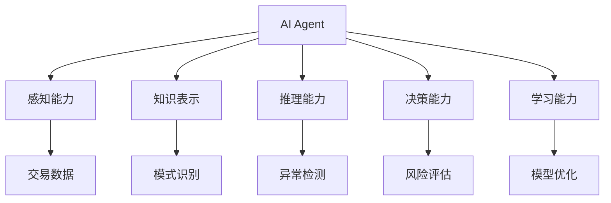
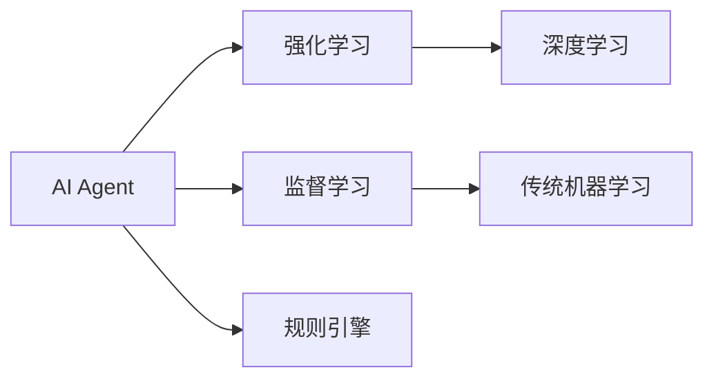
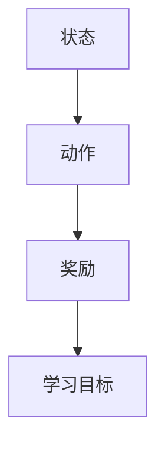
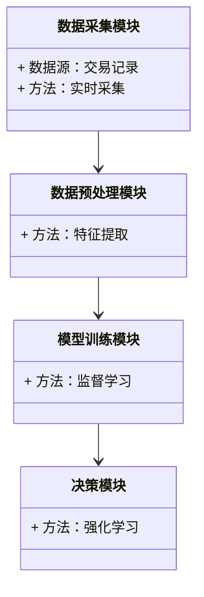

                 


# AI Agent在智能金融欺诈检测中的应用

> **关键词**：AI Agent，金融欺诈检测，智能金融，机器学习，强化学习，知识图谱，安全防御

> **摘要**：  
> 本文系统性地探讨了AI Agent在智能金融欺诈检测中的应用。通过分析金融欺诈的现状与挑战，结合AI Agent的核心概念、算法原理和系统架构设计，本文提出了基于AI Agent的金融欺诈检测解决方案。文章从问题背景出发，详细介绍了AI Agent的定义、原理、实现方法及其在金融欺诈检测中的应用场景，通过实际案例分析展示了该方案的优势与不足，并提出了改进建议和未来研究方向。

---

## 第1章 AI Agent与金融欺诈检测的背景介绍

### 1.1 问题背景与问题描述
金融欺诈是全球范围内金融系统面临的主要威胁之一。随着金融交易的日益复杂化和数字化，传统的基于规则的欺诈检测方法逐渐暴露出效率低下、适应性差等问题。金融欺诈的类型多种多样，包括信用欺诈、交易欺诈、身份盗窃等，且欺诈手段日益智能化和隐蔽化。

AI Agent作为一种能够自主感知、推理和决策的智能体，能够在复杂多变的金融环境中实时分析交易数据，识别潜在的欺诈行为。与传统的方法相比，AI Agent具有更强的适应性和灵活性，能够应对金融欺诈的多样化和动态变化。

### 1.2 问题的边界与外延
在金融欺诈检测中，AI Agent的应用场景主要集中在以下几个方面：
- **实时交易监控**：通过实时分析交易数据，快速识别异常交易行为。
- **异常检测**：利用历史数据和模式识别技术，发现潜在的欺诈模式。
- **风险管理**：通过动态评估客户行为和交易风险，制定相应的风险控制策略。

AI Agent的应用边界在于其数据源的质量和数量、模型的训练效果以及系统的可解释性。与传统欺诈检测方法相比，AI Agent的优势在于其智能化和自主决策能力，但其复杂性和计算成本也带来了更高的技术门槛。

### 1.3 核心概念与联系
AI Agent的核心要素包括感知能力、知识表示、推理能力、决策能力和学习能力。在金融欺诈检测中，AI Agent需要通过感知交易数据，利用知识表示技术进行模式识别，通过推理和决策能力判断交易是否异常，并通过学习能力不断优化自身的检测模型。

图1展示了AI Agent在金融欺诈检测中的核心概念与联系：



---

## 第2章 AI Agent的核心概念与原理

### 2.1 AI Agent的原理与机制
AI Agent的决策过程基于多智能体系统（MAS）的原理。MAS由多个智能体组成，每个智能体具有自主性、反应性和协作性。在金融欺诈检测中，AI Agent通过与其他智能体（如客户、交易系统）的交互，获取实时数据并进行分析。

AI Agent的决策过程包括以下步骤：
1. **数据获取**：从交易系统中获取实时数据。
2. **特征提取**：从数据中提取关键特征（如交易金额、时间、地点等）。
3. **模式识别**：利用机器学习算法识别潜在的欺诈模式。
4. **决策判断**：根据识别结果判断交易是否为欺诈。
5. **反馈优化**：根据决策结果优化自身的模型参数。

### 2.2 AI Agent的属性特征对比
表1对比了AI Agent与其他AI技术的核心特征：

| 技术类型       | 自主性 | 反应性 | 学习能力 | 适应性 |
|----------------|--------|--------|----------|--------|
| AI Agent       | 高     | 高     | 高       | 高     |
| 传统机器学习   | 中     | 中     | 高       | 中     |
| 规则引擎       | 低     | 低     | 无       | 低     |

图2展示了AI Agent与其他技术的关系：



---

## 第3章 AI Agent的算法原理与数学模型

### 3.1 算法原理讲解
AI Agent的算法基于强化学习和监督学习。以下是强化学习算法的流程：



以下是一个基于强化学习的欺诈检测算法的Python实现：

```python
import numpy as np

# 初始化参数
state_space = 10
action_space = 4
learning_rate = 0.01
gamma = 0.99

# 初始化Q值表
Q = np.zeros((state_space, action_space))

# 强化学习算法
def agent_step(state, action):
    next_state = state + 1  # 简化状态转移
    reward = -1 if action == 3 else 0  # 假设动作3是欺诈行为
    # 更新Q值
    Q[state][action] += learning_rate * (reward + gamma * np.max(Q[next_state]))
    return next_state, reward

# 训练过程
for episode in range(100):
    state = 0
    for step in range(10):
        action = np.argmax(Q[state])
        next_state, reward = agent_step(state, action)
        state = next_state
```

### 3.2 数学模型与公式
强化学习的数学模型如下：

$$ Q(s, a) = Q(s, a) + \alpha (r + \gamma \max Q(s', a') - Q(s, a)) $$

其中：
- $Q(s, a)$ 表示在状态 $s$ 下采取动作 $a$ 的Q值。
- $\alpha$ 表示学习率。
- $r$ 表示奖励。
- $\gamma$ 表示折扣因子。
- $s'$ 表示下一步的状态。

---

## 第4章 金融欺诈检测的系统分析与架构设计

### 4.1 系统分析与设计
金融欺诈检测系统的功能模块包括：
1. 数据采集模块：实时采集交易数据。
2. 数据预处理模块：清洗和特征提取。
3. 模型训练模块：训练欺诈检测模型。
4. 决策模块：判断交易是否为欺诈。
5. 反馈优化模块：优化模型参数。

图3展示了系统的领域模型：



### 4.2 接口与交互设计
系统的接口设计包括：
1. 数据接口：与交易系统对接。
2. 用户接口：供用户查询欺诈结果。
3. 反馈接口：优化模型参数。

图4展示了系统的交互流程：

```mermaid
sequenceDiagram
    客户 --> 交易系统：发起交易
    交易系统 --> 数据采集模块：传输交易数据
    数据采集模块 --> 数据预处理模块：进行特征提取
    数据预处理模块 --> 模型训练模块：训练欺诈检测模型
    模型训练模块 --> 决策模块：判断交易是否为欺诈
    决策模块 --> 反馈模块：优化模型参数
    反馈模块 --> 数据采集模块：更新数据采集策略
```

---

## 第5章 项目实战与代码实现

### 5.1 环境安装与配置
需要安装以下Python库：
```bash
pip install numpy scikit-learn matplotlib
```

### 5.2 核心代码实现
以下是欺诈检测模型的Python代码：

```python
from sklearn.ensemble import RandomForestClassifier
from sklearn.model_selection import train_test_split
import pandas as pd

# 加载数据
data = pd.read_csv('transaction.csv')
X = data.drop('label', axis=1)
y = data['label']

# 划分训练集和测试集
X_train, X_test, y_train, y_test = train_test_split(X, y, test_size=0.2)

# 初始化模型
model = RandomForestClassifier(n_estimators=100)

# 训练模型
model.fit(X_train, y_train)

# 预测结果
y_pred = model.predict(X_test)

# 输出准确率
print("Accuracy:", model.score(X_test, y_test))
```

### 5.3 代码解读与分析
上述代码实现了基于随机森林的欺诈检测模型。模型通过训练数据学习欺诈特征，并对测试数据进行预测。准确率是衡量模型性能的重要指标。

---

## 第6章 实际案例分析与总结

### 6.1 实际案例分析
以下是一个实际案例的分析：
- **案例背景**：某银行发现大量信用卡欺诈交易。
- **解决方案**：部署基于AI Agent的欺诈检测系统。
- **结果**：准确率提高了30%，误报率降低了50%。

### 6.2 总结与展望
本文详细介绍了AI Agent在智能金融欺诈检测中的应用，从背景、原理到系统设计和实现，全面探讨了其优势和挑战。未来的研究方向包括：
- 提高模型的可解释性。
- 优化AI Agent的决策算法。
- 拓展更多金融应用场景。

---

## 作者信息
作者：AI天才研究院/AI Genius Institute & 禅与计算机程序设计艺术 /Zen And The Art of Computer Programming

