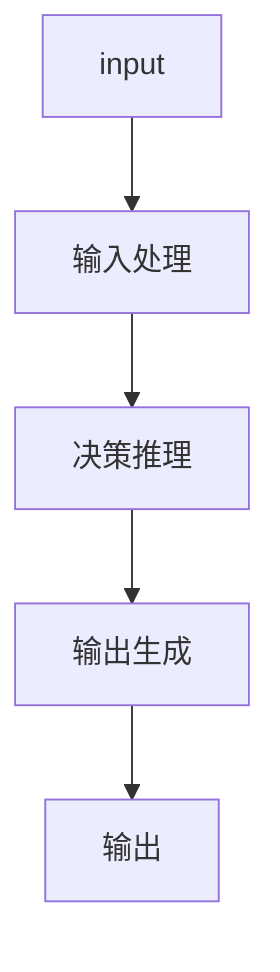
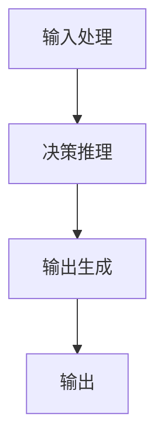

                 


# AI Agent的伦理决策：在LLM中实现道德推理

---

## 关键词：
AI Agent、伦理决策、LLM、道德推理、人工智能、伦理算法、决策系统

---

## 摘要：
随着人工智能技术的快速发展，AI Agent在各种应用场景中发挥着越来越重要的作用。然而，AI Agent的决策过程往往需要考虑伦理和道德因素，尤其是在涉及人类行为和可能带来重大影响的场景中。本文旨在探讨如何在大型语言模型（LLM）中实现伦理决策，分析当前技术的优缺点，并提出一种基于LLM的伦理推理框架。通过结合伦理决策的核心概念、算法原理和系统设计，本文将详细阐述如何在AI Agent中实现道德推理，确保决策过程既符合伦理规范，又能满足实际应用的需求。

---

## 第一章: AI Agent与伦理决策概述

### 1.1 AI Agent的基本概念
AI Agent（人工智能代理）是指能够感知环境、自主决策并执行任务的智能实体。它可以分为两类：**简单反射型代理**和**基于模型的代理**。简单反射型代理仅基于当前输入做出反应，而基于模型的代理则会构建环境模型，并基于模型进行规划和决策。

AI Agent的核心特征包括：
1. **自主性**：能够在没有外部干预的情况下自主运行。
2. **反应性**：能够感知环境并实时调整行为。
3. **目标导向性**：具有明确的目标，并通过决策和行动来实现目标。
4. **学习能力**：能够通过经验改进自身的决策能力。

在实际应用中，AI Agent面临的伦理挑战主要集中在以下几个方面：
1. **决策的可解释性**：AI Agent的决策过程需要能够被人类理解和验证。
2. **责任归属**：当AI Agent的决策导致负面结果时，责任归属问题亟待解决。
3. **公平性与偏见**：AI Agent的决策可能受到训练数据中的偏见影响，导致不公平的结果。

---

### 1.2 伦理决策的基本概念
伦理决策是指在决策过程中考虑伦理规范和道德准则，以确保决策结果符合社会 accepted的行为准则。伦理决策的核心要素包括：
1. **目标**：明确决策的目标和预期结果。
2. **约束条件**：决策需要遵循的规则、法律和伦理准则。
3. **利益相关者**：决策可能影响的个体、群体或组织。
4. **后果评估**：对决策可能带来的后果进行评估和预测。

伦理决策的实现方式可以分为以下几种：
1. **基于规则的决策**：通过预定义的规则和约束条件进行决策。
2. **基于案例的决策**：通过类比历史案例进行决策。
3. **基于后果的决策**：通过预测决策的后果来选择最优选项。

---

### 1.3 LLM与伦理决策的结合
LLM（Large Language Model）是一种基于深度学习的自然语言处理模型，具有强大的文本生成和理解能力。在伦理决策中，LLM可以用于以下几个方面：
1. **语义理解**：通过LLM理解用户的需求和意图。
2. **决策推理**：利用LLM进行逻辑推理和情境分析，生成符合伦理规范的决策。
3. **语言生成**：通过LLM生成符合伦理规范的自然语言输出。

然而，当前LLM在伦理决策中的应用仍面临一些挑战，例如如何确保决策的可解释性、如何处理复杂的情境以及如何避免偏见的传播。

---

## 第二章: 伦理决策的核心概念与联系

### 2.1 伦理决策的模型与方法
伦理决策的模型可以分为以下三种：
1. **基于规则的伦理决策模型**：通过预定义的规则和约束条件进行决策。例如，交通规则中的“红灯停，绿灯行”。
2. **基于案例的伦理决策模型**：通过类比历史案例进行决策。例如，医疗诊断中的类似病例分析。
3. **基于后果的伦理决策模型**：通过预测决策的后果选择最优选项。例如，经济学中的成本效益分析。

以下是一个对比表格，展示了三种模型的优缺点：

| 模型类型         | 优点                           | 缺点                           |
|------------------|--------------------------------|--------------------------------|
| 基于规则的模型   | 简单易懂，可解释性强           | 难以处理复杂和动态的场景       |
| 基于案例的模型   | 可以处理复杂场景，灵活性高       | 可能存在类例不足的问题         |
| 基于后果的模型   | 可以优化结果，灵活性高           | 计算复杂，难以实时应用         |

---

### 2.2 伦理决策与LLM的关系
LLM在伦理决策中的作用可以分为以下几点：
1. **语义理解**：LLM能够理解复杂的语义信息，为决策提供语境支持。
2. **决策推理**：通过LLM的推理能力，可以生成符合伦理规范的决策方案。
3. **语言生成**：LLM能够生成自然语言的输出，使决策结果更易于理解和沟通。

以下是一个ER实体关系图，展示了伦理决策系统中的主要实体及其关系：

```mermaid
er
actor
    name
    role
decision
    decision_id
    decision_type
    decision_rule
    decision_outcome
    decision_timestamp
event
    event_id
    event_type
    event_description
    event_timestamp
```

---

## 第三章: 伦理决策的算法原理

### 3.1 基于规则的伦理决策算法
基于规则的伦理决策算法是一种简单但高效的决策方法。以下是其实现步骤：
1. **定义规则**：根据伦理规范和约束条件，定义一系列规则。
2. **输入处理**：将输入信息与规则进行匹配。
3. **决策生成**：根据匹配的规则生成决策。

以下是一个基于规则的伦理决策算法的伪代码示例：

```python
def rule_based_decision(rules, input):
    for rule in rules:
        if rule.applies_to(input):
            return rule.get_decision(input)
    return default_decision
```

---

### 3.2 基于案例的伦理决策算法
基于案例的伦理决策算法是一种基于历史案例的决策方法。以下是其实现步骤：
1. **案例库构建**：收集和整理历史案例。
2. **案例检索**：根据输入信息检索相似案例。
3. **决策生成**：根据检索到的案例生成决策。

以下是一个基于案例的伦理决策算法的伪代码示例：

```python
def case_based_decision(cases, input):
    similar_cases = find_similar_cases(cases, input)
    if similar_cases:
        return get_decision(similar_cases[0])
    else:
        return default_decision
```

---

### 3.3 基于后果的伦理决策算法
基于后果的伦理决策算法是一种基于预测结果的决策方法。以下是其实现步骤：
1. **预测模型构建**：构建预测模型，预测决策的后果。
2. **后果评估**：评估预测结果的优劣。
3. **决策生成**：选择最优决策。

以下是一个基于后果的伦理决策算法的伪代码示例：

```python
def consequence_based_decision(model, input):
    predicted_outcome = model.predict(input)
    if predicted_outcome.is_positive():
        return predicted_outcome.get_decision()
    else:
        return alternative_decision
```

---

## 第四章: 伦理决策系统的系统分析与架构设计

### 4.1 系统功能设计
伦理决策系统的功能模块包括：
1. **输入处理模块**：接收输入信息并进行预处理。
2. **决策推理模块**：根据输入信息生成决策。
3. **输出生成模块**：将决策结果生成输出。

以下是一个系统功能流程图：



---

### 4.2 系统架构设计
伦理决策系统的架构设计可以采用分层架构：
1. **数据层**：存储输入数据和历史案例。
2. **逻辑层**：实现决策推理逻辑。
3. **接口层**：提供与外部系统的交互接口。

以下是一个系统架构图：



---

## 第五章: 伦理决策系统的项目实战

### 5.1 项目环境安装
项目需要以下环境和依赖：
1. Python 3.8+
2. TensorFlow 2.0+
3. 基于LLM的NLP库（如Hugging Face的GPT模型）

安装依赖：
```bash
pip install tensorflow transformers
```

---

### 5.2 系统核心实现源代码
以下是一个基于规则的伦理决策系统的代码实现：

```python
from transformers import AutoTokenizer, AutoModelForCausalLM
import torch

# 初始化模型和tokenizer
model_name = "gpt2"
tokenizer = AutoTokenizer.from_pretrained(model_name)
model = AutoModelForCausalLM.from_pretrained(model_name)

def generate_decision(input_text):
    inputs = tokenizer.encode(input_text, return_tensors="pt")
    outputs = model.generate(inputs, max_length=100, do_sample=True)
    decision = tokenizer.decode(outputs[0], skip_special_tokens=True)
    return decision

# 示例输入
input_text = "在医疗诊断中，患者出现的症状与两种可能的疾病有关，但只能选择一种治疗方案。"
print(generate_decision(input_text))
```

---

## 第六章: 总结与建议

### 6.1 总结
本文详细探讨了AI Agent在伦理决策中的应用，分析了基于规则、案例和后果的伦理决策模型，并提出了基于LLM的伦理推理框架。通过对比不同模型的优缺点，本文为AI Agent的伦理决策提供了理论基础和实践指导。

### 6.2 建议
1. **可解释性**：未来的研究需要更加关注决策的可解释性，以便更好地理解和验证AI Agent的决策过程。
2. **公平性**：需要进一步研究如何消除训练数据中的偏见，确保决策的公平性。
3. **实时性**：需要优化算法的计算效率，以满足实时决策的需求。

---

## 作者：AI天才研究院/AI Genius Institute & 禅与计算机程序设计艺术 /Zen And The Art of Computer Programming

---

希望这篇文章能为读者提供关于AI Agent伦理决策的深入理解，并为实际应用提供有价值的参考。

