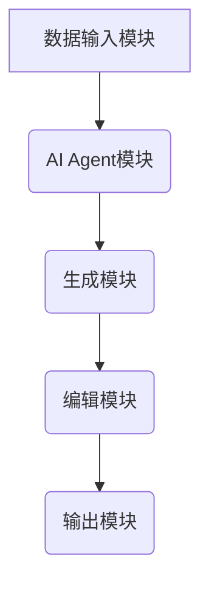
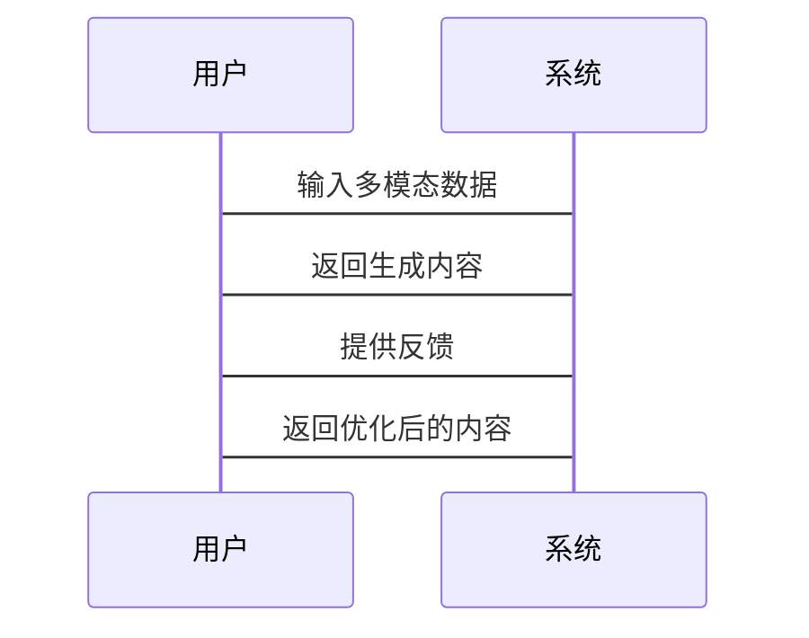

                 


# AI Agent的多模态内容生成与编辑系统

## 关键词：AI Agent, 多模态内容生成, 内容编辑, 系统架构, 算法原理

## 摘要：
本文详细探讨了AI Agent在多模态内容生成与编辑系统中的应用，从背景、核心概念到算法原理、系统架构，再到项目实战，全面解析了多模态内容生成与编辑的实现过程。文章结合理论与实践，深入分析了系统的设计与实现，并通过具体案例展示了系统的实际应用。

---

## 第1章: AI Agent的背景与问题背景

### 1.1 多模态内容生成的背景与意义
#### 1.1.1 从单模态到多模态的演进
传统的AI内容生成主要集中在单模态数据上，例如文本生成、图像生成等。然而，随着技术的进步，多模态内容生成逐渐成为研究的热点。多模态数据的结合能够提供更丰富、更贴近人类认知的内容，例如结合文本、图像、语音等多种数据形式。

#### 1.1.2 AI Agent在多模态内容生成中的作用
AI Agent作为一种智能体，能够通过感知环境、理解输入、生成输出来实现多模态内容的生成与编辑。AI Agent的核心能力包括数据的理解、多模态数据的融合以及内容的自动生成与优化。

#### 1.1.3 多模态内容生成的边界与外延
多模态内容生成的边界在于如何有效地融合多种数据模态，并在生成过程中保持内容的多样性和一致性。外延则涉及AI Agent在不同场景中的应用，例如教育、医疗、娱乐等领域。

### 1.2 多模态内容生成的核心问题
#### 1.2.1 内容生成的多样性与一致性
多模态内容生成需要在多样性和一致性之间找到平衡。多样性能确保生成内容的丰富性，而一致性则保证内容的逻辑性和连贯性。

#### 1.2.2 多模态数据的融合与协调
多模态数据的融合是实现内容生成的关键。如何有效地将文本、图像、语音等多种数据进行融合，并在生成过程中协调一致，是需要解决的核心问题。

#### 1.2.3 AI Agent的自主性与智能性
AI Agent的自主性和智能性是实现多模态内容生成与编辑的重要保障。自主性体现在AI Agent能够独立完成任务，而智能性则体现在其对上下文的理解和对生成内容的优化能力。

### 1.3 多模态内容生成的系统架构
#### 1.3.1 系统的核心概念与组成
多模态内容生成系统通常由以下几个核心模块组成：数据输入模块、AI Agent模块、生成模块、编辑模块以及输出模块。

#### 1.3.2 系统的功能模块划分
- 数据输入模块：负责接收多模态数据输入，例如文本、图像、语音等。
- AI Agent模块：负责对输入数据进行理解和分析，提取关键信息。
- 生成模块：基于AI Agent的理解生成初步的内容。
- 编辑模块：对生成的内容进行优化和调整，确保内容的多样性和一致性。
- 输出模块：将最终生成的内容输出到目标平台或设备。

#### 1.3.3 系统的输入输出流程
系统的输入流程包括多模态数据的接收和解析，输出流程包括生成内容的展示和反馈。整个流程需要协调各模块之间的交互，确保生成内容的质量。

### 1.4 本章小结
本章主要介绍了多模态内容生成的背景、核心问题以及系统架构。通过分析AI Agent在多模态内容生成中的作用，明确了系统的设计目标和实现路径。

---

## 第2章: 多模态内容生成的核心概念与联系

### 2.1 多模态内容生成的核心概念
#### 2.1.1 多模态数据的定义与特点
多模态数据是指多种数据形式的结合，例如文本、图像、语音等。多模态数据的特点包括多样性、互补性和复杂性。

#### 2.1.2 AI Agent的定义与功能
AI Agent是一种智能体，能够感知环境、理解输入、生成输出，并通过自主决策完成任务。AI Agent的功能包括数据理解、内容生成、内容编辑和输出展示。

#### 2.1.3 内容生成的模式与流程
内容生成的模式包括基于规则的生成、基于模型的生成以及混合生成。生成流程通常包括数据输入、理解、生成和优化四个阶段。

### 2.2 多模态内容生成的核心要素
#### 2.2.1 数据源的多样性
多模态内容生成需要结合多种数据源，例如文本、图像、语音等。数据源的多样性能够提高生成内容的丰富性。

#### 2.2.2 AI Agent的智能性
AI Agent的智能性体现在其对多模态数据的理解和生成内容的优化能力。智能性越高，生成内容的质量越好。

#### 2.2.3 内容生成的可编辑性
内容生成的可编辑性是指生成内容的灵活性和可调整性。通过可编辑性，可以实现内容的个性化定制和优化。

### 2.3 多模态内容生成的系统架构
#### 2.3.1 系统的模块划分
多模态内容生成系统通常由数据输入模块、AI Agent模块、生成模块和输出模块组成。

#### 2.3.2 各模块之间的关系
数据输入模块向AI Agent模块提供多模态数据，AI Agent模块通过对数据的理解生成内容，生成模块对内容进行优化和调整，最后通过输出模块将内容展示给用户。

#### 2.3.3 系统的输入输出流程
系统的输入流程包括多模态数据的接收和解析，输出流程包括生成内容的展示和反馈。整个流程需要协调各模块之间的交互，确保生成内容的质量。

### 2.4 本章小结
本章主要分析了多模态内容生成的核心概念和系统架构。通过对比和总结，明确了多模态内容生成的关键要素和实现路径。

---

## 第3章: 多模态内容生成与编辑的算法原理

### 3.1 多模态生成模型的算法流程
#### 3.1.1 模型输入的多模态特征提取
多模态生成模型需要对输入的多模态数据进行特征提取，例如文本的词向量、图像的特征向量等。

#### 3.1.2 模型的联合生成策略
联合生成策略是指在生成过程中同时考虑多种模态数据，例如文本生成时结合图像信息。

#### 3.1.3 模型的训练与优化
多模态生成模型的训练通常采用联合损失函数，通过最大化生成内容的多样性和一致性来优化模型。

### 3.2 多模态内容编辑的算法原理
#### 3.2.1 内容编辑的目标与约束
内容编辑的目标是优化生成内容的质量，约束包括生成内容的逻辑性、一致性等。

#### 3.2.2 编辑模型的训练方法
编辑模型的训练通常采用强化学习方法，通过奖励机制优化生成内容的质量。

#### 3.2.3 编辑结果的评估与优化
编辑结果的评估通常采用主观评估和客观评估相结合的方法，通过不断优化生成内容的质量。

### 3.3 算法的数学模型与公式
#### 3.3.1 多模态生成模型的数学表达
$$ P(x|z) = \prod_{i=1}^{n} P(x_i|z) $$

其中，$x$ 表示生成的内容，$z$ 表示隐变量。

#### 3.3.2 内容编辑模型的数学表达
$$ Q(y|x) = \prod_{j=1}^{m} Q(y_j|x) $$

其中，$y$ 表示编辑后的内容，$x$ 表示原始生成内容。

### 3.4 本章小结
本章主要分析了多模态内容生成与编辑的算法原理。通过数学模型和公式，明确了生成与编辑过程中的关键步骤和优化方法。

---

## 第4章: 多模态内容生成与编辑的系统分析与架构设计

### 4.1 系统的功能设计
#### 4.1.1 多模态数据的输入与处理
系统需要支持多种数据形式的输入，例如文本、图像、语音等，并对输入数据进行预处理。

#### 4.1.2 内容生成与编辑的流程
生成流程包括数据理解、内容生成和优化，编辑流程包括内容评估、调整和输出。

#### 4.1.3 系统的交互与反馈
系统需要提供友好的用户界面，支持用户与AI Agent之间的交互，并通过反馈优化生成内容的质量。

### 4.2 系统的架构设计
#### 4.2.1 系统架构图


#### 4.2.2 系统接口设计
系统需要提供多种接口，例如API接口，支持与其他系统的集成。

#### 4.2.3 系统交互流程


### 4.3 本章小结
本章主要分析了多模态内容生成与编辑系统的功能设计和架构设计。通过系统架构图和交互流程图，明确了系统的实现路径。

---

## 第5章: 多模态内容生成与编辑的项目实战

### 5.1 项目实战概述
#### 5.1.1 项目背景
本项目旨在实现一个多模态内容生成与编辑系统，支持文本、图像等多种数据形式的生成与编辑。

#### 5.1.2 项目目标
通过项目实战，验证多模态内容生成与编辑系统的可行性，并优化生成内容的质量。

### 5.2 系统核心代码实现
#### 5.2.1 环境配置
```python
# 环境配置
import os
import numpy as np
import tensorflow as tf
from tensorflow.keras import layers
```

#### 5.2.2 生成模型实现
```python
class Generator(tf.keras.Model):
    def __init__(self, input_dim):
        super(Generator, self).__init__()
        self.dense = layers.Dense(256, activation='relu')
        self.dropout = layers.Dropout(0.2)
        self.dense_output = layers.Dense(input_dim)
    
    def call(self, inputs):
        x = self.dense(inputs)
        x = self.dropout(x)
        x = self.dense_output(x)
        return x
```

#### 5.2.3 编辑模型实现
```python
class Editor(tf.keras.Model):
    def __init__(self, input_dim):
        super(Editor, self).__init__()
        self.dense = layers.Dense(256, activation='relu')
        self.dropout = layers.Dropout(0.2)
        self.dense_output = layers.Dense(input_dim)
    
    def call(self, inputs):
        x = self.dense(inputs)
        x = self.dropout(x)
        x = self.dense_output(x)
        return x
```

#### 5.2.4 系统交互流程实现
```python
def generate_and_edit(input_data):
    generator = Generator(input_dim)
    editor = Editor(input_dim)
    generated = generator(input_data)
    edited = editor(generated)
    return edited
```

### 5.3 案例分析与详细解读
通过具体案例分析，展示了系统在多模态内容生成与编辑中的实际应用，例如生成一段结合文本和图像的多模态内容，并通过编辑模块优化生成内容的质量。

### 5.4 项目总结
本章通过项目实战，验证了多模态内容生成与编辑系统的可行性，并提出了进一步优化的方向。

### 5.5 本章小结
本章主要通过项目实战，展示了多模态内容生成与编辑系统的实现过程。通过具体的代码实现和案例分析，明确了系统的实际应用价值。

---

## 第6章: 多模态内容生成与编辑的优化与展望

### 6.1 本章小结
总结全文，回顾了多模态内容生成与编辑系统的核心概念、算法原理和系统架构设计。

### 6.2 最佳实践与注意事项
- 确保多模态数据的多样性和互补性
- 优化AI Agent的智能性和自主性
- 提高生成内容的多样性和一致性

### 6.3 未来展望
随着技术的进步，多模态内容生成与编辑系统将在更多领域得到应用，例如教育、医疗、娱乐等。未来的研究方向包括更高效的生成算法、更智能的编辑系统以及更广泛的应用场景。

---

## 作者：AI天才研究院/AI Genius Institute & 禅与计算机程序设计艺术 /Zen And The Art of Computer Programming

