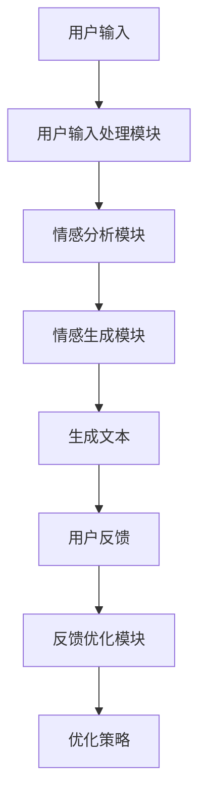

                 


# AI Agent的情感调节：利用LLM实现情绪智能交互

## 关键词：AI Agent，情感调节，LLM，情感计算，人机交互

## 摘要：  
随着人工智能技术的飞速发展，AI Agent（人工智能代理）在各个领域的应用越来越广泛。然而，如何让AI Agent具备情感智能，实现与人类的自然交互，成为了当前技术领域的重要挑战。本文将深入探讨如何利用大语言模型（LLM）实现AI Agent的情感调节，从理论基础到实际应用，逐步解析情感计算的核心原理、LLM在情感调节中的应用，以及构建情感智能交互系统的具体方法。通过本文的分析，读者将能够全面理解AI Agent情感调节的技术细节，并掌握实际应用中的关键要点。

---

# 第一部分: AI Agent与情感调节的背景与基础

## 第1章: AI Agent与情感调节概述

### 1.1 AI Agent的基本概念  
- **AI Agent的定义**：AI Agent是指能够感知环境、自主决策并执行任务的智能实体。它可以是一个软件程序，也可以是一个物理机器人。  
- **AI Agent的核心特征**：  
  - **自主性**：能够在没有外部干预的情况下独立运行。  
  - **反应性**：能够根据环境输入做出实时反应。  
  - **目标导向**：具备明确的目标，并通过行动实现目标。  
  - **社交能力**：能够与人类或其他AI Agent进行交互。  

- **情感智能在AI Agent中的作用**：情感智能使AI Agent能够理解、识别和回应人类的情感，从而提升交互的自然性和用户体验。  

### 1.2 情感调节的定义与重要性  
- **情感调节的定义**：情感调节是指通过识别和分析用户的情感状态，调整AI Agent的输出，使其与用户的情感需求相匹配。  
- **情感调节在人机交互中的价值**：  
  - **提升用户体验**：通过情感调节，AI Agent能够更贴近人类的沟通方式，使用户感到被理解和被重视。  
  - **增强交互效果**：情感调节使AI Agent能够更好地适应用户的情感状态，从而提高交互的效率和准确性。  
  - **扩展应用领域**：情感调节技术能够应用于教育、医疗、客服、社交机器人等领域，提升AI Agent的实用性。  

- **情感调节的应用场景**：  
  - **教育领域**：AI Tutor可以根据学生的情绪状态调整教学策略。  
  - **医疗领域**：AI Health Assistant可以通过情感调节帮助患者缓解焦虑。  
  - **客服领域**：AI Customer Service Agent可以通过情感调节提高客户满意度。  

### 1.3 LLM在情感调节中的潜力  
- **LLM的基本原理**：LLM（Large Language Model）是一种基于深度学习的自然语言处理模型，能够理解和生成人类语言。  
- **LLM在自然语言处理中的优势**：  
  - **强大的上下文理解能力**：LLM能够捕捉文本中的语义信息，理解复杂的情感表达。  
  - **多语言支持**：LLM可以处理多种语言，适用于全球范围内的应用。  
  - **可扩展性**：LLM可以通过微调和迁移学习适应不同的任务需求。  

- **LLM如何支持情感智能**：  
  - **情感分析**：LLM可以通过预训练的情感分析模型识别用户的正面、负面或中性情绪。  
  - **情感生成**：LLM可以生成符合特定情感基调的文本，例如在用户感到沮丧时，生成鼓励性的回复。  
  - **情感记忆**：通过记录用户的长期情感状态，LLM可以提供更个性化的交互体验。  

---

## 第2章: 情感计算的核心概念  

### 2.1 情感计算的定义与实现  
- **情感计算的定义**：情感计算是指通过计算机技术分析、识别和处理人类情感信息的过程。  
- **情感计算的关键技术**：  
  - **情感识别**：通过自然语言处理技术识别文本中的情感倾向。  
  - **情感生成**：根据情感信息生成相应的文本或行为。  
  - **情感记忆**：记录和分析用户的情感变化，以便后续的个性化交互。  

- **情感计算的实现流程**：  
  1. 收集用户输入（文本或语音）。  
  2. 使用情感分析模型识别情感状态。  
  3. 根据情感状态生成相应的回应。  
  4. 反馈优化情感调节策略。  

### 2.2 情感分析与生成的对比  
- **情感分析的定义与方法**：  
  - **情感分析**：对文本的情感倾向进行分类，通常分为正面、负面和中性。  
  - **情感生成的定义**：根据情感需求生成符合特定情感基调的文本。  

- **两者的区别与联系**：  
  - **区别**：情感分析侧重于理解用户的情感，而情感生成侧重于根据情感需求生成文本。  
  - **联系**：情感分析是情感生成的基础，生成的内容需要基于情感分析的结果。  

### 2.3 情感计算的数学模型  
- **情感评分函数**：  
  - **线性加权模型**：根据关键词的权重计算情感评分，例如：$$\text{score} = w_1 \cdot \text{关键词}_1 + w_2 \cdot \text{关键词}_2 + \dots + w_n \cdot \text{关键词}_n$$  
  - **机器学习模型**：使用训练好的分类器对文本进行情感评分，例如支持向量机（SVM）或深度学习模型。  

- **情感分类模型**：  
  - **朴素贝叶斯分类器**：基于概率论的情感分类方法。  
  - **深度学习模型**：如LSTM和Transformer，能够捕捉长距离依赖关系。  

---

## 第3章: LLM与情感计算的结合原理  

### 3.1 LLM的内部工作机制  
- **变压器模型的基本结构**：  
  - **编码器**：将输入的文本转换为上下文向量。  
  - **解码器**：根据编码器的输出生成目标文本。  
  - **注意力机制**：通过自注意力机制捕捉文本中的关键信息。  

- **注意力机制的作用**：  
  - **自注意力机制**：捕捉文本中词语之间的关系，帮助模型理解上下文。  
  - **交叉注意力机制**：在生成文本时，结合输入和内部状态，生成更连贯的回应。  

### 3.2 情感计算在LLM中的实现  
- **情感特征提取**：通过预训练的情感分析模型提取文本中的情感特征。  
- **情感推理过程**：基于情感特征生成符合情感需求的回应。  
- **情感生成策略**：根据用户的情感状态，动态调整生成内容的情感基调。  

### 3.3 情感计算与LLM的优化方法  
- **微调LLM进行情感任务**：  
  - **微调过程**：在预训练好的LLM基础上，使用特定的情感任务数据进行微调。  
  - **训练目标**：最小化交叉熵损失函数，$$\mathcal{L} = -\sum_{i=1}^{n} y_i \log p(y_i)$$，其中$$y_i$$是真实标签，$$p(y_i)$$是模型预测的概率。  

- **多任务学习在情感调节中的应用**：  
  - **多任务学习框架**：同时训练情感分析和情感生成任务，共享模型参数，提升整体性能。  
  - **权重分配**：根据任务的重要性，动态调整各任务的权重。  

- **情感反馈机制的引入**：  
  - **用户反馈收集**：通过用户点击或评分的方式收集情感调节的效果反馈。  
  - **模型优化**：根据反馈调整情感调节策略，优化模型的性能。  

---

## 第4章: 情感调节AI Agent的系统架构设计  

### 4.1 系统功能模块划分  
- **用户输入处理模块**：接收用户的输入，包括文本、语音或表情符号。  
- **情感分析模块**：识别用户输入中的情感倾向。  
- **情感生成模块**：根据情感分析结果生成相应的回应。  
- **反馈优化模块**：收集用户反馈，优化情感调节策略。  

### 4.2 系统架构图  


### 4.3 系统交互流程  
1. **用户输入**：用户发送一条带有情感倾向的文本或语音。  
2. **情感分析**：系统通过预训练的情感分析模型识别用户的情感状态。  
3. **情感生成**：根据情感分析结果，生成符合情感需求的回应。  
4. **用户反馈**：用户对生成的回应进行评分或提供反馈。  
5. **反馈优化**：系统根据反馈优化情感调节策略，提高交互效果。  

---

## 第5章: 项目实战与实现细节  

### 5.1 环境安装  
- **Python版本**：建议使用Python 3.8及以上版本。  
- **依赖库安装**：  
  ```bash
  pip install transformers torch numpy
  ```

### 5.2 系统核心实现  
```python
from transformers import AutoTokenizer, AutoModelForMaskedLM
import torch

# 初始化模型和tokenizer
model_name = "bert-base-uncased"
tokenizer = AutoTokenizer.from_pretrained(model_name)
model = AutoModelForMaskedLM.from_pretrained(model_name)

# 情感分析函数
def analyze_emotion(text):
    inputs = tokenizer.encode_plus(text, return_tensors="pt", padding=True, truncation=True)
    with torch.no_grad():
        outputs = model(**inputs)
    logits = outputs.logits
    # 假设最后一个隐藏层的输出用于情感分析
    return logits.squeeze()

# 情感生成函数
def generate_response(text):
    inputs = tokenizer.encode_plus(text, return_tensors="pt", padding=True, truncation=True)
    with torch.no_grad():
        outputs = model(**inputs)
    # 根据情感状态生成回应
    # 这里简化处理，实际应用中需要更复杂的逻辑
    return "I understand your feelings. Please continue."

### 5.3 案例分析与详细解读  
- **案例1**：用户输入“我今天很生气”。  
  - **情感分析**：模型识别出文本的情感为负面。  
  - **生成回应**：生成“我能理解你的感受，我们可以一起探讨问题的解决方法。”  

- **案例2**：用户输入“我感到非常开心”。  
  - **情感分析**：模型识别出文本的情感为正面。  
  - **生成回应**：生成“太好了！有什么我可以帮你的吗？”  

---

## 第6章: 总结与展望  

### 6.1 总结  
本文详细探讨了AI Agent情感调节的核心概念、LLM在情感计算中的应用，以及情感调节系统的实现方法。通过理论分析和实际案例，展示了如何利用大语言模型实现情感智能交互。  

### 6.2 展望  
随着LLM技术的不断进步，情感调节AI Agent的应用场景将更加广泛。未来的研究方向包括：  
- **多模态情感计算**：结合视觉、语音等多模态信息，提升情感调节的准确性。  
- **个性化情感调节**：根据用户的个性特点和使用习惯，提供更加个性化的交互体验。  
- **实时反馈优化**：通过实时收集用户反馈，动态调整情感调节策略，提升交互效果。  

### 6.3 最佳实践 tips  
- **选择合适的模型**：根据具体需求选择适合的LLM模型，如GPT、BERT等。  
- **优化情感分析模型**：通过微调和迁移学习，提升情感分析的准确率。  
- **注重用户体验**：在实际应用中，确保生成的回应自然流畅，避免机械化的回复。  

---

# 作者：AI天才研究院/AI Genius Institute & 禅与计算机程序设计艺术 /Zen And The Art of Computer Programming

