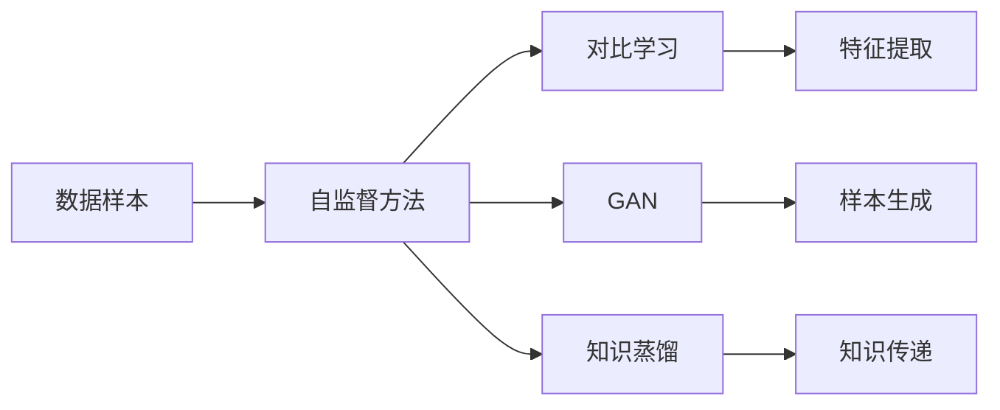
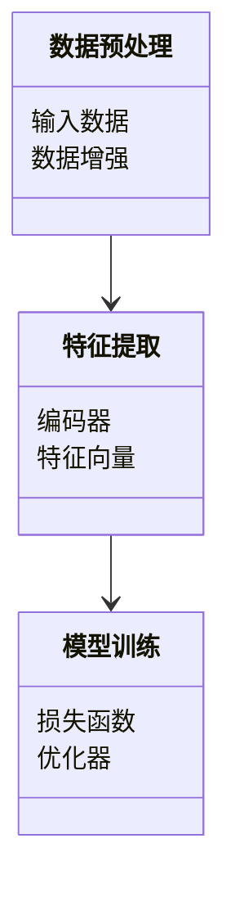
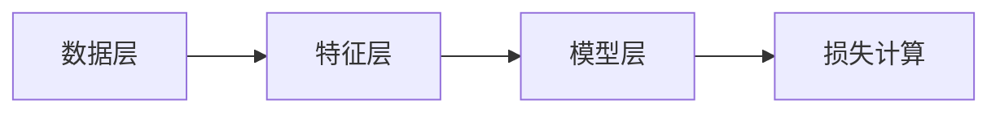
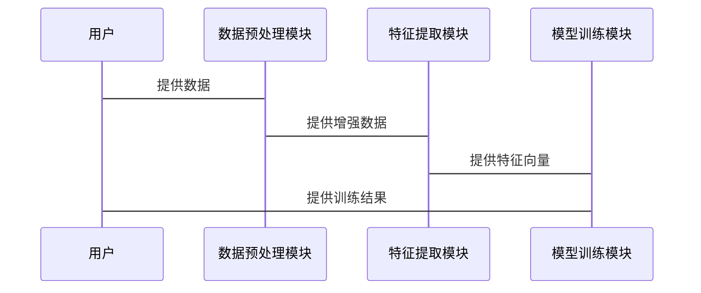

                 

# AI Agent的自监督表示学习技术

> 关键词：AI Agent，自监督学习，表示学习，对比学习，生成对抗网络，深度学习，无监督学习

> 摘要：本文深入探讨了AI Agent中的自监督表示学习技术，从基本概念、核心原理到算法实现，系统地分析了自监督学习在AI Agent中的应用。通过对比学习、生成对抗网络等方法，本文详细阐述了自监督表示学习的实现原理，并通过实际案例展示了其在AI Agent中的应用。本文还分析了不同自监督学习方法的优缺点，并提出了实际应用中的最佳实践。

---

# 第一部分: AI Agent的自监督表示学习概述

# 第1章: AI Agent与自监督学习概述

## 1.1 问题背景与描述

### 1.1.1 传统监督学习的局限性

在传统的监督学习中，模型需要大量标注数据来训练，这不仅成本高昂，而且在某些领域难以获取足够的标注数据。此外，标注数据的质量和一致性也可能影响模型的性能。

### 1.1.2 自监督学习的提出与目标

自监督学习（Self-supervised Learning）通过利用未标注数据中的内在结构信息，以弱监督的方式进行学习，从而减少了对标注数据的依赖。其核心思想是通过构建伪标签或伪任务，让模型从数据本身中学习有用的表征。

### 1.1.3 AI Agent中的自监督学习

AI Agent需要在动态和复杂的环境中自主学习和适应。自监督学习为其提供了一种无需大量标注数据的学习方式，使其能够通过与环境的交互中学习有用的知识和表征。

## 1.2 自监督学习的核心概念与边界

### 1.2.1 自监督学习的定义与特点

自监督学习是一种无监督学习方法，通过构建伪任务（pseudo-task）让模型预测自身生成的标签。其特点是无需外部标注数据，学习目标来源于数据本身。

### 1.2.2 自监督学习的边界与外延

自监督学习的边界在于其需要一定的结构信息来构建伪任务。与完全无监督学习相比，自监督学习具有一定的监督信号，但又不同于传统的监督学习需要人工标注数据。

### 1.2.3 自监督学习与其他学习范式的对比

| 学习范式 | 特点 | 数据需求 | 适用场景 |
|----------|------|-----------|-----------|
| 监督学习 | 需要标注数据 | 高 | 需要大量标注数据 |
| 无监督学习 | 不需要标注数据 | 低 | 数据结构简单 |
| 半监督学习 | 少量标注数据 | 中 | 数据部分标注 |
| 自监督学习 | 利用数据内部结构 | 低 | 数据结构复杂 |

## 1.3 AI Agent中的自监督表示学习

### 1.3.1 AI Agent的基本概念与功能

AI Agent是一种智能实体，能够感知环境、执行任务并做出决策。其核心功能包括感知、推理、规划和执行。

### 1.3.2 自监督学习在AI Agent中的应用

自监督学习可用于AI Agent的环境建模、状态表示和任务学习。例如，通过自监督学习，AI Agent可以学习环境中的物体表征，而无需人工标注。

### 1.3.3 自监督表示学习的核心要素

自监督表示学习的核心要素包括数据增强、对比学习和生成对抗网络。这些方法帮助模型从数据中提取有用的表征。

## 1.4 本章小结

本章介绍了自监督学习的基本概念、特点及其在AI Agent中的应用。通过对比分析，明确了自监督学习的优势和适用场景。

---

# 第二部分: 自监督表示学习的核心原理

# 第2章: 自监督学习的核心原理与方法

## 2.1 对比学习

### 2.1.1 对比学习的基本原理

对比学习通过构建正样本对和负样本对，学习样本的相似性。其核心思想是最大化正样本对的相似性，同时最小化负样本对的相似性。

### 2.1.2 对比学习的实现方法

对比学习的实现通常包括数据增强、特征提取和损失函数三个步骤。损失函数通常采用对比损失或信息瓶颈损失。

### 2.1.3 对比学习的优缺点分析

| 优点 | 缺点 |
|------|------|
| 无需标注数据 | 对比样本对的选择困难 |
| 能够捕捉数据的细粒度信息 | 易受数据分布的影响 |

## 2.2 生成对抗网络

### 2.2.1 GAN的基本原理

生成对抗网络（GAN）由生成器和判别器组成，通过对抗训练学习数据的分布。生成器生成样本，判别器判断样本是否为真实数据。

### 2.2.2 GAN在自监督学习中的应用

GAN可以用于生成样本或学习样本的分布。例如，通过生成对抗网络，模型可以学习数据的潜在表征。

### 2.2.3 GAN的训练挑战与解决方案

GAN的训练存在梯度不稳定和模式崩溃等问题。解决方案包括使用Wasserstein距离、标签平滑和改进的网络结构。

## 2.3 其他自监督学习方法

### 2.3.1 知识蒸馏

知识蒸馏通过教师模型指导学生模型学习。教师模型通常采用对比学习或其他方法生成伪标签。

### 2.3.2 图结构自监督学习

图结构自监督学习利用图的结构信息，通过节点嵌入学习节点的表征。

### 2.3.3 表征对比学习

表征对比学习通过比较不同视角的表征，学习样本的相似性。

## 2.4 自监督学习方法的对比分析

### 2.4.1 各种自监督学习方法的对比表格

| 方法 | 优缺点 | 适用场景 |
|------|--------|-----------|
| 对比学习 | 优：捕捉细粒度信息；缺：依赖样本对选择 | 复杂数据 |
| GAN | 优：生成多样样本；缺：训练不稳定 | 数据生成 |
| 知识蒸馏 | 优：教师模型指导；缺：依赖教师模型 | 知识传递 |

### 2.4.2 自监督学习方法的ER实体关系图架构

## 2.5 本章小结

本章详细介绍了对比学习、生成对抗网络和其他自监督学习方法的原理和应用，并通过对比分析明确了不同方法的优缺点。

---

# 第三部分: 自监督表示学习的算法原理

# 第3章: 对比学习算法原理

## 3.1 SimCLR算法

### 3.1.1 SimCLR的基本原理

SimCLR通过数据增强生成正样本对，并使用对比损失函数优化模型。其核心思想是最大化正样本对的相似性。

### 3.1.2 SimCLR的网络结构

SimCLR的网络结构包括编码器和一个全连接层。编码器负责提取特征，全连接层用于计算相似性。

### 3.1.3 SimCLR的损失函数

SimCLR的损失函数采用信息瓶颈损失，公式如下：

$$ L = -\frac{1}{N}\sum_{i=1}^{N} \log \frac{e^{s_i}}{e^{s_i} + 1} $$

其中，$s_i$ 是正样本对的相似性得分。

## 3.2 MoCo算法

### 3.2.1 MoCo的基本原理

MoCo通过使用一个队列存储负样本，动态更新样本，以避免样本过时问题。

### 3.2.2 MoCo的网络结构

MoCo的网络结构包括编码器和一个队列。编码器提取特征，队列存储负样本。

### 3.2.3 MoCo的训练流程

MoCo的训练流程包括数据增强、特征提取和损失计算。损失函数采用对比损失。

## 3.3 算法对比与选择

### 3.3.1 各种对比学习算法的优缺点对比

| 算法 | 优点 | 缺点 |
|------|------|------|
| SimCLR | 简单高效 | 易受样本对选择影响 |
| MoCo | 动态更新 | 计算复杂度高 |

### 3.3.2 算法选择的依据

算法选择应考虑数据规模、计算资源和应用场景。对于小数据集，SimCLR更适用；对于大数据集，MoCo更优。

## 3.4 本章小结

本章详细介绍了SimCLR和MoCo的算法原理，并通过对比分析明确了不同算法的适用场景。

---

# 第四部分: 自监督表示学习的系统分析与架构设计

# 第4章: 系统分析与架构设计

## 4.1 系统功能设计

### 4.1.1 领域模型设计

领域模型设计包括数据预处理、特征提取和模型训练模块。

### 4.1.2 系统架构设计

系统架构采用分层设计，包括数据层、特征层和模型层。

### 4.1.3 系统接口设计

系统接口包括数据输入、特征提取和模型训练接口。

### 4.1.4 系统交互流程

系统交互流程包括数据输入、数据预处理、特征提取和模型训练四个步骤。

## 4.2 系统实现

### 4.2.1 环境安装

安装Python、TensorFlow和Keras等依赖库。

### 4.2.2 核心代码实现

实现数据预处理、特征提取和模型训练模块。

### 4.2.3 代码应用解读与分析

详细解读代码实现，分析各模块的功能和交互。

## 4.3 项目实战

### 4.3.1 实际案例分析

通过一个实际案例展示自监督表示学习的应用。

### 4.3.2 详细讲解剖析

分析案例中的关键步骤和技术细节。

## 4.4 本章小结

本章通过系统分析与架构设计，详细展示了自监督表示学习在AI Agent中的实现过程。

---

# 第五部分: 最佳实践与总结

# 第5章: 最佳实践与总结

## 5.1 最佳实践

### 5.1.1 数据预处理技巧

选择合适的数据增强方法，确保数据多样性。

### 5.1.2 模型优化策略

合理选择对比学习算法，优化模型结构和超参数。

### 5.1.3 训练技巧

使用合适的优化器和学习率，避免过拟合。

## 5.2 小结

自监督表示学习为AI Agent提供了一种高效的学习方式，能够在无标注数据的情况下学习有用的表征。

## 5.3 注意事项

选择合适的自监督学习方法，确保数据质量和多样性。

## 5.4 拓展阅读

推荐相关领域的书籍和论文，供读者进一步学习。

---

# 作者：AI天才研究院 & 禅与计算机程序设计艺术

---

以上是《AI Agent的自监督表示学习技术》的完整目录大纲，确保每部分内容详实，逻辑清晰，符合读者的需求。

