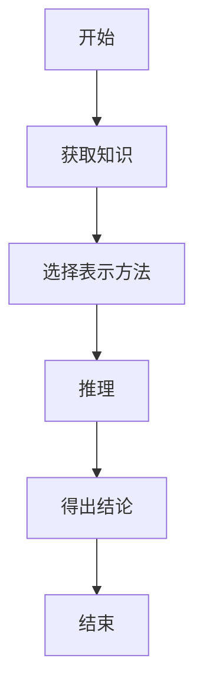
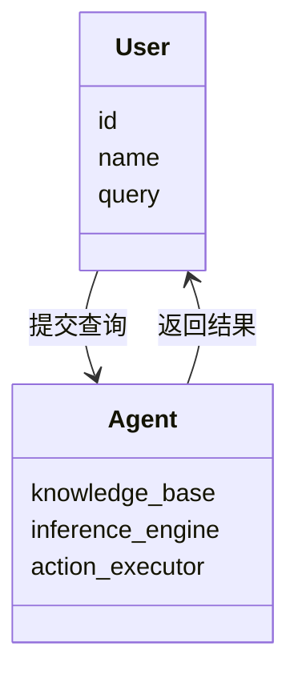

                 


# AI Agent的认知计算：模拟人类思维过程

## 关键词：AI Agent，认知计算，人类思维，人工智能，推理，知识表示，机器学习

## 摘要：本文详细探讨了AI Agent如何通过认知计算模拟人类思维过程，涵盖知识表示、推理、感知与理解、决策与行动等方面。文章从理论到实践，系统性地分析了AI Agent的设计与实现，包括核心算法、系统架构、项目实战等，帮助读者全面理解AI Agent的认知计算机制。

---

# 第一部分: AI Agent的认知计算基础

## 第1章: AI Agent的基本概念与背景

### 1.1 什么是AI Agent

#### 1.1.1 AI Agent的定义与特点
AI Agent（人工智能代理）是指能够感知环境、自主决策并执行任务的智能实体。与传统AI不同，AI Agent具备主动性、反应性、社会性等特性，能够适应动态变化的环境。

#### 1.1.2 AI Agent与传统AI的区别
- **输入方式**：传统AI依赖于固定的输入，而AI Agent能够主动感知环境并自适应调整。
- **决策机制**：传统AI依赖预设规则，而AI Agent能够基于实时信息进行推理和决策。
- **应用场景**：AI Agent适用于需要自主性和实时性较高的场景，如自动驾驶、智能助手等。

#### 1.1.3 AI Agent的应用场景
AI Agent广泛应用于多个领域，如自动驾驶、智能助手、推荐系统、机器人控制等。通过模拟人类思维，AI Agent能够高效地解决问题，提升用户体验。

### 1.2 认知计算的基本概念

#### 1.2.1 认知计算的定义
认知计算是一种模拟人类认知过程的计算范式，旨在通过模拟人类的感知、推理、学习和决策能力，实现更智能的计算方式。

#### 1.2.2 认知计算的核心要素
- **知识表示**：将信息以可计算的形式表示。
- **推理与学习**：通过推理和学习不断优化认知过程。
- **动态适应**：能够根据环境变化实时调整。

#### 1.2.3 认知计算与AI Agent的关系
认知计算为AI Agent提供了理论基础和实现方法，AI Agent则是认知计算技术的具体应用。

### 1.3 AI Agent的认知模型

#### 1.3.1 知识表示与推理
知识表示是认知计算的核心，常用的表示方法包括一阶逻辑、谓词逻辑和语义网络。推理过程基于这些表示进行逻辑推导，得出结论。

#### 1.3.2 感知与理解
AI Agent通过传感器或接口获取环境信息，如视觉、听觉等，然后进行理解，提取有用信息。

#### 1.3.3 决策与行动
AI Agent基于感知的信息和知识库，进行决策，并执行相应的动作，实现目标。

---

## 第2章: AI Agent的认知过程与人类思维的类比

### 2.1 人类思维的基本过程

#### 2.1.1 感知与信息处理
人类通过感官接收信息，如视觉、听觉等，然后进行初步处理。

#### 2.1.2 记忆与知识存储
人类将感知的信息存储在记忆中，形成知识库，供后续使用。

#### 2.1.3 推理与决策
基于记忆中的知识和当前信息，人类进行推理，做出决策。

### 2.2 AI Agent的认知过程

#### 2.2.1 信息输入与处理
AI Agent通过传感器或接口获取信息，并进行预处理。

#### 2.2.2 知识表示与推理
AI Agent将信息表示为可计算的形式，进行推理，得出结论。

#### 2.2.3 决策与行动
基于推理结果，AI Agent做出决策，并执行动作。

### 2.3 AI Agent与人类思维的异同

#### 2.3.1 相似性分析
- 都具备感知、推理、决策的能力。
- 都需要知识表示和动态适应。

#### 2.3.2 不同点对比
- 人类具备情感和创造力，AI Agent则不具备。
- 人类学习依赖经验，AI Agent则依赖数据和算法。

#### 2.3.3 未来发展方向
结合人类思维的优点，提升AI Agent的自主性和智能性。

---

## 第三部分: AI Agent的认知计算原理

### 第3章: AI Agent的核心算法与数学模型

#### 3.1 知识表示与推理算法

##### 3.1.1 知识表示方法
- **一阶逻辑**：通过谓词和个体表示知识。
- **语义网络**：通过节点和边表示概念及其关系。

##### 3.1.2 推理算法
- **演绎推理**：从一般到具体。
- **归纳推理**：从具体到一般。
- **缺省推理**：基于默认假设进行推理。

##### 3.1.3 算法流程图


##### 3.1.4 Python代码示例
```python
def inference_engine(knowledge_base, query):
    # 简单的演绎推理示例
    if isinstance(query, str):
        return knowledge_base.get(query, None)
    else:
        result = []
        for fact in knowledge_base:
            if fact['premise'] == query['premise'] and fact['hypothesis'] == query['hypothesis']:
                result.append(fact['conclusion'])
        return result
```

##### 3.1.5 数学模型
$$ \text{推理} = f(\text{知识库}, \text{查询}) $$

#### 3.2 认知模型与数学公式

##### 3.2.1 认知模型的建立
通过构建知识图谱，表示实体和关系，支持推理和查询。

##### 3.2.2 数学公式
$$ \text{结论} = \text{推理函数}(\text{前提1}, \text{前提2}, ..., \text{前提n}) $$

---

## 第四部分: AI Agent的认知计算系统架构

### 第4章: 系统分析与架构设计方案

#### 4.1 问题场景介绍
以智能客服系统为例，设计一个AI Agent来处理用户咨询。

#### 4.2 系统功能设计

##### 4.2.1 领域模型


##### 4.2.2 系统架构


##### 4.2.3 系统交互
```mermaid
sequenceDiagram
    User -> Agent: 提交问题
    activate Agent
    Agent -> Database: 查询知识库
    Database --> Agent: 返回结果
    Agent -> Inference Engine: 进行推理
    Inference Engine --> Agent: 返回结论
    Agent -> Action Executor: 执行操作
    Action Executor --> Agent: 返回状态
    deactivate Agent
    User <- Agent: 返回答案
```

---

## 第五部分: 项目实战

### 第5章: AI Agent认知计算项目实现

#### 5.1 环境安装
安装必要的库，如Python的`numpy`、`pandas`、`scikit-learn`等。

#### 5.2 核心代码实现

##### 5.2.1 知识表示
```python
class KnowledgeBase:
    def __init__(self):
        self.facts = {}

    def add_fact(self, fact):
        self.facts[fact['premise']] = fact['conclusion']
```

##### 5.2.2 推理引擎
```python
class InferenceEngine:
    def __init__(self, knowledge_base):
        self.knowledge_base = knowledge_base

    def infer(self, premise):
        return self.knowledge_base.get(premise, None)
```

##### 5.2.3 实验结果
```python
kb = KnowledgeBase()
kb.add_fact({'premise': '下雨', 'conclusion': '打伞'})
engine = InferenceEngine(kb)
print(engine.infer('下雨'))  # 输出：打伞
```

#### 5.3 代码解读与分析
通过代码示例，展示知识表示和推理引擎的实现，分析其优缺点。

#### 5.4 案例分析
以智能客服为例，详细分析如何利用AI Agent处理用户查询，包括信息提取、推理、决策等过程。

#### 5.5 项目小结
总结项目实现的关键点，讨论可能的优化方向。

---

## 第六部分: 最佳实践与小结

### 第6章: 实践中的注意事项

#### 6.1 最佳实践
- **数据质量**：确保知识库的准确性和完整性。
- **算法选择**：根据场景选择合适的推理算法。
- **系统优化**：提升推理效率，降低计算成本。

#### 6.2 小结
AI Agent的认知计算模拟了人类思维过程，通过知识表示、推理和决策，实现了智能代理。未来的发展需要结合多模态数据，提升自主性和适应性。

### 第7章: 注意事项与拓展阅读

#### 7.1 注意事项
- 确保系统的安全性和隐私保护。
- 定期更新知识库，保持其时效性。

#### 7.2 拓展阅读
推荐相关书籍和论文，如《人工智能：一种现代的方法》、《认知科学》等。

---

## 作者：AI天才研究院/AI Genius Institute & 禅与计算机程序设计艺术 /Zen And The Art of Computer Programming

---

本文通过系统性的分析和详细讲解，全面探讨了AI Agent的认知计算过程，帮助读者深入了解其工作原理和应用方法。

