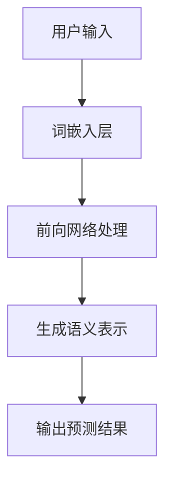

                 


# AI Agent的语义理解：提升LLM的深层文本分析

> 关键词：AI Agent，语义理解，LLM，文本分析，自然语言处理

> 摘要：本文深入探讨了AI Agent在提升大语言模型（LLM）深层文本分析中的作用。通过背景介绍、核心概念、算法原理、系统架构、项目实战和最佳实践等多个维度，系统地分析了AI Agent如何通过语义理解技术，优化LLM的文本处理能力，从而实现更高效、更准确的自然语言处理。

---

## 第一部分: AI Agent的语义理解基础

### 第1章: AI Agent的背景与概念

#### 1.1 AI Agent的基本概念
- **1.1.1 什么是AI Agent**
  AI Agent（智能体）是指能够感知环境、自主决策并执行任务的智能系统。它可以是一个软件程序、机器人或其他智能设备，通过与环境交互来实现特定目标。

- **1.1.2 AI Agent的核心特征**
  - 感知能力：通过传感器或数据输入感知环境。
  - 决策能力：基于感知信息做出决策。
  - 执行能力：通过动作或输出影响环境。
  - 学习能力：通过经验或数据优化自身的行为。

- **1.1.3 AI Agent的分类与应用场景**
  - 分类：基于智能水平可分为简单反射型、基于模型的反应型、目标驱动型和实用驱动型。
  - 应用场景：智能家居、自动驾驶、智能客服、机器人助手等。

#### 1.2 语义理解的重要性
- **1.2.1 语义理解的基本概念**
  语义理解（Semantic Understanding）是自然语言处理（NLP）中的核心技术，旨在让计算机能够理解人类语言的含义，而不仅仅是表面的文字。

- **1.2.2 语义理解的关键技术**
  - 词义消歧：解决词语在不同上下文中的不同含义。
  - 句法分析：分析句子的结构和语法关系。
  - 实体识别：识别文本中的实体（如人名、地名、组织名等）。
  - 情感分析：判断文本的情感倾向。

- **1.2.3 语义理解在AI Agent中的作用**
  - 通过语义理解，AI Agent能够更准确地理解用户意图，从而提供更智能的服务。
  - 语义理解帮助AI Agent在复杂场景下做出更合理的决策。

#### 1.3 AI Agent与LLM的关系
- **1.3.1 LLM的基本概念**
  大语言模型（Large Language Model，LLM）是一类基于深度学习的自然语言处理模型，如GPT、BERT等。这些模型通过大量数据训练，能够生成人类水平的文本，并在多种NLP任务中表现出色。

- **1.3.2 AI Agent如何利用LLM进行语义理解**
  - AI Agent通过调用LLM API，将用户输入的文本传递给模型，获取语义分析结果。
  - LLM负责生成文本的语义表示，AI Agent利用这些表示进行后续处理或生成响应。

- **1.3.3 LLM在AI Agent中的应用现状**
  - 当前，LLM已广泛应用于AI Agent的对话系统、文本生成和意图识别等任务。
  - 随着模型的不断优化，AI Agent与LLM的结合将更加紧密，语义理解能力也将进一步提升。

---

### 第2章: AI Agent语义理解的核心概念

#### 2.1 核心概念原理
- **2.1.1 语义理解的原理**
  语义理解依赖于对上下文的理解和对语义关系的分析。AI Agent通过结合上下文信息和领域知识，生成更准确的语义表示。

- **2.1.2 AI Agent如何处理语义信息**
  - 接收用户输入，提取关键词和句法结构。
  - 调用LLM进行语义分析，获取意图和实体信息。
  - 根据语义结果生成响应或执行相应操作。

- **2.1.3 LLM在语义理解中的角色**
  LLM通过预训练的参数，生成语义丰富的表示，帮助AI Agent理解输入文本的深层含义。

#### 2.2 核心概念对比表
| 概念          | 描述                                                                 |
|---------------|----------------------------------------------------------------------|
| AI Agent      | 能够感知环境、决策并执行任务的智能系统                             |
| 语义理解      | 理解人类语言的含义，而不仅仅是表面的文字                           |
| LLM           | 基于深度学习的大语言模型，用于生成和分析人类语言                   |
| 语义表示      | 用向量或符号表示文本的语义信息，用于后续处理                       |

#### 2.3 ER实体关系图
```mermaid
er
  actor: 用户
  agent: AI Agent
  llm: 大语言模型
  action: 用户输入
  semantic_info: 语义信息
  relationship1: 用户 -> 提供输入 -> AI Agent
  relationship2: AI Agent -> 调用LLM -> 生成语义信息
  relationship3: LLM -> 提供语义信息 -> AI Agent
  relationship4: AI Agent -> 根据语义信息 -> 执行操作
```

---

## 第三部分: 算法原理与数学模型

### 第3章: 算法原理详解

#### 3.1 LLM的训练过程
- **前向传播**
  - 输入文本通过词嵌入层，生成词向量表示。
  - 词向量经过多层神经网络处理，生成上下文表示。
  - 最后一层输出为词预测概率分布。

- **反向传播**
  - 使用交叉熵损失函数计算预测结果与真实结果的误差。
  - 通过梯度下降优化模型参数。

#### 3.2 语义理解的算法流程


#### 3.3 LLM的损失函数
损失函数用于衡量模型预测与真实值的差异：
$$ \text{损失} = -\sum_{i=1}^{n} y_i \log(p(y_i)) $$
其中，$y_i$ 是真实标签的概率，$p(y_i)$ 是模型预测的概率。

#### 3.4 注意力机制
注意力机制用于捕捉文本中的关键信息：
$$ \text{注意力权重} = \frac{\exp(\text{相似度})}{\sum \exp(\text{相似度})} $$

---

### 第4章: 数学模型与公式

#### 4.1 概率模型
LLM基于概率模型生成文本：
$$ P(y|x) = \prod_{i=1}^{n} P(y_i|y_{<i},x) $$

#### 4.2 损失函数
交叉熵损失用于训练模型：
$$ \text{损失} = -\sum_{i=1}^{n} y_i \log(p(y_i)) $$

#### 4.3 注意力机制公式
注意力机制的具体实现：
$$ \text{查询} = q = W_q h_i $$
$$ \text{键} = k = W_k h_j $$
$$ \text{值} = v = W_v h_j $$
$$ \text{注意力} = \frac{q k^T}{\sqrt{d}} $$
$$ \text{权重} = \text{Softmax}(\text{注意力}) $$
$$ \text{输出} = \text{权重} \cdot v $$

---

## 第五部分: 系统分析与架构设计

### 第5章: 系统架构设计

#### 5.1 问题场景介绍
以智能客服系统为例，AI Agent需要通过语义理解分析用户的问题，提供准确的解决方案。

#### 5.2 系统功能设计
- **领域模型**
  ```mermaid
  classDiagram
      class 用户 {
          提交问题
      }
      class AI Agent {
          接收问题
          分析语义
          生成响应
      }
      class LLM {
          提供语义分析结果
      }
      用户 --> AI Agent: 提交问题
      AI Agent --> LLM: 分析语义
      AI Agent --> 用户: 生成响应
  ```

- **系统架构设计**
  ```mermaid
  architecture
      client: 用户端
      agent: AI Agent
      llm: LLM服务
      db: 知识库
      user: 用户
      client --> agent: 提交问题
      agent --> llm: 分析语义
      llm --> agent: 提供结果
      agent --> db: 查询知识库
      agent --> user: 生成响应
  ```

---

### 第6章: 项目实战

#### 6.1 环境安装
- 安装Python和相关库（如TensorFlow、PyTorch）。
- 安装LLM框架（如Hugging Face的Transformers库）。

#### 6.2 核心代码实现
```python
from transformers import pipeline

# 初始化AI Agent
class AIAssistant:
    def __init__(self):
        self.nlp = pipeline("text-generation", model="gpt2")

    def process_query(self, query):
        # 分析语义
        response = self.nlp(query)
        # 生成响应
        return response[0]['generated_text']

# 使用示例
agent = AIAssistant()
print(agent.process_query("如何提高学习效率？"))
```

#### 6.3 代码解读与分析
- 使用Hugging Face的Transformers库，调用GPT-2模型进行语义分析和生成。
- `process_query`方法接收用户输入，调用LLM生成响应。

#### 6.4 实际案例分析
- 用户输入：“我的订单在哪里？”
- AI Agent分析语义，调用LLM生成响应：“您可以在订单历史中查看您的订单详情。”

---

## 第六部分: 最佳实践与小结

### 第7章: 最佳实践

#### 7.1 实践建议
- **数据质量**：确保训练数据的多样性和代表性。
- **模型调优**：通过微调和参数优化提升模型性能。
- **领域适配**：针对特定领域优化模型，提升语义理解的准确性。

#### 7.2 小结
本文详细探讨了AI Agent在提升LLM语义理解能力中的作用，从背景、概念到算法、系统架构和项目实战，全面解析了AI Agent如何优化文本分析能力。

---

### 第8章: 注意事项与拓展阅读

#### 8.1 注意事项
- **数据隐私**：处理用户数据时需注意隐私保护。
- **模型性能**：优化模型性能以应对复杂的语义理解任务。
- **用户体验**：设计良好的用户交互界面，提升用户体验。

#### 8.2 拓展阅读
- 建议阅读相关领域的最新论文和技术博客，关注AI Agent和LLM的发展趋势。

---

## 作者：AI天才研究院 & 禅与计算机程序设计艺术

---

通过以上内容，读者可以全面理解AI Agent在语义理解中的应用，掌握提升LLM深层文本分析的具体方法，并能够在实际项目中应用这些知识。

