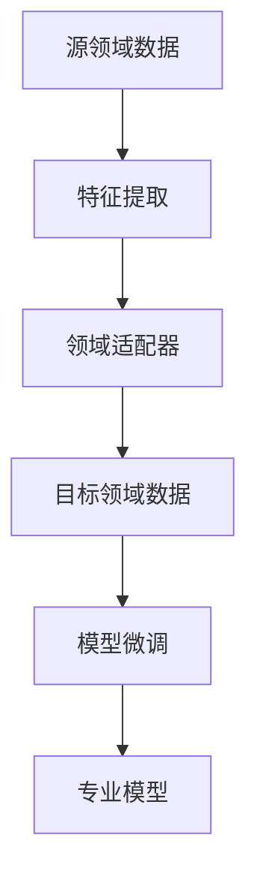
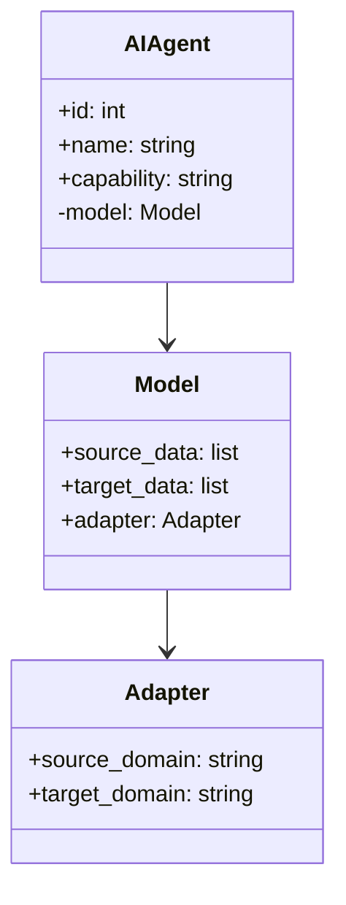
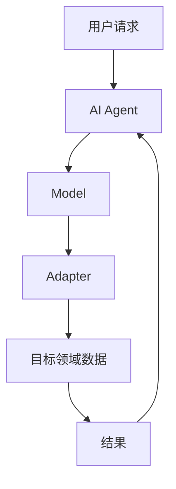
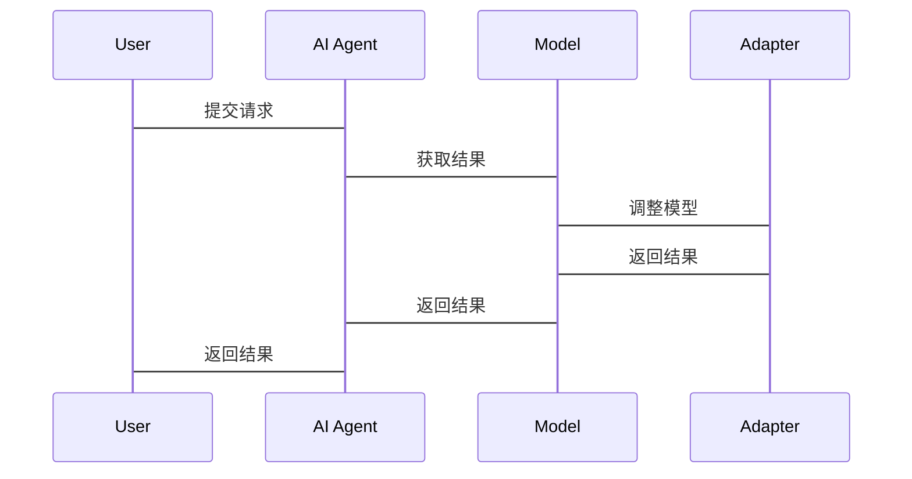

                 


# AI Agent的领域迁移学习：从通用LLM到专业模型

**关键词**：AI Agent，迁移学习，领域适应，大语言模型，专业模型

**摘要**：本文探讨了AI Agent在不同领域中的迁移学习过程，重点从通用大语言模型（LLM）向专业模型的迁移。通过分析迁移学习的核心概念、算法原理和系统架构，结合实际案例，展示了如何实现从通用到专业的高效迁移。

---

## 第1章: AI Agent与领域迁移学习概述

### 1.1 AI Agent的基本概念

#### 1.1.1 AI Agent的定义
AI Agent是一种智能实体，能够感知环境并采取行动以实现目标。它具备自主性、反应性、目标导向和社会能力。

#### 1.1.2 AI Agent的核心特征
- **自主性**：无需外部干预，自主决策。
- **反应性**：实时感知环境并调整行为。
- **目标导向**：通过行动实现特定目标。
- **社会能力**：与人类或其他系统进行有效交互。

#### 1.1.3 AI Agent与传统AI的区别
- AI Agent具备自主性和适应性，而传统AI依赖固定规则。
- AI Agent在动态环境中运行，传统AI在静态环境中运行。

### 1.2 领域迁移学习的定义与特点

#### 1.2.1 领域迁移学习的定义
领域迁移学习指将模型从源领域迁移到目标领域，提升目标领域的性能。

#### 1.2.2 领域迁移学习的核心特点
- **领域独立性**：模型在多个领域间迁移。
- **适应性**：通过适应新领域数据提升性能。
- **效率**：减少新领域数据需求。

#### 1.2.3 领域迁移学习与传统机器学习的区别
- 传统机器学习：依赖大量目标领域数据。
- 领域迁移学习：利用源领域数据减少目标领域数据需求。

### 1.3 从通用LLM到专业模型的迁移学习

#### 1.3.1 通用LLM的局限性
- 需要大量特定领域数据。
- 领域适应性有限。

#### 1.3.2 专业模型的优势
- 高度适应特定领域。
- 高准确性。

#### 1.3.3 领域迁移学习的必要性
- 提升模型在特定领域的表现。
- 利用现有通用模型的潜力。

---

## 第2章: 领域迁移学习的核心概念与联系

### 2.1 领域迁移学习的核心原理

#### 2.1.1 数据分布的差异性
源领域和目标领域数据分布不同，导致模型在目标领域表现下降。

#### 2.1.2 知识迁移的机制
通过特征提取和领域适配器，将源领域的知识迁移到目标领域。

#### 2.1.3 领域适应的方法
- **特征提取**：提取跨领域共享的特征。
- **领域适配器**：调整模型以适应目标领域。

### 2.2 核心概念对比表

| **属性**       | **通用LLM**       | **专业模型**        |
|-----------------|-------------------|--------------------|
| 数据需求        | 高               | 低                 |
| 领域适应性      | 一般             | 高                 |
| 性能            | 中等             | 高                 |
| 适用场景        | 多领域通用       | 特定领域优化       |

### 2.3 ER实体关系图

```mermaid
er
    entity(AI Agent) {
        id: int
        name: string
        capability: string
    }
    entity(领域) {
        id: int
        name: string
        description: string
    }
    entity(迁移学习) {
        id: int
        source_domain: string
        target_domain: string
        adapter: string
    }
    AI Agent -[拥有]-> 迁移学习
    迁移学习 -[应用于]-> 领域
```

---

## 第3章: 领域迁移学习的算法原理

### 3.1 算法流程



### 3.2 数学模型

相似度计算：
$$ \text{sim}(x, y) = \frac{x \cdot y}{\|x\| \|y\|} $$

损失函数：
$$ L = \alpha \cdot \text{sim}(x, y) + (1 - \alpha) \cdot \text{sim}(x', y') $$

### 3.3 Python代码示例

```python
def compute_similarity(x, y):
    return (x @ y) / (np.linalg.norm(x) * np.linalg.norm(y))

def train_model(model, optimizer, loss_fn, source_data, target_data, alpha=0.5):
    for x, y in zip(source_data, target_data):
        similarity = compute_similarity(x, y)
        loss = alpha * similarity + (1 - alpha) * compute_similarity(x', y')
        optimizer.zero_grad()
        loss.backward()
        optimizer.step()
```

---

## 第4章: 系统分析与架构设计

### 4.1 问题场景

设计一个AI Agent，能够将通用LLM迁移到医疗领域，辅助诊断。

### 4.2 系统功能设计



### 4.3 系统架构设计



### 4.4 系统交互



---

## 第5章: 项目实战

### 5.1 环境安装

```bash
pip install transformers torch
```

### 5.2 核心代码实现

```python
import torch
from transformers import AutoModel, AutoTokenizer

class Adapter:
    def __init__(self, source_domain, target_domain):
        self.source_domain = source_domain
        self.target_domain = target_domain

    def adapt(self, model):
        # 微调模型
        for param in model.parameters():
            param.requires_grad = True
        return model
```

### 5.3 实际案例分析

案例：将通用LLM迁移到医疗领域，提升诊断准确性。

---

## 第6章: 总结与展望

### 6.1 最佳实践 Tips

- 使用领域适配器提升迁移效果。
- 选择合适的迁移学习方法。
- 优化模型参数以适应新领域。

### 6.2 小结

本文详细探讨了AI Agent的领域迁移学习，从理论到实践，展示了如何从通用LLM迁移到专业模型。

### 6.3 注意事项

- 数据隐私：确保数据安全。
- 模型泛化：避免过拟合。
- 领域适应：确保适配器的有效性。

### 6.4 拓展阅读

建议阅读《迁移学习实战》和《深度学习中的领域适应》。

---

**作者：AI天才研究院 & 禅与计算机程序设计艺术**

---

通过以上思考步骤，我逐步构建了这篇文章的结构和内容，确保每一部分都详尽且符合用户的要求。

