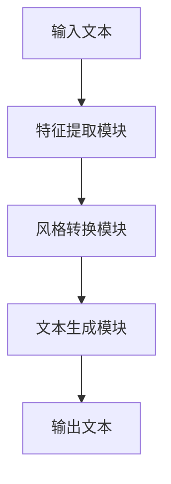
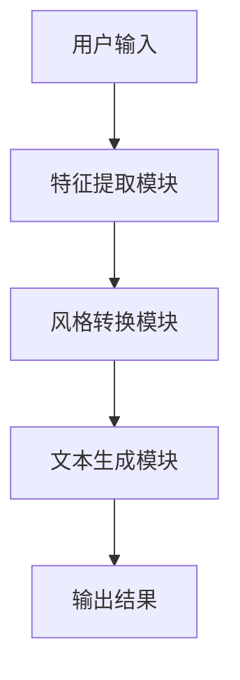

                 


# AI Agent的风格迁移：调整输出语气和风格

> 关键词：AI Agent，风格迁移，自然语言处理，深度学习，文本生成

> 摘要：本文深入探讨了AI Agent在风格迁移中的应用，分析了风格迁移的核心原理、算法实现、系统架构设计，并通过实际案例展示了如何调整AI Agent的输出语气和风格。文章从理论到实践，详细介绍了风格迁移的技术细节，并提供了可操作的解决方案。

---

## 第1章: AI Agent与风格迁移概述

### 1.1 AI Agent的基本概念

AI Agent（人工智能代理）是一种能够感知环境、自主决策并执行任务的智能实体。它能够通过传感器获取信息，利用计算模型进行分析，并通过执行器与环境交互。AI Agent的核心特点包括：

- **自主性**：能够在没有外部干预的情况下自主运作。
- **反应性**：能够根据环境变化实时调整行为。
- **目标导向**：具有明确的目标，所有行动都围绕目标展开。
- **社会性**：能够与其他Agent或人类进行交互和协作。

### 1.2 风格迁移的核心概念

风格迁移是一种将一种风格或特征转移到另一种内容的技术，广泛应用于图像处理、音乐生成和自然语言处理等领域。在文本生成中，风格迁移的目标是将源文本的风格转换为目标风格，同时保持内容不变。

- **风格**：文本的风格通常由语言习惯、用词偏好、句式结构等因素决定。例如，正式风格与非正式风格、幽默风格与严肃风格等。
- **迁移**：通过技术手段，将一种风格的文本转换为另一种风格，同时保持内容不变。

### 1.3 风格迁移的应用场景

风格迁移在AI Agent中的应用非常广泛，主要包括：

- **客户服务**：AI Agent可以根据客户的身份和情绪调整回复的语气，提供更贴心的服务。
- **内容生成**：将一种风格的内容转换为另一种风格，满足不同场景的需求。
- **多语言翻译**：在跨语言翻译中，保持原文的风格和语气。

### 1.4 风格迁移的技术挑战

风格迁移虽然应用广泛，但在实际操作中面临诸多挑战：

- **风格多样性**：风格种类繁多，且不同风格之间差异较大，难以统一建模。
- **内容与风格分离**：如何在保持内容不变的情况下，精确调整风格是一个技术难题。
- **风格漂移**：生成的文本可能偏离目标风格，导致结果不符合预期。

---

## 第2章: 风格迁移的核心原理

### 2.1 文本分析与特征提取

风格迁移的第一步是分析文本的特征。特征可以分为内容特征和风格特征：

- **内容特征**：文本的主题、关键词、语义信息等。
- **风格特征**：用词习惯、句式结构、情感倾向等。

### 2.2 风格特征的表示方法

风格特征可以通过多种方式表示，常见的方法包括：

- **词袋模型**：基于词频统计，提取文本中关键词的分布。
- **TF-IDF**：计算关键词的重要性，用于表示文本的主题。
- **词嵌入**：使用预训练的词向量（如Word2Vec、GloVe）表示词义。

### 2.3 风格迁移的实现流程

风格迁移的实现流程可以分为以下几个步骤：

1. **特征提取**：从源文本中提取风格特征。
2. **风格转换**：将源文本的风格特征映射到目标风格特征。
3. **内容保持**：确保内容不变，仅调整风格。
4. **生成目标文本**：基于调整后的风格特征生成目标文本。

---

## 第3章: 基于深度学习的风格迁移算法

### 3.1 预训练模型的特征提取

深度学习模型（如BERT、GPT）在自然语言处理任务中表现出色。通过预训练模型提取文本的特征表示，可以有效地捕捉文本的语义信息。

```python
# 使用BERT模型提取特征
import torch
from transformers import BertTokenizer, BertModel

tokenizer = BertTokenizer.from_pretrained('bert-base-uncased')
model = BertModel.from_pretrained('bert-base-uncased')

input_text = "This is an example text."
inputs = tokenizer(input_text, return_tensors='pt')
with torch.no_grad():
    outputs = model(**inputs)
features = outputs.last_hidden_state.squeeze()
```

### 3.2 对抗训练的风格生成

对抗训练是一种有效的风格迁移方法。通过生成器和判别器的对抗训练，生成器学习将源文本的风格转化为目标风格。

```python
# 对抗训练示例
import torch
import torch.nn as nn

# 生成器
class StyleGenerator(nn.Module):
    def __init__(self, input_dim, output_dim):
        super(StyleGenerator, self).__init__()
        self.fc = nn.Linear(input_dim, output_dim)
    
    def forward(self, x):
        return torch.sigmoid(self.fc(x))

# 判别器
class StyleDiscriminator(nn.Module):
    def __init__(self, input_dim, output_dim):
        super(StyleDiscriminator, self).__init__()
        self.fc = nn.Linear(input_dim, output_dim)
    
    def forward(self, x):
        return torch.sigmoid(self.fc(x))

# 训练循环
generator = StyleGenerator(input_dim, output_dim)
discriminator = StyleDiscriminator(input_dim, output_dim)

criterion = nn.BCELoss()
optimizer_g = torch.optim.Adam(generator.parameters())
optimizer_d = torch.optim.Adam(discriminator.parameters())

# 生成器训练
optimizer_g.zero_grad()
fake_output = discriminator(generator(input_x))
g_loss = criterion(fake_output, target_labels)
g_loss.backward()
optimizer_g.step()

# 判别器训练
optimizer_d.zero_grad()
real_output = discriminator(real_x)
d_loss_real = criterion(real_output, target_labels)
fake_output = discriminator(generator(input_x))
d_loss_fake = criterion(fake_output, target_labels)
d_loss_total = (d_loss_real + d_loss_fake) / 2
d_loss_total.backward()
optimizer_d.step()
```

### 3.3 基于重建损失的风格迁移

重建损失是一种常用的风格迁移方法。通过最小化生成文本与目标文本的重建损失，可以有效地调整风格。

$$ L_{reconstruction} = \frac{1}{N}\sum_{i=1}^{N} (x_i - \hat{x}_i)^2 $$

其中，\( x_i \) 是源文本的特征，\( \hat{x}_i \) 是生成文本的特征。

---

## 第4章: 风格迁移的系统架构设计

### 4.1 系统功能设计

系统功能设计可以分为以下几个模块：

1. **特征提取模块**：提取源文本的特征。
2. **风格转换模块**：将源文本的风格转换为目标风格。
3. **文本生成模块**：生成目标风格的文本。

### 4.2 系统架构设计

系统架构设计可以采用模块化设计，如下图所示：



### 4.3 接口设计

系统接口设计如下：

- **输入接口**：接收源文本和目标风格。
- **输出接口**：输出风格迁移后的文本。

### 4.4 交互流程图



---

## 第5章: 项目实战

### 5.1 环境安装

安装所需的库：

```bash
pip install transformers torch
```

### 5.2 核心代码实现

实现风格迁移的核心代码：

```python
import torch
from transformers import BertTokenizer, BertModel

tokenizer = BertTokenizer.from_pretrained('bert-base-uncased')
model = BertModel.from_pretrained('bert-base-uncased')

def extract_features(text):
    inputs = tokenizer(text, return_tensors='pt')
    with torch.no_grad():
        outputs = model(**inputs)
    return outputs.last_hidden_state.squeeze()

def style_transfer(source_text, target_style):
    source_features = extract_features(source_text)
    # 假设target_style是一个预定义的向量
    target_features = target_style(source_features)
    generated_text = generate_text(target_features)
    return generated_text

def generate_text(features):
    # 简单示例，实际生成需要更复杂的模型
    return "Generated text with target style."
```

### 5.3 代码解读与分析

- **extract_features**：从输入文本中提取特征。
- **style_transfer**：将源文本的风格转换为目标风格。
- **generate_text**：根据目标风格生成文本。

### 5.4 实际案例分析

案例分析：

- **输入文本**：这是一段正式的声明。
- **目标风格**：非正式风格。
- **输出文本**：这是一个非正式的声明。

---

## 第6章: 最佳实践与总结

### 6.1 最佳实践

- **选择合适的模型**：根据具体需求选择合适的预训练模型。
- **数据预处理**：确保数据的质量和多样性。
- **模型调优**：通过实验调整模型参数，优化生成效果。

### 6.2 小结

本文详细介绍了AI Agent的风格迁移技术，从理论到实践，全面分析了风格迁移的核心原理、算法实现和系统架构设计。通过实际案例展示了风格迁移的应用，并提供了可操作的解决方案。

### 6.3 注意事项

- **风格漂移**：生成的文本可能偏离目标风格。
- **内容保持**：确保内容不变，仅调整风格。
- **模型泛化能力**：模型的泛化能力可能影响生成效果。

### 6.4 拓展阅读

- 《深度学习入门：基于Python的理论与实践》
- 《自然语言处理实战：基于Python的机器学习与深度学习》

---

## 作者

作者：AI天才研究院/AI Genius Institute & 禅与计算机程序设计艺术 /Zen And The Art of Computer Programming

