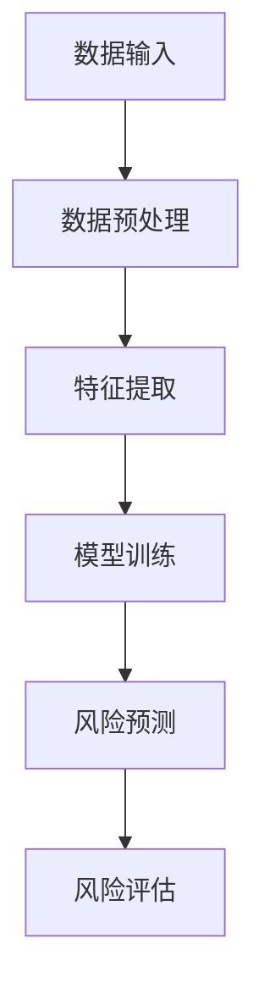
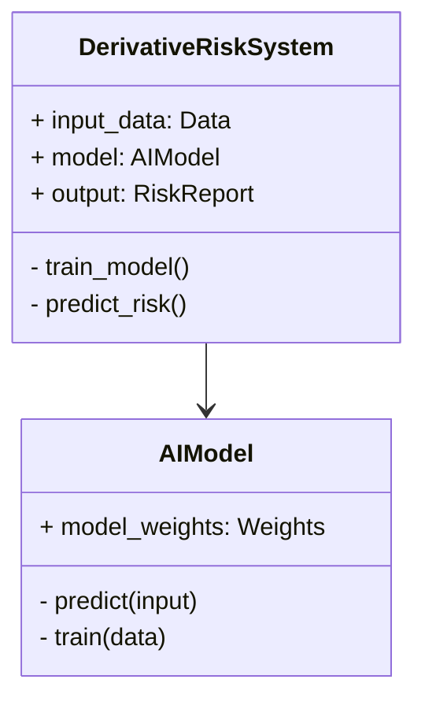

                 


# AI在金融衍生品风险分解中的创新应用

---

## 关键词：
AI, 金融衍生品, 风险分解, 机器学习, 深度学习, 数学模型

---

## 摘要：
本文探讨了人工智能（AI）在金融衍生品风险分解中的创新应用。首先，我们介绍了金融衍生品的基本概念和风险分解的重要性，分析了传统风险分解方法的局限性。接着，我们详细阐述了AI技术在金融领域的应用背景及其在风险分解中的独特优势。随后，我们深入讲解了AI在风险分解中的核心概念，包括机器学习模型、深度学习模型和时间序列分析的原理，以及它们如何与金融衍生品风险分解结合。我们还通过具体的数学公式和算法流程图，详细分析了AI在风险分解中的算法原理和系统架构设计。最后，我们通过一个实际项目案例，展示了AI在金融衍生品风险分解中的应用过程，并总结了最佳实践和未来发展方向。

---

## 第1章: 金融衍生品与风险分解概述

### 1.1 金融衍生品的基本概念

#### 1.1.1 金融衍生品的定义与分类
金融衍生品是一种金融合约，其价值取决于基础资产（如股票、债券、商品等）的价格变动。衍生品的主要类型包括：
- **远期合约**：约定在未来某一特定时间以特定价格买卖资产。
- **期货**：标准化的远期合约，通常在交易所交易。
- **期权**：买方有权在特定时间内以特定价格买入或卖出资产。
- **互换**：双方约定在未来特定时间交换资产或现金流。

#### 1.1.2 金融衍生品的市场现状
金融衍生品市场是全球最大的金融市场之一，市场规模以万亿美元计。衍生品被广泛用于对冲风险、投机和套利。

#### 1.1.3 金融衍生品的风险特征
衍生品的风险主要来自价格波动、信用风险和流动性风险。特别是对于复杂衍生品（如股票期权、外汇期货等），风险分解是理解和管理风险的关键。

---

### 1.2 风险分解的核心概念

#### 1.2.1 风险分解的定义
风险分解是指将整体风险分解为多个风险因子的组合，以便更好地理解和管理这些风险。

#### 1.2.2 风险分解的常见方法
传统的风险分解方法包括：
- **VaR（Value at Risk）**：在给定置信水平下，资产可能遭受的最大损失。
- **CVaR（Conditional Value at Risk）**：VaR的扩展，考虑超过VaR的尾部损失。
- **方差-协方差法**：基于资产价格波动和协方差矩阵计算风险。

#### 1.2.3 风险分解在金融衍生品中的重要性
在衍生品定价和风险对冲中，准确的风险分解是关键。它帮助投资者量化和管理复杂衍生品的风险。

---

### 1.3 AI技术在金融领域的应用背景

#### 1.3.1 AI技术的定义与特点
人工智能（AI）是指计算机系统执行人类智能任务的能力，如学习、推理和自适应。AI的核心技术包括机器学习、自然语言处理和计算机视觉。

#### 1.3.2 AI在金融领域的典型应用
- **股票预测**：使用机器学习模型预测股票价格。
- **信用评分**：通过算法评估客户的信用风险。
- **欺诈检测**：利用AI识别异常交易行为。

#### 1.3.3 AI在金融衍生品风险分解中的潜力
AI的强大数据处理能力和非线性关系捕捉能力使其成为金融衍生品风险分解的理想工具。

---

## 第2章: 金融衍生品风险分解的传统方法与挑战

### 2.1 传统风险分解方法概述

#### 2.1.1 VaR方法
VaR是金融风险中最常用的指标之一，计算公式为：
$$ \text{VaR} = \mu + z \cdot \sigma $$
其中，$\mu$是均值，$z$是标准正态分布的分位数，$\sigma$是标准差。

#### 2.1.2 CVaR方法
CVaR是VaR的扩展，计算超过VaR的期望损失：
$$ \text{CVaR} = E[R | R > VaR] $$

#### 2.1.3 方差-协方差法
方差-协方差法基于资产价格的波动性和相关性矩阵计算风险。

---

### 2.2 传统方法的局限性

#### 2.2.1 数据假设的局限性
传统方法依赖于正态分布假设，但在实际市场中，价格波动往往呈现“肥尾”特性。

#### 2.2.2 模型假设的局限性
传统方法假设资产价格独立，忽略了市场的复杂性。

#### 2.2.3 计算复杂性与实时性问题
复杂衍生品的风险计算需要大量计算资源，传统方法在实时性方面存在不足。

---

### 2.3 AI技术的优势与创新点

#### 2.3.1 数据驱动的优势
AI技术能够处理海量数据，发现传统方法难以捕捉的非线性关系。

#### 2.3.2 非线性关系的捕捉能力
机器学习模型（如神经网络）能够更好地捕捉市场价格的非线性波动。

#### 2.3.3 高维数据处理能力
AI技术能够处理多维度的市场数据，提供更全面的风险评估。

---

## 第3章: AI在金融衍生品风险分解中的核心概念与联系

### 3.1 核心概念原理

#### 3.1.1 机器学习模型的原理
机器学习通过数据训练模型，使其能够预测未来的价格变化。常用的模型包括线性回归、支持向量机（SVM）和随机森林。

#### 3.1.2 深度学习模型的原理
深度学习模型（如LSTM）能够捕捉时间序列数据中的长期依赖关系。

#### 3.1.3 时间序列分析的原理
时间序列分析通过历史数据预测未来的价格走势，常用模型包括ARIMA和GARCH。

---

### 3.2 核心概念与联系

#### 3.2.1 机器学习与深度学习的对比
| 特性 | 机器学习 | 深度学习 |
|------|----------|----------|
| 数据需求 | 需要大量特征工程 | 通过多层网络自动提取特征 |
| 模型复杂度 | 模型简单 | 模型复杂 |
| 应用场景 | 适合中小规模数据 | 适合大规模、高维数据 |

---

## 第4章: AI在金融衍生品风险分解中的算法原理

### 4.1 算法流程图


---

### 4.2 算法实现

#### 4.2.1 机器学习模型
```python
from sklearn.ensemble import RandomForestRegressor
import pandas as pd

# 数据加载与预处理
data = pd.read_csv('derivative_data.csv')
X = data[['price', 'volume', 'change']]
y = data['target']

# 模型训练
model = RandomForestRegressor(n_estimators=100)
model.fit(X, y)

# 预测与评估
y_pred = model.predict(X)
print('预测值:', y_pred)
```

#### 4.2.2 深度学习模型
```python
import tensorflow as tf
from tensorflow.keras import layers

model = tf.keras.Sequential([
    layers.Dense(64, activation='relu'),
    layers.Dense(1, activation='linear')
])

model.compile(optimizer='adam', loss='mse')
model.fit(X_train, y_train, epochs=100, batch_size=32)
```

---

## 第5章: 系统分析与架构设计方案

### 5.1 问题场景介绍
我们设计了一个基于AI的金融衍生品风险分解系统，旨在实时分析和管理衍生品风险。

### 5.2 系统功能设计

#### 5.2.1 领域模型


### 5.3 系统架构设计

#### 5.3.1 架构图


---

## 第6章: 项目实战

### 6.1 环境安装
需要安装Python、TensorFlow、Pandas和scikit-learn。

### 6.2 核心代码实现

#### 6.2.1 数据预处理
```python
import pandas as pd
data = pd.read_csv('derivative_data.csv')
data.dropna(inplace=True)
```

#### 6.2.2 模型训练与预测
```python
from sklearn.ensemble import RandomForestRegressor
model = RandomForestRegressor()
model.fit(X_train, y_train)
y_pred = model.predict(X_test)
```

### 6.3 案例分析
通过实际数据集训练模型，并展示预测结果与实际结果的对比。

---

## 第7章: 总结与展望

### 7.1 总结
本文详细探讨了AI在金融衍生品风险分解中的应用，从传统方法的局限性到AI技术的优势，再到具体的算法实现和系统设计，全面展示了AI在这一领域的潜力。

### 7.2 未来展望
随着AI技术的不断发展，未来可以进一步优化算法、提高计算效率，并拓展更多的应用场景。

---

## 最佳实践 Tips

- **数据质量**：确保数据的完整性和准确性。
- **模型选择**：根据具体需求选择合适的AI模型。
- **实时性优化**：通过分布式计算和并行处理提高系统的实时性。

---

## 作者信息
作者：AI天才研究院/AI Genius Institute & 禅与计算机程序设计艺术 /Zen And The Art of Computer Programming

