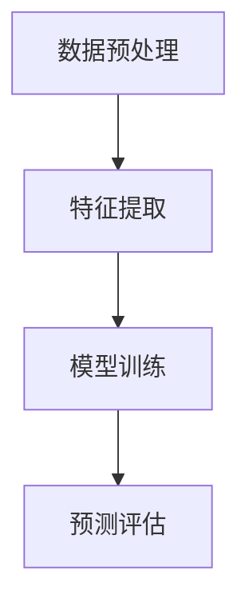
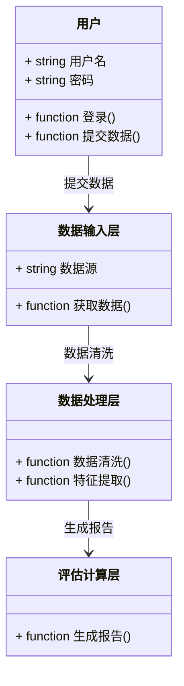

                 


# AI辅助的公司治理评估系统

> 关键词：AI技术，公司治理，评估系统，机器学习，数据分析

> 摘要：本文探讨了如何利用AI技术辅助公司治理评估，介绍了系统的设计与实现，包括算法原理、系统架构和项目实战，为公司治理提供高效解决方案。

---

## 第一部分：AI辅助的公司治理评估系统概述

### 第1章：问题背景与解决方案

#### 1.1 问题背景

##### 1.1.1 公司治理的传统挑战

公司治理涉及合规性、风险管理、绩效分析等多个方面。传统评估方法依赖人工数据收集和分析，存在效率低、成本高、主观性强的问题。

##### 1.1.2 传统评估方法的局限性

- 数据处理繁琐，难以实时更新。
- 评估标准不统一，结果缺乏客观性。
- 人工分析耗时长，难以及时发现问题。

##### 1.1.3 AI技术的引入与潜力

AI技术通过自动化数据处理和分析，提高评估效率和准确性，降低成本，支持实时监控和预测。

#### 1.2 问题描述

##### 1.2.1 公司治理评估的核心要素

包括合规性、风险管理、董事会结构、股东权益等关键指标。

##### 1.2.2 当前评估体系的痛点

- 数据收集和处理耗时，容易出错。
- 评估结果受主观因素影响，缺乏客观依据。
- 无法实时跟踪企业动态，难以及时应对风险。

##### 1.2.3 AI在评估中的应用需求

AI技术可以自动处理数据，提供客观分析，支持实时监控，优化评估流程。

#### 1.3 解决方案

##### 1.3.1 AI辅助评估的总体思路

通过机器学习模型分析公司数据，生成评估报告，提供改进建议。

##### 1.3.2 系统的目标与功能

目标：提高评估效率和准确性，降低成本，支持实时监控。

功能：数据输入、处理、评估、报告生成。

##### 1.3.3 边界与外延

系统仅处理公司治理相关数据，不涉及财务分析或其他业务领域。

---

## 第2章：核心概念与联系

### 2.1 核心概念原理

##### 2.1.1 AI在数据处理中的作用

AI通过机器学习模型处理和分析数据，识别关键指标。

##### 2.1.2 公司治理评估的关键指标

包括合规性、风险管理、董事会结构、股东权益等。

##### 2.1.3 系统的集成与优化

AI技术与公司治理评估的结合，优化了评估流程，提高了准确性。

### 2.2 概念属性对比

| 特性 | 传统评估方法 | AI辅助评估系统 |
|------|--------------|----------------|
| 数据处理 | 人工为主 | 自动化处理 |
| 实时性 | 低 | 高 |
| 准确性 | 受主观影响 | 高度客观 |
| 可扩展性 | 低 | 高 |

### 2.3 ER实体关系图

```mermaid
er
    actor: 用户
    system: AI辅助评估系统
    company: 公司
    indicator: 评估指标
    data: 数据
    relation: 关系
    actor --> system: 用户输入数据
    system --> company: 生成评估报告
    company --> indicator: 提供指标数据
    data --> system: 数据处理
    relation --> system: 关系分析
```

---

## 第3章：算法原理与数学模型

### 3.1 算法原理

#### 3.1.1 机器学习模型的选择与训练

使用随机森林模型进行分类和回归分析，训练数据包括公司治理指标。

#### 3.1.2 算法流程图



#### 3.1.3 代码示例

```python
import pandas as pd
from sklearn.ensemble import RandomForestClassifier

# 数据预处理
data = pd.read_csv('data.csv')
X = data.drop('label', axis=1)
y = data['label']

# 特征选择
selector = SelectFromModel(RandomForestClassifier())
selector.fit(X, y)
selected_features = selector.get_support(indices=True)

# 模型训练
model = RandomForestClassifier()
model.fit(X.iloc[:, selected_features], y)
```

### 3.2 数学模型

#### 3.2.1 线性回归模型

$$y = \beta_0 + \beta_1x_1 + \beta_2x_2 + \epsilon$$

#### 3.2.2 随机森林算法

$$y = \sum_{i=1}^{n} (a_i x_i + b_i)$$

---

## 第4章：系统分析与架构设计

### 4.1 系统分析

#### 4.1.1 问题场景介绍

公司治理评估系统需要处理大量数据，快速生成评估报告，帮助管理层优化治理结构。

#### 4.1.2 系统功能设计

##### 4.1.2.1 领域模型类图



#### 4.1.3 系统架构设计

##### 4.1.3.1 系统架构图


##### 4.1.3.2 接口设计

- 数据接口：提供API获取公司数据。
- 报告接口：返回评估结果。

##### 4.1.3.3 交互流程图

```mermaid
sequenceDiagram
    actor 用户
    system 系统
    用户 -> 系统: 提交数据
    系统 -> 用户: 返回报告
```

---

## 第5章：项目实战

### 5.1 环境安装

#### 5.1.1 安装Python和相关库

```bash
pip install numpy pandas scikit-learn
```

### 5.2 核心代码实现

#### 5.2.1 数据预处理

```python
import pandas as pd
from sklearn.preprocessing import StandardScaler

data = pd.read_csv('data.csv')
X = data.drop('label', axis=1)
y = data['label']

scaler = StandardScaler()
X_scaled = scaler.fit_transform(X)
```

#### 5.2.2 模型训练

```python
from sklearn.ensemble import RandomForestClassifier

model = RandomForestClassifier()
model.fit(X_scaled, y)
```

#### 5.2.3 生成报告

```python
import json

report = {
    'accuracy': model.score(X_scaled, y),
    'important_features': model.feature_importances_
}

with open('report.json', 'w') as f:
    json.dump(report, f)
```

### 5.3 案例分析

#### 5.3.1 实际案例

某公司数据输入系统，生成评估报告，显示合规性良好，但风险管理需优化。

---

## 第6章：最佳实践与总结

### 6.1 最佳实践

- 数据预处理：确保数据质量，处理缺失值和异常值。
- 模型选择：根据数据特性选择合适算法，进行交叉验证。
- 模型优化：调整超参数，防止过拟合或欠拟合。

### 6.2 小结

AI技术显著提升了公司治理评估的效率和准确性，优化了企业运营。

### 6.3 注意事项

- 数据隐私：确保数据安全，遵守相关法律法规。
- 模型准确性：定期更新模型，适应数据变化。

### 6.4 拓展阅读

- 《机器学习实战》
- 《公司治理原理》

---

作者：AI天才研究院 & 禅与计算机程序设计艺术

