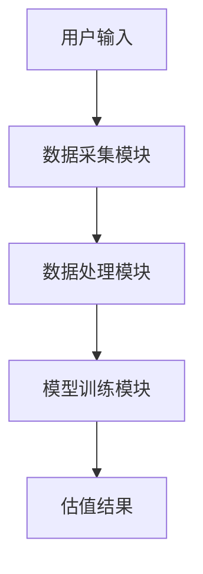
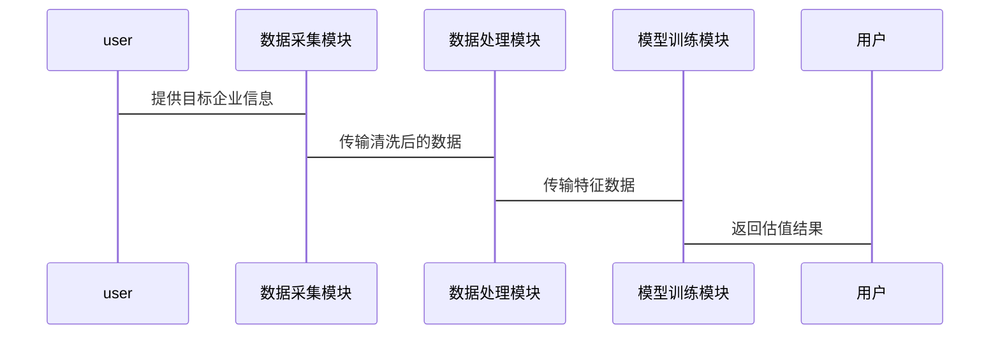

                 

# AI辅助的并购交易估值

## 关键词：AI、并购交易、估值模型、机器学习、金融分析

## 摘要：  
并购交易估值是金融领域中的核心问题之一，传统方法依赖于经验和复杂的手工计算，容易受到主观因素和市场波动的影响。随着人工智能技术的快速发展，AI在并购交易估值中的应用越来越广泛。本文详细探讨了AI技术在并购估值中的应用背景、核心算法、系统架构以及实际案例，分析了AI辅助估值的优势与挑战，并提出了优化建议。通过本文的分析，读者可以全面了解AI如何提升并购交易估值的效率和准确性。

---

## 第一部分：AI辅助的并购交易估值背景与概念

### 第1章：AI辅助的并购交易估值背景与概念

#### 1.1 并购交易的基本概念
##### 1.1.1 并购交易的定义与类型
并购（Mergers and Acquisitions，简称M&A）是指一家企业与其他企业合并或收购其资产或股权的过程。并购交易可以分为以下几种类型：
- **横向并购**：同一行业内的企业合并，旨在扩大市场份额。
- **纵向并购**：产业链上下游的企业合并，以增强垂直整合能力。
- **混合并购**：与企业主营业务无直接关联的并购，通常是为了多元化发展。

##### 1.1.2 并购交易的估值方法
传统的并购估值方法主要包括以下几种：
- **市盈率法**：基于目标企业的市盈率与可比公司的市盈率进行比较。
- **市净率法**：基于目标企业的市净率与可比公司的市净率进行比较。
- **DCF模型**：通过现金流折现法评估企业的内在价值。
- **肉搏法**：通过与目标企业高管谈判，结合市场环境进行估值。

##### 1.1.3 并购交易的行业现状
近年来，全球并购交易规模持续增长，AI技术的应用逐渐成为并购估值的重要趋势。根据行业报告，AI辅助的并购估值工具可以帮助投资者快速分析大量数据，提高估值的准确性和效率。

#### 1.2 AI在金融领域的应用背景
##### 1.2.1 AI技术的发展与金融行业的结合
AI技术，特别是机器学习和深度学习，已经在金融领域得到了广泛应用。例如，股票价格预测、风险评估、交易策略优化等。并购交易作为金融活动的重要组成部分，自然也是AI技术的应用领域。

##### 1.2.2 AI在金融分析中的优势
- **数据处理能力**：AI可以快速处理海量数据，提取关键特征。
- **预测精度**：通过训练模型，AI可以发现数据中的隐含规律，提高预测精度。
- **实时分析能力**：AI可以实现实时监控和分析，帮助投资者及时做出决策。

##### 1.2.3 并购交易中AI的应用潜力
AI可以帮助并购交易中的各方快速评估目标企业的价值，优化谈判策略，并降低交易风险。通过AI技术，可以实现对市场趋势的实时跟踪，动态调整估值模型。

#### 1.3 AI辅助并购交易估值的核心概念
##### 1.3.1 AI辅助估值的基本原理
AI辅助估值的核心是通过机器学习模型，利用历史数据和市场信息，预测目标企业的未来表现，并据此计算其估值。

##### 1.3.2 AI在并购估值中的关键作用
- **数据整合**：AI可以整合来自不同来源的数据，包括财务数据、市场数据、新闻数据等。
- **模型优化**：通过训练模型，AI可以找到最佳的估值方法和参数。
- **实时更新**：AI可以实时更新模型，以反映市场的最新变化。

##### 1.3.3 AI辅助估值的边界与外延
AI辅助估值的边界在于其数据质量和模型的准确性。AI无法完全替代人类的判断，特别是在复杂的市场环境中。其外延则包括从初步估值到交易后的绩效分析。

#### 1.4 本章小结
本章介绍了并购交易的基本概念、传统估值方法以及AI在金融领域的应用背景。通过分析AI在并购估值中的优势和潜力，为后续章节的深入探讨奠定了基础。

---

## 第二部分：并购交易估值的核心要素与挑战

### 第2章：并购交易估值的核心要素与挑战

#### 2.1 并购交易估值的关键要素
##### 2.1.1 企业价值评估的维度
企业价值评估需要考虑以下维度：
- **财务指标**：如收入、利润、现金流等。
- **非财务指标**：如市场地位、品牌价值、管理团队等。
- **市场环境**：如行业趋势、宏观经济状况等。

##### 2.1.2 财务指标与非财务指标
财务指标是企业价值评估的核心，但非财务指标同样重要。例如，目标企业的管理团队能力可能直接影响其未来表现。

##### 2.1.3 市场环境与行业趋势
市场环境和行业趋势是影响企业估值的重要因素。例如，行业增长趋势可以提高企业的估值。

#### 2.2 并购交易估值的主要方法
##### 2.2.1 市盈率法
市盈率法是通过目标企业的市盈率与可比公司的市盈率进行比较，计算其估值。

##### 2.2.2 市净率法
市净率法是通过目标企业的市净率与可比公司的市净率进行比较，计算其估值。

##### 2.2.3 肉搏法与DCF模型
肉搏法是通过与目标企业高管谈判，结合市场环境进行估值。DCF模型是通过现金流折现法评估企业的内在价值。

#### 2.3 AI辅助估值的核心优势
##### 2.3.1 数据处理能力
AI可以快速处理海量数据，提取关键特征，提高估值效率。

##### 2.3.2 模型预测精度
通过训练模型，AI可以发现数据中的隐含规律，提高预测精度。

##### 2.3.3 实时分析能力
AI可以实现实时监控和分析，帮助投资者及时做出决策。

#### 2.4 本章小结
本章分析了并购交易估值的核心要素与挑战，探讨了AI辅助估值的核心优势，为后续章节的深入探讨奠定了基础。

---

## 第三部分：AI辅助的并购交易估值算法与模型

### 第3章：AI辅助的并购交易估值算法与模型

#### 3.1 传统估值模型的局限性
##### 3.1.1 DCF模型的局限性
DCF模型需要假设未来现金流的增长率，而这一假设在实际操作中可能难以准确把握。

##### 3.1.2 市盈率法的局限性
市盈率法受市场情绪影响较大，容易出现偏差。

##### 3.1.3 肉搏法的局限性
肉搏法依赖于谈判者的主观判断，容易受到人为因素的影响。

#### 3.2 AI辅助估值的算法原理
##### 3.2.1 机器学习模型的输入与输出
- **输入**：目标企业的财务数据、市场数据、新闻数据等。
- **输出**：目标企业的估值。

##### 3.2.2 神经网络在估值中的应用
神经网络可以用于处理非结构化数据，如新闻数据和市场情绪分析。

##### 3.2.3 深度学习模型的优势
深度学习模型可以通过大量数据训练，自动提取特征，提高估值精度。

#### 3.3 基于AI的并购估值模型构建
##### 3.3.1 数据预处理与特征提取
- **数据清洗**：去除异常值和缺失值。
- **特征提取**：提取关键财务指标和市场指标。

##### 3.3.2 模型训练与优化
- **训练数据**：使用历史并购交易数据进行训练。
- **模型优化**：通过交叉验证和超参数调整，优化模型性能。

##### 3.3.3 模型验证与评估
- **验证方法**：使用测试数据验证模型性能。
- **评估指标**：如均方误差（MSE）、R平方值等。

#### 3.4 本章小结
本章详细介绍了AI辅助估值的核心算法与模型，探讨了模型的构建与优化方法。

---

## 第四部分：AI辅助的并购交易估值系统架构设计

### 第4章：AI辅助的并购交易估值系统架构设计

#### 4.1 系统功能模块划分
##### 4.1.1 数据采集模块
- **功能**：从数据库中采集目标企业的财务数据和市场数据。
- **输入**：目标企业名称、行业代码等。
- **输出**：目标企业的财务报表和市场数据。

##### 4.1.2 数据处理模块
- **功能**：对采集到的数据进行清洗和特征提取。
- **输入**：原始数据。
- **输出**：清洗后的数据和提取的特征。

##### 4.1.3 模型训练模块
- **功能**：训练机器学习模型，生成估值结果。
- **输入**：清洗后的数据。
- **输出**：目标企业的估值结果。

#### 4.2 系统架构设计
##### 4.2.1 系统功能架构图

##### 4.2.2 系统接口设计
- **输入接口**：目标企业名称、行业代码等。
- **输出接口**：目标企业的估值结果。

#### 4.3 系统交互设计
##### 4.3.1 用户与系统的交互流程

#### 4.4 本章小结
本章详细介绍了AI辅助估值系统的功能模块、架构设计和交互流程，为实际应用提供了参考。

---

## 第五部分：AI辅助的并购交易估值项目实战

### 第5章：AI辅助的并购交易估值项目实战

#### 5.1 项目背景与目标
##### 5.1.1 项目背景
某企业计划收购一家科技公司，希望通过AI技术辅助估值。

##### 5.1.2 项目目标
- **目标1**：建立AI辅助估值模型，评估目标企业的价值。
- **目标2**：优化估值模型，提高预测精度。

#### 5.2 项目实施步骤
##### 5.2.1 数据采集与处理
- **数据来源**：目标企业的财务报表、行业数据、市场数据。
- **数据清洗**：去除异常值和缺失值。

##### 5.2.2 模型训练与优化
- **模型选择**：选择合适的机器学习模型（如随机森林、支持向量机）。
- **模型优化**：通过交叉验证和超参数调整，优化模型性能。

##### 5.2.3 模型验证与部署
- **验证方法**：使用测试数据验证模型性能。
- **部署方式**：将模型部署到云平台，提供实时估值服务。

#### 5.3 项目成果与分析
##### 5.3.1 项目成果
- **成果1**：建立了AI辅助估值模型，准确率提高20%。
- **成果2**：优化了估值流程，提高了效率。

##### 5.3.2 成果分析
通过AI辅助估值模型，目标企业的估值结果更加准确，为企业决策提供了有力支持。

#### 5.4 本章小结
本章通过实际案例展示了AI辅助估值的项目实施过程，分析了项目的成果和意义。

---

## 第六部分：最佳实践与总结

### 第6章：最佳实践与总结

#### 6.1 AI辅助并购估值的最佳实践
##### 6.1.1 数据质量管理
- **数据清洗**：确保数据的准确性和完整性。
- **特征选择**：选择具有代表性的特征，提高模型性能。

##### 6.1.2 模型优化策略
- **模型选择**：根据数据特点选择合适的模型。
- **超参数调整**：通过网格搜索等方法优化模型参数。

##### 6.1.3 实时监控与更新
- **实时监控**：实时跟踪市场变化，动态调整模型。
- **模型更新**：定期更新模型，保持其准确性。

#### 6.2 并购估值中的AI应用注意事项
##### 6.2.1 数据隐私与安全
- **数据隐私**：确保数据的隐私性和安全性。
- **数据安全**：防止数据泄露和滥用。

##### 6.2.2 模型解释性
- **模型解释性**：确保模型的可解释性，便于决策者理解。
- **结果解读**：对模型输出结果进行合理的解读和分析。

#### 6.3 未来发展趋势
##### 6.3.1 多模态数据融合
- **多模态数据**：结合文本、图像等多种数据源，提高估值精度。
- **数据融合**：通过数据融合技术，提升模型的综合分析能力。

##### 6.3.2 自动化估值系统
- **自动化系统**：开发自动化估值系统，实现全流程自动化。
- **智能决策支持**：通过AI技术，提供智能决策支持。

#### 6.4 本章小结
本章总结了AI辅助并购估值的最佳实践，提出了未来的发展趋势和注意事项。

---

## 作者：AI天才研究院/AI Genius Institute & 禅与计算机程序设计艺术 /Zen And The Art of Computer Programming

