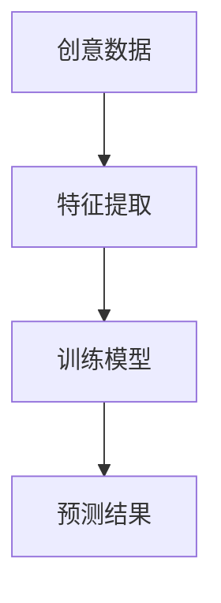
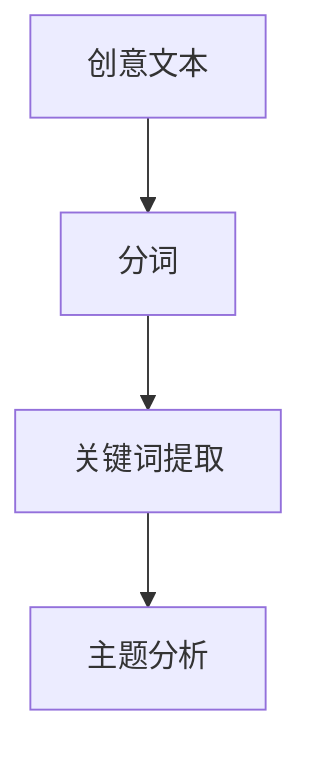
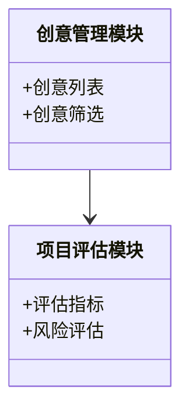
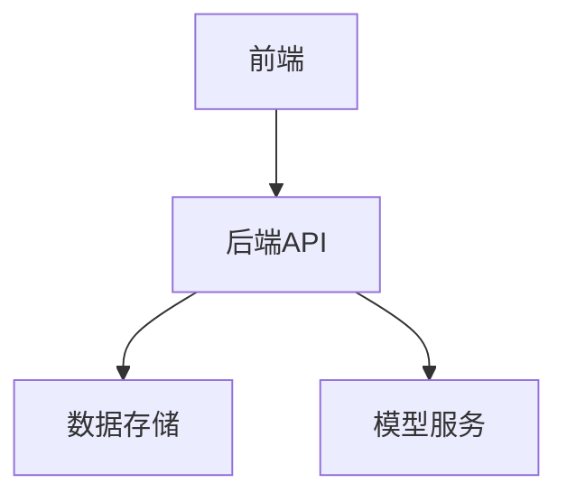

                 


# AI驱动的企业创新管理：从创意筛选到商业化全流程智能化

## 关键词：AI，企业创新管理，创意筛选，商业化，智能化

## 摘要：  
本文探讨了AI在企业创新管理中的应用，从创意筛选到商业化，详细分析了AI如何实现全流程智能化。通过算法、系统架构和项目实战，展示了AI如何提升创新效率和成功率。文章结构清晰，内容详实，为企业的创新管理提供了新的思路和实践指导。

---

## 第一章 引言

### 1.1 为什么需要AI驱动的企业创新管理  
传统企业创新管理依赖人工判断，效率低下且主观性强。AI通过数据驱动的方法，提升创意筛选、项目评估和资源分配的效率和准确性，为企业创新管理带来革命性变化。

### 1.2 本书的目标与意义  
本书旨在通过AI技术，系统性地优化企业创新管理流程，为企业提供从创意到商业化的一站式解决方案。通过案例分析和理论探讨，帮助读者理解AI在创新管理中的应用价值。

---

## 第二章 AI驱动的企业创新管理背景

### 2.1 问题背景  
- **创意筛选的低效性**：人工筛选创意耗时长，主观性强。  
- **项目评估的主观性**：缺乏客观指标，评估结果不稳定。  
- **资源分配的不均衡性**：难以根据项目潜力合理分配资源。  

### 2.2 问题描述  
- **创意筛选**：创意数量多，难以快速筛选出有价值的创意。  
- **项目评估**：评估过程依赖主观判断，结果缺乏数据支持。  
- **资源分配**：资源分配不均，影响项目成功率。  

### 2.3 问题解决  
- **AI技术的应用**：利用机器学习和NLP技术，实现创意筛选和项目评估的自动化和智能化。  
- **数据驱动的决策**：通过数据分析，提供客观的决策支持。  
- **智能化工具**：开发智能化工具，优化创新管理流程。  

### 2.4 边界与外延  
- **适用范围**：适用于企业内部创新项目管理，不涉及外部市场推广。  
- **区别于其他方法**：AI方法注重数据驱动和自动化，传统方法依赖人工经验。  
- **技术与管理的结合**：AI技术与管理流程的深度融合，提升管理效率。  

---

## 第三章 AI驱动的企业创新管理核心概念

### 3.1 创意筛选的AI方法  
- **基于NLP的创意分析**：利用自然语言处理技术，分析创意文本，提取关键词和主题。  
- **创意可行性的预测模型**：通过机器学习模型，预测创意的市场潜力和可行性。  

### 3.2 项目评估的AI模型  
- **商业潜力预测**：基于历史数据和市场趋势，预测项目的商业潜力。  
- **风险评估指标**：通过数据分析，评估项目的市场风险和执行风险。  

### 3.3 资源分配的智能优化  
- **资源分配算法**：利用优化算法，合理分配资源，提高项目成功率。  
- **资源动态调整**：根据项目进展和市场变化，动态调整资源分配策略。  

---

## 第四章 算法原理讲解

### 4.1 机器学习算法  
#### 4.1.1 算法流程图  


#### 4.1.2 Python代码示例  
```python
import pandas as pd
from sklearn.model_selection import train_test_split
from sklearn.linear_model import LogisticRegression

# 数据加载与预处理
data = pd.read_csv('创意数据.csv')
X = data.drop('label', axis=1)
y = data['label']

# 数据分割
X_train, X_test, y_train, y_test = train_test_split(X, y, test_size=0.2)

# 模型训练
model = LogisticRegression()
model.fit(X_train, y_train)

# 模型预测
y_pred = model.predict(X_test)
print('预测结果:', y_pred)
```

#### 4.1.3 数学模型  
- **损失函数**：  
  $$ L = -\frac{1}{m} \sum_{i=1}^{m} [y_i \log(h(x_i)) + (1 - y_i) \log(1 - h(x_i))] $$  
  其中，$$ h(x_i) $$ 是sigmoid函数的输出。  
- **优化算法**：  
  $$ \theta = \theta - \alpha \frac{\partial L}{\partial \theta} $$  
  其中，$$ \alpha $$ 是学习率。  

### 4.2 自然语言处理（NLP）算法  
#### 4.2.1 算法流程图  


#### 4.2.2 Python代码示例  
```python
from sklearn.feature_extraction.text import TfidfVectorizer

# 文本数据加载
texts = ["这是一个创意描述", "另一个创意描述"]

# 特征提取
vectorizer = TfidfVectorizer()
X = vectorizer.fit_transform(texts)

print('特征提取结果:', X)
```

---

## 第五章 系统分析与架构设计方案

### 5.1 功能模块设计  
#### 5.1.1 功能模块类图  


### 5.2 系统架构设计  
#### 5.2.1 系统架构图  


### 5.3 接口设计  
#### 5.3.1 接口交互序列图  
```mermaid
sequenceDiagram
    用户 --> API: 提交创意
    API --> 数据库: 存储创意
    API --> 模型服务: 请求评估
    模型服务 --> API: 返回评估结果
    用户 <-- API: 显示结果
```

---

## 第六章 项目实战

### 6.1 环境安装  
- **工具安装**：安装Python、Jupyter Notebook、Scikit-learn、NLTK。  
- **数据准备**：获取创意数据集，包括创意描述和标签。  

### 6.2 核心代码实现  
#### 6.2.1 创意筛选代码  
```python
import pandas as pd
from sklearn.model_selection import train_test_split
from sklearn.naive_bayes import MultinomialNB
from sklearn.feature_extraction.text import TfidfVectorizer

# 数据加载与预处理
data = pd.read_csv('创意数据.csv')
X = data['描述']
y = data['标签']

# 特征提取
vectorizer = TfidfVectorizer()
X_vec = vectorizer.fit_transform(X)

# 数据分割
X_train, X_test, y_train, y_test = train_test_split(X_vec, y, test_size=0.2)

# 模型训练
model = MultinomialNB()
model.fit(X_train, y_train)

# 模型预测
y_pred = model.predict(X_test)
print('预测准确率:', accuracy_score(y_test, y_pred))
```

#### 6.2.2 项目评估代码  
```python
import pandas as pd
from sklearn.ensemble import RandomForestRegressor
from sklearn.model_selection import train_test_split

# 数据加载与预处理
data = pd.read_csv('项目数据.csv')
X = data.drop('收益', axis=1)
y = data['收益']

# 数据分割
X_train, X_test, y_train, y_test = train_test_split(X, y, test_size=0.2)

# 模型训练
model = RandomForestRegressor()
model.fit(X_train, y_train)

# 模型预测
y_pred = model.predict(X_test)
print('预测收益:', y_pred)
```

### 6.3 案例分析  
- **案例背景**：某公司收集了大量创意，希望筛选出有市场潜力的创意。  
- **数据准备**：创意描述和市场表现数据。  
- **模型选择**：使用随机森林回归模型进行预测。  
- **结果分析**：模型预测准确率较高，筛选出高潜力创意，提高项目成功率。  

---

## 第七章 总结与展望

### 7.1 总结  
本文详细探讨了AI在企业创新管理中的应用，从创意筛选到商业化，展示了AI如何实现全流程智能化。通过算法、系统架构和项目实战，提供了企业创新管理的新思路。

### 7.2 未来展望  
- **算法优化**：进一步优化机器学习算法，提高预测准确性。  
- **多模态数据融合**：结合文本、图像等多种数据源，提升分析能力。  
- **动态调整**：开发动态调整模型，适应市场变化。  

### 7.3 最佳实践  
- **数据质量**：确保数据准确性和完整性。  
- **模型可解释性**：提高模型的可解释性，便于管理和调整。  
- **团队协作**：AI技术与企业管理团队紧密合作，确保方案落地。  

---

## 作者：AI天才研究院 & 禅与计算机程序设计艺术  

感谢您的阅读！如需进一步交流，请联系作者邮箱：[您的邮箱]。

