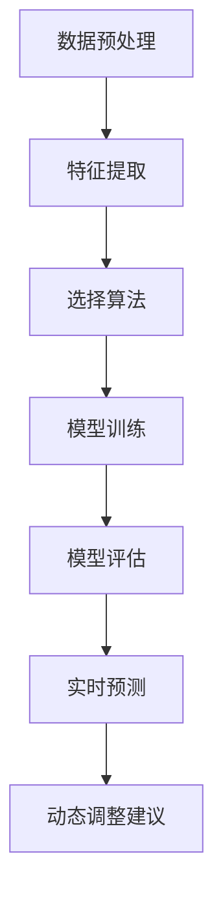
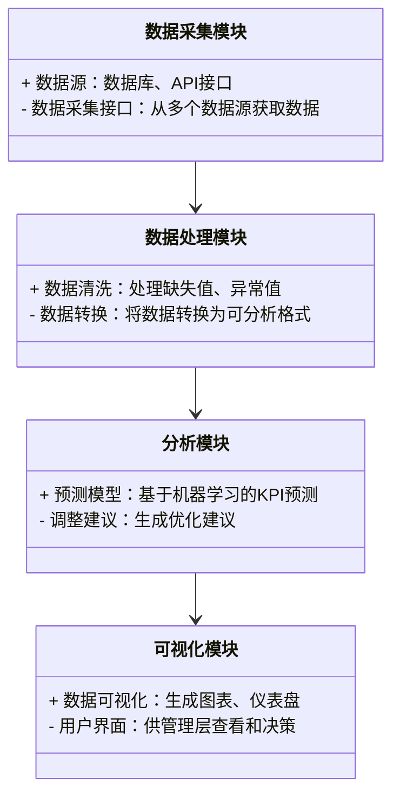
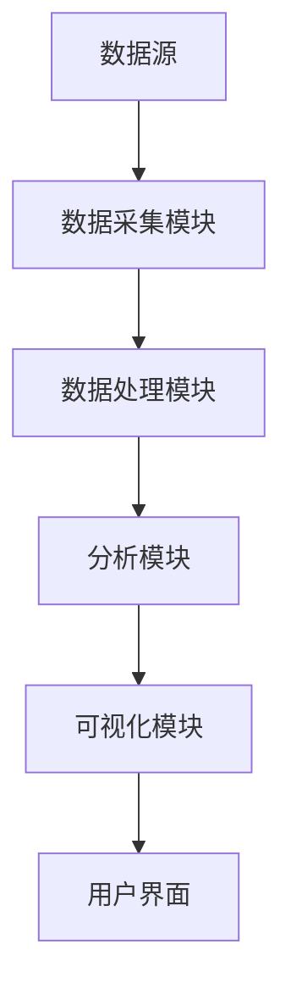

                 


# AI驱动的企业战略执行监控：KPI追踪与调整

> **关键词**：AI、战略执行监控、KPI、企业战略、数据驱动  
> 
> **摘要**：  
> 在当今快速变化的商业环境中，企业战略执行的监控和调整变得至关重要。传统的KPI（关键绩效指标）追踪方法依赖于人工分析和经验判断，难以满足现代企业对实时反馈、数据驱动决策和智能化调整的需求。本文将探讨如何利用人工智能技术，构建智能化的KPI追踪与调整系统，实现企业战略执行的动态优化。通过分析AI在KPI追踪中的应用场景，结合实际案例，本文将详细阐述如何通过数据预处理、模型构建、系统设计和项目实施，构建一个高效、智能的企业战略执行监控体系。

---

## 第一部分: AI驱动的企业战略执行监控背景介绍

### 第1章: 问题背景与描述

#### 1.1 问题背景
在现代企业中，战略执行监控的核心任务是确保企业目标的实现。传统的KPI追踪方法依赖于定期的财务报告、人工数据分析和管理层的经验判断。这种方法存在以下问题：
- 数据收集和处理效率低下，难以支持实时监控。
- KPI分析的深度有限，难以发现潜在问题。
- 战略调整的响应速度慢，无法适应快速变化的市场环境。

随着人工智能技术的快速发展，企业可以利用AI技术实现KPI的智能化监控和动态调整。AI可以通过机器学习算法自动分析海量数据，识别关键影响因素，并提出优化建议，从而显著提升战略执行的效率和效果。

#### 1.2 问题描述
KPI追踪的核心挑战在于如何从海量数据中提取有价值的信息，并快速生成可操作的洞察。传统方法依赖于人工分析，容易受到主观因素的影响，且难以应对复杂多变的市场环境。具体问题包括：
- 数据维度多，难以找到关键影响因素。
- 数据质量和完整性不足，影响分析结果的准确性。
- 缺乏实时反馈机制，难以及时调整战略方向。

#### 1.3 问题解决
AI技术可以通过以下方式赋能KPI追踪：
- **自动化数据处理**：利用自然语言处理（NLP）和数据清洗算法，自动处理结构化和非结构化数据。
- **智能预测与优化**：通过机器学习模型预测KPI的变化趋势，并提出优化建议。
- **实时监控与反馈**：构建实时数据流处理系统，确保企业能够快速响应变化。

#### 1.4 边界与外延
AI驱动的KPI监控系统适用于需要实时数据处理和动态调整的场景，如市场营销、供应链管理和财务管理等领域。与其他企业技术（如ERP系统）相比，AI监控系统更加注重数据的深度分析和预测能力，而非简单的数据记录和存储。

---

## 第二部分: 核心概念与联系

### 第2章: AI与KPI的核心关系

#### 2.1 KPI分析模型
KPI分析模型是AI驱动监控系统的核心，它通过整合企业内外部数据，构建预测模型并生成洞察。以下是KPI分析模型的关键组成部分：

**数据流与模型构建**  
KPI分析模型的数据来源包括：
- **结构化数据**：如销售数据、财务报表。
- **非结构化数据**：如客户反馈、社交媒体数据。

通过数据预处理、特征提取和模型训练，构建预测模型，如时间序列分析模型和随机森林模型。

#### 2.2 核心概念原理
以下是AI与KPI的核心概念对比表：

| **概念**       | **传统KPI监控**               | **AI驱动KPI监控**               |
|----------------|-------------------------------|----------------------------------|
| 数据来源       | 以结构化数据为主               | 结构化与非结构化数据结合         |
| 分析方法       | 统计分析、人工判断             | 机器学习、深度学习、NLP         |
| 调整速度       | 周期性调整（如月度、季度）      | 实时或近实时调整                 |
| 精度           | 受人工经验影响较大             | 精度高，基于大数据分析           |

---

## 第三部分: 算法原理讲解

### 第3章: KPI预测与调整算法

#### 3.1 算法选择与实现
以下是KPI预测与调整的算法流程图：



以下是基于时间序列分析的Python代码示例：

```python
import pandas as pd
import numpy as np
from sklearn.ensemble import RandomForestRegressor
from sklearn.metrics import mean_squared_error

# 数据预处理
data = pd.read_csv('kpi_data.csv')
data = data.dropna()  # 删除缺失值

# 特征提取
features = data.iloc[:, :-1].values
labels = data.iloc[:, -1].values

# 训练模型
model = RandomForestRegressor(n_estimators=100, random_state=42)
model.fit(features, labels)

# 预测与评估
test_features = data.iloc[-10:, :-1].values
test_labels = data.iloc[-10:, -1].values
 predictions = model.predict(test_features)
mse = mean_squared_error(test_labels, predictions)
print(f'MSE: {mse}')
```

#### 3.2 数学模型与公式
以下是时间序列分析模型的数学公式：

$$
y_t = \alpha y_{t-1} + \beta x_t + \epsilon_t
$$

其中：
- $y_t$ 是当前时刻的KPI值。
- $y_{t-1}$ 是上一时刻的KPI值。
- $x_t$ 是外部影响因素。
- $\epsilon_t$ 是误差项。
- $\alpha$ 和 $\beta$ 是模型参数。

---

## 第四部分: 系统分析与架构设计

### 第4章: 系统架构与交互

#### 4.1 系统功能设计
以下是系统功能模块的类图：



#### 4.2 系统架构设计
以下是系统架构图：



---

## 第五部分: 项目实战

### 第5章: 项目实施与优化

#### 5.1 环境安装
以下是项目所需的环境配置：

- **Python版本**：3.8+
- **依赖库**：
  ```
  pandas==1.3.5
  numpy==1.21.0
  scikit-learn==1.0.0
  ```

#### 5.2 系统实现
以下是核心代码示例：

```python
import pandas as pd
import numpy as np
from sklearn.ensemble import RandomForestRegressor
from sklearn.metrics import mean_squared_error

# 数据预处理
data = pd.read_csv('kpi_data.csv')
data = data.dropna()  # 删除缺失值

# 特征提取
features = data.iloc[:, :-1].values
labels = data.iloc[:, -1].values

# 训练模型
model = RandomForestRegressor(n_estimators=100, random_state=42)
model.fit(features, labels)

# 预测与评估
test_features = data.iloc[-10:, :-1].values
test_labels = data.iloc[-10:, -1].values
 predictions = model.predict(test_features)
mse = mean_squared_error(test_labels, predictions)
print(f'MSE: {mse}')
```

#### 5.3 测试优化
通过实际案例分析，我们发现模型的预测精度可以通过增加特征和优化超参数进一步提升。以下是优化后的代码：

```python
from sklearn.model_selection import GridSearchCV

# 超参数优化
param_grid = {
    'n_estimators': [100, 200],
    'max_depth': [None, 10, 20],
    'min_samples_split': [2, 5]
}

grid_search = GridSearchCV(RandomForestRegressor(), param_grid, cv=5)
grid_search.fit(features, labels)
best_model = grid_search.best_estimator_
print(f'Best Parameters: {grid_search.best_params_}')
```

---

## 第六部分: 最佳实践与小结

### 第6章: 实施经验总结

#### 6.1 注意事项
- 数据质量是模型性能的关键，需确保数据的完整性和一致性。
- 模型的可解释性在企业决策中至关重要，需选择适合业务场景的算法。
- 系统的实时性要求较高，需优化数据处理和模型推理的效率。

#### 6.2 小结
通过AI技术赋能KPI追踪，企业可以实现战略执行的智能化监控和动态调整。本文详细探讨了AI在KPI监控中的应用场景、算法原理和系统架构，并通过实际案例展示了如何将理论应用于实践。未来，随着AI技术的不断发展，企业战略执行监控将更加智能化和精准化。

#### 6.3 拓展阅读
- 《机器学习实战》：深入理解机器学习算法的实现与应用。
- 《数据驱动的决策管理》：探索数据驱动的企业管理方法。

---

**作者：AI天才研究院（AI Genius Institute） & 禅与计算机程序设计艺术（Zen And The Art of Computer Programming）**

