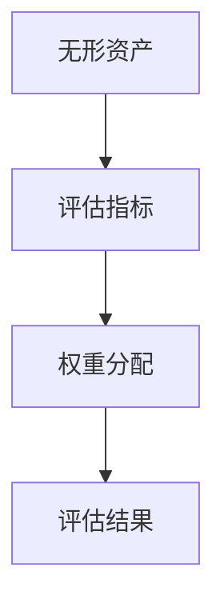
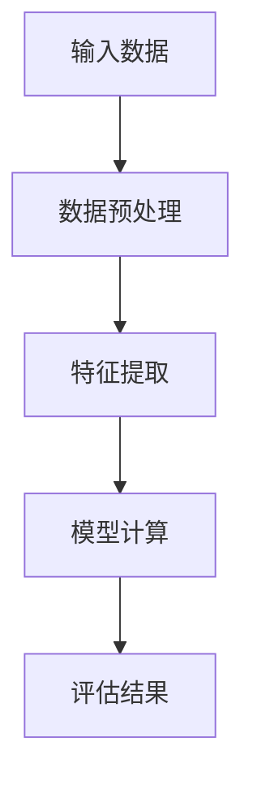
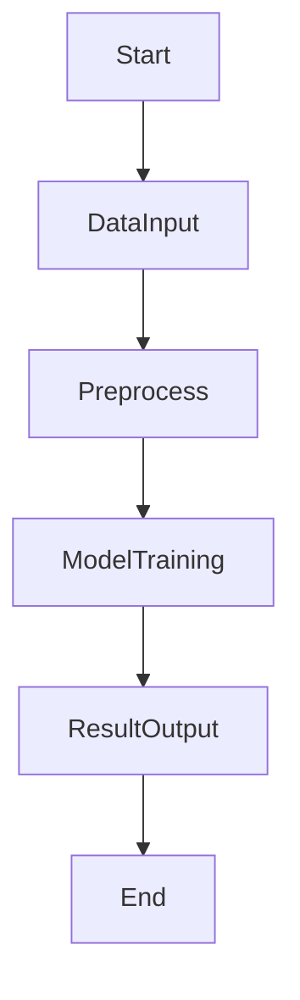
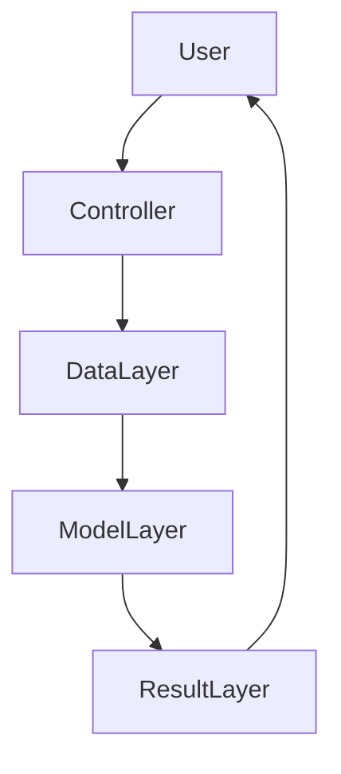
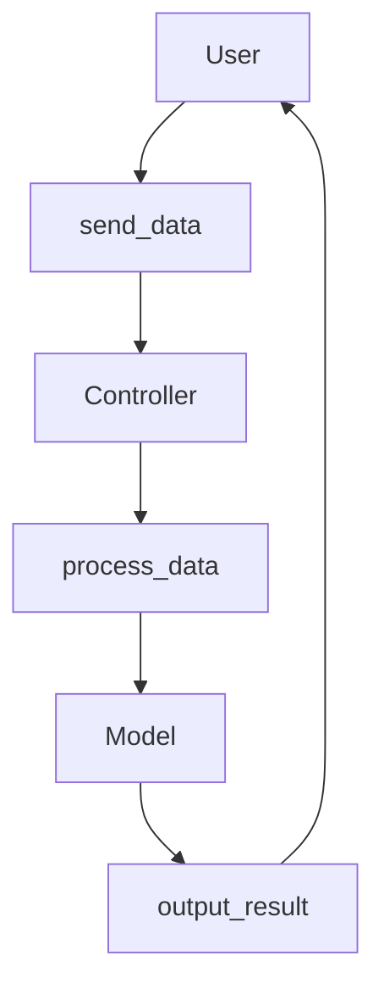

                 


# AI驱动的企业无形资产价值评估系统

> 关键词：AI，企业价值评估，无形资产，机器学习，神经网络

> 摘要：本文详细探讨了如何利用人工智能技术驱动企业无形资产的价值评估系统。通过分析传统评估方法的局限性，结合现代AI技术的优势，提出了一种基于机器学习和神经网络的新型评估方法。文章从核心概念、算法原理、系统架构到项目实战，全面介绍了该系统的构建过程和应用场景。

---

## 第一部分: AI驱动的企业无形资产价值评估系统概述

### 第1章: 企业无形资产价值评估的背景与挑战

#### 1.1 无形资产的定义与分类
- **1.1.1 无形资产的定义**
  无形资产是指企业拥有或控制的，没有实物形态的长期资产，包括专利权、商标权、商誉、特许经营权等。

- **1.1.2 无形资产的主要分类**
  - 知识产权类：专利、商标、版权等。
  - 商誉类：企业声誉、客户关系等。
  - 技术类：技术诀窍、研发成果等。

- **1.1.3 无形资产在企业中的重要性**
  无形资产是企业核心竞争力的体现，直接影响企业的市场价值和长期盈利能力。

#### 1.2 传统无形资产评估方法的局限性
- **1.2.1 基于财务数据的传统评估方法**
  - 主要依赖历史财务数据，难以反映未来价值。
  - 无法量化非财务因素（如品牌影响力、技术创新能力）。

- **1.2.2 传统方法的局限性与不足**
  - 数据维度有限，难以捕捉复杂市场环境下的价值变化。
  - 评估过程主观性强，缺乏客观性和准确性。

- **1.2.3 企业对更高效评估方法的需求**
  - 随着市场竞争加剧，企业需要更精准、动态的评估方法。
  - AI技术的快速发展为企业提供了新的解决方案。

#### 1.3 AI技术在无形资产评估中的应用前景
- **1.3.1 AI技术的基本概念与优势**
  - 人工智能通过机器学习、自然语言处理等技术，能够从海量数据中提取有价值的信息。
  - AI的自动化和智能化特点能够显著提高评估效率和准确性。

- **1.3.2 AI在无形资产评估中的潜在价值**
  - 利用AI技术可以整合多维度数据（如市场数据、财务数据、文本数据）进行综合评估。
  - AI能够实时跟踪市场变化，动态调整评估模型。

- **1.3.3 企业级应用的可行性分析**
  - 技术可行性：AI技术已成熟，能够支持复杂的评估任务。
  - 经济可行性：AI驱动的评估系统可以显著降低评估成本，提高企业价值。

---

### 第2章: 无形资产价值评估的核心概念与联系

#### 2.1 核心概念与原理
- **2.1.1 无形资产评估的核心要素**
  - 数据来源：包括财务数据、市场数据、文本数据等。
  - 评估模型：基于机器学习的回归模型或深度学习模型。
  - 评估结果：企业无形资产的市场价值或潜在价值。

- **2.1.2 AI驱动评估的数学模型**
  - 基于机器学习的回归模型：通过训练数据预测无形资产价值。
  - 基于神经网络的深度学习模型：捕捉数据中的非线性关系。

- **2.1.3 系统架构与功能模块**
  - 数据采集模块：从企业内外部数据源获取数据。
  - 数据处理模块：清洗、特征提取和数据预处理。
  - 评估模型模块：构建并训练机器学习模型。
  - 结果输出模块：生成评估报告和可视化结果。

#### 2.2 核心概念对比分析
- **2.2.1 不同评估方法的对比表格**
  | 评估方法 | 数据来源 | 模型复杂度 | 评估效率 | 评估精度 |
  |----------|----------|------------|----------|----------|
  | 传统财务法 | 财务数据 | 低 | 低 | 低 |
  | 机器学习法 | 多维度数据 | 中 | 中 | 高 |
  | 神经网络法 | 全维度数据 | 高 | 高 | 高 |

- **2.2.2 实体关系（ER）图架构**


#### 2.3 系统架构与功能模块
- **2.3.1 系统整体架构**


---

### 第3章: AI驱动的无形资产价值评估算法原理

#### 3.1 算法原理概述
- **3.1.1 基于机器学习的评估模型**
  - 线性回归模型：适用于简单的线性关系。
  - 支持向量机（SVM）：适用于非线性分类和回归问题。
  - 随机森林：适用于高维数据和复杂关系。

- **3.1.2 神经网络在评估中的应用**
  - 卷积神经网络（CNN）：适用于图像数据。
  - 循环神经网络（RNN）：适用于时间序列数据。
  - �长短时记忆网络（LSTM）：适用于长期依赖关系。

- **3.1.3 算法选择的依据与原则**
  - 数据类型：文本数据、数值数据、时间序列数据等。
  - 数据规模：小数据适合线性回归，大数据适合深度学习。
  - 模型解释性：业务需求对解释性的要求。

#### 3.2 算法实现与流程图
- **3.2.1 算法流程**


#### 3.3 数学模型与公式
- **3.3.1 基本评估公式**
$$ V = \sum_{i=1}^{n} w_i x_i $$
其中，$V$ 表示评估价值，$w_i$ 表示第$i$个指标的权重，$x_i$ 表示第$i$个指标的评分。

- **3.3.2 神经网络模型**
$$ f(x) = \sigma(Wx + b) $$
其中，$W$ 是权重矩阵，$b$ 是偏置，$\sigma$ 是激活函数。

---

### 第4章: 无形资产价值评估系统的架构设计

#### 4.1 问题场景介绍
- 企业需要评估无形资产的市场价值，以支持并购、融资等决策。
- 传统评估方法难以满足动态市场环境下的实时评估需求。

#### 4.2 项目介绍
- 本项目旨在构建一个基于AI的无形资产价值评估系统，解决传统方法的局限性。

#### 4.3 系统功能设计
- 数据采集模块：从企业内外部数据源获取数据。
- 数据处理模块：清洗、特征提取和数据预处理。
- 评估模型模块：构建并训练机器学习模型。
- 结果输出模块：生成评估报告和可视化结果。

#### 4.4 系统架构设计


#### 4.5 系统接口设计
- 输入接口：接收企业无形资产相关数据。
- 输出接口：返回评估结果和报告。

#### 4.6 系统交互设计


---

### 第5章: 项目实战

#### 5.1 环境安装
- 安装Python、机器学习库（如Scikit-learn、TensorFlow）和数据处理工具（如Pandas、NumPy）。

#### 5.2 系统核心实现源代码
```python
import pandas as pd
import numpy as np
from sklearn.linear_model import LinearRegression

# 数据预处理
data = pd.read_csv('input.csv')
X = data.drop('value', axis=1)
y = data['value']

# 模型训练
model = LinearRegression()
model.fit(X, y)

# 模型预测
new_data = pd.read_csv('new_input.csv')
predicted_values = model.predict(new_data.drop('value', axis=1))
```

#### 5.3 代码应用解读与分析
- 数据预处理：清洗数据，提取特征。
- 模型训练：基于训练数据训练机器学习模型。
- 模型预测：使用训练好的模型预测新数据的评估价值。

#### 5.4 实际案例分析
- 案例背景：某企业需要评估其商标价值。
- 数据准备：收集商标相关信息、市场数据和财务数据。
- 模型训练与预测：使用机器学习模型预测商标价值。
- 结果分析：与传统评估方法对比，验证模型的准确性和优势。

#### 5.5 项目小结
- 通过实战案例验证了AI驱动评估系统的可行性和有效性。
- 与传统方法相比，AI技术能够显著提高评估效率和准确性。

---

## 第六章: 最佳实践与总结

### 6.1 最佳实践
- 数据质量是评估系统的核心，确保数据的完整性和准确性。
- 根据企业需求选择合适的模型，避免过度复杂化。
- 定期更新模型，适应市场环境的变化。

### 6.2 小结
本文详细介绍了AI驱动的企业无形资产价值评估系统的构建过程，从核心概念、算法原理到系统架构和项目实战，全面探讨了该系统的实现方法和应用价值。

### 6.3 注意事项
- 数据隐私和安全问题需要高度重视。
- 模型的可解释性是企业决策的重要因素。
- 系统的维护和更新需要持续投入。

### 6.4 拓展阅读
- 推荐阅读《机器学习实战》和《深度学习》等书籍，深入理解AI技术的应用。
- 关注行业动态，了解最新的AI技术在企业评估中的应用。

---

## 作者信息

作者：AI天才研究院（AI Genius Institute） & 禅与计算机程序设计艺术（Zen And The Art of Computer Programming）

--- 

希望这篇文章能够为读者提供清晰的思路和实用的指导，帮助他们理解并应用AI技术驱动的企业无形资产价值评估系统。

