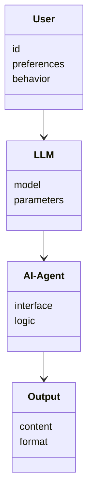
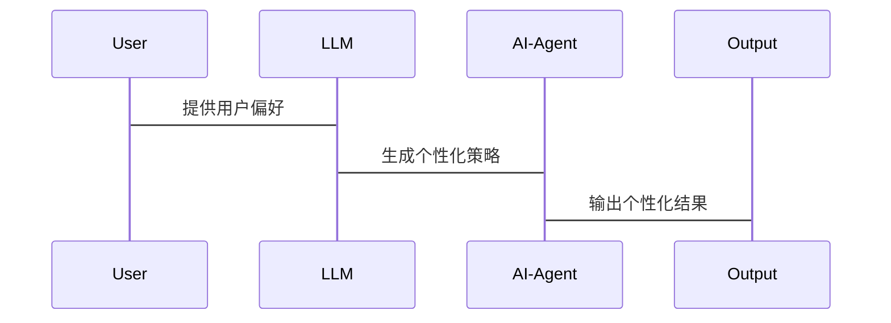

                 


# LLM驱动的AI Agent个性化：适应用户偏好

**关键词：** LLM, AI Agent, 个性化, 用户偏好, 大语言模型, 自适应系统

**摘要：** 本文探讨了如何利用大语言模型（LLM）驱动的AI代理实现个性化适应用户偏好的技术。文章从背景介绍、核心概念、算法原理、系统架构、项目实战到最佳实践，详细分析了LLM在AI Agent中的应用，以及如何通过个性化适应提升用户体验。

---

## 第1章：背景介绍

### 1.1 问题背景
#### 1.1.1 定义：LLM驱动的AI Agent
- **LLM（Large Language Model）**：基于大量数据训练的深度学习模型，能够理解和生成自然语言文本。
- **AI Agent**：一种智能体，能够根据用户需求执行任务，提供服务或交互。

#### 1.1.2 当前现状：个性化需求的增长
- 用户对个性化服务的需求日益增长，尤其是在信息过载和选择多样性增加的背景下。
- 传统AI Agent的功能相对固定，难以适应用户的个性化偏好。

#### 1.1.3 发展趋势：AI Agent的智能化与个性化
- 随着LLM技术的成熟，AI Agent逐渐具备更强的自然语言处理能力和个性化适应能力。

### 1.2 问题描述
#### 1.2.1 用户需求的多样性
- 用户的偏好、习惯和使用场景千差万别，单一的AI Agent难以满足所有用户的需求。
- 例如，不同用户对信息的过滤、推荐和交互方式的需求不同。

#### 1.2.2 AI Agent的功能局限性
- 传统AI Agent通常基于规则或简单的数据驱动方法，缺乏灵活性和深度理解能力。
- 难以处理复杂场景下的个性化需求。

#### 1.2.3 个性化适应的必要性
- 通过个性化适应，AI Agent能够更好地满足用户需求，提升用户体验和满意度。

### 1.3 问题解决
#### 1.3.1 LLM的优势
- **强大的自然语言处理能力**：LLM能够理解上下文、推理和生成自然语言文本。
- **可扩展性**：LLM可以通过微调或提示工程技术快速适应不同任务和场景。

#### 1.3.2 AI Agent的个性化适应方法
- 基于用户行为数据和偏好分析，动态调整AI Agent的行为策略。
- 通过LLM的参数微调或提示工程，实现个性化内容生成和推荐。

#### 1.3.3 边界与外延
- **边界**：个性化适应仅在LLM的能力范围内，无法处理超出模型训练数据范围的任务。
- **外延**：个性化适应可以扩展到更多场景，如情感分析、对话生成等。

### 1.4 核心要素
#### 1.4.1 LLM模型
- 选择合适的LLM模型（如GPT、PaLM等）作为AI Agent的核心模块。
- 模型的可定制性和适应性是个性化适应的关键。

#### 1.4.2 用户偏好分析
- 通过用户行为数据、反馈和历史记录，分析用户的偏好和需求。
- 建立用户画像，为个性化适应提供依据。

#### 1.4.3 个性化策略
- 根据用户偏好，动态调整AI Agent的输出内容、交互方式和推荐策略。

---

## 第2章：核心概念与联系

### 2.1 LLM与AI Agent的关系
#### 2.1.1 LLM作为AI Agent的核心模块
- LLM提供自然语言理解和生成能力，是AI Agent实现个性化适应的基础。
- AI Agent通过LLM进行对话生成、信息检索和内容推荐。

#### 2.1.2 AI Agent的个性化适应机制
- 个性化适应是通过LLM的参数调整或提示工程技术实现的。
- 例如，通过微调LLM模型，使其更符合特定用户的偏好和需求。

#### 2.1.3 用户偏好与模型输出的关联
- 用户的偏好影响AI Agent的输出内容和交互方式。
- 例如，用户喜欢简洁的表达，AI Agent会调整输出风格以满足需求。

### 2.2 核心概念属性对比
#### 表格：LLM与传统NLP模型的对比
| 属性         | LLM模型                     | 传统NLP模型               |
|--------------|-----------------------------|--------------------------|
| 处理能力     | 高度复杂，支持多种任务       | 专注于单一任务             |
| 数据需求     | 需要大量数据训练             | 数据需求相对较少           |
| 灵活性       | 高度可定制，适应性强         | 灵活性较低                 |

#### 表格：个性化适应与非个性化适应的对比
| 属性         | 个性化适应                 | 非个性化适应               |
|--------------|-----------------------------|--------------------------|
| 适应能力     | 高度个性化，满足特定用户需求 | 非个性化，适用于所有用户     |
| 效果         | 更精准，用户体验更好         | 可能不够精准，用户体验一般   |

### 2.3 ER实体关系图
- **Mermaid流程图：用户偏好 -> LLM -> AI Agent -> 输出**
  ```mermaid
  graph TD
    A[用户偏好] --> B(LLM模型)
    B --> C[AI Agent]
    C --> D[输出]
  ```

---

## 第3章：算法原理讲解

### 3.1 LLM的训练与个性化微调
#### 3.1.1 LLM的训练过程
- **目标函数**：最大化似然概率，优化模型参数以生成符合上下文的文本。
  $$ \mathcal{L}(\theta) = -\sum_{i=1}^{N} \log p_{\theta}(w_i | w_{<i}) $$
- **训练数据**：大规模多样化的文本数据，涵盖多种语言和领域。

#### 3.1.2 个性化微调
- **微调方法**：
  - 在预训练的基础上，使用特定领域的数据进行微调。
  - 例如，针对金融领域的用户，微调LLM以生成更专业的金融内容。

#### 3.1.3 微调的数学模型
- **微调目标函数**：
  $$ \mathcal{L}_{\text{fine-tune}}(\theta) = \lambda \mathcal{L}(\theta) + (1-\lambda) \mathcal{L}_{\text{domain}}(\theta) $$
  其中，$\lambda$是平衡系数，$\mathcal{L}_{\text{domain}}$是特定领域的损失函数。

---

## 第4章：系统分析与架构设计

### 4.1 系统功能设计
#### 4.1.1 领域模型：Mermaid类图


#### 4.1.2 系统架构设计：Mermaid架构图


### 4.2 系统接口设计
- **输入接口**：接收用户的自然语言输入或命令。
- **输出接口**：生成个性化文本或执行任务。

### 4.3 系统交互：Mermaid序列图


---

## 第5章：项目实战

### 5.1 环境安装
- **依赖项**：
  - Python 3.8+
  - transformers库（用于加载和微调LLM）
  - scikit-learn库（用于用户偏好分析）

### 5.2 核心代码实现
#### 5.2.1 加载LLM模型
```python
from transformers import AutoModelForCausalLM, AutoTokenizer

model_name = "gpt2"
model = AutoModelForCausalLM.from_pretrained(model_name)
tokenizer = AutoTokenizer.from_pretrained(model_name)
```

#### 5.2.2 微调LLM模型
```python
from transformers import Trainer, TrainingArguments

# 微调数据
train_dataset = ...  # 自定义数据集

# 训练参数
args = TrainingArguments(
    output_dir=".",
    overwrite_output_dir=True,
    num_epochs=3,
    per_device_train_batch_size=8,
)

trainer = Trainer(model=model, args=args, train_dataset=train_dataset)
trainer.train()
```

#### 5.2.3 用户偏好分析
```python
from sklearn.cluster import KMeans

user_data = [...]  # 用户行为数据
kmeans = KMeans(n_clusters=3).fit(user_data)
clusters = kmeans.labels_
```

### 5.3 案例分析
- **案例1**：金融领域用户的个性化报告生成。
  - 用户偏好：关注股票市场分析。
  - 微调后的模型生成更专业的金融报告。

### 5.4 项目总结
- 个性化适应能够显著提升用户体验。
- 微调LLM是实现个性化适应的有效方法。

---

## 第6章：最佳实践

### 6.1 经验总结
- **数据质量**：高质量的用户数据是个性化适应的基础。
- **模型选择**：选择适合任务的LLM模型，避免过度复杂的模型。

### 6.2 小结
- LLM驱动的AI Agent个性化适应是未来发展的趋势。
- 通过用户数据和模型微调，能够实现更精准的个性化服务。

### 6.3 注意事项
- **数据隐私**：确保用户数据的安全和隐私保护。
- **模型泛化能力**：避免过度个性化导致模型泛化能力下降。

### 6.4 拓展阅读
- 《Transformers: Pre-training of Text for Unsupervised Q&A and Dialog》
- 《Large Language Models: The New Frontier in AI》

---

**作者：AI天才研究院/AI Genius Institute & 禅与计算机程序设计艺术/Zen And The Art of Computer Programming**

