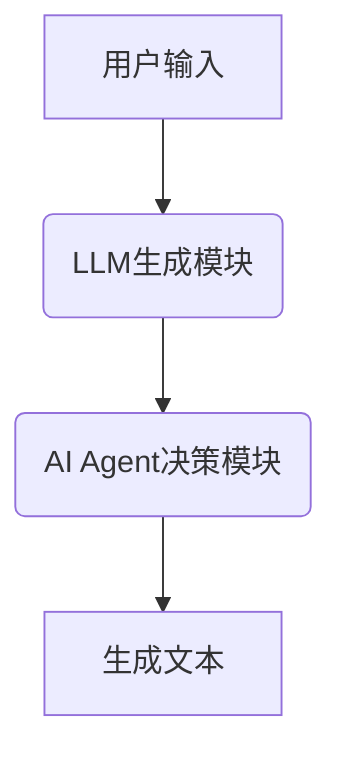
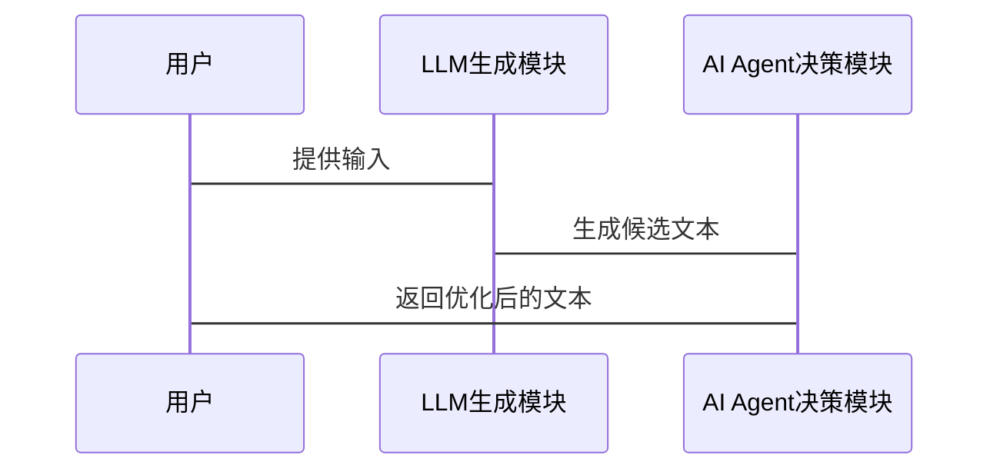

                 


# LLM驱动的AI Agent创意写作助手

## 关键词：
- 大语言模型（LLM）
- AI Agent
- 创意写作
- 自然语言处理（NLP）
- 人机交互

## 摘要：
本文详细探讨了如何利用大语言模型（LLM）驱动的AI Agent作为创意写作助手的原理、实现和应用。从LLM和AI Agent的基本概念出发，逐步分析其核心算法、系统架构，并通过具体项目实战展示其在创意写作中的潜力。文章最后总结了最佳实践和未来发展方向。

---

# 第一部分: LLM与AI Agent背景与概念

## 第1章: LLM与AI Agent概述

### 1.1 大语言模型（LLM）的基本概念
#### 1.1.1 什么是大语言模型
大语言模型（Large Language Model，LLM）是基于深度学习的自然语言处理模型，通过预训练海量文本数据，能够理解并生成人类语言。LLM的核心是Transformer架构，包括编码器和解码器两部分，能够处理序列数据。

$$
\text{Transformer结构公式}：
$$
\text{编码器} = \text{嵌入层} \rightarrow \text{多头自注意力} \rightarrow \text{前馈网络}
$$
$$
\text{解码器} = \text{嵌入层} \rightarrow \text{多头自注意力} \rightarrow \text{多头互注意力} \rightarrow \text{前馈网络}
$$

#### 1.1.2 LLM的核心特点
- **大规模预训练**：通过 billions 级别的参数量，学习语言的规律和上下文关系。
- **生成能力强**：能够生成连贯且有意义的文本。
- **多任务能力**：通过微调可以适应多种NLP任务，如翻译、问答、文本摘要。

#### 1.1.3 LLM与传统NLP模型的区别
| 特性       | 传统NLP模型                     | LLM                           |
|------------|--------------------------------|---------------------------------|
| 参数量     | 小（百万级别）                 | 大（ billions 级别）           |
| 任务适应性 | 专用性强，需要针对每个任务训练 | 通用性强，通过微调即可适应任务 |
| 训练数据   | 数据量小，领域有限             | 数据量大，覆盖广泛领域         |

### 1.2 AI Agent的基本概念
#### 1.2.1 什么是AI Agent
AI Agent（人工智能代理）是能够感知环境、自主决策并执行任务的智能体。它通过与用户交互，理解需求并提供相应的服务。

#### 1.2.2 AI Agent的类型
- **简单反射型**：基于规则直接响应输入。
- **基于模型型**：使用内部状态和环境模型进行决策。
- **基于学习型**：通过机器学习模型（如强化学习）优化行为。

#### 1.2.3 AI Agent的核心功能
- **感知**：通过传感器或输入接口获取信息。
- **决策**：基于当前状态和目标，做出决策。
- **执行**：通过动作或输出接口实现决策。

### 1.3 LLM驱动的AI Agent的定义与特点
#### 1.3.1 定义
LLM驱动的AI Agent是一种结合了大语言模型生成能力和AI Agent智能决策能力的系统，能够通过自然语言理解与生成，提供智能化的服务。

#### 1.3.2 核心优势
- **强大的生成能力**：LLM能够生成高质量的文本内容。
- **智能决策**：AI Agent能够根据上下文和用户需求，做出最优决策。
- **灵活性**：适用于多种场景，如写作、客服、教育等。

#### 1.3.3 应用场景
- **创意写作**：帮助用户生成故事、文案等。
- **客服助手**：提供智能问答、客户支持。
- **教育辅助**：提供学习指导、作业解答。

### 1.4 创意写作助手的背景与需求
#### 1.4.1 创意写作的基本需求
- 内容多样性：生成不同风格和主题的内容。
- 高度个性化：根据用户需求定制内容。
- 高效性：快速生成高质量内容。

#### 1.4.2 传统写作工具的局限性
- 内容生成能力有限。
- 缺乏互动性，无法根据用户反馈实时调整。
- 功能单一，难以满足多样化需求。

#### 1.4.3 LLM驱动的AI Agent在创意写作中的潜力
- 提供多样化的写作灵感。
- 实时互动，根据用户反馈优化内容。
- 支持多种写作风格和主题。

### 1.5 本章小结
本章介绍了LLM和AI Agent的基本概念，并重点分析了LLM驱动的AI Agent在创意写作中的潜力和优势。通过对比传统NLP模型和LLM的特点，展示了LLM在创意写作中的独特优势。

---

## 第2章: LLM驱动的AI Agent核心概念与原理

### 2.1 LLM的训练与优化
#### 2.1.1 基于Transformer的模型结构
Transformer模型由编码器和解码器组成，编码器负责将输入序列编码为上下文向量，解码器根据编码结果生成输出序列。

$$
\text{编码器结构公式}：
$$
$$
\text{解码器结构公式}：
$$

#### 2.1.2 大规模预训练的原理
LLM通过预训练海量数据，学习语言的语法、语义和上下文关系。预训练目标包括预测下一个词（语言模型）和生成文本摘要等任务。

#### 2.1.3 微调与适应任务的方法
微调（Fine-tuning）是将预训练的LLM在特定任务数据上进行进一步训练，以优化模型在目标任务上的性能。

### 2.2 LLM的注意力机制
#### 2.2.1 自注意力机制的原理
自注意力机制允许模型在生成文本时，关注输入序列中的重要部分，从而生成更连贯的文本。

$$
\text{自注意力机制公式}：
$$

#### 2.2.2 多头注意力的实现
多头注意力通过并行处理多个子序列，增强模型对不同上下文信息的捕捉能力。

### 2.3 LLM的生成机制
#### 2.3.1 解码器的结构与作用
解码器负责根据编码器生成的上下文向量，逐步生成输出序列。

#### 2.3.2 生成式模型的工作流程
生成式模型通过贪心搜索或采样方法，从解码器输出中选择最可能的下一个词。

#### 2.3.3 温度与Top-k采样在生成中的作用
- **温度**：控制生成的多样性和确定性。温度越高，生成越多样化；温度越低，生成越确定。
- **Top-k采样**：从生成词中选择Top-k概率最高的词，减少生成的随机性。

---

## 第3章: AI Agent的智能决策与交互

### 3.1 AI Agent的决策模型
#### 3.1.1 基于LLM的决策树构建
AI Agent通过LLM生成多个决策选项，构建决策树以选择最优路径。

#### 3.1.2 状态-动作-奖励模型（SAR）的原理
SAR模型通过状态、动作和奖励三者之间的关系，优化AI Agent的决策行为。

#### 3.1.3 基于强化学习的决策优化
强化学习通过奖励机制，优化AI Agent的决策策略，提升生成内容的质量。

### 3.2 AI Agent的自然语言理解与生成
#### 3.2.1 基于LLM的语义理解
LLM通过上下文理解用户意图，生成符合需求的文本。

#### 3.2.2 多轮对话的实现
AI Agent能够维护对话上下文，实现多轮对话，提供更自然的交互体验。

#### 3.2.3 基于上下文的生成策略
AI Agent根据上下文信息，调整生成策略，生成更符合用户需求的文本。

### 3.3 AI Agent的交互设计
#### 3.3.1 用户意图识别
AI Agent通过自然语言处理技术，识别用户的意图和需求。

#### 3.3.2 自然语言的生成与优化
AI Agent根据用户需求，生成高质量的文本内容，并通过优化算法提升生成质量。

#### 3.3.3 交互中的反馈机制
用户对生成内容的反馈被用于优化AI Agent的生成策略，提升用户体验。

---

## 第4章: LLM驱动的AI Agent算法原理与实现

### 4.1 LLM驱动的AI Agent算法原理
#### 4.1.1 解码器的实现
解码器通过多头自注意力机制和前馈网络，生成输出序列。

#### 4.1.2 生成策略的选择
生成策略包括贪心搜索、随机采样和Top-k采样，选择最适合当前任务的策略。

#### 4.1.3 基于强化学习的优化
强化学习通过奖励机制，优化生成策略，提升生成内容的质量。

---

## 第5章: 系统架构与项目实战

### 5.1 创意写作助手的系统架构设计
#### 5.1.1 系统功能模块
- 用户输入模块：接收用户的输入。
- LLM生成模块：调用LLM生成文本内容。
- AI Agent决策模块：根据用户反馈优化生成内容。

#### 5.1.2 系统架构图


#### 5.1.3 系统接口设计
- 输入接口：接收用户输入的文本。
- 输出接口：输出生成的文本内容。

#### 5.1.4 系统交互流程图


### 5.2 项目实战
#### 5.2.1 环境安装
```bash
pip install transformers
pip install torch
```

#### 5.2.2 核心实现代码
```python
from transformers import GPT2LMHeadModel, GPT2Tokenizer

tokenizer = GPT2Tokenizer.from_pretrained('gpt2')
model = GPT2LMHeadModel.from_pretrained('gpt2')

def generate_text(prompt, max_length=50):
    inputs = tokenizer.encode(prompt, return_tensors='pt')
    outputs = model.generate(inputs, max_length=max_length, do_sample=True)
    return tokenizer.decode(outputs[0], skip_special_tokens=True)
```

#### 5.2.3 功能解读
上述代码展示了如何使用GPT-2模型生成文本。用户输入一个prompt，模型根据prompt生成max_length长度的文本。

#### 5.2.4 实际案例分析
用户输入：“写一篇科幻小说的开头。”，生成文本：“在一个遥远的星球上，人类发现了一种神秘的能量源……”

---

## 第6章: 最佳实践与小结

### 6.1 最佳实践 tips
- **数据隐私**：确保用户数据的安全性。
- **模型调优**：根据具体任务优化模型参数。
- **用户体验**：提供多样化的生成选项，满足不同用户需求。

### 6.2 本章小结
本文详细探讨了LLM驱动的AI Agent在创意写作中的应用，从背景、原理到实现，全面分析了其潜力和优势。通过项目实战，展示了如何利用现有技术构建一个高效的创意写作助手。

### 6.3 注意事项
- 注意模型的训练成本，优化资源利用。
- 定期更新模型，保持生成内容的时效性。

### 6.4 拓展阅读
- 建议进一步研究强化学习在AI Agent中的应用。
- 关注最新的LLM模型和技术进展。

---

# 作者：AI天才研究院/AI Genius Institute & 禅与计算机程序设计艺术 /Zen And The Art of Computer Programming

---

以上是《LLM驱动的AI Agent创意写作助手》的技术博客文章的完整内容。希望这篇文章能够为读者提供关于LLM和AI Agent在创意写作中的应用的全面了解，并为未来的实践提供有价值的参考。

