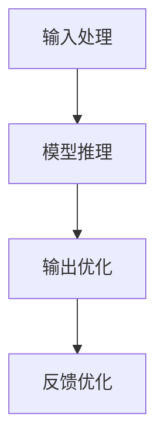
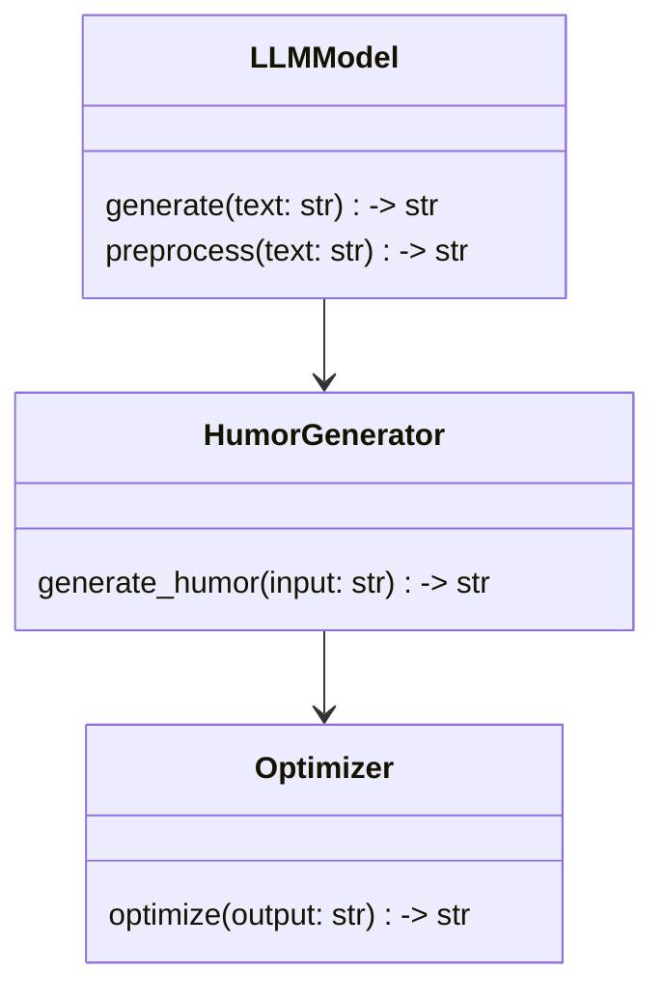
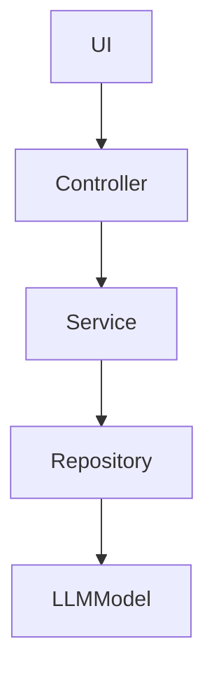
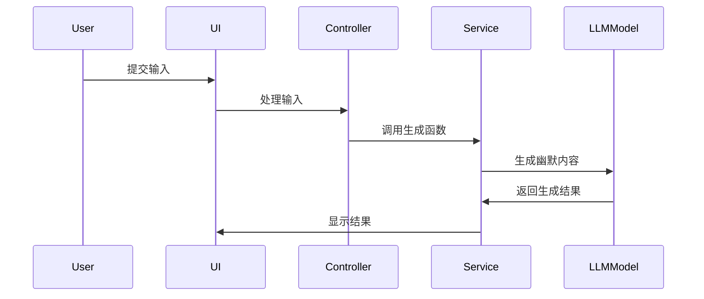

                 


# LLM驱动的AI Agent幽默感生成

> **关键词**: 大语言模型, AI Agent, 幽默感生成, 人机交互, 强化学习, 算法实现

> **摘要**: 本文探讨了如何利用大语言模型（LLM）驱动的AI Agent生成幽默感。通过分析幽默的多维特征、LLM和AI Agent的基本原理，提出了一种基于强化学习的幽默生成算法，并结合系统架构设计和项目实战，展示了如何实现高效的幽默感生成系统。本文还讨论了幽默生成的挑战、优化策略以及未来的研究方向。

---

## 引言

幽默感是人类语言交流中一种重要的情感表达方式，能够拉近人与人之间的距离，提升沟通的趣味性。随着人工智能技术的快速发展，如何让AI Agent也具备幽默感，使其在人机交互中更加生动有趣，成为研究者们关注的焦点。

LLM（Large Language Model）作为当前最前沿的自然语言处理技术，具有强大的生成能力和理解能力。通过将LLM与AI Agent结合，我们可以实现基于上下文的智能幽默生成。本文将从理论到实践，详细探讨LLM驱动的AI Agent幽默感生成的实现方法。

---

## 第1章: 幽默感的定义与重要性

### 1.1 幽默的多维度特征

幽默是一种复杂的情感表达，涉及语言、文化和语境等多个维度。它可以通过双关语、夸张、反讽、情境依赖等方式实现。幽默的核心在于通过出人意料的方式打破常规，引发观众的笑声或共鸣。

**表1-1: 幽默的主要特征对比**

| 特征维度 | 描述 |
|----------|------|
| 语言性    | 依赖语言结构和语义 |
| 文化性    | 受文化背景影响 |
| 情境性    | 依赖具体语境 |
| 普遍性    | 笑点可能具有普遍性 |

### 1.2 LLM与AI Agent的基本概念

#### 1.2.1 LLM的基本概念

大语言模型（LLM）是一种基于深度学习的自然语言处理模型，具有强大的文本生成和理解能力。常见的LLM包括GPT系列、BERT系列等。

#### 1.2.2 AI Agent的核心功能

AI Agent是一种智能体，能够根据环境信息自主决策并执行任务。它通常包括感知、推理、规划和执行四个模块。

#### 1.2.3 LLM与AI Agent的结合

通过将LLM作为AI Agent的“大脑”，我们可以实现基于上下文的智能对话生成，从而赋予AI Agent幽默感。

---

## 第2章: LLM与AI Agent的基本原理

### 2.1 LLM的工作原理

#### 2.1.1 大语言模型的训练机制

LLM通常采用监督学习和无监督学习结合的方式进行训练，通过海量数据学习语言的规律。

#### 2.1.2 LLM的生成过程

生成过程主要基于解码器的自回归机制，通过逐词生成来构建完整的文本。

#### 2.1.3 LLM的局限性

尽管LLM具有强大的生成能力，但其生成的内容可能存在逻辑不连贯、语境理解不足等问题。

### 2.2 AI Agent的核心功能

#### 2.2.1 AI Agent的定义与分类

AI Agent可以分为简单反应式Agent和基于模型的反思式Agent两类。

#### 2.2.2 AI Agent的任务模型

任务模型包括状态表示、动作选择和目标函数三个部分。

#### 2.2.3 AI Agent的交互方式

AI Agent可以通过文本、语音、视觉等多种方式与用户进行交互。

### 2.3 LLM驱动的AI Agent幽默感生成的基本框架

#### 2.3.1 框架的组成

框架通常包括输入处理、模型推理和输出优化三个模块。

#### 2.3.2 框架的实现流程

1. 接收用户输入；
2. 进行语义解析；
3. 调用LLM生成幽默内容；
4. 输出生成结果。

#### 2.3.3 框架的优化方向

包括优化算法、提升文化适应性和增强语境理解能力等方面。

---

## 第3章: 幽默感生成的机制

### 3.1 幽默的结构分析

#### 3.1.1 双关语的结构

双关语通常依赖于词语的多义性，通过制造歧义来达到幽默效果。

#### 3.1.2 夸张与反讽的结构

夸张通过放大事实，反讽则通过表面肯定实则否定的方式制造幽默。

#### 3.1.3 情境依赖的幽默

幽默的生成往往依赖于具体的语境，不同的情境可能导致相同的笑话产生不同的效果。

### 3.2 幽默生成的逻辑推理

#### 3.2.1 基于意图的幽默生成

根据用户的意图生成相应的幽默内容。

#### 3.2.2 基于语义的幽默生成

基于文本的语义关系生成幽默内容。

#### 3.2.3 基于语境的幽默生成

结合具体的语境信息生成幽默内容。

### 3.3 幽默生成的挑战

#### 3.3.1 文化差异的影响

不同文化背景下，幽默的表达方式和笑点可能大不相同。

#### 3.3.2 语境理解的复杂性

幽默的生成需要准确理解复杂的语境信息。

#### 3.3.3 用户反馈的不确定性

用户的反馈可能存在主观性和模糊性，影响模型的优化。

---

## 第4章: 基于LLM的幽默生成算法

### 4.1 基于LLM的幽默生成流程

#### 4.1.1 输入处理

接收用户的输入，并进行初步的预处理。

#### 4.1.2 模型推理

调用LLM生成初步的幽默内容。

#### 4.1.3 输出优化

根据反馈优化生成内容，提升幽默效果。

### 4.2 基于强化学习的幽默优化

#### 4.2.1 强化学习的基本原理

强化学习通过奖励机制优化模型的生成效果。

#### 4.2.2 幽默生成的奖励函数设计

奖励函数通常基于用户反馈和生成内容的质量进行设计。

#### 4.2.3 训练过程中的挑战

包括训练效率、奖励函数设计和模型收敛性等问题。

### 4.3 基于LLM的幽默生成算法实现

#### 4.3.1 算法流程图



#### 4.3.2 算法伪代码

```python
def generate_humor(input):
    preprocessed_input = preprocess(input)
    initial_output = llm.generate(preprocessed_input)
    optimized_output = optimize(initial_output)
    return optimized_output
```

#### 4.3.3 算法优化建议

包括优化奖励函数设计、改进预处理模块和提升模型训练效率等方面。

---

## 第5章: 系统架构设计

### 5.1 系统需求分析

#### 5.1.1 功能需求

系统需要具备幽默生成、用户反馈、结果优化等功能。

#### 5.1.2 性能需求

系统需要具备高响应速度和良好的扩展性。

### 5.2 系统功能设计

#### 5.2.1 领域模型类图



#### 5.2.2 系统架构图



#### 5.2.3 系统交互图



---

## 第6章: 项目实战

### 6.1 环境配置

需要安装Python、TensorFlow等依赖库。

### 6.2 核心实现源代码

```python
class LLMModel:
    def __init__(self):
        pass

    def generate(self, text):
        pass

class HumorGenerator:
    def __init__(self, llm_model):
        self.llm_model = llm_model

    def generate_humor(self, input_text):
        preprocessed = self.preprocess(input_text)
        output = self.llm_model.generate(preprocessed)
        return self.optimize(output)

    def preprocess(self, text):
        pass

    def optimize(self, text):
        pass
```

### 6.3 实际案例分析

通过具体案例分析幽默生成的效果和优化方向。

---

## 第7章: 总结与展望

### 7.1 全文总结

本文详细探讨了LLM驱动的AI Agent幽默感生成的实现方法，提出了基于强化学习的幽默生成算法，并结合系统架构设计和项目实战，展示了如何实现高效的幽默感生成系统。

### 7.2 应用前景

幽默生成技术在人机交互、教育、娱乐等领域具有广阔的应用前景。

### 7.3 未来方向

未来的研究可以进一步优化幽默生成算法，提升模型的跨文化适应性和语境理解能力。

---

## 附录

### 附录A: 相关术语解释

对文中涉及的专业术语进行详细解释。

### 附录B: 参考文献

列出本文参考的文献资料。

---

## 作者

**作者**：AI天才研究院/AI Genius Institute & 禅与计算机程序设计艺术 /Zen And The Art of Computer Programming

---

本文通过系统化的分析和实践，详细探讨了LLM驱动的AI Agent幽默感生成的实现方法。从理论到实践，为研究者和开发者提供了宝贵的参考。

