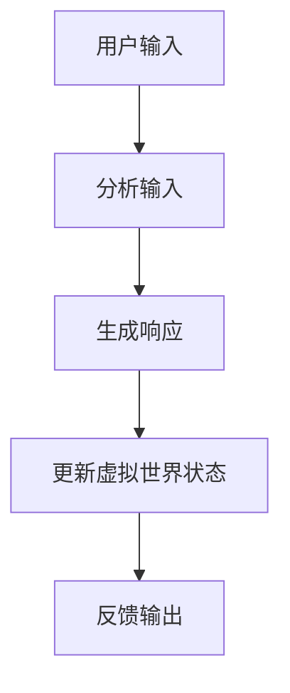
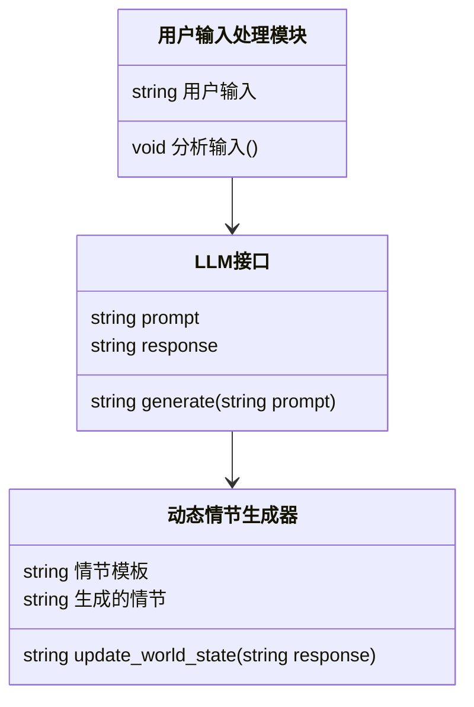
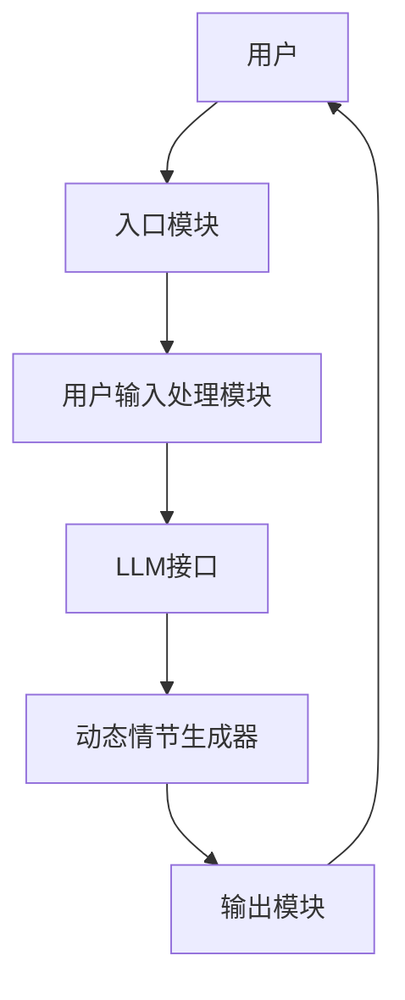
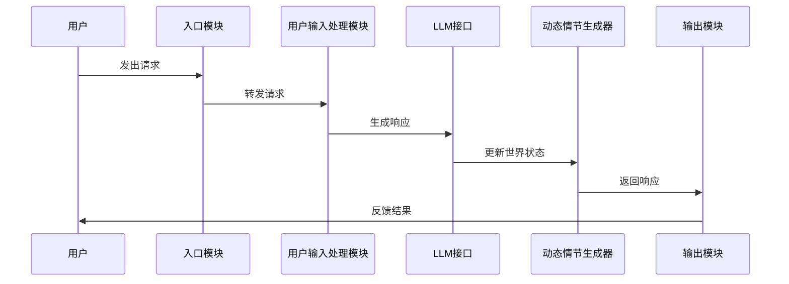

                 


# LLM驱动的AI Agent虚构世界构建器

> 关键词：LLM, AI Agent, 虚构世界, 构建器, 人工智能, 大语言模型

> 摘要：本文详细探讨了如何利用大语言模型（LLM）驱动的人工智能代理（AI Agent）构建虚构世界。通过分析核心概念、算法原理、系统架构以及实际项目案例，本文为读者提供了从理论到实践的全面指南，帮助理解并实现高效的虚拟世界构建。

---

## 第1章 背景介绍

### 1.1 问题背景

#### 1.1.1 虚拟世界构建的定义与目标
虚拟世界构建是指通过技术手段创建一个模拟或虚构的环境，用户可以在其中互动、探索和体验。其目标是提供沉浸式的体验，使得用户能够与虚拟世界中的元素进行交互，并感受到环境的变化。

#### 1.1.2 LLM在虚拟世界构建中的作用
大语言模型（LLM）通过自然语言处理技术，能够生成丰富、动态的文本内容，为虚拟世界的对话系统和情节生成提供了强大的支持。

#### 1.1.3 AI Agent在虚拟世界构建中的角色
AI Agent作为智能代理，负责接收用户的输入，分析意图，并在虚拟世界中执行相应的操作，推动情节的发展。

#### 1.1.4 当前问题与解决方案
传统的虚拟世界构建依赖手动编码，效率低下且难以扩展。LLM驱动的AI Agent能够动态生成内容，实时调整情节，显著提升了构建效率和用户体验。

#### 1.1.5 虚拟世界构建的边界与外延
本文主要关注基于文本的虚拟世界构建，不涉及图形化虚拟现实或增强现实。外延包括与其他技术的结合，如游戏引擎的集成。

#### 1.1.6 核心要素组成
- LLM：提供文本生成能力
- AI Agent：负责用户交互和任务执行
- 对话系统：处理用户输入并生成响应
- 动态情节生成器：实时调整虚拟世界的状态
- 用户输入处理模块：接收并解析用户输入
- 虚拟世界状态管理器：维护世界的状态和规则

---

## 第2章 核心概念与联系

### 2.1 LLM与AI Agent的关系

#### 2.1.1 LLM作为AI Agent的核心驱动力
LLM为AI Agent提供文本生成能力，使其能够与用户进行自然语言交互。

#### 2.1.2 AI Agent作为LLM的执行载体
AI Agent利用LLM生成的文本，执行任务并推动虚拟世界的发展。

#### 2.1.3 两者结合的协同效应
通过协同工作，LLM和AI Agent能够实现动态、智能的虚拟世界构建。

### 2.2 核心概念原理

#### 2.2.1 LLM的原理概述
LLM通过概率分布生成文本，基于训练数据学习语言模式。

#### 2.2.2 AI Agent的原理概述
AI Agent接收输入，分析意图，并在虚拟世界中执行相应的操作。

### 2.3 核心概念属性对比

| 属性          | LLM                       | AI Agent                     |
|---------------|---------------------------|-----------------------------|
| 功能          | 文本生成                  | 任务执行与交互              |
| 输入类型      | 文本输入                  | 用户输入与虚拟世界状态     |
| 输出类型      | 文本输出                  | 动态内容与状态更新          |
| 应用场景      | 对话生成、内容创作        | 虚拟世界构建、任务执行      |

### 2.4 ER实体关系图

```mermaid
er
actor(用户) -|> 虚拟世界构建器
虚拟世界构建器 -|> LLM模型
虚拟世界构建器 -|> AI Agent
```

---

## 第3章 算法原理讲解

### 3.1 LLM驱动的AI Agent算法流程



### 3.2 数学模型与公式

#### 3.2.1 LLM的核心数学模型
文本生成的概率模型：
$$ P(w_1, w_2, ..., w_n) = \prod_{i=1}^n P(w_i | w_1, ..., w_{i-1}) $$

#### 3.2.2 AI Agent的决策模型
基于概率的决策树：
$$ P(action | state) = \text{max}_\text{action} Q(state, action) $$

#### 3.2.3 示例代码
```python
def llm_generate(text_prompt):
    # 调用LLM API生成文本
    response = openai.ChatCompletion.create(
        model="gpt-3.5-turbo",
        messages=[{"role": "user", "content": text_prompt}]
    )
    return response.choices[0].message.content

def ai_agent_action(prompt):
    # 调用LLM生成响应
    response = llm_generate(prompt)
    # 更新虚拟世界状态
    update_world_state(response)
    return response
```

---

## 第4章 系统分析与架构设计方案

### 4.1 项目介绍

#### 4.1.1 项目场景
基于文本的虚拟故事生成系统，用户与AI Agent互动，生成动态故事。

### 4.2 系统功能设计

#### 4.2.1 领域模型



### 4.3 系统架构设计



### 4.4 系统接口设计

#### 4.4.1 接口定义
- 用户输入接口：接收用户输入文本
- LLM接口：生成响应文本
- 动态情节生成器接口：更新虚拟世界状态

### 4.5 系统交互流程



---

## 第5章 项目实战

### 5.1 环境安装

```bash
pip install openai transformers
```

### 5.2 核心代码实现

#### 5.2.1 用户输入处理模块

```python
def process_user_input(user_input):
    # 分析输入并生成prompt
    prompt = f"基于用户输入：{user_input}，生成一个动态情节。"
    return prompt
```

#### 5.2.2 LLM接口实现

```python
def llm_generate(prompt):
    # 调用LLM生成响应
    response = openai.ChatCompletion.create(
        model="gpt-3.5-turbo",
        messages=[{"role": "user", "content": prompt}]
    )
    return response.choices[0].message.content
```

#### 5.2.3 动态情节生成器

```python
def update_world_state(response):
    # 更新虚拟世界状态
    print(f"虚拟世界状态更新：{response}")
```

### 5.3 案例分析

#### 5.3.1 实际案例

```python
user_input = "用户希望生成一个科幻故事。"
prompt = process_user_input(user_input)
response = llm_generate(prompt)
update_world_state(response)
```

### 5.4 项目总结

通过以上实现，我们构建了一个基于LLM的AI Agent虚拟世界构建系统，能够动态生成情节，提升用户体验。未来可以优化算法，提升生成效率。

---

## 第6章 最佳实践

### 6.1 最佳实践 tips

- **选择合适的LLM模型**：根据需求选择合适的模型，如较小的模型适合快速响应。
- **优化系统交互流程**：减少不必要的步骤，提升用户体验。
- **处理多样性输入**：设计灵活的输入处理模块，适应不同的用户需求。

### 6.2 小结

本文详细介绍了LLM驱动的AI Agent在虚拟世界构建中的应用，从理论到实践，为读者提供了全面的指导。

### 6.3 注意事项

- 确保系统的实时性和响应速度。
- 处理模型的计算资源需求，避免性能瓶颈。

### 6.4 拓展阅读

- 推荐阅读《Large Language Models for Text Generation》。
- 关注AI Agent在游戏开发中的应用。

---

## 作者

作者：AI天才研究院 & 禅与计算机程序设计艺术

--- 

希望这篇文章能够帮助读者理解并实现基于LLM的AI Agent虚构世界构建器。通过逐步分析和详细讲解，本文为技术开发者和研究人员提供了理论与实践相结合的指导。

