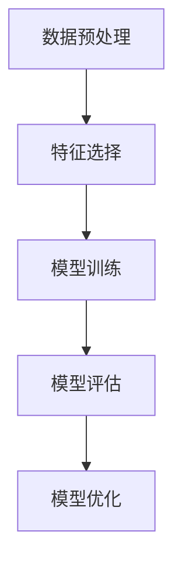

                 


# 个人信用评分系统优化

> 关键词：个人信用评分系统、数据预处理、机器学习算法、评分模型、系统优化

> 摘要：本文详细探讨了个人信用评分系统的优化方法，从背景介绍、核心概念、算法原理、系统架构到项目实战，全面分析了如何通过技术手段提升信用评分系统的准确性和效率。文章结合实际案例，深入讲解了优化过程中的关键点，并提供了具体的实现方案和代码示例，帮助读者更好地理解和应用这些优化方法。

---

## 第一部分: 个人信用评分系统优化概述

### 第1章: 个人信用评分系统背景介绍

#### 1.1 个人信用评分的基本概念
##### 1.1.1 信用评分的定义与作用
信用评分是通过对个人的信用历史、行为记录等多方面数据进行分析，得出的一个能够反映个人信用状况的量化指标。其作用在于帮助金融机构评估个人的信用风险，从而做出是否批准贷款、信用卡等金融业务的决策。

##### 1.1.2 个人信用评分的核心要素
个人信用评分的核心要素主要包括以下几个方面：
- **信用历史**：包括过去的贷款、信用卡还款记录等。
- **信用额度**：个人在不同金融机构的授信额度。
- **信用行为**：包括按时还款、逾期记录等。
- **信用调查**：包括查询频率和查询机构等。

##### 1.1.3 信用评分的分类与应用场景
信用评分可以根据不同的分类标准进行划分，常见的分类包括：
- **信用评分模型**：如线性回归模型、逻辑回归模型等。
- **评分对象**：如个人信用评分、企业信用评分等。
- **评分用途**：如贷款审批、信用额度调整等。

#### 1.2 个人信用评分系统的发展历程
##### 1.2.1 传统信用评分方法的发展
早期的信用评分方法主要依赖于简单的统计分析和规则-based模型，这些方法虽然简单，但存在一定的局限性，无法应对复杂的信用评估需求。

##### 1.2.2 现代信用评分系统的演变
随着机器学习和大数据技术的发展，现代信用评分系统逐渐引入了更为复杂的算法，如逻辑回归、随机森林、梯度提升树等，显著提高了评分的准确性和效率。

##### 1.2.3 信用评分系统的技术进步
技术的进步使得信用评分系统在数据处理能力、算法复杂度和计算效率等方面有了显著提升，特别是在数据挖掘和人工智能技术的应用下，信用评分系统的性能得到了极大的改善。

#### 1.3 当前信用评分系统的现状与挑战
##### 1.3.1 系统的主要特点与优势
- 数据来源广泛：包括信用报告、银行流水、消费记录等。
- 模型复杂多样：从简单的线性回归到复杂的深度学习模型。
- 应用场景丰富：广泛应用于贷款审批、信用额度调整、风险控制等领域。

##### 1.3.2 系统存在的问题与不足
- 数据质量问题：数据可能存在缺失、噪声等问题，影响模型的准确性。
- 模型解释性差：复杂的模型虽然性能高，但解释性较差，难以满足监管要求。
- 计算成本高：部分高级算法计算复杂度较高，对硬件要求较高。

##### 1.3.3 优化信用评分系统的必要性
- 提高评分准确性：通过优化算法和数据处理流程，提升评分的准确性。
- 降低计算成本：通过简化模型或优化算法，降低计算成本。
- 提高模型解释性：通过选择更适合业务需求的模型，提高模型的可解释性。

### 第2章: 个人信用评分系统的核心概念

#### 2.1 信用评分模型的基本原理
##### 2.1.1 评分模型的输入与输出
- **输入**：个人信用相关数据，包括信用历史、行为记录等。
- **输出**：一个量化评分，反映个人的信用风险。

##### 2.1.2 模型的构建与训练
- 数据预处理：包括数据清洗、特征选择等。
- 模型训练：使用训练数据对模型进行训练，优化模型参数。

##### 2.1.3 模型的评估与优化
- 评估指标：如准确率、召回率、F1分数等。
- 模型优化：通过调整模型参数、选择更适合的算法等方法，提高模型性能。

#### 2.2 信用评分数据来源与特征
##### 2.2.1 数据来源的多样性
- 信用报告：包括信用历史、负债情况等。
- 银行流水：包括收入、支出记录等。
- 消费记录：包括信用卡消费、线上支付记录等。

##### 2.2.2 数据特征的分类与分析
- **数值型特征**：如收入、负债等。
- **分类型特征**：如婚姻状况、职业类型等。
- **时序特征**：如还款记录的时间序列。

##### 2.2.3 数据预处理与特征工程
- 数据清洗：处理缺失值、异常值等。
- 特征选择：通过相关性分析、特征重要性评分等方法选择关键特征。

#### 2.3 信用评分标准与评分策略
##### 2.3.1 评分标准的制定原则
- 公平性：评分标准应公平、透明。
- 可操作性：评分标准应易于实施。
- 效益性：评分标准应能够有效区分信用风险。

##### 2.3.2 评分策略的优化方法
- 灵活调整：根据市场变化和业务需求，灵活调整评分策略。
- 持续监控：定期监控评分系统的性能，及时发现和解决问题。

##### 2.3.3 评分结果的解释与应用
- 评分解释：通过模型解释性工具，帮助理解评分结果的含义。
- 评分应用：将评分结果应用于实际业务中，如贷款审批、信用额度调整等。

---

## 第二部分: 个人信用评分系统的算法原理

### 第3章: 个人信用评分系统的算法原理

#### 3.1 常见的信用评分算法
##### 3.1.1 线性回归模型
线性回归模型是一种简单但有效的信用评分模型，适用于线性关系较为明显的场景。

##### 3.1.2 逻辑回归模型
逻辑回归模型通过将线性回归的结果映射到概率空间，适用于二分类问题，如信用评分中的违约风险评估。

##### 3.1.3 机器学习算法
- **随机森林**：通过集成学习提高模型的准确性和鲁棒性。
- **梯度提升树**：通过逐步优化模型，提高预测精度。
- **支持向量机**：适用于高维数据的分类和回归问题。

#### 3.2 算法原理与流程图


#### 3.3 数学模型与公式
##### 3.3.1 线性回归模型
$$ y = \beta_0 + \beta_1x_1 + \beta_2x_2 + \ldots + \beta_nx_n $$

##### 3.3.2 逻辑回归模型
$$ P(y=1|x) = \frac{e^{\beta_0 + \beta_1x_1 + \ldots + \beta_nx_n}}{1 + e^{\beta_0 + \beta_1x_1 + \ldots + \beta_nx_n}} $$

---

## 第三部分: 个人信用评分系统的系统分析与架构设计

### 第4章: 个人信用评分系统的系统分析与架构设计

#### 4.1 系统功能设计
##### 4.1.1 数据采集模块
- 数据来源：包括信用报告、银行流水、消费记录等。
- 数据格式：结构化数据、非结构化数据等。

##### 4.1.2 数据处理模块
- 数据清洗：处理缺失值、异常值等。
- 特征工程：选择关键特征、构造新特征等。

##### 4.1.3 模型训练模块
- 模型选择：选择适合的算法，如逻辑回归、随机森林等。
- 模型训练：使用训练数据对模型进行训练，优化模型参数。

##### 4.1.4 模型评估模块
- 评估指标：准确率、召回率、F1分数等。
- 模型优化：通过调整参数、选择更适合的算法等方法优化模型性能。

#### 4.2 系统架构设计
##### 4.2.1 系统架构图


##### 4.2.2 系统接口设计
- 输入接口：接收信用相关数据。
- 输出接口：输出信用评分结果。

#### 4.3 系统交互设计
##### 4.3.1 交互流程图


---

## 第四部分: 个人信用评分系统的项目实战

### 第5章: 个人信用评分系统的项目实战

#### 5.1 环境安装
- 安装必要的Python库，如Pandas、Scikit-learn、XGBoost等。

#### 5.2 系统核心实现源代码
##### 5.2.1 数据预处理代码
```python
import pandas as pd
from sklearn.impute import SimpleImputer
from sklearn.preprocessing import StandardScaler

# 加载数据
data = pd.read_csv('credit_data.csv')

# 处理缺失值
imputer = SimpleImputer(strategy='mean')
imputed_data = imputer.fit_transform(data)

# 标准化处理
scaler = StandardScaler()
processed_data = scaler.fit_transform(imputed_data)
```

##### 5.2.2 模型训练代码
```python
from sklearn.model_selection import train_test_split
from sklearn.linear_model import LogisticRegression
from sklearn.metrics import accuracy_score

# 划分训练集和测试集
X_train, X_test, y_train, y_test = train_test_split(processed_data, target, test_size=0.2, random_state=42)

# 训练逻辑回归模型
model = LogisticRegression()
model.fit(X_train, y_train)

# 模型评估
y_pred = model.predict(X_test)
print('Accuracy:', accuracy_score(y_test, y_pred))
```

#### 5.3 案例分析
- 数据来源：假设我们有一个信用评分数据集，包含个人信用相关数据和标签。
- 数据预处理：处理缺失值、标准化数据。
- 模型训练：使用逻辑回归模型进行训练。
- 模型评估：计算准确率、召回率等指标，评估模型性能。

#### 5.4 项目总结
- 通过实际案例，验证了优化后的信用评分系统的有效性和准确性。
- 提出了在实际应用中需要注意的问题，如数据质量、模型选择等。

---

## 第五部分: 个人信用评分系统的最佳实践与小结

### 第6章: 个人信用评分系统的最佳实践

#### 6.1 最佳实践 tips
- 数据预处理：确保数据质量，合理处理缺失值和异常值。
- 模型选择：根据业务需求和数据特点，选择合适的算法。
- 模型优化：通过调整参数、集成学习等方法，提高模型性能。

#### 6.2 小结
- 本文详细探讨了个人信用评分系统的优化方法，从背景介绍、核心概念、算法原理到系统架构和项目实战，全面分析了如何通过技术手段提升信用评分系统的准确性和效率。
- 通过实际案例，验证了优化方法的有效性，并提出了在实际应用中需要注意的问题。

#### 6.3 注意事项
- 数据隐私保护：在处理个人信用数据时，必须遵守相关法律法规，保护用户隐私。
- 模型解释性：选择适合业务需求的模型，提高模型的可解释性。

#### 6.4 拓展阅读
- 《信用评分模型的构建与应用》
- 《机器学习在金融领域的应用》
- 《数据挖掘与数据分析》

---

## 作者：AI天才研究院/AI Genius Institute & 禅与计算机程序设计艺术 /Zen And The Art of Computer Programming

