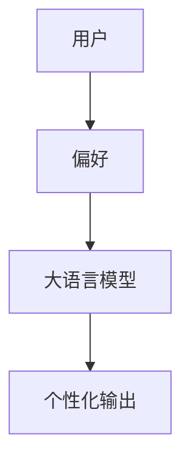
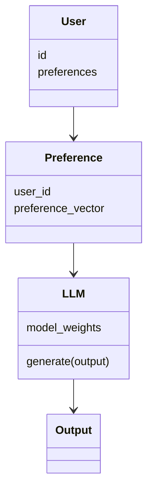
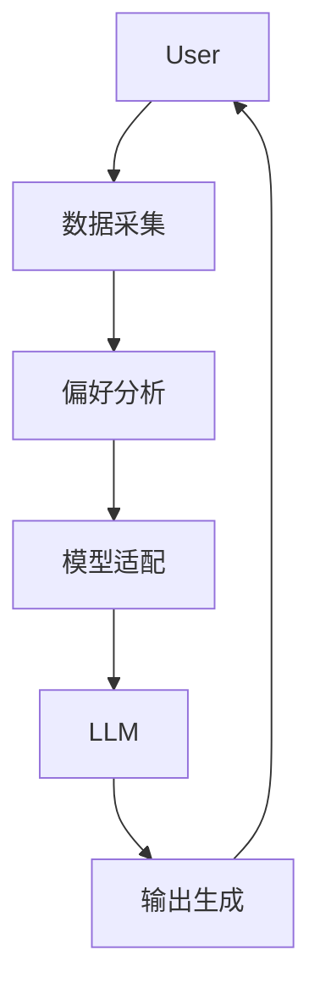
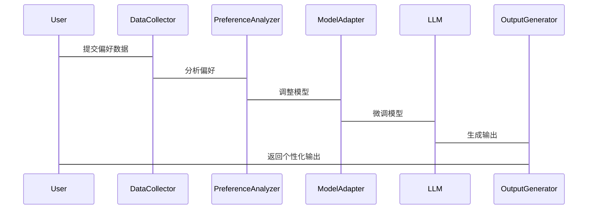

                 


# 《个性化AI Agent：根据用户偏好定制LLM》

## 关键词：个性化AI Agent，LLM，用户偏好，定制化训练，机器学习，自然语言处理

## 摘要：
个性化AI Agent通过根据用户的偏好定制大型语言模型（LLM），以提供更精准和个性化的服务。本文从背景、核心概念、算法原理、系统架构、项目实战到最佳实践，全面探讨如何实现基于用户偏好的LLM定制，涵盖从理论到实践的各个层面，帮助读者理解并应用这一技术。

---

## 第1章: 个性化AI Agent的背景与问题描述

### 1.1 问题背景

#### 1.1.1 传统AI Agent的局限性
传统的AI Agent通常基于固定的规则或预定义的模型，难以适应用户的个性化需求。例如，通用搜索引擎无法根据用户的偏好调整搜索结果的相关性。

#### 1.1.2 用户需求多样性的挑战
用户的需求千差万别，同一问题可能对不同用户有不同的最佳答案。例如，一个金融顾问的用户可能需要投资建议，而另一个用户可能需要风险评估。

#### 1.1.3 LLM在个性化定制中的潜力
LLM具有强大的生成和理解能力，通过定制化训练，可以根据用户的偏好生成个性化的输出。

### 1.2 问题描述

#### 1.2.1 个性化AI Agent的目标
个性化AI Agent的目标是根据用户的偏好，生成符合其独特需求的输出。

#### 1.2.2 用户偏好的定义与分类
用户偏好可以是显式（如用户直接提供的反馈）或隐式（如用户的浏览历史）。

#### 1.2.3 个性化LLM的实现路径
通过定制化训练或微调LLM，使其生成符合用户偏好的输出。

### 1.3 问题解决与边界

#### 1.3.1 个性化LLM的核心问题
如何捕捉和分析用户偏好，并将其整合到LLM的生成过程中。

#### 1.3.2 边界与外延
个性化LLM的定制仅限于用户的偏好，不涉及模型的其他方面。

#### 1.3.3 核心要素与组成结构
用户偏好、LLM、个性化输出。

---

## 第2章: 个性化AI Agent的核心概念与联系

### 2.1 核心概念原理

#### 2.1.1 用户偏好的捕捉与分析
通过用户的行为数据（如点击、输入）捕捉偏好。

#### 2.1.2 LLM的定制化训练与微调
通过迁移学习，使用用户的偏好数据微调LLM。

#### 2.1.3 个性化输出的生成机制
根据用户偏好调整生成策略。

### 2.2 核心概念对比表

| 概念       | 个性化LLM | 通用LLM |
|------------|-----------|---------|
| 用户输入   | 偏好数据   | 无偏好  |
| 输出目标   | 个性化输出 | 标准输出 |

### 2.3 ER实体关系图


---

## 第3章: 个性化LLM的训练与推理

### 3.1 算法原理概述

#### 3.1.1 损失函数
$$\text{Loss} = \text{交叉熵损失} + \lambda \times \text{偏好损失}$$

#### 3.1.2 优化目标
$$\text{优化目标} = \text{生成结果与用户偏好的相似度}$$

### 3.2 详细步骤

#### 3.2.1 数据预处理
将用户偏好数据转换为模型可理解的向量表示。

#### 3.2.2 模型训练
使用偏好数据微调LLM，调整模型参数以适应用户的偏好。

#### 3.2.3 推理过程
根据用户输入和偏好生成个性化输出。

### 3.3 代码示例

```python
def preprocess_preferences(preferences):
    # 将偏好数据转换为向量表示
    pass

def train_model(model, preferences):
    # 微调模型
    optimizer = Adam(lr=1e-5)
    model.compile(optimizer=optimizer, loss='categorical_crossentropy')
    model.fit(preprocessed_data, labels, epochs=10)
    return model

def generate_output(model, input_text, preferences):
    # 根据偏好生成输出
    output = model.generate(input_text)
    return output
```

---

## 第4章: 系统分析与架构设计

### 4.1 项目背景

#### 4.1.1 项目目标
开发一个可以根据用户偏好定制LLM的系统。

### 4.2 系统功能设计

#### 4.2.1 领域模型类图


### 4.3 系统架构设计

#### 4.3.1 系统架构图


### 4.4 接口设计

#### 4.4.1 接口描述
API接口用于接收用户输入和偏好，返回个性化输出。

### 4.5 交互流程图



---

## 第5章: 项目实战

### 5.1 环境安装

#### 5.1.1 安装Python和依赖
```bash
pip install tensorflow transformers
```

### 5.2 核心代码实现

#### 5.2.1 数据加载
```python
def load_data(preferences_file):
    # 加载偏好数据
    pass
```

#### 5.2.2 模型训练
```python
def train_custom_model(model, data):
    # 微调模型
    pass
```

#### 5.2.3 偏好分析
```python
def analyze_preference(preferences):
    # 分析用户偏好
    pass
```

### 5.3 代码解读与分析

#### 5.3.1 数据加载
将偏好数据加载到模型中。

#### 5.3.2 模型训练
使用偏好数据微调LLM，使其生成个性化输出。

### 5.4 案例分析

#### 5.4.1 用户偏好分类
将用户偏好分为几类，分别训练模型。

### 5.5 项目小结

个性化LLM的实现需要结合用户的偏好数据和模型微调技术，能够显著提升用户体验。

---

## 第6章: 最佳实践与小结

### 6.1 最佳实践

#### 6.1.1 数据质量的重要性
确保数据的多样性和代表性。

#### 6.1.2 模型调优的技巧
定期验证模型效果，调整超参数。

### 6.2 小结

个性化AI Agent通过定制LLM，能够根据用户偏好生成个性化输出，显著提升用户体验。

### 6.3 注意事项

注意数据隐私和模型性能的平衡。

### 6.4 拓展阅读

推荐相关领域的书籍和论文，供读者深入学习。

---

## 附录

### 附录A: 术语表

- LLM：大型语言模型

### 附录B: 工具安装指南

```bash
pip install tensorflow transformers
```

### 附录C: 代码样例

```python
def generate_output(model, input_text, preferences):
    # 根据偏好生成输出
    output = model.generate(input_text)
    return output
```

### 附录D: 参考文献

- 省略

---

## 作者：AI天才研究院 & 禅与计算机程序设计艺术

