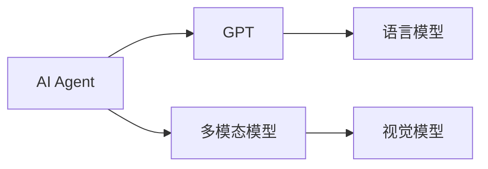
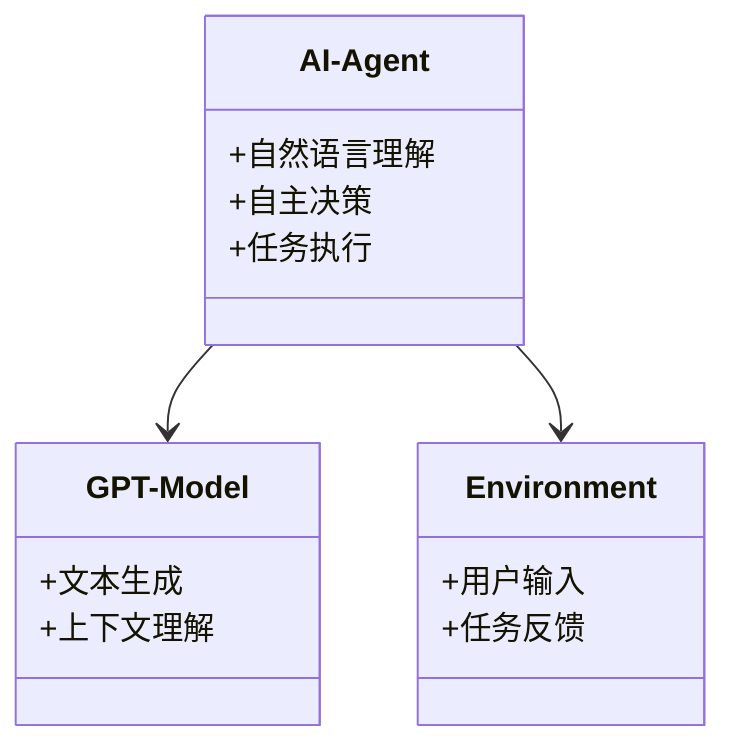
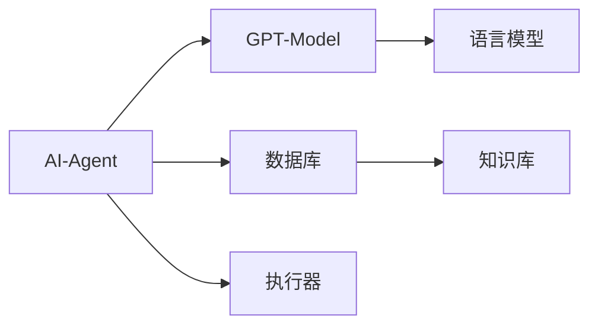
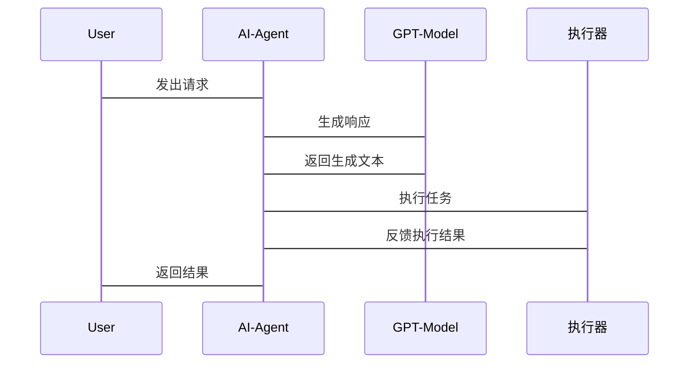

                 


# 从GPT到AI Agent：技术演进与应用变革

> 关键词：GPT, AI Agent, 生成式AI, 强化学习, 多模态模型, 智能体系统, 技术演进

> 摘要：本文将深入探讨从GPT到AI Agent的技术演进过程，分析生成式AI与AI Agent的核心概念及其联系，揭示它们在算法原理、系统架构和实际应用中的差异与融合。通过详细的案例分析和系统设计，阐述如何构建一个基于GPT的AI Agent系统，并展望未来的发展趋势。

---

# 第一部分: 从GPT到AI Agent的技术演进

## 第1章: GPT与AI Agent的背景与概念

### 1.1 GPT系列模型的演进

#### 1.1.1 GPT的起源与发展
GPT（Generative Pre-trained Transformer）由OpenAI于2018年首次提出，至今已发展到GPT-4。GPT系列模型基于Transformer架构，通过预训练的方式学习大规模文本数据，具备强大的生成能力。

#### 1.1.2 GPT的核心技术与特点
- **生成式AI**：GPT能够生成连贯且有意义的文本，支持多种语言和领域。
- **Transformer模型**：GPT采用Transformer架构，包含编码器和解码器，通过自注意力机制捕捉上下文信息。
- **预训练+微调**：GPT通过大规模数据预训练，针对特定任务进行微调。

#### 1.1.3 GPT的局限性与改进方向
- **单向生成**：GPT主要生成文本，无法处理复杂任务。
- **缺乏自主性**：GPT无法自主决策，需要外部控制。

### 1.2 AI Agent的基本概念与分类

#### 1.2.1 AI Agent的定义与特征
AI Agent（人工智能代理）是指能够感知环境、自主决策并执行任务的智能体。其核心特征包括：
- **自主性**：无需外部干预，自主完成任务。
- **反应性**：实时感知环境并做出反应。
- **目标导向**：基于目标驱动决策。

#### 1.2.2 AI Agent的主要分类
1. **基于规则的AI Agent**：通过预定义规则进行决策。
2. **基于学习的AI Agent**：通过机器学习模型进行决策。
3. **基于知识的AI Agent**：结合知识库进行推理和决策。

#### 1.2.3 AI Agent与传统AI的区别
- **自主性**：AI Agent具备自主决策能力，而传统AI通常需要人工干预。
- **动态性**：AI Agent能够实时适应环境变化，而传统AI通常静态执行任务。
- **交互性**：AI Agent支持与环境和其他智能体的交互，而传统AI通常仅限于单向处理。

### 1.3 从GPT到AI Agent的技术演进

#### 1.3.1 GPT作为AI Agent的基石
GPT的生成式AI能力为AI Agent提供了强大的语言生成模块，使其能够理解和生成自然语言。

#### 1.3.2 AI Agent的多模态能力
AI Agent不仅能够处理文本，还能结合视觉、听觉等多模态信息，具备更广泛的应用场景。

#### 1.3.3 AI Agent的应用场景与优势
- **智能助手**：如Siri、Alexa等，提供语音交互服务。
- **机器人控制**：AI Agent可以控制机器人完成物理世界中的任务。
- **游戏AI**：在游戏场景中，AI Agent可以控制游戏角色进行自主决策。

---

## 第2章: GPT与AI Agent的核心概念与联系

### 2.1 GPT与AI Agent的核心概念

#### 2.1.1 GPT的生成式AI能力
GPT通过生成式AI技术，能够生成与上下文相关的文本，为AI Agent提供了强大的语言交互能力。

#### 2.1.2 AI Agent的自主决策能力
AI Agent具备自主决策能力，能够在复杂环境中完成任务，而不仅仅是生成文本。

#### 2.1.3 GPT与AI Agent的协同关系
GPT作为AI Agent的语言生成模块，AI Agent则为GPT提供了决策和执行的能力，两者结合形成了一个完整的智能系统。

### 2.2 GPT与AI Agent的实体关系图



### 2.3 GPT与AI Agent的算法原理对比

#### 2.3.1 GPT的Transformer模型
- **编码器**：将输入文本编码为上下文向量。
- **解码器**：根据编码器输出生成目标文本。
- **自注意力机制**：捕捉文本中的长程依赖关系。

#### 2.3.2 AI Agent的强化学习框架
- **状态表示**：感知环境并提取状态信息。
- **动作选择**：基于当前状态选择最优动作。
- **奖励机制**：通过奖励函数优化决策策略。

#### 2.3.3 两者的结合与优化
通过将GPT的生成能力与AI Agent的决策能力结合，可以在复杂的场景中实现更高效的交互和任务完成。

---

## 第3章: GPT与AI Agent的算法原理

### 3.1 GPT的算法原理

#### 3.1.1 Transformer模型的结构
- **编码器**：包含多个相同的Transformer块，每个块包含多头自注意力和前馈网络。
- **解码器**：与编码器类似，但包含一个额外的自注意力机制。

#### 3.1.2 注意力机制的数学公式
$$\text{Attention}(Q,K,V) = \text{softmax}\left(\frac{QK^T}{\sqrt{d_k}}\right)V$$

#### 3.1.3 GPT的训练与优化
- **预训练**：在大规模数据上进行无监督学习。
- **微调**：针对特定任务进行有监督微调。

### 3.2 AI Agent的算法原理

#### 3.2.1 强化学习的基本原理
- **状态空间**：环境中的状态表示。
- **动作空间**：智能体可执行的动作。
- **奖励函数**：用于评估智能体动作的优劣。

#### 3.2.2 状态、动作、奖励的定义
- **状态**：智能体感知到的环境信息。
- **动作**：智能体基于状态做出的决策。
- **奖励**：智能体执行动作后获得的反馈。

#### 3.2.3 AI Agent的决策树与概率模型
- **决策树**：用于表示可能的决策路径。
- **概率模型**：通过概率分布描述决策的不确定性。

---

## 第4章: 基于GPT的AI Agent系统设计

### 4.1 问题场景介绍
设计一个具备自然语言交互能力的AI Agent系统，能够理解用户意图并执行相应任务。

### 4.2 系统功能设计

#### 4.2.1 领域模型设计


#### 4.2.2 系统架构设计


#### 4.2.3 接口设计与交互流程


---

## 第5章: 项目实战

### 5.1 环境安装与配置
安装Python、TensorFlow、Keras等必要的库，配置运行环境。

### 5.2 系统核心实现

#### 5.2.1 GPT模型实现
```python
import tensorflow as tf
from tensorflow.keras.layers import Dense, Input, Dropout, LSTM, GRU
from tensorflow.keras.models import Model

def build_gpt_model(max_length=512):
    inputs = Input(shape=(max_length,))
    x = Embedding(...)(inputs)
    x = GRU(512, return_sequences=True)(x)
    x = Dropout(0.5)(x)
    outputs = Dense(vocab_size, activation='softmax')(x)
    model = Model(inputs=inputs, outputs=outputs)
    return model
```

#### 5.2.2 AI Agent实现
```python
from tensorflow.keras.models import load_model
import numpy as np

class AI-Agent:
    def __init__(self):
        self.gpt_model = load_model('gpt_model.h5')
    
    def generate_response(self, input_text):
        # 处理输入文本，生成响应
        pass
    
    def make_decision(self, state):
        # 根据状态做出决策
        pass
```

### 5.3 代码解读与分析
详细解读上述代码，说明每个模块的功能和实现细节。

### 5.4 案例分析与实际应用
通过具体案例展示AI Agent在实际场景中的应用，分析其优缺点。

### 5.5 项目小结
总结项目实现的关键点和经验教训。

---

## 第6章: 最佳实践与未来展望

### 6.1 最佳实践
- **模型优化**：通过剪枝、蒸馏等技术优化模型性能。
- **多模态融合**：结合视觉、听觉等多模态信息提升智能体能力。
- **安全与伦理**：确保AI Agent的安全性和伦理合规性。

### 6.2 小结
从GPT到AI Agent的技术演进，不仅推动了生成式AI的发展，也为智能体系统的构建提供了新的思路。

### 6.3 注意事项
- **数据隐私**：确保数据的合法性和隐私性。
- **性能优化**：优化模型的运行效率，降低资源消耗。
- **用户体验**：注重用户体验设计，提升交互的自然性和流畅性。

### 6.4 拓展阅读
推荐相关书籍和论文，供读者深入学习。

---

# 作者：AI天才研究院/AI Genius Institute & 禅与计算机程序设计艺术 /Zen And The Art of Computer Programming

---

本文通过系统地分析从GPT到AI Agent的技术演进，详细阐述了生成式AI与智能体系统的核心概念、算法原理和系统架构，并通过实际案例展示了如何构建一个基于GPT的AI Agent系统。希望本文能为读者提供有价值的参考和启发。

