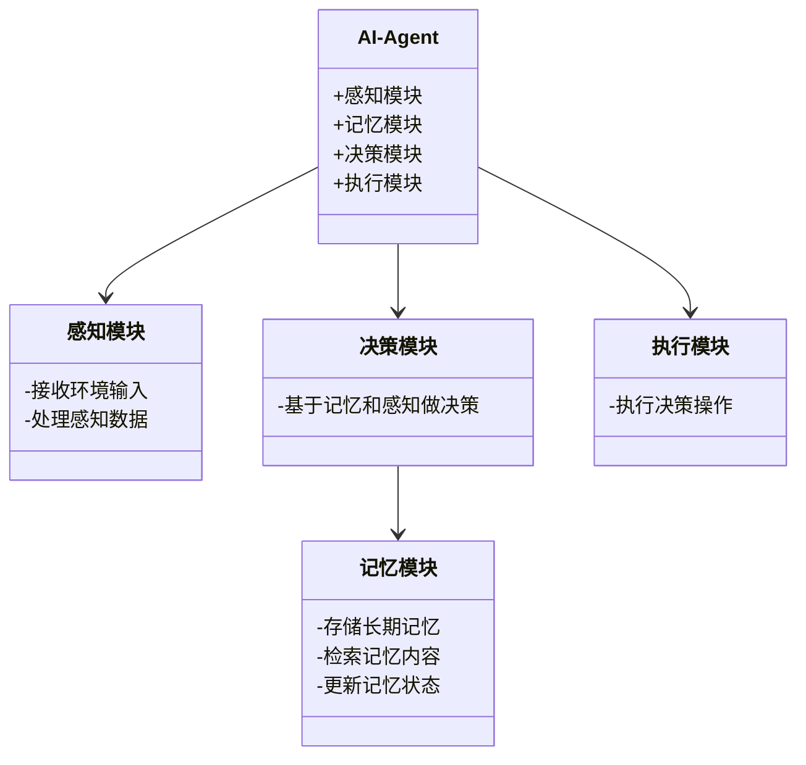
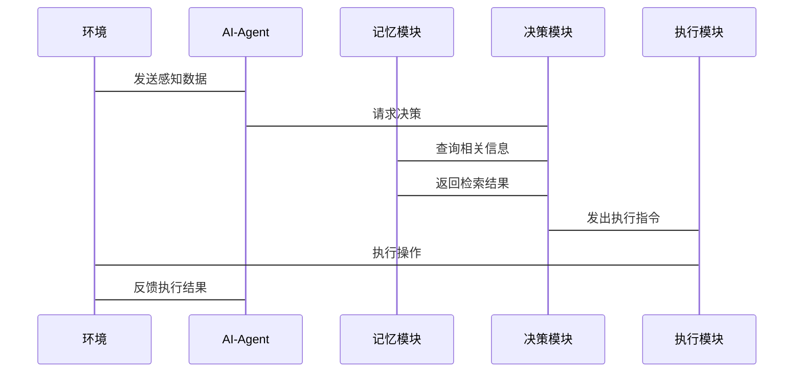

                 


# 《从零构建AI Agent的长期记忆机制》

## 关键词：
- AI Agent
- 长期记忆机制
- 神经网络
- 记忆增强网络
- 系统架构

## 摘要：
本文将详细探讨从零构建AI Agent的长期记忆机制，涵盖其核心概念、算法原理、系统架构以及项目实战。通过逐步分析，读者将深入了解如何设计和实现具有长期记忆能力的AI Agent，包括神经网络中的记忆单元、记忆门控机制、记忆网络模型，以及实际应用中的系统设计与实现。

---

# 第一部分：AI Agent的长期记忆机制概述

## 第1章：从零构建AI Agent的长期记忆机制背景

### 1.1 问题背景与挑战
- **AI Agent的核心功能与需求**：AI Agent需要具备感知环境、理解任务、执行操作和记忆相关信息的能力。
- **长期记忆机制的重要性**：长期记忆能够帮助AI Agent在任务执行过程中保持上下文信息，提升任务处理的连贯性和准确性。
- **当前技术的局限性与改进方向**：现有技术在短期记忆方面较为成熟，但长期记忆机制仍面临存储容量、检索效率和信息持久性等方面的挑战。

### 1.2 问题描述与解决思路
- **AI Agent的记忆需求分析**：AI Agent需要在复杂环境中处理多任务，长期记忆能力是其智能水平的重要体现。
- **长期记忆机制的目标与实现路径**：目标是构建一种机制，使得AI Agent能够高效存储、检索和更新长期信息。实现路径包括神经网络设计、记忆检索算法优化和系统架构创新。

### 1.3 长期记忆机制的边界与外延
- **记忆机制的输入输出边界**：长期记忆机制的输入包括感知数据和上下文信息，输出包括任务相关的长期记忆内容。
- **长期记忆与其他记忆类型的关系**：长期记忆与短期记忆、显式记忆和隐式记忆之间的区别与联系。
- **系统架构中的位置与作用**：长期记忆机制作为AI Agent的核心模块，与其他模块如感知模块和决策模块协同工作。

### 1.4 长期记忆机制的核心要素与概念结构
- **记忆存储、检索与更新的三要素**：记忆存储单元、检索算法和更新机制。
- **时间维度与记忆持久性**：长期记忆需要在较长的时间跨度内保持信息的有效性。
- **知识表示与关联性**：知识的表示形式及其在长期记忆中的关联性。

---

# 第二部分：长期记忆机制的核心概念与联系

## 第2章：长期记忆机制的核心原理

### 2.1 神经网络与记忆存储的结合
- **神经网络的基本原理**：神经网络通过层状结构处理输入数据，提取特征并进行分类或回归。
- **神经网络中的记忆单元结构**：记忆单元如LSTM（长短期记忆网络）和GRU（门控循环单元）用于处理序列数据中的长期依赖关系。
- **LSTM的工作机制**：通过遗忘门、输入门和输出门控制信息的存储和输出，解决传统RNN的梯度消失问题。

### 2.2 长期记忆机制的数学模型与公式
- **LSTM的门控机制公式**：
  $$ f gates = \sigma(W_f x + U_f h_{prev} + b_f) $$
  其中，$\sigma$表示sigmoid函数，$W_f$和$U_f$是参数矩阵，$x$是输入，$h_{prev}$是前一时刻的隐藏状态。
- **LSTM的细胞状态更新公式**：
  $$ c_t = f gates \cdot c_{t-1} + i gates \cdot x_t $$
  其中，$i gates$是输入门，控制新信息的注入。

### 2.3 长期记忆机制的属性特征对比
| 特性         | 短期记忆机制       | 长期记忆机制       |
|--------------|--------------------|--------------------|
| 存储时间       | 短暂               | 长期               |
| 容量           | 较大               | 较小               |
| 访问方式       | 随机访问           | 基于内容的寻址     |

### 2.4 记忆网络模型的对比分析
- **记忆单元的类型**：包括LSTM、GRU、Transformer中的自注意力机制。
- **记忆持久性**：通过遗忘门控制记忆的保留时间，确保长期记忆的持久性和相关性。

---

## 第3章：长期记忆机制的算法原理与实现

### 3.1 长期记忆机制的算法原理
- **序列记忆网络**：通过序列数据中的上下文信息，利用记忆机制进行信息存储和检索。
- **记忆增强网络**：在神经网络中引入记忆模块，增强模型的表达能力。

### 3.2 算法实现的详细步骤
1. **输入数据预处理**：将输入数据转化为适合神经网络处理的形式。
2. **初始化记忆模块参数**：设置记忆单元的权重矩阵和偏置项。
3. **计算门控机制**：通过门控机制控制信息的存储和输出。
4. **更新记忆状态**：根据门控结果更新记忆单元的状态。
5. **输出结果**：通过输出门生成最终的输出结果。

### 3.3 代码实现与解读
```python
class LSTMCell:
    def __init__(self, input_size, hidden_size):
        self.Wf = np.random.randn(input_size, hidden_size)
        self.Uf = np.random.randn(hidden_size, hidden_size)
        self.bf = np.zeros(hidden_size)
        # 其他门控机制的权重和偏置初始化

    def forward(self, x, h_prev, c_prev):
        f_gate = sigmoid(np.dot(x, self.Wf) + np.dot(h_prev, self.Uf) + self.bf)
        i_gate = sigmoid(np.dot(x, Wi) + np.dot(h_prev, Ui) + bi)
        o_gate = sigmoid(np.dot(x, Wo) + np.dot(h_prev, Uo) + bo)
        c_candidate = np.tanh(np.dot(x, Wc) + np.dot(h_prev, Uc) + bc)
        c_new = f_gate * c_prev + i_gate * c_candidate
        h_new = o_gate * np.tanh(c_new)
        return h_new, c_new

    def backward(self, ...):
        # 反向传播的实现
```

### 3.4 算法优化与改进
- **遗忘门的优化**：通过调整遗忘门的权重，提高记忆的准确性和相关性。
- **记忆单元的扩展**：引入多层记忆单元，提升模型的表达能力。

---

## 第4章：AI Agent的长期记忆机制系统架构与设计

### 4.1 系统架构设计
- **模块划分**：感知模块、记忆模块、决策模块和执行模块。
- **系统功能设计**：通过领域模型（mermaid类图）展示各模块之间的交互关系。



### 4.2 接口设计与交互流程
- **接口设计**：定义记忆模块的存储、检索和更新接口。
- **交互流程**：通过mermaid序列图展示AI Agent与环境之间的交互流程。



---

## 第5章：项目实战与案例分析

### 5.1 环境安装与配置
- **安装Python和相关库**：如TensorFlow、Keras、numpy等。
- **安装mermaid工具**：用于绘制系统架构图和交互流程图。

### 5.2 核心功能实现
- **实现LSTMCell**：完成长期记忆机制的核心算法。
- **构建AI Agent系统**：集成感知、记忆、决策和执行模块。

### 5.3 代码实现与解读
```python
import numpy as np

class LSTMCell:
    def __init__(self, input_size, hidden_size):
        self.Wf = np.random.randn(input_size, hidden_size)
        self.Uf = np.random.randn(hidden_size, hidden_size)
        self.bf = np.zeros(hidden_size)
        # 初始化其他门控机制的权重和偏置

    def forward(self, x, h_prev, c_prev):
        f_gate = sigmoid(np.dot(x, self.Wf) + np.dot(h_prev, self.Uf) + self.bf)
        i_gate = sigmoid(np.dot(x, Wi) + np.dot(h_prev, Ui) + bi)
        o_gate = sigmoid(np.dot(x, Wo) + np.dot(h_prev, Uo) + bo)
        c_candidate = np.tanh(np.dot(x, Wc) + np.dot(h_prev, Uc) + bc)
        c_new = f_gate * c_prev + i_gate * c_candidate
        h_new = o_gate * np.tanh(c_new)
        return h_new, c_new

    def backward(self, ...):
        # 反向传播的实现
```

### 5.4 案例分析与解读
- **案例分析**：通过一个实际案例，展示长期记忆机制在AI Agent中的应用。
- **结果解读**：分析实验结果，验证长期记忆机制的有效性和优化空间。

---

## 第6章：总结与展望

### 6.1 总结
- **主要内容回顾**：系统地介绍了长期记忆机制的核心概念、算法原理、系统架构和项目实战。
- **技术特点总结**：长期记忆机制通过神经网络中的记忆单元实现，结合门控机制提高信息存储和检索的效率。

### 6.2 当前技术的挑战与未来发展方向
- **当前挑战**：长期记忆机制的存储容量有限，检索效率有待提高，信息持久性需要优化。
- **未来发展方向**：探索更高效的存储结构，优化检索算法，结合边缘计算提升实时性。

### 6.3 最佳实践与注意事项
- **最佳实践**：在实际应用中，结合具体场景选择合适的记忆机制，定期优化系统参数。
- **注意事项**：长期记忆机制的设计需要综合考虑存储容量、检索效率和信息持久性，确保系统的稳定性和高效性。

### 6.4 拓展阅读与深入学习
- **推荐书籍**：《深度学习》、《神经网络与机器学习》。
- **推荐论文**：最新的长期记忆机制相关研究论文。

---

## 作者：AI天才研究院/AI Genius Institute & 禅与计算机程序设计艺术 /Zen And The Art of Computer Programming

---

通过以上大纲，您可以逐步构建完整的《从零构建AI Agent的长期记忆机制》技术博客文章，确保每部分内容详实、逻辑清晰，并结合实际案例进行深入分析。

