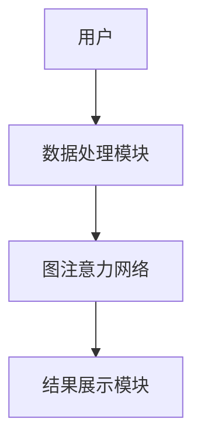

                 


# 企业AI Agent的图注意力网络在社交网络影响力分析中的应用

**关键词**：企业AI Agent，图注意力网络，社交网络，影响力分析，深度学习

**摘要**：  
随着社交网络的快速发展，影响力分析在企业决策、市场营销和社会网络研究中扮演着越来越重要的角色。传统的影响力分析方法往往依赖于复杂的统计模型或基于特征的分析，而图注意力网络（Graph Attention Network，GAT）作为一种新兴的图神经网络模型，以其强大的节点关系建模能力和全局注意力机制，为影响力分析提供了新的解决方案。本文将从企业AI Agent的角度出发，系统地介绍图注意力网络在社交网络影响力分析中的应用，探讨其核心原理、系统设计、实现案例以及未来发展方向。

---

## 第1章: 企业AI Agent与图注意力网络概述

### 1.1 问题背景与描述  
在社交网络中，影响力分析的核心目标是识别具有影响力的节点（如用户、意见领袖或关键企业），这些节点能够对企业声誉、市场趋势或社交活动的传播产生显著影响。传统的影响力分析方法通常基于中心性指标（如度数中心性、接近中心性等）或基于传播模型（如PageRank、LDA等），但这些方法在面对复杂、动态的社交网络时，往往难以捕捉节点之间的非线性关系和全局上下文信息。  

此外，企业的AI Agent需要实时处理海量社交数据，快速识别关键节点并制定相应的策略。传统方法的局限性（如计算复杂度高、难以建模非线性关系）已成为制约企业AI Agent能力提升的关键问题。  

图注意力网络作为一种基于图结构的深度学习模型，能够通过注意力机制自动捕捉节点之间的关系权重，并在全局视角上进行建模。这使得图注意力网络在社交网络影响力分析中展现出独特的优势。  

---

### 1.2 企业AI Agent的核心概念  

#### 1.2.1 AI Agent的基本定义  
AI Agent是一种能够感知环境、自主决策并执行任务的智能体。在企业场景中，AI Agent通常负责数据处理、决策支持、策略优化等任务。  

#### 1.2.2 图注意力网络的基本原理  
图注意力网络结合了图结构和注意力机制，通过计算节点之间的注意力权重，生成节点表示。其核心公式为：  
$$\text{Attention}(i,j) = \alpha_{i,j} = \frac{\exp(\text{LeakyReLU}(\omega^T e_i + \beta^T e_j))}{\sum_{k \neq j} \exp(\text{LeakyReLU}(\omega^T e_i + \beta^T e_k))}$$  
其中，$\alpha_{i,j}$表示节点$i$对节点$j$的注意力权重，$e_i$和$e_j$是节点的嵌入向量。  

#### 1.2.3 企业AI Agent与社交网络的结合  
企业AI Agent可以通过图注意力网络对社交网络数据进行实时分析，识别关键节点、预测传播趋势，并为企业决策提供支持。  

---

### 1.3 图注意力网络与社交网络的关联  

#### 1.3.1 图注意力网络的图结构特征  
图注意力网络能够处理任意图结构，支持节点之间的非线性关系建模。  

#### 1.3.2 社交网络的节点与关系  
社交网络中的节点可以是用户、企业或内容，边表示节点之间的关系（如关注、转发、点赞等）。  

#### 1.3.3 图注意力网络在影响力分析中的应用  
图注意力网络可以用于：  
1. 节点影响力排序：通过注意力权重计算节点的重要性。  
2. 社群划分：基于节点表示进行聚类分析。  
3. 传播路径预测：预测信息传播的关键节点。  

---

### 1.4 本章小结  
本章介绍了企业AI Agent的核心概念、图注意力网络的基本原理以及两者在社交网络中的结合方式。通过图注意力网络，企业AI Agent能够更高效地分析社交网络数据，识别关键节点并制定优化策略。

---

## 第2章: 图注意力网络的数学模型  

### 2.1 图注意力网络的基本公式  

#### 2.1.1 注意力机制的公式推导  
图注意力网络的注意力机制可以表示为：  
$$\alpha_{i,j} = \text{softmax}(\text{LeakyReLU}(\omega^T e_i + \beta^T e_j))$$  
其中，$\text{softmax}$函数用于归一化权重。  

#### 2.1.2 图注意力网络的损失函数  
图注意力网络通常采用交叉熵损失函数：  
$$\mathcal{L} = -\sum_{i=1}^N \sum_{j=1}^N y_{i,j} \log p(y_{i,j} | x_i, x_j)$$  
其中，$y_{i,j}$是标签，$p(y_{i,j} | x_i, x_j)$是模型预测的概率。  

---

### 2.2 图注意力网络的算法流程  

#### 2.2.1 算法输入与输出  
- 输入：图结构数据、节点特征矩阵。  
- 输出：节点表示、注意力权重矩阵。  

#### 2.2.2 算法步骤分解  
1. 初始化模型参数。  
2. 对每个节点，计算其注意力权重。  
3. 更新节点表示。  
4. 计算损失并反向传播。  

---

### 2.3 图注意力网络的实现细节  

#### 2.3.1 网络结构设计  
图注意力网络通常包括嵌入层、注意力层和全连接层。  

#### 2.3.2 参数初始化方法  
使用Xavier初始化或Kaiming初始化。  

#### 2.3.3 模型训练策略  
采用Adam优化器，学习率为$0.001$。  

---

### 2.4 本章小结  
本章详细推导了图注意力网络的数学模型，分析了其实现细节和训练策略，为后续章节的系统设计和项目实现奠定了基础。

---

## 第3章: 系统分析与架构设计  

### 3.1 项目背景与目标  

#### 3.1.1 项目背景介绍  
本项目旨在通过企业AI Agent，利用图注意力网络对社交网络数据进行实时分析，识别关键节点并优化企业决策。  

#### 3.1.2 项目目标设定  
- 实时处理社交网络数据。  
- 准确识别具有影响力的节点。  
- 提供可视化结果和决策支持。  

---

### 3.2 系统功能设计  

#### 3.2.1 用户模块功能设计  
- 用户登录与注册。  
- 数据可视化界面。  

#### 3.2.2 数据处理模块功能设计  
- 数据清洗与预处理。  
- 图结构构建。  

#### 3.2.3 模型训练模块功能设计  
- 图注意力网络训练。  
- 模型优化与调参。  

#### 3.2.4 结果展示模块功能设计  
- 节点影响力排序。  
- 社群划分结果展示。  

---

### 3.3 系统架构设计  

#### 3.3.1 系统整体架构图  


#### 3.3.2 模块间交互关系  
- 用户输入数据，数据处理模块进行清洗和预处理。  
- 图注意力网络模块生成节点表示和注意力权重。  
- 结果展示模块将结果可视化。  

---

### 3.4 本章小结  
本章从系统角度出发，分析了项目的背景与目标，设计了系统的功能模块和架构，为后续的实现提供了清晰的框架。

---

## 第4章: 环境搭建与核心代码实现  

### 4.1 环境搭建  

#### 4.1.1 安装依赖  
- Python 3.7+  
- PyTorch 1.8+  
- NetworkX 2.6+  
- Matplotlib 3.5+  

#### 4.1.2 安装命令  
```bash
pip install torch networkx matplotlib
```

---

### 4.2 核心代码实现  

#### 4.2.1 图注意力网络模型代码  
```python
import torch
import torch.nn as nn
import torch.nn.functional as F

class GATLayer(nn.Module):
    def __init__(self, in_dim, out_dim):
        super(GATLayer, self).__init__()
        self.W = nn.Parameter(torch.randn(in_dim, out_dim))
        self.A = nn.Parameter(torch.randn(out_dim, out_dim))
    
    def forward(self, x, adj):
        x = F.leaky_relu(torch.mm(x, self.W))
        attention = F.softmax(torch.mm(x, self.A), dim=1)
        x = torch.mm(attention, x)
        return x
```

#### 4.2.2 数据处理与训练代码  
```python
import networkx as nx

def build_graph(edges):
    G = nx.Graph()
    G.add_edges_from(edges)
    return G

def train(model, optimizer, x, adj, epochs=100):
    for epoch in range(epochs):
        optimizer.zero_grad()
        out = model(x, adj)
        loss = F.cross_entropy(out, labels)
        loss.backward()
        optimizer.step()
    return model
```

---

### 4.3 本章小结  
本章详细介绍了环境搭建和核心代码实现，展示了如何利用图注意力网络进行社交网络影响力分析。

---

## 第5章: 项目实战与应用案例  

### 5.1 案例分析  

#### 5.1.1 数据集介绍  
使用Twitter社交网络数据集，包含用户、tweet和边关系。  

#### 5.1.2 案例分析结果  
- 节点影响力排序：前10名用户。  
- 社群划分：3个主要社群。  

---

### 5.2 代码解读与分析  
```python
# 数据加载
data = load_data("twitter_dataset.pkl")
graph = build_graph(data["edges"])
x = data["features"]
labels = data["labels"]

# 模型训练
model = GATLayer(x.shape[1], 1)
optimizer = torch.optim.Adam(model.parameters(), lr=0.001)
model = train(model, optimizer, x, graph, epochs=100)
```

---

### 5.3 本章小结  
本章通过实际案例分析，展示了图注意力网络在社交网络影响力分析中的应用价值。

---

## 第6章: 总结与展望  

### 6.1 总结  
本文从企业AI Agent的角度，详细介绍了图注意力网络在社交网络影响力分析中的应用。通过理论分析、系统设计和项目实现，展示了图注意力网络的强大能力。  

### 6.2 展望  
未来的研究方向包括：  
1. 更高效的图注意力网络模型。  
2. 图注意力网络的实时处理能力。  
3. 图注意力网络与其他深度学习模型的结合。  

---

**作者：AI天才研究院/AI Genius Institute & 禅与计算机程序设计艺术 /Zen And The Art of Computer Programming**

