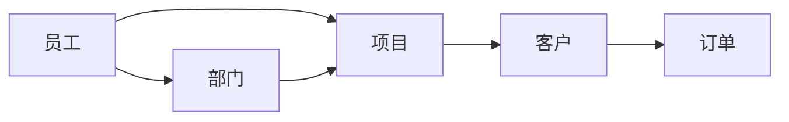
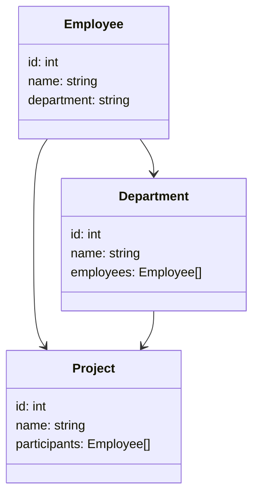

                 


# 企业AI Agent的图神经网络应用：复杂关系分析

> 关键词：企业AI Agent，图神经网络，复杂关系分析，算法原理，系统架构，项目实战

> 摘要：本文深入探讨了企业AI Agent在复杂关系分析中的应用，重点介绍了图神经网络的原理、算法实现及其在系统架构中的应用。通过实际案例分析，展示了如何利用图神经网络解决企业中的复杂关系问题，并总结了最佳实践和未来发展方向。

---

## 第一部分：企业AI Agent的图神经网络应用概述

### 第1章：问题背景与挑战

#### 1.1 问题背景
- 企业面临数据孤岛和信息不透明的问题，传统方法难以处理复杂关系。
- 图神经网络能够有效捕捉数据间的复杂关联，提供高效的解决方案。

#### 1.2 问题描述
- 传统数据分析方法难以处理复杂关系，导致决策效率低下。
- 需要一种能够高效分析复杂关系的技术，提升企业智能化水平。

#### 1.3 问题解决
- 引入AI Agent和图神经网络，通过构建图结构数据，分析复杂关系。
- 图神经网络能够处理非结构化数据，提供更精准的分析结果。

#### 1.4 边界与外延
- 图神经网络适用于复杂关系分析，但需考虑数据隐私和计算资源限制。
- 本文主要探讨企业场景中的应用，不涉及其他领域。

#### 1.5 核心要素
- AI Agent：作为智能主体，负责数据处理和决策。
- 图神经网络：用于复杂关系分析，提供高效的计算模型。
- 复杂关系：企业中的多对多关系，如供应链、客户关系等。

---

### 第2章：图神经网络的核心概念与联系

#### 2.1 图数据的结构与特征
- **节点**：代表实体，如企业中的员工、客户、产品。
- **边**：表示节点之间的关系，如“属于”、“购买”。
- **属性**：节点或边的附加信息，如员工的职位、客户的购买金额。

| 特征 | 节点 | 边 | 属性 |
|------|------|----|------|
| 示例 | 员工ID | 部门ID | 职位 |
| 类型 | 实体标识 | 关系标识 | 描述性信息 |

#### 2.2 图神经网络的原理与模型
- **图神经网络**：通过聚合邻域节点信息，生成节点表示。
- **主流模型**：包括GCN、GAT、GraphSAGE等，各有优缺点。

#### 2.3 实体关系图的Mermaid流程图


---

## 第二部分：算法原理

### 第3章：图神经网络的节点表示

#### 3.1 节点表示的基本概念
- 节点表示：将节点映射到低维空间，便于计算。
- 邻域聚合：通过聚合邻域节点的信息，生成节点表示。

#### 3.2 邻域聚合机制的数学公式
$$
h_i^{(l+1)} = \sigma\left(\sum_{j \in \mathcal{N}(i)} W^{(l)} h_j^{(l)}\right)
$$
其中，$\mathcal{N}(i)$ 表示节点i的邻域节点。

#### 3.3 节点嵌入的计算流程
1. 初始化节点嵌入。
2. 迭代更新节点嵌入，聚合邻域信息。
3. 输出最终节点表示。

### 第4章：图神经网络的传播与聚合

#### 4.1 传播函数的定义与实现
$$
f(h_j, W) = W h_j
$$
其中，$W$ 是权重矩阵，$h_j$ 是输入向量。

#### 4.2 聚合函数的类型与选择
- **平均聚合**：$$\text{avg}(h_j) = \frac{1}{|\mathcal{N}(i)|} \sum_{j \in \mathcal{N}(i)} h_j$$
- **最大聚合**：$$\text{max}(h_j) = \max_{j \in \mathcal{N}(i)} h_j$$
- **加权聚合**：$$\text{weighted}(h_j) = \sum_{j \in \mathcal{N}(i)} w_j h_j$$

#### 4.3 图卷积操作的数学模型
$$
X^{(l+1)} = \text{ReLU}(A X^{(l)} W^{(l)})
$$
其中，$A$ 是邻接矩阵，$X^{(l)}$ 是当前层的特征矩阵，$W^{(l)}$ 是权重矩阵。

---

## 第三部分：系统分析与架构设计

### 第5章：系统功能设计

#### 5.1 领域模型的Mermaid类图


#### 5.2 系统功能模块的划分
- 数据采集模块：负责收集企业数据。
- 数据预处理模块：清洗和转换数据。
- 图神经网络模块：进行复杂关系分析。
- 结果展示模块：可视化分析结果。

### 第6章：系统架构设计

#### 6.1 系统架构的Mermaid架构图
```mermaid
docker
    services {
        api {
            depends_on db, model
        }
        db {
            depends_on redis
        }
        model {
            build .
        }
        redis
    }
```

#### 6.2 系统组件的交互设计
- API接收请求，调用模型进行分析。
- 数据库存储图数据和结果。
- Redis缓存中间结果，提高效率。

#### 6.3 系统接口的设计与实现
- API接口：RESTful风格，如`POST /analyze`.
- 数据接口：与数据库交互，使用ORM框架。

---

## 第四部分：项目实战

### 第7章：项目环境与工具安装

#### 7.1 开发环境的搭建
- 操作系统：Linux或macOS。
- Python版本：3.8以上。
- 安装依赖：`pip install torch networkx pyg`.

#### 7.2 工具安装
- PyTorch：深度学习框架。
- NetworkX：图数据处理库。
- PyG：图神经网络库。

### 第8章：系统实现与案例分析

#### 8.1 核心代码实现
```python
import torch
from torch import nn
import torch.nn.functional as F

class GCN(nn.Module):
    def __init__(self, in_channels, out_channels):
        super(GCN, self).__init__()
        self.weight = nn.Parameter(torch.randn(in_channels, out_channels))

    def forward(self, x, adj):
        return F.relu(torch.mm(x, self.weight) + torch.mm(adj, x))
```

#### 8.2 代码应用解读与分析
- 数据预处理：将企业数据转换为图结构。
- 模型训练：使用PyTorch进行训练，优化权重。
- 结果分析：可视化图中节点的聚类结果。

#### 8.3 实际案例分析
- 以供应链管理为例，分析供应商之间的关系，预测供应链风险。

---

## 第五部分：总结与展望

### 第9章：最佳实践与总结

#### 9.1 总结
- 图神经网络在复杂关系分析中表现优异。
- AI Agent能够提高企业的智能化水平。

#### 9.2 注意事项
- 数据隐私和安全需重视。
- 模型的可解释性有待进一步研究。

#### 9.3 未来发展方向
- 提升模型的可解释性。
- 推动图神经网络的工业应用。

#### 9.4 拓展阅读
- 推荐阅读《Graph Neural Networks: A Review of Methods, Applications, and Open Challenges》。

---

作者：AI天才研究院/AI Genius Institute & 禅与计算机程序设计艺术 /Zen And The Art of Computer Programming

