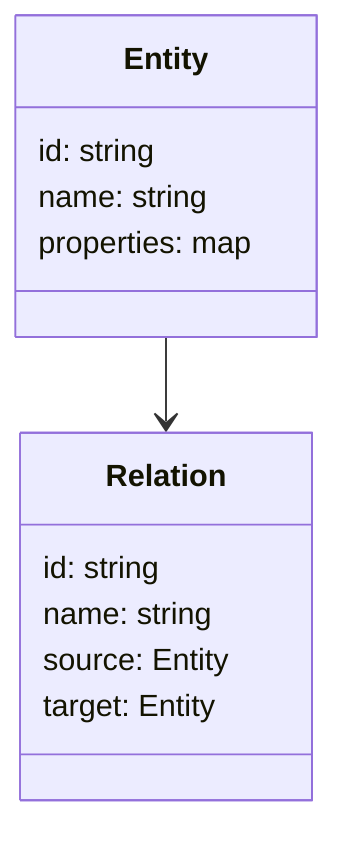
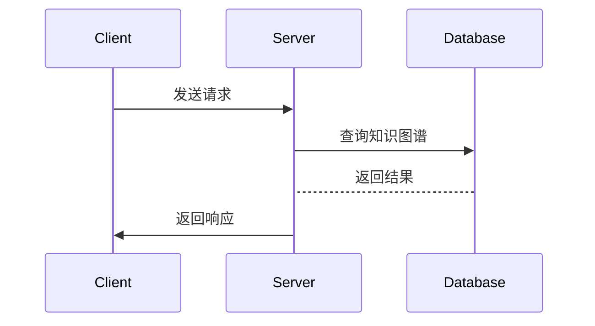

                 


# 企业AI Agent的知识图谱应用策略

## 关键词：
知识图谱, AI Agent, 知识表示, 智能推理, 企业应用

## 摘要：
本文系统探讨了企业AI Agent的知识图谱应用策略，从知识图谱的构建与管理、AI Agent的核心算法、系统架构设计到项目实战，详细阐述了知识图谱在企业AI Agent中的应用价值和实现方法。通过分析知识图谱与AI Agent的结合，本文为企业的智能化转型提供了切实可行的解决方案和实践指导。

---

# 第1章: 知识图谱与AI Agent概述

## 1.1 知识图谱的定义与特点
### 1.1.1 知识图谱的定义
知识图谱是一种用于表示知识的数据结构，通过实体（概念）及其关系，构建出一个网络化的知识库。它能够将分散的数据组织成有意义的结构，帮助计算机理解和推理。

### 1.1.2 知识图谱的核心特点
- **语义性**：通过关系和属性描述实体间的语义联系。
- **结构化**：采用图结构，便于计算机处理和推理。
- **动态性**：支持实时更新和扩展。

### 1.1.3 知识图谱与传统数据库的区别
| 特性          | 知识图谱                 | 传统数据库           |
|---------------|--------------------------|----------------------|
| 数据结构      | 图结构（节点和边）       | 行结构               |
| 查询能力      | 支持复杂关联查询         | 支持简单键值查询     |
| 应用场景      | 智能推理、语义搜索       | 基本 CRUD 操作       |

## 1.2 AI Agent的定义与特点
### 1.2.1 AI Agent的定义
AI Agent是一种智能代理，能够感知环境、自主决策并执行任务。它结合了机器学习、自然语言处理和知识表示等多种技术。

### 1.2.2 AI Agent的核心特点
- **自主性**：无需人工干预，自主完成任务。
- **反应性**：能够实时感知环境变化并做出反应。
- **学习能力**：通过数据和经验不断优化自身行为。

## 1.3 知识图谱与AI Agent的联系
### 1.3.1 知识图谱作为AI Agent的知识库
知识图谱为AI Agent提供了丰富的知识库，支持其进行语义理解和智能推理。

### 1.3.2 AI Agent基于知识图谱的智能推理
AI Agent利用知识图谱中的关系和属性，进行推理和决策，提升其智能性。

### 1.3.3 知识图谱与AI Agent的结合应用场景
- **智能问答**：通过知识图谱提供准确的知识回答。
- **推荐系统**：基于知识图谱进行个性化推荐。
- **自动化任务处理**：利用知识图谱指导AI Agent完成复杂任务。

## 1.4 企业AI Agent的知识图谱应用背景
### 1.4.1 企业智能化转型的需求
随着市场竞争的加剧，企业需要更高效的决策和自动化操作，知识图谱和AI Agent成为关键工具。

### 1.4.2 知识图谱在企业中的价值
- 提供结构化的知识表示，便于计算机处理。
- 支持智能检索和推理，提升企业效率。

### 1.4.3 AI Agent在企业中的潜力
- 提高业务流程自动化水平。
- 实现跨部门的信息协同。

## 1.5 本章小结
本章介绍了知识图谱和AI Agent的基本概念，分析了它们在企业中的应用背景和潜力，为后续内容奠定了基础。

---

# 第2章: 知识图谱构建与管理

## 2.1 知识图谱的构建流程
### 2.1.1 数据采集与预处理
- 数据来源：企业内部数据、公开数据集。
- 预处理：清洗、去重、标准化。

### 2.1.2 知识抽取与实体识别
- 技术：NLP技术、规则抽取。
- 实体识别：使用命名实体识别（NER）技术。

### 2.1.3 知识融合与关联建立
- 数据整合：消除冗余，建立实体间的关系。
- 关系抽取：识别实体间的关联。

### 2.1.4 知识图谱存储与管理
- 数据库选择：图数据库（如Neo4j）。
- 知识图谱的动态更新。

## 2.2 知识图谱的表示与建模
### 2.2.1 实体与关系的表示
- 实体表示：节点，属性：标签。
- 关系表示：边，属性：权重。

### 2.2.2 知识图谱的建模方法
- 使用图数据库建模，支持复杂的关联查询。

### 2.2.3 知识图谱的可扩展性设计
- 设计模块化，便于扩展。

## 2.3 知识图谱的可视化与分析
### 2.3.1 知识图谱的可视化工具
- 工具：Neo4j Browser、Gephi。
- 可视化方法：节点和边的布局优化。

### 2.3.2 知识图谱的分析方法
- 分析工具：图遍历算法（BFS、DFS）。
- 应用场景：异常检测、关系挖掘。

## 2.4 本章小结
本章详细介绍了知识图谱的构建流程和管理方法，为后续AI Agent的应用提供了知识基础。

---

# 第3章: AI Agent的核心算法与实现

## 3.1 知识图谱中的图嵌入算法
### 3.1.1 Word2Vec与Node2Vec
- Word2Vec：用于词向量生成。
- Node2Vec：用于图中节点的向量表示。

### 3.1.2 GraphSAGE与GAT
- GraphSAGE：基于归纳推理的图神经网络。
- GAT：注意力机制在图中的应用。

### 3.1.3 知识图谱中的节点表示学习
- 使用图神经网络进行节点嵌入学习。

## 3.2 AI Agent的对话生成算法
### 3.2.1 基于规则的对话生成
- 规则定义：预先设定对话规则。

### 3.2.2 基于检索的对话生成
- 检索方法：基于向量相似度检索。

### 3.2.3 基于生成模型的对话生成
- 模型：Transformer架构，生成自然语言文本。

## 3.3 本章小结
本章介绍了AI Agent的核心算法，包括图嵌入和对话生成算法，为知识图谱的应用提供了技术支持。

---

# 第4章: 系统分析与架构设计

## 4.1 问题场景介绍
### 4.1.1 企业知识管理需求
- 知识分散，难以有效利用。
- 需要智能化的知识检索和推理。

## 4.2 项目介绍
### 4.2.1 项目目标
构建基于知识图谱的企业AI Agent系统，实现智能问答和任务处理。

## 4.3 系统功能设计
### 4.3.1 领域模型设计


### 4.3.2 系统架构设计


## 4.4 系统接口设计
### 4.4.1 API接口
- RESTful API：GET、POST、PUT、DELETE。

## 4.5 系统交互设计


## 4.6 本章小结
本章分析了企业AI Agent系统的架构设计，为系统的实现提供了指导。

---

# 第5章: 项目实战

## 5.1 环境安装
### 5.1.1 安装必要的库
- Python库：networkx、neo4j、tensorflow。
- 图数据库：Neo4j。

## 5.2 核心代码实现
### 5.2.1 知识图谱构建代码
```python
import neo4j
from neo4j import GraphDatabase

def create_entity(tx, label, properties):
    tx.run("CREATE (n:%s {%s})" % (label, properties))
```

### 5.2.2 AI Agent对话生成代码
```python
import tensorflow as tf
from tensorflow.keras import layers

model = tf.keras.Sequential([
    layers.Embedding(input_dim=10000, output_dim=16),
    layers.LSTM(64),
    layers.Dense(5000, activation='softmax')
])
```

## 5.3 代码应用解读与分析
- 知识图谱构建：使用Neo4j存储实体和关系。
- 对话生成：使用LSTM模型生成自然语言回复。

## 5.4 实际案例分析
- 应用场景：智能客服系统。
- 案例分析：通过知识图谱实现精准回答。

## 5.5 本章小结
本章通过实际项目展示了知识图谱和AI Agent的具体实现，验证了理论的可行性。

---

# 第6章: 最佳实践与小结

## 6.1 最佳实践
### 6.1.1 知识图谱的动态更新
- 定期更新知识库，保持信息准确性。

### 6.1.2 AI Agent的可扩展性设计
- 设计模块化的架构，便于功能扩展。

## 6.2 注意事项
- 数据安全：保护企业敏感信息。
- 性能优化：提升系统响应速度。

## 6.3 未来展望
- 知识图谱的深度学习应用。
- AI Agent的多模态交互。

## 6.4 本章小结
本章总结了企业AI Agent的知识图谱应用策略，并提出了未来的发展方向。

---

# 作者：AI天才研究院 & 禅与计算机程序设计艺术

本文作者为AI天才研究院，专注于人工智能与计算机程序设计的研究与实践，致力于为企业智能化转型提供技术支持与创新思路。

