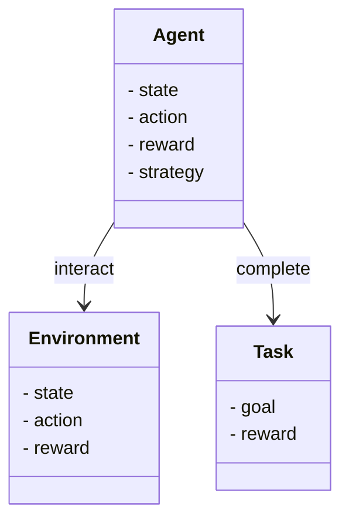
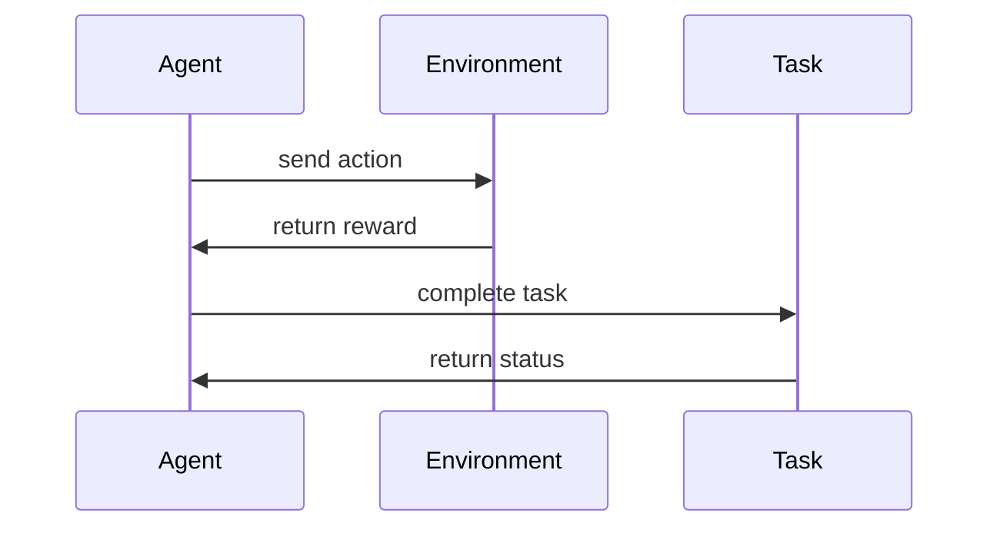

                 


# 基于元强化学习的AI Agent策略生成

> **关键词**：元强化学习，AI Agent，策略生成，强化学习，深度学习，元学习  
> **摘要**：本文深入探讨了基于元强化学习的AI Agent策略生成方法。通过分析元强化学习的核心概念、算法原理、系统设计和实际应用，详细介绍了如何利用元强化学习提升AI Agent的策略生成能力。文章内容涵盖了元强化学习的背景、核心思想、算法实现、系统架构设计以及实际项目案例，为读者提供了全面而深入的指导。

---

## 第1章：元强化学习与AI Agent概述

### 1.1 元强化学习的背景与概念

#### 1.1.1 强化学习的基本概念
强化学习是一种机器学习范式，其中智能体通过与环境交互来学习策略，以最大化累积奖励。核心概念包括：
- **环境（Environment）**：智能体所处的外部世界。
- **智能体（Agent）**：能够感知环境并采取行动的主体。
- **状态（State）**：环境在某一时刻的描述。
- **动作（Action）**：智能体采取的行为。
- **奖励（Reward）**：智能体行为的价值反馈。

#### 1.1.2 元强化学习的定义与特点
元强化学习（Meta Reinforcement Learning）是在强化学习基础上发展起来的高级学习方法，旨在通过元学习机制（Meta-Learning）实现快速策略生成。其特点包括：
- **快速适应性**：能够在新任务中快速调整策略。
- **多任务学习**：能够同时或依次学习多个相关任务。
- **元参数优化**：通过优化元参数来实现跨任务的策略生成。

#### 1.1.3 元强化学习的核心思想
元强化学习的核心思想是通过元学习机制，让智能体在多个任务中学习通用策略，从而在新任务中快速生成最优策略。与传统强化学习相比，元强化学习更注重策略的灵活性和适应性。

---

### 1.2 AI Agent的基本概念与分类

#### 1.2.1 AI Agent的定义
AI Agent是一种能够感知环境、采取行动并优化目标的智能体。它可以基于强化学习、监督学习或无监督学习等方法进行训练。

#### 1.2.2 基于强化学习的AI Agent
强化学习是训练AI Agent的核心方法之一，通过与环境交互，智能体逐步优化策略以最大化累积奖励。

#### 1.2.3 元强化学习在AI Agent中的应用
元强化学习通过元学习机制，使得AI Agent能够快速适应新任务，提升策略生成的效率和灵活性。

---

### 1.3 元强化学习的核心思想

#### 1.3.1 元学习机制的定义
元学习是一种学习方法，旨在通过学习如何学习，从而快速适应新任务。元强化学习将这一思想引入强化学习领域。

#### 1.3.2 元强化学习的目标
元强化学习的目标是通过元参数优化，使得智能体能够在多个任务中生成高效策略。

#### 1.3.3 元强化学习的优势
- **快速适应性**：能够在新任务中快速调整策略。
- **多任务学习**：能够同时或依次学习多个任务。
- **灵活性**：适用于动态变化的环境。

---

## 第2章：元强化学习的核心概念

### 2.1 元学习机制的数学模型

#### 2.1.1 元学习的优化目标
元学习的优化目标是通过元参数θ，使得智能体在新任务中的策略能够快速收敛。

$$ \theta = \arg\min_{\theta} \sum_{i=1}^{N} L_i(\theta) $$

其中，$L_i$ 是第i个任务的损失函数。

#### 2.1.2 元学习的参数更新公式
元学习的参数更新公式如下：

$$ \theta_{t+1} = \theta_t - \eta \nabla_{\theta} L(\theta_t) $$

其中，η是学习率。

---

### 2.2 多智能体协作与策略生成

#### 2.2.1 多智能体系统的基本概念
多智能体系统是由多个智能体组成的协作系统，每个智能体负责特定任务或区域。

#### 2.2.2 策略生成的机制
策略生成机制通过元强化学习实现，使得多个智能体能够协作生成全局最优策略。

#### 2.2.3 元强化学习在多智能体协作中的应用
元强化学习通过元参数优化，使得多智能体能够快速适应新任务。

---

### 2.3 元强化学习的数学模型与公式

#### 2.3.1 元强化学习的数学表达式
元强化学习的数学表达式如下：

$$ J(\theta) = \sum_{i=1}^{N} J_i(\theta) $$

其中，$J_i$ 是第i个任务的优化目标。

#### 2.3.2 元强化学习的损失函数
元强化学习的损失函数可以表示为：

$$ L(\theta) = \sum_{i=1}^{N} (r_i - \hat{r}_i)^2 $$

其中，$r_i$ 是实际奖励，$\hat{r}_i$ 是预测奖励。

#### 2.3.3 元强化学习的优化算法
元强化学习的优化算法包括Adam、SGD等。

---

## 第3章：元强化学习的核心算法

### 3.1 元Q-learning算法

#### 3.1.1 算法的基本原理
元Q-learning算法通过元参数优化，实现快速策略生成。

#### 3.1.2 算法的数学模型
元Q-learning的数学模型如下：

$$ Q(s, a; \theta) = \max_{a'} Q(s, a'; \theta) $$

#### 3.1.3 算法的实现步骤
1. 初始化元参数θ。
2. 对于每个任务，更新Q值。
3. 优化元参数θ。

---

### 3.2 元策略梯度算法

#### 3.2.1 算法的基本原理
元策略梯度算法通过梯度上升优化策略。

#### 3.2.2 算法的数学模型
元策略梯度算法的数学模型如下：

$$ \nabla_{\theta} J(\theta) = \mathbb{E}_{s,a}[\nabla_{\theta} \log \pi(a|s; \theta)] Q(s,a; \theta) $$

#### 3.2.3 算法的实现步骤
1. 初始化策略参数θ。
2. 计算梯度。
3. 更新策略参数。

---

## 第4章：系统分析与架构设计

### 4.1 问题场景介绍
我们考虑一个自动驾驶场景，其中多个AI Agent需要协作完成任务。

### 4.2 系统功能设计（领域模型Mermaid类图）


### 4.3 系统架构设计（Mermaid架构图）


### 4.4 系统接口设计
- **API接口**：提供与环境交互的接口。
- **数据接口**：提供数据存储和访问接口。

### 4.5 系统交互流程（Mermaid序列图）


---

## 第5章：项目实战

### 5.1 环境安装
安装Python和相关库，如TensorFlow、Keras等。

### 5.2 核心实现源代码
```python
class MetaAgent:
    def __init__(self, theta):
        self.theta = theta

    def act(self, state):
        # 计算策略
        pass

    def update(self, reward):
        # 更新元参数
        pass
```

### 5.3 代码应用解读与分析
通过具体案例分析代码的应用场景和实际效果。

### 5.4 项目总结与优化建议
总结项目成果，提出优化建议。

---

## 第6章：优化与调优

### 6.1 优化方法
探讨元强化学习中的优化方法，如参数调整、算法改进等。

### 6.2 调优技巧
分析调优的关键点，如学习率、批量大小、训练轮数等。

### 6.3 系统性能分析
通过实验和数据展示系统性能的提升效果。

---

## 第7章：未来展望与最佳实践

### 7.1 元强化学习的前沿技术
探讨元强化学习领域的最新研究和技术进展。

### 7.2 应用挑战与解决方案
分析元强化学习在实际应用中的挑战，并提出解决方案和改进建议。

### 7.3 最佳实践与注意事项
总结在实践中的经验和教训，提供最佳实践的建议和注意事项。

---

## 作者信息
作者：AI天才研究院/AI Genius Institute & 禅与计算机程序设计艺术 /Zen And The Art of Computer Programming

