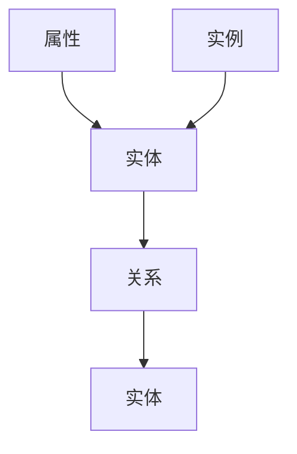
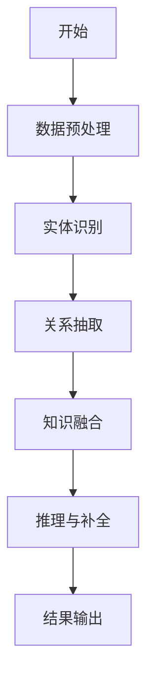
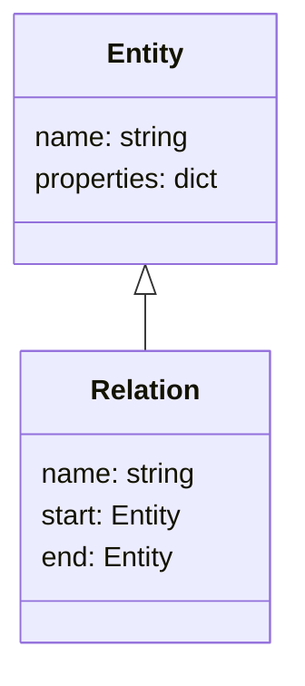
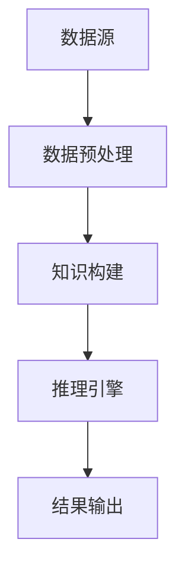
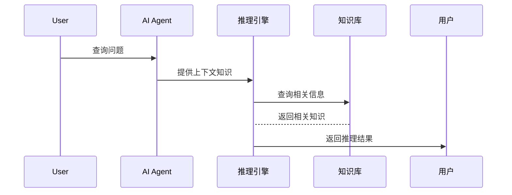

                 


# 基于图谱的AI Agent知识推理与补全

## 关键词：  
图谱技术、AI Agent、知识推理、知识补全、符号逻辑推理、深度学习推理

## 摘要：  
本文系统性地探讨了基于图谱的AI Agent知识推理与补全的技术细节，从问题背景到算法原理，从系统架构到项目实战，全面解析了这一领域的核心概念和实现路径。文章通过详细讲解图谱构建、知识表示、推理算法等关键技术，结合实际案例，展示了如何利用图谱技术提升AI Agent的知识处理能力，实现智能化的推理与补全。  

---

## 第一部分：基于图谱的AI Agent知识推理与补全背景介绍

### 第1章：问题背景与问题描述

#### 1.1 问题背景  
- **AI Agent的发展现状**：AI Agent作为人工智能的核心技术之一，近年来得到了广泛应用，但其知识处理能力仍面临诸多挑战。  
- **知识推理与补全的必要性**：AI Agent需要具备理解上下文、推理隐含信息的能力，以应对复杂的现实场景。  
- **图谱技术的应用潜力**：图谱技术通过结构化的知识表示，为AI Agent的知识推理与补全提供了强大的工具支持。  

#### 1.2 问题描述  
- **AI Agent知识推理的核心问题**：如何从非结构化的数据中提取知识，并构建可推理的知识图谱。  
- **知识补全的挑战与难点**：如何利用现有知识推断缺失的信息，并确保补全的准确性与合理性。  
- **图谱技术如何解决这些问题**：通过构建结构化的知识图谱，图谱技术可以为AI Agent提供丰富的上下文信息，支持高效的推理与补全。  

#### 1.3 问题解决思路  
- **图谱技术的基本原理**：通过实体识别、关系抽取和知识融合，构建结构化的知识图谱。  
- **知识推理与补全的实现路径**：基于图谱的符号逻辑推理和深度学习推理，结合规则和数据驱动的方法。  
- **基于图谱的AI Agent整体架构**：数据预处理、知识构建、推理引擎、结果解释与反馈优化。  

#### 1.4 问题的边界与外延  
- **图谱技术的适用范围**：适用于需要结构化知识表示的领域，如自然语言处理、智能问答等。  
- **知识推理与补全的边界条件**：数据质量和推理规则的合理性直接影响补全的准确性和效率。  
- **相关概念的扩展与延伸**：图谱技术与其他知识表示方法（如知识图谱与本体论的结合）的对比与融合。  

#### 1.5 概念结构与核心要素组成  
- **图谱的基本结构**：由实体（Node）、关系（Edge）和属性（Property）构成。  
- **知识表示的核心要素**：实体、关系、属性及其之间的语义关联。  
- **推理与补全的逻辑框架**：基于图谱的路径分析、规则推理和深度学习推理。  

---

## 第二部分：核心概念与联系

### 第2章：核心概念与联系

#### 2.1 图谱技术的核心原理  
- **图谱的基本概念**：实体是现实世界中的具体事物或抽象概念，关系是实体之间的关联。  
- **图谱的构建过程**：包括数据预处理、实体识别、关系抽取和知识融合。  
- **图谱的存储与管理**：采用图数据库（如Neo4j）或知识图谱存储技术（如RDF）进行存储与管理。  

#### 2.2 知识表示的核心特征  
- **实体与关系的定义**：实体是知识的基本单元，关系描述实体之间的关联。  
- **知识图谱的层次结构**：从概念层次到实例层次的多层次表示。  
- **知识表示的可扩展性**：支持动态扩展和更新，以适应新知识的引入。  

#### 2.3 推理机制的原理与特点  
- **符号逻辑推理的基本原理**：基于谓词逻辑和规则库，通过逻辑推理得出结论。  
- **深度学习推理的核心思想**：利用神经网络模型（如GNN）对图结构数据进行特征提取和关系推理。  
- **推理机制的可解释性**：符号逻辑推理具有较高的可解释性，而深度学习推理通常较为黑箱。  

#### 2.4 核心概念的对比分析  
- **图谱与传统知识库的对比**：图谱具有结构化和语义化的优点，而传统知识库通常较为松散。  
- **符号逻辑与深度学习的对比**：符号逻辑推理基于规则，深度学习推理基于数据特征。  
- **推理与检索的对比**：推理基于已有知识生成新知识，检索是基于已有知识查找特定信息。  

#### 2.5 ER实体关系图架构  


---

## 第三部分：算法原理讲解

### 第3章：算法原理讲解

#### 3.1 图谱构建算法  
- **实体识别与抽取算法**：基于NLP技术（如NER）从文本中提取实体。  
- **关系抽取算法**：利用模式匹配或深度学习模型（如RNN、Transformer）抽取实体之间的关系。  
- **知识融合算法**：通过冲突检测和合并规则，将多源数据融合到统一的知识图谱中。  

#### 3.2 知识表示与推理算法  
- **符号逻辑推理算法**：基于规则的正向和反向推理，如基于谓词逻辑的演绎推理。  
- **基于图的推理算法**：利用图遍历算法（如BFS、DFS）在知识图谱中进行路径分析。  
- **深度学习推理算法**：基于图神经网络（GNN）的节点表示学习和关系推理。  

#### 3.3 算法实现流程  


#### 3.4 算法实现代码示例  
```python
# 知识表示的Python代码示例
class Entity:
    def __init__(self, name, properties):
        self.name = name
        self.properties = properties

class Relation:
    def __init__(self, name, start_node, end_node):
        self.name = name
        self.start_node = start_node
        self.end_node = end_node

# 符号逻辑推理的Python代码示例
def forward_chaining(rules, facts):
    inferred = set(facts)
    while True:
        new_inferred = set()
        for rule in rules:
            head, body = rule
            if all(b in inferred for b in body):
                if head not in inferred:
                    new_inferred.add(head)
        if not new_inferred:
            break
        inferred.update(new_inferred)
    return inferred
```

#### 3.5 算法的数学模型与公式  
符号逻辑推理的数学模型基于一阶逻辑（FOL），其核心公式为：  
$$ \forall x \exists y (P(x) \rightarrow Q(y)) $$  
其中，$P(x)$ 表示前提条件，$Q(y)$ 表示结论。深度学习推理的数学模型基于图神经网络，其核心公式为：  
$$ Z = G(x, edge\_info) $$  
其中，$G$ 是图神经网络，$x$ 是输入节点特征，$edge\_info$ 是边信息，$Z$ 是输出节点表示。  

---

## 第四部分：系统分析与架构设计方案

### 第4章：系统分析与架构设计

#### 4.1 问题场景介绍  
- **应用场景**：智能问答系统、对话生成系统、知识检索系统等。  
- **项目介绍**：基于图谱的AI Agent知识推理与补全系统，旨在提升AI Agent的知识处理能力。  

#### 4.2 系统功能设计  
- **领域模型设计**：  

- **系统架构设计**：  


#### 4.3 系统接口设计  
- **输入接口**：接收用户输入的查询或命令。  
- **输出接口**：输出推理结果或补全知识。  
- **交互流程**：  


---

## 第五部分：项目实战

### 第5章：项目实战

#### 5.1 环境安装与配置  
- **安装Python环境**：使用Anaconda或虚拟环境。  
- **安装依赖库**：如networkx、py2neo、numpy等。  

#### 5.2 系统核心实现源代码  
```python
# 知识构建代码
from py2neo import Graph, Node, Relationship

graph = Graph("http://localhost:7474", auth=("neo4j", "password"))

# 实体节点创建
node1 = Node("Entity", name="AI Agent")
node2 = Node("Entity", name="Knowledge Graph")

# 关系建立
relationship = Relationship(node1, "Uses", node2)
graph.create(relationship)
```

#### 5.3 实际案例分析与详细解读  
- **案例背景**：构建一个简单的知识图谱，包含实体“AI Agent”和“Knowledge Graph”，以及它们之间的关系。  
- **代码实现**：如上所示，通过Py2Neo库创建实体节点和关系。  
- **结果分析**：推理引擎能够基于图谱中的关系进行推理，例如：“AI Agent使用Knowledge Graph进行知识推理”。  

#### 5.4 项目小结  
- **项目总结**：通过本项目，我们掌握了基于图谱的知识构建与推理的基本方法。  
- **经验教训**：数据质量对推理结果的影响至关重要。  

---

## 第六部分：总结

### 第6章：总结

#### 6.1 最佳实践  
- **数据预处理的重要性**：确保数据的准确性和完整性。  
- **推理规则的设计**：结合符号逻辑和深度学习，提升推理的准确性和效率。  

#### 6.2 小结  
- 本文系统性地探讨了基于图谱的AI Agent知识推理与补全的技术细节，从理论到实践，全面解析了这一领域的核心概念和实现路径。  

#### 6.3 注意事项  
- 在实际应用中，需注意数据隐私和模型的可解释性问题。  

#### 6.4 拓展阅读  
- 推荐阅读《知识图谱构建与应用》、《图神经网络入门与实践》等书籍，深入了解图谱技术和深度学习推理的最新进展。  

---

## 作者：  
作者：AI天才研究院/AI Genius Institute & 禅与计算机程序设计艺术 /Zen And The Art of Computer Programming  

---

通过以上详细的内容规划，我们可以看到，基于图谱的AI Agent知识推理与补全是一个复杂但极具潜力的领域。通过本文的系统性分析，读者可以深入了解这一技术的核心原理和实现方法，并将其应用于实际项目中，推动AI Agent技术的进一步发展。

