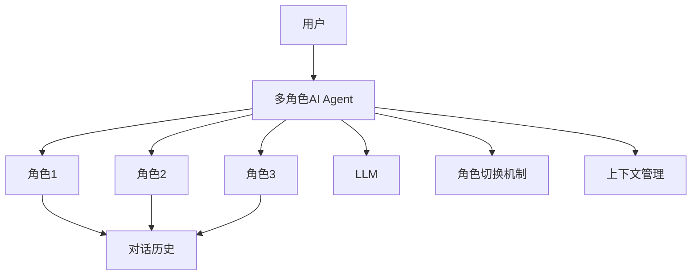
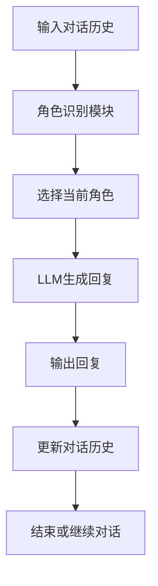
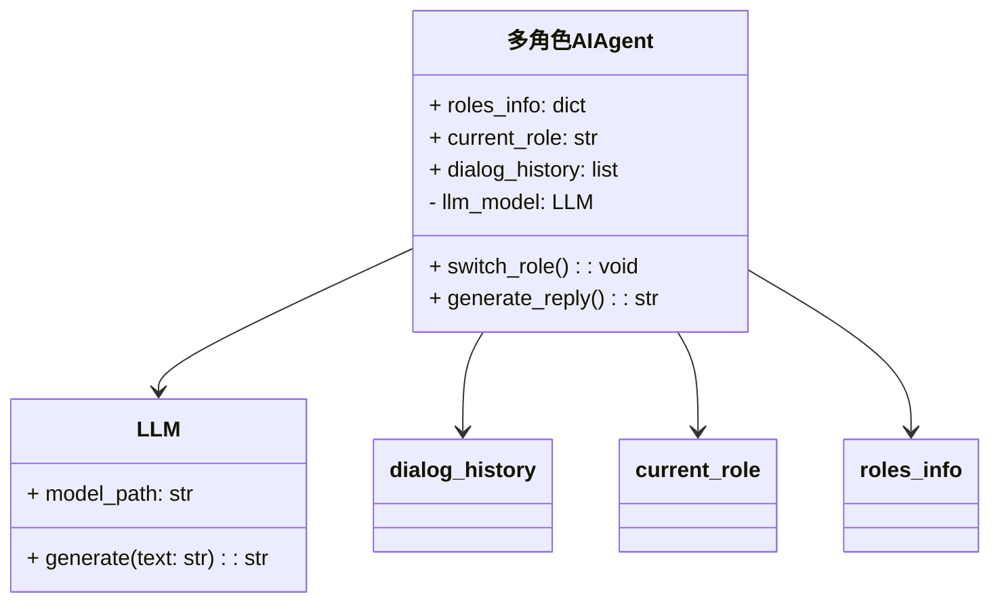

                 


# 多角色AI Agent：基于LLM的虚拟角色扮演系统

## 关键词：
多角色AI Agent, 大语言模型, 虚拟角色扮演, 对话生成, 人机交互

## 摘要：
多角色AI Agent是一种基于大语言模型（LLM）的虚拟角色扮演系统，能够模拟多个不同角色之间的对话和交互。本文将详细探讨多角色AI Agent的核心概念、算法原理、系统架构设计以及实际项目实现，帮助读者理解如何构建和应用这种创新的AI系统。

---

## 第1章: 多角色AI Agent的背景与概念

### 1.1 多角色AI Agent的定义与背景

#### 1.1.1 什么是多角色AI Agent
多角色AI Agent是一种能够模拟多个不同角色进行交互和对话的智能系统。它基于大语言模型（LLM），通过自然语言处理技术，实现角色之间的动态切换和上下文管理。

#### 1.1.2 多角色AI Agent的发展背景
随着AI技术的快速发展，尤其是大语言模型（如GPT-3, GPT-4）的出现，AI系统能够处理复杂的人机对话。然而，传统的对话系统通常只能模拟单一角色，无法应对多角色交互的复杂场景。多角色AI Agent的出现，填补了这一技术空白。

#### 1.1.3 多角色AI Agent的应用场景
多角色AI Agent广泛应用于多个领域：
- **教育领域**：模拟老师、学生、家长等不同角色，提供个性化的学习支持。
- **客服领域**：实现客户、客服代表、技术支持等角色的交互，提升用户体验。
- **娱乐领域**：在游戏中模拟不同角色，增强玩家的沉浸感。
- **企业协作**：模拟不同部门的员工角色，协助企业内部协作。

---

### 1.2 LLM与多角色AI Agent的关系

#### 1.2.1 LLM的基本概念
大语言模型（LLM）是一种基于Transformer架构的深度学习模型，能够处理自然语言文本，生成人类水平的回复。其核心是通过大量的文本数据训练，掌握语言的规律和语义信息。

#### 1.2.2 LLM在多角色AI Agent中的作用
多角色AI Agent依赖LLM进行对话生成和上下文管理。LLM不仅提供语言生成能力，还能通过调整模型参数，模拟不同角色的语言风格和行为模式。

#### 1.2.3 多角色AI Agent与传统对话系统的区别
- **角色切换能力**：多角色AI Agent能够动态切换角色，而传统对话系统通常只支持单一角色。
- **上下文管理**：多角色AI Agent需要管理多个角色的对话历史，而传统系统只关注当前对话。
- **灵活性**：多角色AI Agent能够适应更多复杂场景，而传统系统在复杂场景中表现受限。

---

## 第2章: 多角色AI Agent的核心概念与联系

### 2.1 多角色AI Agent的核心概念

#### 2.1.1 多角色建模
多角色建模是多角色AI Agent的核心技术，通过构建多个角色的特征模型，包括语言风格、知识库、行为模式等，实现角色间的动态切换。

#### 2.1.2 角色切换机制
角色切换机制是指在对话过程中，根据上下文信息自动切换当前角色，确保对话的连贯性和合理性。

#### 2.1.3 对话上下文管理
对话上下文管理是确保多角色对话顺利进行的关键，通过记录每个角色的对话历史和状态，实现上下文的动态更新。

### 2.2 多角色AI Agent的实体关系图



### 2.3 多角色AI Agent的核心算法原理

#### 2.3.1 多角色对话生成算法（Mermaid流程图）



#### 2.3.2 角色切换机制的实现（Python代码示例）

```python
def switch_role(current_role, roles_info):
    # 根据上下文选择下一个角色
    next_role = select_next_role(current_role, roles_info)
    return next_role

def select_next_role(current_role, roles_info):
    # 根据规则选择下一个角色
    for role in roles_info:
        if should_switch_role(current_role, role):
            return role
    return current_role

def should_switch_role(current_role, target_role):
    # 判断是否需要切换角色
    if current_role == target_role:
        return False
    # 根据上下文判断是否需要切换
    return True
```

---

## 第3章: 多角色AI Agent的算法原理与数学模型

### 3.1 大语言模型（LLM）的基本原理

#### 3.1.1 变压器模型（Transformer）的结构
Transformer模型由编码器和解码器组成，编码器负责将输入文本转换为向量表示，解码器负责生成输出文本。

#### 3.1.2 注意力机制（Attention）的数学公式
$$
\text{Attention}(Q, K, V) = \text{softmax}\left(\frac{QK^T}{\sqrt{d_k}}\right)V
$$
其中，\( Q \) 是查询向量，\( K \) 是键向量，\( V \) 是值向量，\( d_k \) 是向量维度。

---

## 第4章: 系统分析与架构设计

### 4.1 问题场景介绍

#### 4.1.1 系统目标
构建一个多角色AI Agent，能够模拟多个角色进行对话，并根据上下文动态切换角色。

#### 4.1.2 系统需求
- 支持多角色建模
- 实现角色切换机制
- 管理对话上下文
- 提供用户交互界面

### 4.2 系统功能设计

#### 4.2.1 领域模型（Mermaid类图）



---

## 第5章: 项目实战

### 5.1 环境安装

```bash
pip install transformers
pip install torch
pip install mermaid
```

### 5.2 系统核心实现源代码

#### 5.2.1 多角色AI Agent实现

```python
from transformers import AutoTokenizer, AutoModelForCausalLM
import torch

class MultiRoleAI:
    def __init__(self, roles_info):
        self.roles_info = roles_info
        self.current_role = None
        self.dialog_history = []
        self.llm = AutoModelForCausalLM.from_pretrained("gpt2")
        self.tokenizer = AutoTokenizer.from_pretrained("gpt2")

    def switch_role(self):
        if not self.current_role:
            self.current_role = list(self.roles_info.keys())[0]
        else:
            for role in self.roles_info:
                if role != self.current_role:
                    self.current_role = role
                    break

    def generate_reply(self, input_text):
        self.dialog_history.append(input_text)
        # 切换角色
        self.switch_role()
        # 生成回复
        inputs = self.tokenizer.encode(input_text, return_tensors="pt")
        outputs = self.llm.generate(inputs, max_length=50)
        reply = self.tokenizer.decode(outputs[0])
        self.dialog_history.append(reply)
        return reply
```

### 5.3 代码应用解读与分析

#### 5.3.1 代码功能解读
上述代码实现了多角色AI Agent的基本功能，包括角色切换和对话生成。通过使用大语言模型（如GPT-2），系统能够根据输入文本生成相应的回复。

#### 5.3.2 代码实现细节
- **角色切换**：通过`switch_role`方法实现角色的动态切换。
- **对话生成**：使用LLM生成回复，并记录对话历史。

### 5.4 实际案例分析

#### 5.4.1 案例1：教育场景
用户：我需要帮助完成数学作业。
AI Agent（老师角色）：请告诉我具体的问题。
用户：解方程 \( x^2 + 2x + 1 = 0 \)。
AI Agent（老师角色）：这个方程的解是 \( x = -1 \)。

#### 5.4.2 案例2：客服场景
用户：我的订单有问题。
AI Agent（客服代表角色）：请提供订单号，我将帮助您解决问题。

### 5.5 项目小结
通过上述代码实现，我们可以看到多角色AI Agent的基本结构和功能。实际应用中，还需要进一步优化角色切换逻辑和对话生成算法，以提高系统的智能化水平。

---

## 第6章: 最佳实践与总结

### 6.1 小结
本文详细探讨了多角色AI Agent的核心概念、算法原理和系统架构设计，并通过实际项目展示了如何实现一个多角色对话系统。多角色AI Agent的应用前景广阔，能够为多个领域带来创新的解决方案。

### 6.2 注意事项
- **角色建模**：需要根据具体场景设计合理的角色模型。
- **上下文管理**：确保对话历史的准确记录和更新。
- **模型选择**：选择合适的LLM模型，影响系统的生成能力。

### 6.3 拓展阅读
- 《The Transformer Neural Machine Translation》
- 《Large Language Models: A Survey》

---

## 作者：AI天才研究院/AI Genius Institute & 禅与计算机程序设计艺术 /Zen And The Art of Computer Programming

---

通过本文的详细讲解，读者可以深入了解多角色AI Agent的实现原理和应用方法，为后续的研究和实践提供有力的参考。

