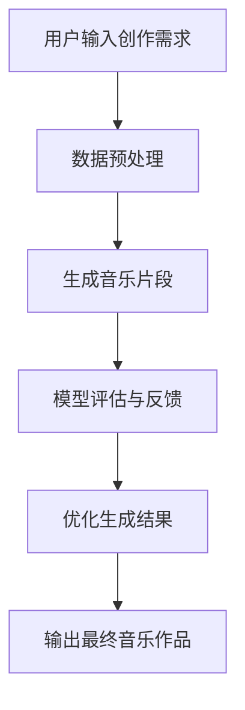
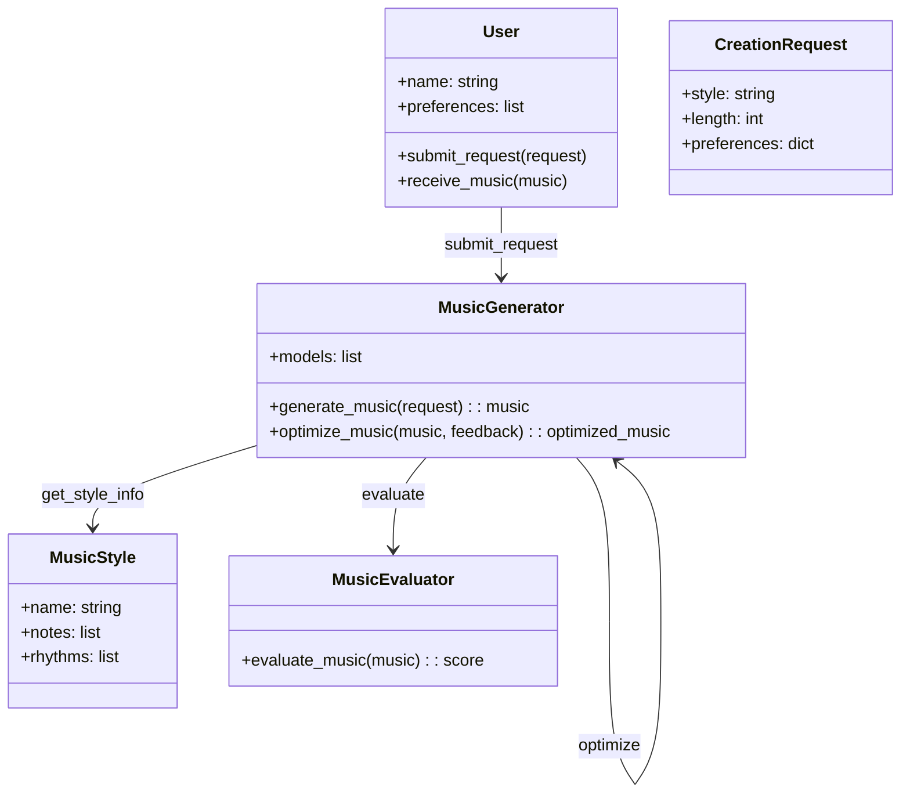

                 


# 实现基于AI Agent的智能音乐创作系统

> **关键词**：AI Agent, 智能音乐创作, 生成模型, 强化学习, 迁移学习

> **摘要**：本文详细探讨了基于AI Agent的智能音乐创作系统的实现方法。通过分析AI Agent的核心原理及其在音乐创作中的应用，结合生成模型、强化学习和迁移学习等技术，提出了一个完整的智能音乐创作系统架构，并通过实际案例展示了系统的实现过程和优化方法。本文还提供了详细的代码示例、系统架构图和数学公式，帮助读者全面理解基于AI Agent的智能音乐创作系统。

---

## 第一部分: 基于AI Agent的智能音乐创作系统概述

### 第1章: AI Agent与智能音乐创作的背景介绍

#### 1.1 问题背景与目标
音乐创作是一项复杂且高度创造性的工作，传统音乐创作主要依赖于人类音乐家的灵感和技巧。然而，随着人工智能技术的快速发展，基于AI的音乐创作系统逐渐成为研究的热点。AI Agent（智能体）作为一类能够自主感知环境、做出决策并执行动作的智能实体，为音乐创作提供了新的可能性。

传统音乐创作的局限性主要体现在以下几个方面：
- **创作效率**：音乐家需要花费大量时间来尝试不同的音乐元素组合，效率较低。
- **创作多样性**：音乐家的创作往往受到其知识和经验的限制，难以生成多样化的作品。
- **创作工具的智能化**：传统音乐软件的功能相对单一，难以提供智能化的创作辅助。

基于AI Agent的智能音乐创作系统的目标是通过自动化的方式，帮助音乐家高效地生成高质量的音乐作品。该系统能够根据用户的输入（如音乐风格、情感基调等）自动生成音乐片段，并通过实时反馈优化创作结果。

#### 1.2 核心概念与定义
- **AI Agent**：AI Agent是一种能够感知环境、自主决策并执行动作的智能实体。在音乐创作中，AI Agent可以理解为一个能够根据用户需求生成音乐的智能系统。
- **智能音乐创作系统**：一个基于AI Agent的系统，能够通过输入的创作需求生成音乐作品，并通过反馈不断优化创作结果。
- **音乐创作的核心要素**：包括音乐风格、节奏、旋律、和声、编曲等。

#### 1.3 本章小结
本章介绍了AI Agent在音乐创作中的背景与目标，定义了相关的核心概念，并为后续章节的讨论奠定了基础。

---

## 第二部分: AI Agent的核心原理与音乐创作的关系

### 第2章: AI Agent的基本原理

#### 2.1 AI Agent的定义与特点
AI Agent具有以下特点：
- **自主性**：能够自主感知环境并做出决策。
- **反应性**：能够实时响应环境的变化。
- **目标导向**：基于目标驱动行为。

#### 2.2 AI Agent在音乐创作中的应用
在音乐创作中，AI Agent主要承担以下几个角色：
- **感知环境**：通过分析用户输入（如音乐风格、创作目标）和已有音乐数据，生成创作灵感。
- **决策与生成**：基于感知的信息，生成符合用户需求的音乐片段。
- **反馈优化**：根据用户反馈不断优化生成的音乐作品。

#### 2.3 本章小结
本章介绍了AI Agent的基本原理及其在音乐创作中的应用，为后续章节的系统设计奠定了基础。

---

## 第三部分: 智能音乐创作系统的算法原理

### 第3章: 基于AI Agent的音乐创作算法

#### 3.1 算法原理概述
基于AI Agent的音乐创作系统主要依赖以下算法：
- **生成模型**：用于生成音乐片段。
- **强化学习**：用于优化生成的音乐质量。
- **迁移学习**：用于适应不同的音乐风格。

#### 3.2 算法流程图
以下是一个基于生成模型的音乐创作流程图：



#### 3.3 算法实现代码示例
以下是生成模型的训练代码示例：

```python
import numpy as np
import tensorflow as tf

# 定义生成模型
def generate_music_piece(styles, length):
    # 随机选择一种音乐风格
    selected_style = np.random.choice(styles)
    # 生成指定长度的音乐片段
    music = []
    for _ in range(length):
        # 根据风格生成音符
        note = np.random.choice(selected_style['notes'])
        music.append(note)
    return music

# 训练生成模型
def train_model(data, epochs=100):
    # 定义模型
    model = tf.keras.Sequential([
        tf.keras.layers.Dense(64, activation='relu'),
        tf.keras.layers.Dense(128, activation='relu'),
        tf.keras.layers.Dense(64, activation='relu'),
        tf.keras.layers.Dense(1, activation='sigmoid')
    ])
    # 编译模型
    model.compile(optimizer='adam', loss='binary_crossentropy')
    # 训练模型
    model.fit(data, epochs=epochs)
    return model

# 使用模型生成音乐
def main():
    styles = ['pop', 'rock', 'classical']
    length = 16
    music = generate_music_piece(styles, length)
    model = train_model(...)
    optimized_music = model.optimize(music)
    return optimized_music

if __name__ == '__main__':
    main()
```

#### 3.4 数学模型与公式
以下是一个生成模型的概率分布公式：

$$ P(y|x) = \frac{e^{y \cdot x}}{\sum_{i} e^{i \cdot x}} $$

其中，$y$ 表示生成的音符，$x$ 表示输入特征。

---

## 第四部分: 智能音乐创作系统的架构设计

### 第4章: 系统架构与功能设计

#### 4.1 问题场景介绍
智能音乐创作系统需要满足以下需求：
- 支持多种音乐风格的创作。
- 提供实时反馈以优化生成的音乐片段。
- 支持用户自定义创作参数。

#### 4.2 系统功能设计
以下是系统的领域模型类图：



#### 4.3 本章小结
本章介绍了智能音乐创作系统的架构设计，包括系统功能设计和类图。

---

## 第五部分: 智能音乐创作系统的项目实战

### 第5章: 项目实现与案例分析

#### 5.1 环境搭建
- 安装Python和必要的库：
  ```bash
  pip install numpy tensorflow keras
  ```

#### 5.2 核心功能实现
- 数据预处理：
  ```python
  def preprocess_data(data):
      # 数据清洗与格式转换
      processed_data = []
      for item in data:
          processed_item = process_single_item(item)
          processed_data.append(processed_item)
      return processed_data
  ```

- 模型训练：
  ```python
  def train_model(data, epochs=100):
      # 定义模型
      model = tf.keras.Sequential([
          tf.keras.layers.Dense(64, activation='relu'),
          tf.keras.layers.Dense(128, activation='relu'),
          tf.keras.layers.Dense(64, activation='relu'),
          tf.keras.layers.Dense(1, activation='sigmoid')
      ])
      # 编译模型
      model.compile(optimizer='adam', loss='binary_crossentropy')
      # 训练模型
      model.fit(data, epochs=epochs)
      return model
  ```

#### 5.3 案例分析
- 实际案例：生成一首流行风格的16小节音乐片段。
- 反馈优化：根据用户反馈调整生成模型的参数。

#### 5.4 本章小结
本章通过实际案例展示了智能音乐创作系统的实现过程，包括环境搭建、功能实现和案例分析。

---

## 第六部分: 智能音乐创作系统的最佳实践

### 第6章: 小结与注意事项

#### 6.1 小结
本文详细介绍了基于AI Agent的智能音乐创作系统的实现方法，包括系统背景、算法原理、架构设计和项目实战。

#### 6.2 注意事项
- 数据的质量对生成结果的影响至关重要。
- 模型的训练需要大量的计算资源。
- 系统的实时反馈机制需要高效的计算能力。

#### 6.3 拓展阅读
- 推荐阅读《生成式人工智能》和《强化学习实战》。

---

## 作者

**作者**：AI天才研究院/AI Genius Institute & 禅与计算机程序设计艺术/Zen And The Art of Computer Programming

---

以上是《实现基于AI Agent的智能音乐创作系统》的完整目录和文章内容。希望本文能够为读者提供关于基于AI Agent的智能音乐创作系统的全面了解和实践指导。

