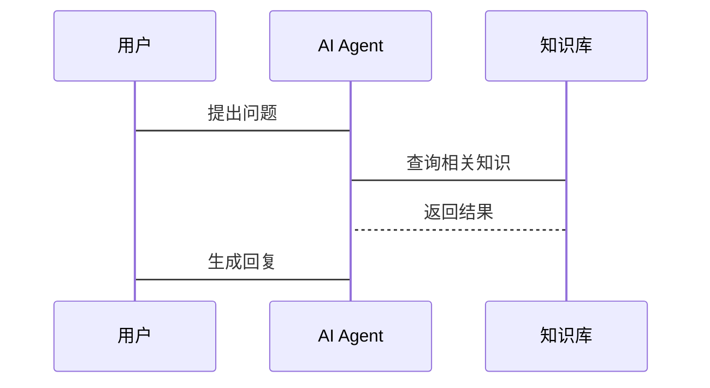

                 


# 客户服务 AI Agent：24/7 全天候的 LLM 驱动智能客服

> 关键词：客户服务、AI Agent、LLM、大语言模型、智能客服系统、24/7 全天候服务

> 摘要：随着人工智能技术的快速发展，客户服务领域正在经历一场深刻的变革。基于大语言模型（LLM）的智能客服系统以其高效、智能和全天候的特点，正在逐步取代传统的客户服务模式。本文将从背景、原理、系统架构到实际应用，全面解析客户服务 AI Agent 的核心技术和应用场景，探讨其在未来的潜力和发展方向。

---

# 第一部分: 客户服务 AI Agent 背景与核心概念

## 第1章: 客户服务 AI Agent 的背景与问题背景

### 1.1 客户服务 AI Agent 的背景介绍
#### 1.1.1 传统客户服务的挑战与痛点
传统的客户服务模式主要依赖人工坐席，存在以下痛点：
- 人工成本高：需要大量人员提供7×24小时服务。
- 响应时间长：人工坐席在高峰期可能无法及时响应客户。
- 服务质量不稳定：人员素质参差不齐，服务质量难以标准化。
- 知识库维护困难：人工坐席需要记忆大量产品知识和业务规则，容易出错。

#### 1.1.2 AI 技术在客户服务中的应用现状
近年来，人工智能技术的快速发展为客户服务行业带来了新的解决方案。基于自然语言处理（NLP）的智能客服系统逐渐崭露头角，但仍存在以下问题：
- 对话质量不稳定：部分AI客服的生成结果可能不够准确，缺乏人性化。
- 多轮对话能力不足：部分系统难以处理复杂的多轮对话场景。
- 业务规则适配性差：AI系统难以快速适应不同行业的业务规则。

#### 1.1.3 大语言模型（LLM）驱动智能客服的机遇
大语言模型（LLM）的出现，为智能客服系统带来了新的可能性。LLM具有以下优势：
- 强大的对话生成能力：能够理解和生成自然语言对话。
- 自适应学习能力：可以通过微调适应不同行业的业务规则。
- 高效的处理能力：能够7×24小时全天候为客户提供服务。

### 1.2 问题背景与问题描述
#### 1.2.1 客户服务行业的核心问题
客户服务行业的核心问题可以归结为以下几点：
- 如何提高客户满意度？
- 如何降低人工成本？
- 如何提升服务效率？
- 如何实现标准化和个性化的结合？

#### 1.2.2 传统客服系统的主要缺陷
传统客服系统的主要缺陷包括：
- 人工成本高。
- 响应速度慢。
- 服务质量不稳定。
- 知识库维护困难。

#### 1.2.3 LLM 驱动的 AI Agent 如何解决这些问题
LLM驱动的AI Agent通过以下方式解决传统客服系统的主要缺陷：
- 降低人工成本：通过自动化服务减少对人工坐席的依赖。
- 提高响应速度：7×24小时全天候响应客户需求。
- 提升服务质量：通过标准化的对话流程和知识库，确保服务质量一致。
- 知识库动态维护：通过LLM的自学习能力，动态更新知识库内容。

### 1.3 问题解决与边界外延
#### 1.3.1 AI Agent 在客户服务中的核心问题解决
AI Agent在客户服务中的核心问题解决包括：
- 自动化处理客户的常见问题。
- 提供个性化服务。
- 实现多渠道的统一接入。

#### 1.3.2 系统边界与功能外延
系统边界与功能外延包括：
- 系统边界：仅限于客户服务场景，不涉及其他业务模块。
- 功能外延：可以通过API接口与企业其他系统集成。

#### 1.3.3 相关概念与核心要素的结构化分析
相关概念与核心要素的结构化分析如下：
- 核心概念：AI Agent、LLM、NLP、知识库。
- 关系分析：AI Agent通过LLM和NLP技术，利用知识库实现客户服务功能。

---

## 第2章: 大语言模型（LLM）的核心原理

### 2.1 LLM 的基本原理
#### 2.1.1 从 NLP 到 LLM 的发展
从NLP到LLM的发展历程可以分为以下几个阶段：
1. 传统基于规则的NLP：通过预定义的规则实现简单的文本处理。
2. 统计NLP：利用统计方法进行文本分析。
3. 深度学习驱动的NLP：引入深度学习技术，如RNN和BERT。
4. 大语言模型：通过大规模预训练模型（如GPT系列）实现强大的文本生成能力。

#### 2.1.2 Transformer 架构的核心思想
Transformer架构的核心思想包括：
- 注意力机制（Attention）：通过计算输入序列中每个位置的重要性，生成注意力权重。
- 前馈神经网络：通过多层感知机实现非线性变换。
- 并行计算：通过并行计算提高处理效率。

#### 2.1.3 概率生成模型的工作原理
概率生成模型通过以下步骤实现文本生成：
1. 输入文本经过编码器编码，生成上下文表示。
2. 解码器根据上下文表示生成下一个词的概率分布。
3. 根据概率分布生成最终的输出文本。

### 2.2 LLM 的优势与局限性
#### 2.2.1 LLM 的核心优势
- 强大的生成能力：能够生成高质量的自然语言文本。
- 自适应能力：可以通过微调适应不同的任务和领域。
- 高效性：通过并行计算实现快速生成。

#### 2.2.2 LLM 的主要局限性
- 计算资源需求高：需要大量的计算资源进行训练和推理。
- 对小样本数据的适应性差：在小样本数据上表现不如传统方法。
- 黑箱问题：模型的决策过程难以解释。

#### 2.2.3 如何平衡 LLM 的优缺点
- 通过领域微调优化性能。
- 结合规则引擎处理特定场景。
- 使用可解释性技术提升透明度。

### 2.3 LLM 在客户服务中的应用
#### 2.3.1 LLM 的对话生成能力
- 自动生成回复：根据客户输入生成合适的回复。
- 多轮对话：支持连续的多轮对话，保持对话的连贯性。

#### 2.3.2 LLM 的意图识别能力
- 识别客户意图：通过分析对话内容，识别客户的需求和意图。
- 动态调整策略：根据意图变化调整对话策略。

#### 2.3.3 LLM 的多轮对话管理能力
- 对话状态跟踪：记录对话的历史信息，确保对话的连贯性。
- 上下文理解：通过上下文理解客户的需求，提供更精准的服务。

### 2.4 核心概念对比表格
以下表格对比了传统规则引擎和LLM驱动的AI Agent的核心概念：

| 概念 | 传统规则引擎 | LLM 驱动的 AI Agent |
|------|--------------|---------------------|
| 基础 | 固定规则库    | 自适应生成模型      |
| 灵活性 | 低            | 高                  |
| 维护成本 | 高            | 中                  |
| 应用场景 | 简单规则匹配 | 复杂场景处理        |

---

## 第3章: 系统分析与架构设计方案

### 3.1 问题场景介绍
我们假设一个电商网站需要一个7×24小时的智能客服系统，为客户提供售前咨询、售后支持和投诉处理等服务。

### 3.2 系统功能设计
系统功能设计包括：
- 用户身份验证：通过API验证用户身份。
- 对话历史记录：记录用户与AI Agent的对话历史。
- 业务规则匹配：根据对话内容匹配合适的业务规则。
- 知识库查询：根据对话内容查询知识库，生成回复。

### 3.3 系统架构设计
系统架构设计包括：
- 客户端：包括Web界面和移动App。
- 服务端：包括API接口、对话管理模块和知识库模块。
- 数据库：存储用户信息、对话历史和知识库内容。

### 3.4 系统接口设计
系统接口设计包括：
- 用户身份验证接口：/api/authenticate。
- 对话历史查询接口：/api/conversation_history。
- 业务规则匹配接口：/api/business_rule_match。
- 知识库查询接口：/api/knowledge_base_query。

### 3.5 系统交互流程图
以下是一个简单的系统交互流程图：



---

## 第4章: 项目实战

### 4.1 环境安装
项目实战需要以下环境：
- Python 3.8+
- PyTorch 1.9+
- Transformers库 4.16+

### 4.2 系统核心实现源代码
以下是一个简单的AI Agent实现代码：

```python
from transformers import AutoTokenizer, AutoModelForCausalLM
import torch

class AIAgent:
    def __init__(self, model_name="gpt2"):
        self.tokenizer = AutoTokenizer.from_pretrained(model_name)
        self.model = AutoModelForCausalLM.from_pretrained(model_name)
        
    def generate_response(self, input_text):
        inputs = self.tokenizer(input_text, return_tensors="pt")
        outputs = self.model.generate(
            inputs.input_ids,
            max_length=50,
            do_sample=True,
            temperature=0.7
        )
        response = self.tokenizer.decode(outputs[0], skip_special_tokens=True)
        return response
```

### 4.3 代码应用解读与分析
上述代码实现了以下功能：
- 初始化AI Agent：加载预训练模型和分词器。
- 生成回复：根据输入文本生成回复。

### 4.4 案例分析
以下是一个案例分析：
- 客户输入：“我的订单还没有发货。”
- AI Agent回复：“您好，您的订单预计将在3个工作日内发货。如果有任何问题，请随时联系我们。”

### 4.5 项目小结
通过上述实现，我们可以看到LLM驱动的AI Agent在客户服务中的巨大潜力。通过不断优化模型和规则，可以进一步提升系统的性能和用户体验。

---

## 第5章: 最佳实践 tips、小结、注意事项、拓展阅读

### 5.1 小结
本文从背景、原理、系统架构到实际应用，全面解析了客户服务AI Agent的核心技术和应用场景。通过LLM驱动的AI Agent，我们可以实现高效、智能的客户服务，提升客户满意度和企业竞争力。

### 5.2 注意事项
- 数据隐私：确保客户数据的安全和隐私。
- 模型优化：通过微调优化模型性能。
- 人机协作：结合人工客服处理复杂问题。

### 5.3 拓展阅读
- 《Deep Learning》——Ian Goodfellow
- 《Transformer: A Neural Network Model for Unsupervised Learning》——Vaswani et al.
- 《Large Language Models in 2023》——Sam Altman

---

作者：AI天才研究院/AI Genius Institute & 禅与计算机程序设计艺术 /Zen And The Art of Computer Programming

