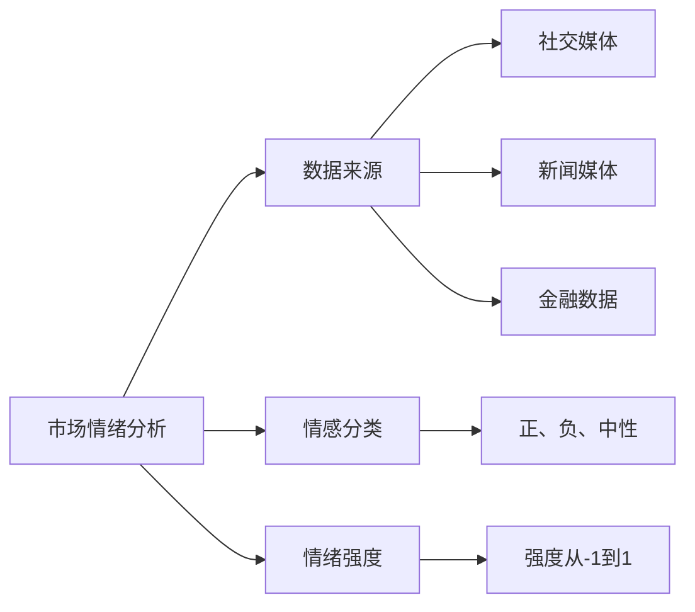
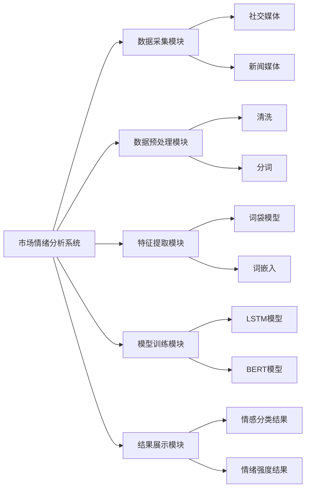

                 


```markdown
# 市场情绪分析

> 关键词：市场情绪分析、自然语言处理、大数据分析、情感分类、机器学习

> 摘要：市场情绪分析是一种利用自然语言处理和大数据分析技术，通过对市场相关文本数据进行情感分类和强度分析，从而预测市场趋势和投资者行为的方法。本文将从市场情绪分析的背景与概念、核心概念与联系、算法原理、系统分析与架构设计、项目实战等方面，深入探讨市场情绪分析的技术实现和应用。

---

## 第一部分: 市场情绪分析概述

### 第1章: 市场情绪分析的背景与概念

#### 1.1 市场情绪分析的定义与背景

市场情绪分析（Market Sentiment Analysis）是一种通过分析市场参与者在公共渠道（如社交媒体、新闻媒体、论坛等）发表的文本数据，来判断市场情绪状态的技术。市场情绪通常分为“看多”、“看空”和“中性”三种状态，而情绪强度则可以用数值（如-1到1）来表示。

市场情绪分析的重要性体现在以下几个方面：

1. **预测市场趋势**：投资者的情绪往往会影响市场的走势，通过分析市场情绪，投资者可以更好地做出投资决策。
2. **风险管理**：及时发现市场的过度乐观或悲观情绪，可以帮助投资者规避潜在的风险。
3. **量化交易策略**：情绪分析可以为量化交易提供额外的信号，帮助交易系统做出更明智的决策。

市场情绪分析的应用场景包括股票市场、加密货币市场、商品市场等。

#### 1.2 市场情绪分析的核心概念

市场情绪分析的核心概念包括数据来源、情感分类和情绪强度分析。

1. **数据来源**：市场情绪分析的数据来源主要包括社交媒体（如Twitter、Facebook）、新闻媒体（如新闻网站、财经媒体）、论坛（如Reddit）、交易数据（如订单簿、交易量）等。
2. **情感分类**：将文本数据分为“正面”、“负面”和“中性”三类。
3. **情绪强度分析**：对情绪进行量化，通常用-1到1之间的数值表示情绪强度。

市场情绪分析与其他情绪分析的区别在于，它更关注市场参与者的集体情绪，而不是个体情绪。同时，市场情绪分析的数据来源和应用场景具有更强的行业特征。

#### 1.3 市场情绪分析的边界与外延

市场情绪分析的边界包括以下几个方面：

1. **数据质量**：市场情绪分析的效果很大程度上依赖于数据质量。低质量的数据（如噪声、垃圾信息）会影响分析结果。
2. **模型性能**：模型的性能直接影响情绪分析的准确性。不同的模型在不同的场景下表现不同。
3. **市场参与者的异质性**：市场参与者的情绪可能受到多种因素的影响，如市场环境、个人情绪等。

---

### 第2章: 市场情绪分析的核心概念与联系

#### 2.1 核心概念原理

市场情绪分析的核心概念包括数据预处理、特征提取、情感分类和情绪强度分析。

1. **数据预处理**：包括数据清洗、分词、去除停用词等步骤。
2. **特征提取**：将文本数据转化为数值特征，常用的特征包括词袋模型（Bag of Words）和词嵌入（Word Embedding）。
3. **情感分类**：使用机器学习或深度学习模型对文本进行分类。
4. **情绪强度分析**：对情绪强度进行回归分析或分类。

#### 2.2 核心概念属性特征对比表格

| 概念       | 属性特征               |
|------------|------------------------|
| 数据来源    | 文本数据、社交媒体数据等 |
| 情感分类    | 正、负、中性           |
| 情绪强度    | 强度从-1到1            |

#### 2.3 ER实体关系图架构



---

### 第3章: 市场情绪分析的算法原理

#### 3.1 算法原理概述

市场情绪分析的算法主要包括传统机器学习算法和深度学习算法。

1. **传统机器学习算法**：如支持向量机（SVM）、随机森林（Random Forest）等。
2. **深度学习算法**：如长短时记忆网络（LSTM）、双向LSTM、Transformer等。
3. **混合模型**：结合传统机器学习和深度学习的优点，如使用词嵌入作为输入特征，结合LSTM进行情感分类。

#### 3.2 LSTM模型原理

LSTM（Long Short Term Memory）是一种特殊的RNN（循环神经网络），能够有效捕捉文本数据中的长距离依赖关系。


LSTM的数学模型如下：

$$
f_t = \sigma(W_f \cdot [h_{t-1}, x_t] + b_f)
$$

$$
i_t = \sigma(W_i \cdot [h_{t-1}, x_t] + b_i)
$$

$$
o_t = \sigma(W_o \cdot [h_{t-1}, x_t] + b_o)
$$

$$
c_t = f_t \cdot c_{t-1} + i_t \cdot x_t
$$

$$
h_t = o_t \cdot c_t
$$

其中，$f_t$是遗忘门，$i_t$是输入门，$o_t$是输出门，$c_t$是细胞状态，$h_t$是隐藏状态。

#### 3.3 BERT模型原理

BERT（Bidirectional Transformer）是一种基于Transformer的预训练模型，能够捕捉文本的全局语义信息。


BERT的数学模型如下：

$$
\text{Attention}(Q, K, V) = \text{softmax}\left(\frac{QK^T}{\sqrt{d_k}}\right)V
$$

其中，$Q$是查询向量，$K$是键向量，$V$是值向量，$d_k$是向量维度。

#### 3.4 算法实现代码示例

以下是使用Python实现的基于LSTM的情感分类代码示例：

```python
import numpy as np
from tensorflow.keras.models import Sequential
from tensorflow.keras.layers import LSTM, Dense, Dropout, Embedding

# 数据预处理
max_words = 1000
max_sequence_length = 500

# 模型定义
model = Sequential()
model.add(Embedding(max_words, 64, input_length=max_sequence_length))
model.add(LSTM(64, return_sequences=False))
model.add(Dropout(0.5))
model.add(Dense(3, activation='softmax'))

model.compile(loss='categorical_crossentropy', optimizer='adam', metrics=['accuracy'])

# 模型训练
model.fit(x_train, y_train, epochs=10, batch_size=32, validation_split=0.2)
```

---

## 第二部分: 系统分析与架构设计

### 第4章: 系统分析与架构设计

#### 4.1 项目介绍

市场情绪分析系统旨在通过分析社交媒体、新闻媒体等文本数据，预测市场情绪，并为投资者提供决策支持。

#### 4.2 系统功能设计

市场情绪分析系统的功能模块包括：

1. **数据采集**：从社交媒体、新闻媒体等渠道采集文本数据。
2. **数据预处理**：清洗、分词、去除停用词等。
3. **特征提取**：将文本数据转化为数值特征。
4. **模型训练**：训练情感分类模型和情绪强度回归模型。
5. **结果展示**：可视化市场情绪分析结果。

#### 4.3 系统架构设计



---

### 第5章: 项目实战

#### 5.1 环境安装

安装所需的Python库：

```bash
pip install numpy pandas tensorflow keras matplotlib
```

#### 5.2 核心实现代码

以下是市场情绪分析系统的实现代码：

```python
import numpy as np
import pandas as pd
from tensorflow.keras.models import Sequential
from tensorflow.keras.layers import LSTM, Dense, Dropout, Embedding
from sklearn.preprocessing import LabelEncoder
from sklearn.model_selection import train_test_split

# 数据加载
data = pd.read_csv('market_sentiment.csv')

# 数据预处理
label_encoder = LabelEncoder()
data['label'] = label_encoder.fit_transform(data['sentiment'])

# 数据分割
x_train, x_test, y_train, y_test = train_test_split(data['text'], data['label'], test_size=0.2)

# 模型定义
model = Sequential()
model.add(Embedding(1000, 64, input_length=500))
model.add(LSTM(64, return_sequences=False))
model.add(Dropout(0.5))
model.add(Dense(3, activation='softmax'))

model.compile(loss='sparse_categorical_crossentropy', optimizer='adam', metrics=['accuracy'])

# 模型训练
model.fit(x_train, y_train, epochs=10, batch_size=32, validation_split=0.2)
```

#### 5.3 案例分析

以股票市场为例，分析市场情绪对股票价格的影响。

---

## 第三部分: 最佳实践与小结

### 第6章: 最佳实践

1. **数据质量控制**：确保数据来源可靠，去除噪声数据。
2. **模型调优**：尝试不同的模型和超参数，优化模型性能。
3. **实时分析**：实现实时市场情绪监控，及时捕捉市场变化。

### 第7章: 小结与展望

市场情绪分析是一种重要的市场分析工具，通过自然语言处理和大数据分析技术，可以帮助投资者更好地理解市场情绪，做出更明智的投资决策。未来，随着人工智能技术的发展，市场情绪分析将更加智能化和精准化。

---

## 作者

作者：AI天才研究院/AI Genius Institute & 禅与计算机程序设计艺术/Zen And The Art of Computer Programming
```

