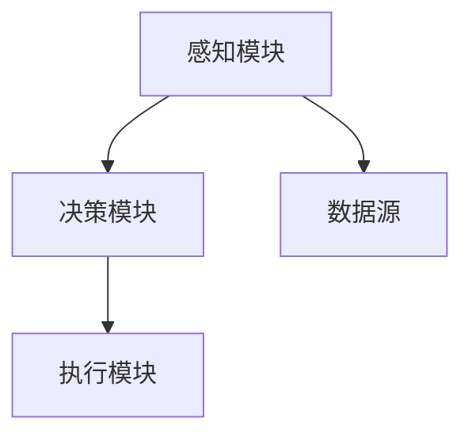
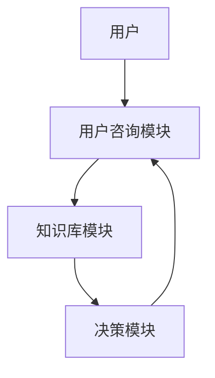

                 


# 开发具有复杂场景理解与决策能力的AI Agent

> 关键词：AI Agent, 复杂场景, 语义理解, 决策算法, 系统架构, 多模态数据

> 摘要：本文详细探讨了开发具有复杂场景理解与决策能力的AI Agent的关键技术。从AI Agent的基本概念到复杂场景理解的核心技术，从决策算法的实现到系统架构设计，再到实际项目开发，系统地介绍了AI Agent开发的完整流程。文章结合理论与实践，通过具体案例分析，深入剖析了AI Agent在复杂场景下的理解与决策能力的实现方法。

---

# 第一部分: AI Agent基础与背景

# 第1章: AI Agent概述

## 1.1 AI Agent的基本概念

### 1.1.1 AI Agent的定义

AI Agent（人工智能代理）是指能够感知环境、做出决策并采取行动以实现目标的智能实体。AI Agent可以是软件程序、机器人或其他智能系统，其核心目标是通过与环境的交互来完成特定任务。

### 1.1.2 AI Agent的特点

- **自主性**：AI Agent能够在没有外部干预的情况下自主运行。
- **反应性**：能够实时感知环境并做出反应。
- **目标导向性**：基于目标驱动行为。
- **学习能力**：通过经验改进性能。

### 1.1.3 AI Agent与传统AI的区别

传统AI（如专家系统）依赖于预定义的规则和知识库，而AI Agent更强调与环境的动态交互和自主决策能力。

---

## 1.2 复杂场景理解与决策的核心要素

### 1.2.1 场景理解的层次划分

- **感知层**：通过多模态数据（如视觉、听觉、文本）感知环境。
- **理解层**：通过语义分析理解场景含义。
- **推理层**：基于知识图谱进行推理和关联分析。

### 1.2.2 决策能力的评估标准

- **准确性**：决策的正确性。
- **实时性**：决策的速度。
- **适应性**：适应复杂场景变化的能力。

### 1.2.3 复杂场景的典型特征

- **不确定性**：环境信息不完全或模糊。
- **动态性**：环境状态不断变化。
- **多目标性**：可能需要在多个目标之间权衡。

---

## 1.3 AI Agent的应用场景

### 1.3.1 智能助手

AI Agent可以作为个人助手，帮助用户完成日程管理、信息检索等任务。

### 1.3.2 自动驾驶

自动驾驶汽车中的AI Agent需要实时感知环境并做出驾驶决策。

### 1.3.3 智能客服

AI Agent可以用于智能客服系统，提供自动化的客户支持服务。

---

## 1.4 本章小结

本章介绍了AI Agent的基本概念、核心要素及其在复杂场景中的应用。AI Agent的自主性和目标导向性使其在复杂场景中具有广泛的应用潜力。

---

# 第2章: 复杂场景理解的核心技术

## 2.1 语义理解技术

### 2.1.1 自然语言处理(NLP)基础

NLP技术用于理解和生成人类语言。例如，使用词袋模型（Bag of Words）进行文本表示。

### 2.1.2 知识图谱构建

知识图谱是一种结构化的知识表示方法，用于存储实体及其关系。例如，构建一个包含“人-地点-时间”的知识图谱。

### 2.1.3 上下文理解

上下文理解通过分析语境来理解语言的含义。例如，使用上下文无关向量（如Word2Vec）进行语义分析。

---

## 2.2 多模态数据处理

### 2.2.1 视觉数据处理

使用计算机视觉技术（如图像分类、目标检测）处理视觉数据。

### 2.2.2 听觉数据处理

使用语音识别和语音合成技术处理听觉数据。

### 2.2.3 跨模态融合

将不同模态的数据（如文本、图像）进行融合，以提高理解能力。例如，使用多模态神经网络模型进行跨模态信息整合。

---

## 2.3 知识表示与推理

### 2.3.1 知识表示方法

知识表示方法包括基于符号的表示（如逻辑表达式）和基于向量的表示（如嵌入向量）。

### 2.3.2 推理算法

推理算法包括基于规则的推理（如逻辑推理）和基于概率的推理（如贝叶斯网络）。

### 2.3.3 知识图谱的应用

知识图谱可以用于关联分析和推理。例如，在医疗领域中，通过知识图谱进行疾病诊断。

---

## 2.4 本章小结

本章介绍了复杂场景理解的核心技术，包括语义理解、多模态数据处理和知识表示与推理。这些技术为AI Agent提供了强大的场景理解能力。

---

# 第3章: AI Agent的决策算法

## 3.1 基于强化学习的决策算法

### 3.1.1 强化学习基础

强化学习是一种通过与环境交互来学习策略的方法。例如，使用Q-Learning算法进行状态-动作优先级的更新。

### 3.1.2 Q-Learning算法

Q-Learning算法通过更新Q值函数来学习最优策略。公式如下：

$$ Q(s, a) = Q(s, a) + \alpha (r + \gamma \max Q(s', a') - Q(s, a)) $$

其中，$\alpha$是学习率，$\gamma$是折扣因子。

### 3.1.3 Deep Q-Networks(DQN)

DQN通过深度神经网络近似Q值函数。例如，使用卷积神经网络（CNN）处理视觉输入。

---

## 3.2 基于马尔可夫决策过程的算法

### 3.2.1 马尔可夫决策过程(MDP)定义

MDP定义了一个由状态、动作、奖励和转移概率组成的决策过程。

### 3.2.2 多智能体协作决策

多智能体协作决策需要考虑多个智能体的协作与竞争。例如，使用分布式Q-Learning算法进行多智能体协作。

### 3.2.3 动态决策过程

动态决策过程需要实时更新策略以应对环境变化。例如，使用在线学习算法进行实时决策。

---

## 3.3 基于规则的决策算法

### 3.3.1 规则引擎

规则引擎通过预定义的规则进行决策。例如，使用Drools规则引擎进行业务规则管理。

### 3.3.2 基于逻辑的决策

基于逻辑的决策通过逻辑推理进行决策。例如，使用逻辑回归算法进行分类决策。

### 3.3.3 混合决策模型

混合决策模型结合规则和机器学习模型。例如，使用规则和决策树模型进行混合决策。

---

## 3.4 本章小结

本章介绍了AI Agent的决策算法，包括强化学习、马尔可夫决策过程和基于规则的决策算法。这些算法为AI Agent提供了强大的决策能力。

---

# 第4章: 复杂场景下的系统架构设计

## 4.1 系统模块划分

### 4.1.1 感知模块

感知模块负责获取环境信息。例如，使用摄像头和麦克风获取视觉和听觉数据。

### 4.1.2 决策模块

决策模块负责根据感知信息做出决策。例如，使用强化学习算法进行决策。

### 4.1.3 执行模块

执行模块负责执行决策结果。例如，使用机器人手臂执行物理操作。

---

## 4.2 系统架构图



---

## 4.3 模块间交互设计

### 4.3.1 感知模块与决策模块的交互

感知模块将环境信息传递给决策模块，决策模块根据信息做出决策并返回给感知模块。

### 4.3.2 决策模块与执行模块的交互

决策模块将决策结果传递给执行模块，执行模块执行操作并将反馈信息传递给决策模块。

---

## 4.4 本章小结

本章介绍了复杂场景下AI Agent的系统架构设计，包括模块划分和模块间交互设计。系统架构设计是实现复杂场景理解与决策能力的基础。

---

# 第5章: 项目实战

## 5.1 项目背景介绍

### 5.1.1 项目目标

开发一个具有复杂场景理解与决策能力的AI Agent，例如智能客服系统。

### 5.1.2 项目需求

实现用户咨询的自动响应和问题解决。

---

## 5.2 系统功能设计

### 5.2.1 领域模型设计

使用领域模型（如实体关系图）进行功能设计。

### 5.2.2 功能模块划分

- **用户咨询模块**：处理用户的咨询请求。
- **知识库模块**：存储和管理知识库。
- **决策模块**：根据咨询内容进行决策。

---

## 5.3 系统架构设计

### 5.3.1 系统架构图



---

## 5.4 系统实现

### 5.4.1 环境安装

安装Python、TensorFlow、Keras等开发工具。

### 5.4.2 核心代码实现

```python
class AIAgent:
    def __init__(self):
        self.knowledge_base = KnowledgeBase()

    def perceive(self, input):
        # 处理输入并返回感知结果
        return self.knowledge_base.retrieve(input)

    def decide(self, perception):
        # 根据感知结果做出决策
        return self.strategy(perception)

    def execute(self, decision):
        # 执行决策并返回反馈
        return self.executor.execute(decision)
```

### 5.4.3 功能设计

设计功能流程图，例如：


---

## 5.5 项目小结

本章通过实际项目案例介绍了AI Agent的开发过程，从项目背景到系统架构设计，再到核心代码实现，详细展示了AI Agent的开发流程。

---

# 第6章: 最佳实践与注意事项

## 6.1 开发注意事项

### 6.1.1 数据质量

确保数据的准确性和完整性。

### 6.1.2 算法选择

根据具体场景选择合适的算法。

### 6.1.3 系统优化

优化系统的性能和稳定性。

---

## 6.2 小结

AI Agent的开发需要综合考虑算法、系统架构和项目实践。通过最佳实践和注意事项，可以提高AI Agent的开发效率和性能。

---

# 作者

作者：AI天才研究院/AI Genius Institute & 禅与计算机程序设计艺术 /Zen And The Art of Computer Programming

---

**版权声明**  
本文版权归作者所有，未经授权不得转载。如需转载，请联系作者获取授权，并注明出处。

