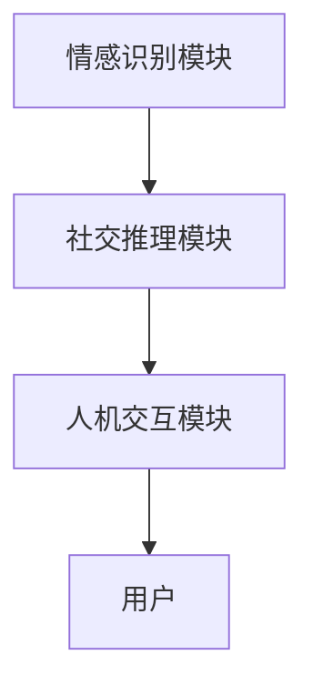

                 


# 开发具有情感计算与社交能力的AI Agent

> 关键词：情感计算、社交能力、AI Agent、人机交互、深度学习、自然语言处理

> 摘要：情感计算与社交能力是开发具有高度智能和交互能力的AI Agent的核心要素。本文将从情感计算和社交能力的基本概念出发，深入探讨其在AI Agent中的实现原理、算法设计、系统架构以及实际应用。通过详细的理论分析和实践案例，本文旨在为开发者提供一套完整的开发指南，帮助他们构建具有情感计算和社交能力的AI Agent。

---

## 第1章: 情感计算与社交能力AI Agent概述

### 1.1 情感计算的核心概念

#### 1.1.1 情感计算的定义与背景
情感计算（Affective Computing）是研究如何通过计算机技术来识别、理解、分析和模拟人类情感的学科。它是人工智能领域的重要分支之一，旨在让计算机具备类似人类的情感认知能力。随着人工智能技术的快速发展，情感计算在教育、医疗、娱乐、社交等领域展现出广泛的应用潜力。

#### 1.1.2 社交能力在AI Agent中的作用
社交能力是指个体在社交互动中表现出的理解、表达和协调能力。在AI Agent中，社交能力使其能够与人类或其他智能体进行有效沟通和协作。具备社交能力的AI Agent能够理解上下文、识别人的情感状态，并根据情境做出合适的回应。

#### 1.1.3 情感计算与社交能力的边界与外延
情感计算关注的是情感的识别和分析，而社交能力则更注重情感的应用和表达。二者的边界在于，情感计算是社交能力的基础，而社交能力是情感计算的延伸。情感计算的外延包括情感识别、情感分析、情感生成等，而社交能力的外延则包括社交推理、社交决策、社交表达等。

### 1.2 AI Agent的基本原理

#### 1.2.1 AI Agent的定义与分类
AI Agent（人工智能代理）是指能够感知环境、自主决策并采取行动以实现特定目标的智能实体。根据功能和复杂度，AI Agent可以分为简单反射型Agent、基于模型的反射型Agent、目标驱动型Agent和效用驱动型Agent。

#### 1.2.2 情感计算在AI Agent中的应用
情感计算为AI Agent提供了情感认知能力，使其能够理解用户的 emotions、意图和需求。通过情感计算，AI Agent可以更好地与人类交互，提供更加个性化的服务。

#### 1.2.3 社交能力的实现方式
社交能力的实现需要结合自然语言处理、机器学习和知识图谱等技术，构建社交推理模型，模拟人类的社交行为和决策过程。

### 1.3 情感计算与社交能力的核心要素

#### 1.3.1 情感识别与分析
情感识别是情感计算的基础，主要通过自然语言处理、语音识别和计算机视觉等技术，从文本、语音或图像中提取情感信息。

#### 1.3.2 社交推理与决策
社交推理是社交能力的核心，通过分析上下文和情境，推断出合适的社交行为和决策。

#### 1.3.3 人机交互中的情感表达
情感表达是人机交互的重要环节，AI Agent需要通过文本、语音或视觉等方式，将情感信息传递给用户。

### 1.4 本章小结
本章介绍了情感计算与社交能力在AI Agent中的基本概念和作用，明确了情感计算与社交能力的核心要素，为后续章节的深入探讨奠定了基础。

---

## 第2章: 情感计算与社交能力的核心概念

### 2.1 情感计算的原理与方法

#### 2.1.1 情感识别的原理
情感识别通过分析文本、语音或图像中的情感特征，利用机器学习模型进行分类和预测。

#### 2.1.2 情感分析的算法
情感分析的算法包括基于规则的浅层分析和基于深度学习的模型。常用的深度学习模型有LSTM、GRU和Transformer等。

#### 2.1.3 情感计算的数学模型
情感计算的数学模型可以表示为一个分类问题，通过训练数据构建情感分类器。例如，使用支持向量机（SVM）进行二分类任务。

### 2.2 社交能力的实现机制

#### 2.2.1 社交推理的逻辑
社交推理需要分析对话上下文、用户意图和情境信息，推断出合适的回应方式。

#### 2.2.2 社交决策的算法
社交决策的算法可以采用基于规则的专家系统或基于学习的机器学习模型。例如，使用决策树进行分类任务。

#### 2.2.3 社交能力的评估指标
社交能力的评估指标包括准确率、召回率、F1值和用户满意度等。

### 2.3 情感计算与社交能力的联系与区别

#### 2.3.1 情感计算与社交能力的联系
情感计算为社交能力提供了情感信息，而社交能力则将情感信息应用于实际的社交场景。

#### 2.3.2 情感计算与社交能力的区别
情感计算关注情感的识别和分析，而社交能力关注情感的应用和表达。二者的区别在于，情感计算是基础，社交能力是应用。

#### 2.3.3 情感计算与社交能力的综合应用
综合应用情感计算和社交能力，可以构建具备情感认知和社交能力的AI Agent，使其能够更好地与人类交互。

### 2.4 本章小结
本章深入探讨了情感计算与社交能力的核心概念，明确了二者的联系与区别，为后续章节的算法设计和系统实现提供了理论基础。

---

## 第3章: 情感计算与社交能力的数学模型与算法

### 3.1 情感计算的数学模型

#### 3.1.1 情感分析的线性模型
线性模型如逻辑回归（Logistic Regression）可以用于情感分类任务。

#### 3.1.2 情感分析的深度学习模型
深度学习模型如LSTM和Transformer在情感分析任务中表现出色。

#### 3.1.3 情感计算的公式推导
例如，情感分类的逻辑回归模型可以表示为：
$$ P(y=1|x) = \frac{1}{1 + e^{-w \cdot x - b}} $$
其中，$w$ 是权重向量，$x$ 是输入特征，$b$ 是偏置项。

### 3.2 社交能力的算法原理

#### 3.2.1 社交推理的逻辑框架
社交推理可以通过构建知识图谱和逻辑推理模型来实现。

#### 3.2.2 社交决策的算法流程
社交决策的流程包括目标识别、情境分析和行为选择。

#### 3.2.3 社交能力的数学模型
社交决策可以表示为一个多分类任务，使用Softmax函数进行分类：
$$ P(y=k|x) = \frac{e^{x_k}}{\sum_{j=1}^{n} e^{x_j}} $$
其中，$k$ 是目标类别，$n$ 是类别的总数。

### 3.3 情感计算与社交能力的算法对比

#### 3.3.1 算法的对比分析
情感计算算法注重情感特征的提取和分类，而社交能力算法注重情境分析和行为决策。

#### 3.3.2 算法的优缺点
情感计算算法的优点是精度高，缺点是计算复杂度较高；社交能力算法的优点是灵活性强，缺点是依赖大量数据。

#### 3.3.3 算法的优化方向
优化方向包括结合多模态数据、引入迁移学习和强化学习等技术。

### 3.4 本章小结
本章详细讲解了情感计算与社交能力的数学模型与算法，为后续章节的系统设计和实现提供了理论支持。

---

## 第4章: 情感计算与社交能力的系统架构设计

### 4.1 系统功能设计

#### 4.1.1 情感识别模块
情感识别模块负责从输入数据中提取情感特征，进行情感分类。

#### 4.1.2 社交推理模块
社交推理模块基于上下文和情境信息，进行社交推理和决策。

#### 4.1.3 人机交互模块
人机交互模块负责与用户的交互，实现情感表达和社交回应。

### 4.2 系统架构设计

#### 4.2.1 模块间的交互关系
模块间的交互关系可以通过mermaid图表示，例如：



#### 4.2.2 系统的分层架构
系统的分层架构可以分为数据层、算法层和应用层。

#### 4.2.3 系统的接口设计
系统的接口设计需要考虑模块之间的数据传递和功能调用。

### 4.3 系统的实现流程

#### 4.3.1 数据输入与处理
数据输入包括文本、语音和图像等多模态数据，需要进行预处理和特征提取。

#### 4.3.2 情感计算
情感计算模块通过机器学习模型进行情感分类，输出情感标签。

#### 4.3.3 社交推理
社交推理模块基于情感标签和上下文信息，进行社交推理和决策。

### 4.4 本章小结
本章详细设计了情感计算与社交能力AI Agent的系统架构，明确了模块功能和交互关系，为后续章节的项目实战奠定了基础。

---

## 第5章: 情感计算与社交能力AI Agent的项目实战

### 5.1 环境安装与配置

#### 5.1.1 开发工具与库的安装
需要安装Python、TensorFlow、Keras和NLTK等开发工具和库。

#### 5.1.2 数据集的准备
需要准备情感计算和社交能力相关的数据集，如IMDB情感分类数据集。

### 5.2 核心代码实现

#### 5.2.1 情感计算模块的实现
以下是情感计算模块的Python代码示例：

```python
import tensorflow as tf
from tensorflow import keras

# 定义情感分类模型
def emotion_classifier():
    model = keras.Sequential()
    model.add(keras.layers.Embedding(input_dim=10000, output_dim=16))
    model.add(keras.layers.LSTM(32))
    model.add(keras.layers.Dense(2, activation='softmax'))
    return model

# 编译模型
model = emotion_classifier()
model.compile(optimizer='adam', loss='sparse_categorical_crossentropy', metrics=['accuracy'])

# 训练模型
model.fit(X_train, y_train, epochs=10, batch_size=32)
```

#### 5.2.2 社交推理模块的实现
以下是社交推理模块的Python代码示例：

```python
def social_inference(context, user_profile):
    # 分析上下文和用户资料，生成回应
    response = "根据您的描述，我可以理解您的情感状态。请提供更多细节，以便我更好地帮助您。"
    return response
```

### 5.3 案例分析与应用

#### 5.3.1 情感计算的应用场景
情感计算可以应用于智能客服、教育辅助和健康监测等领域。

#### 5.3.2 社交能力的应用场景
社交能力可以应用于智能助手、社交机器人和虚拟伴侣等领域。

### 5.4 项目总结与优化

#### 5.4.1 项目总结
本项目通过情感计算和社交推理技术，构建了一个具备情感认知和社交能力的AI Agent，能够实现情感识别、社交推理和人机交互。

#### 5.4.2 项目优化
未来可以进一步优化算法性能，引入多模态数据和强化学习技术，提升系统的智能性和用户体验。

### 5.5 本章小结
本章通过项目实战，详细讲解了情感计算与社交能力AI Agent的实现过程，为读者提供了从理论到实践的完整指南。

---

## 第6章: 情感计算与社交能力AI Agent的最佳实践与未来展望

### 6.1 最佳实践 tips

#### 6.1.1 开发中的注意事项
在开发过程中，需要注意数据质量、模型选择和性能优化等问题。

#### 6.1.2 模型调优技巧
可以通过交叉验证、超参数优化和模型集成等方法提升模型性能。

#### 6.1.3 人机交互设计建议
在人机交互设计中，需要注重用户体验，提供自然和流畅的交互方式。

### 6.2 未来展望

#### 6.2.1 情感计算的未来发展方向
未来，情感计算将更加注重多模态数据的融合和情感生成技术的研究。

#### 6.2.2 社交能力的未来发展方向
社交能力将更加智能化和个性化，结合知识图谱和对话生成技术，实现更复杂的社交推理和决策。

#### 6.2.3 情感计算与社交能力的融合趋势
随着技术的发展，情感计算与社交能力的融合将更加紧密，推动AI Agent向更高层次的智能发展。

### 6.3 本章小结
本章总结了情感计算与社交能力AI Agent开发中的最佳实践，并展望了未来的发展方向，为读者提供了进一步研究和实践的参考。

---

## 作者：AI天才研究院/AI Genius Institute & 禅与计算机程序设计艺术 /Zen And The Art of Computer Programming

---

以上是《开发具有情感计算与社交能力的AI Agent》的技术博客文章的完整内容。

