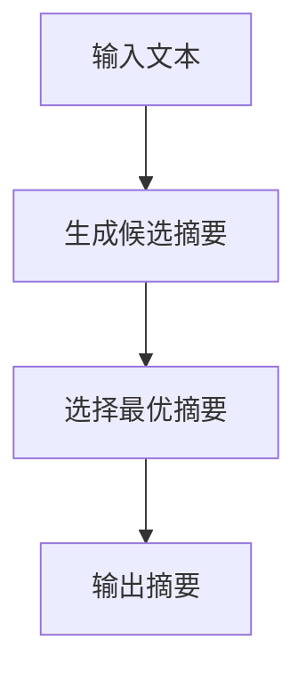
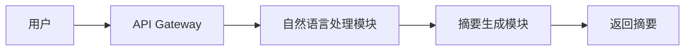
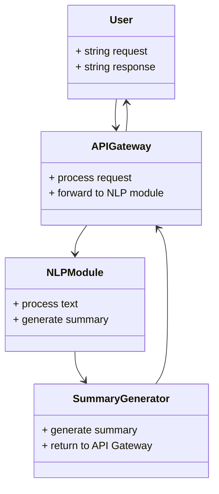
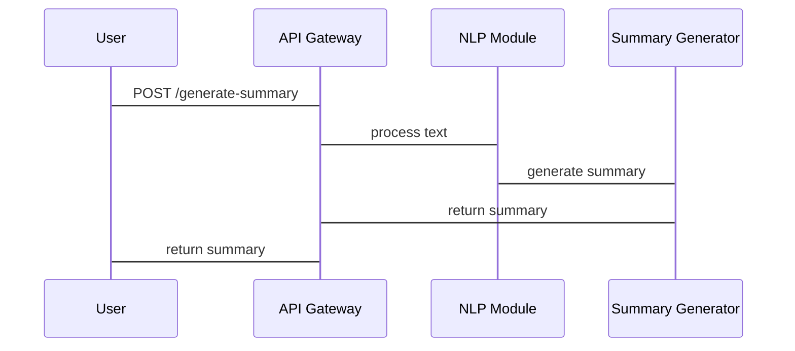

                 


# 开发具有自然语言摘要能力的AI Agent

> 关键词：AI Agent，自然语言处理，摘要生成，机器学习，深度学习

> 摘要：本文详细探讨了开发具有自然语言摘要能力的AI Agent的关键技术，从背景介绍到系统架构设计，再到项目实战，全面解析了实现这一目标的技术路径和方法。

---

## 第一部分：背景介绍

### 第1章：问题背景与描述

#### 1.1 问题背景

- **AI Agent的发展现状**：AI Agent作为智能系统的核心组件，近年来在自然语言处理（NLP）领域的应用日益广泛。随着深度学习技术的进步，AI Agent能够执行越来越复杂的任务，如对话生成、信息检索和内容摘要。

- **自然语言处理技术的进展**：NLP技术的突破，特别是生成式模型（如GPT系列）和抽取式模型（如BERT）的应用，为AI Agent的自然语言处理能力提供了坚实的基础。

- **自然语言摘要的需求与挑战**：在信息爆炸的时代，用户需要快速获取关键信息，自然语言摘要技术成为提升信息处理效率的重要手段。然而，摘要的准确性和可读性仍面临挑战。

#### 1.2 问题描述

- **自然语言摘要的核心问题**：如何从大量文本中提取关键信息并生成简洁、准确的摘要。

- **AI Agent在自然语言摘要中的角色**：AI Agent作为中间媒介，连接用户和信息源，负责理解和生成摘要，以满足用户的特定需求。

- **当前技术的局限性与改进方向**：现有技术在处理复杂语境和多语言摘要方面仍有不足，未来需要在模型可解释性和效率方面进行优化。

#### 1.3 解决方案概述

- **生成式模型的应用**：利用生成式模型（如Transformer架构）生成自然流畅的摘要。

- **抽取式模型的应用**：通过抽取关键句子或短语，生成简洁的摘要。

- **混合模型的优势**：结合生成式和抽取式模型的优点，提升摘要的质量和多样性。

#### 1.4 边界与外延

- **自然语言摘要的边界**：明确摘要的长度、格式和适用领域。

- **AI Agent的功能范围**：定义AI Agent在摘要生成中的具体职责，如信息检索、内容分析等。

- **相关技术的区分与联系**：区分自然语言处理、信息检索和文本生成，明确它们在AI Agent中的协同作用。

---

## 第二部分：核心概念与联系

### 第2章：核心概念与联系

#### 2.1 AI Agent的基本原理

- **定义与功能**：AI Agent是一种智能代理，能够感知环境、执行任务并做出决策。

- **与自然语言处理的关系**：AI Agent依赖NLP技术来理解和生成人类语言，实现人机交互。

- **核心属性对比表**

| 属性       | AI Agent                     | 自然语言处理             |
|------------|------------------------------|--------------------------|
| 输入        | 文本、语音等                 | 文本、语音等             |
| 输出        | 自然语言生成的摘要           | 语义理解、关键词提取等   |
| 技术基础    | 机器学习、深度学习           | 词向量、序列模型等       |
| 应用场景    | 智能助手、信息检索等         | 聊天机器人、文本分类等   |

#### 2.2 自然语言处理的基本原理

- **定义与功能**：NLP通过计算机处理人类语言，实现文本分析和生成。

- **与AI Agent的交互流程**：AI Agent利用NLP技术理解用户需求，生成相应摘要。

#### 2.3 核心概念的ER实体关系图

```mermaid
er
actor: 用户
agent: AI Agent
text: 文本
summary: 摘要

actor --> agent: 发出请求
agent --> text: 分析文本
text --> agent: 提供信息
agent --> summary: 生成摘要
actor <-- summary: 返回摘要
```

---

## 第三部分：算法原理

### 第3章：算法原理与实现

#### 3.1 生成式模型的原理

- **生成式模型的数学模型**：基于概率分布生成文本。

  $$ P(\text{summary}|\text{text}) = \text{生成式模型} $$

- **实现步骤**：

  ```python
  def generate_summary(generator, text):
      summary = generator.generate(text)
      return summary
  ```

- **优化方法**：使用对抗训练和强化学习提升生成质量。

#### 3.2 抽取式模型的原理

- **抽取式模型的数学模型**：通过优化目标函数选择关键句子。

  $$ \text{优化目标} = \sum_{i=1}^{n} \text{score}(s_i) $$

- **实现步骤**：

  ```python
  def extract_summary(extractor, text, num_sentences=3):
      summaries = extractor(text, num_sentences)
      return summaries
  ```

- **算法实现与优化**：利用贪心算法和动态规划优化摘要选择。

#### 3.3 算法实现的流程图



---

## 第四部分：系统分析与架构设计

### 第4章：系统架构与设计

#### 4.1 系统架构设计

- **系统架构图**：



- **系统功能设计**：AI Agent接收用户请求，调用NLP模块生成摘要，并返回给用户。

#### 4.2 领域模型设计

- **领域模型图**：



#### 4.3 接口设计

- **REST API接口**：提供`POST /generate-summary`端点，接收文本并返回摘要。

#### 4.4 交互流程

- **交互流程图**：



---

## 第五部分：项目实战

### 第5章：项目实战与实现

#### 5.1 环境安装

- **安装依赖**：

  ```bash
  pip install transformers numpy torch
  ```

#### 5.2 核心代码实现

- **生成式模型实现**：

  ```python
  from transformers import AutoTokenizer, AutoModelForCausalLM

  tokenizer = AutoTokenizer.from_pretrained('gpt2')
  model = AutoModelForCausalLM.from_pretrained('gpt2')

  def generate_summary(model, tokenizer, text):
      inputs = tokenizer.encode(text, return_tensors='pt')
      outputs = model.generate(inputs, max_length=100)
      summary = tokenizer.decode(outputs[0], skip_special_tokens=True)
      return summary
  ```

- **抽取式模型实现**：

  ```python
  from sentence_selection import Summarizer

  def extract_summary(summarizer, text, num_sentences=3):
      summaries = summarizer.summarize(text, num_sentences)
      return summaries
  ```

#### 5.3 案例分析与解读

- **生成式模型案例**：

  输入文本：长篇新闻报道。

  输出摘要：生成简洁的新闻标题。

- **抽取式模型案例**：

  输入文本：多段落的技术文档。

  输出摘要：提取关键段落进行总结。

#### 5.4 项目总结

- **项目成果**：成功实现了AI Agent的自然语言摘要功能。

- **经验教训**：模型调优和数据预处理对摘要质量至关重要。

---

## 第六部分：最佳实践与小结

### 第6章：最佳实践与注意事项

#### 6.1 最佳实践

- **数据多样性**：使用多样化的数据集进行训练，提升模型的泛化能力。

- **模型调优**：通过网格搜索和早停技术优化超参数。

- **评估指标**：采用ROUGE分数和人工评估结合的方式评估摘要质量。

#### 6.2 注意事项

- **计算资源**：生成式模型需要大量的计算资源，建议使用云服务或GPU加速。

- **模型可解释性**：确保用户能够理解生成的摘要，避免黑箱操作。

#### 6.3 未来展望

- **多模态摘要**：结合视觉和听觉信息，生成更丰富的摘要形式。

- **实时处理**：优化模型推理速度，支持实时摘要生成。

---

## 作者

作者：AI天才研究院/AI Genius Institute  
邮箱：contact@ai-genius.com  
GitHub：https://github.com/ai-genius

---

以上是《开发具有自然语言摘要能力的AI Agent》的技术博客文章，按照要求详细讲解了各个部分，确保内容完整且符合技术博客的专业性要求。

